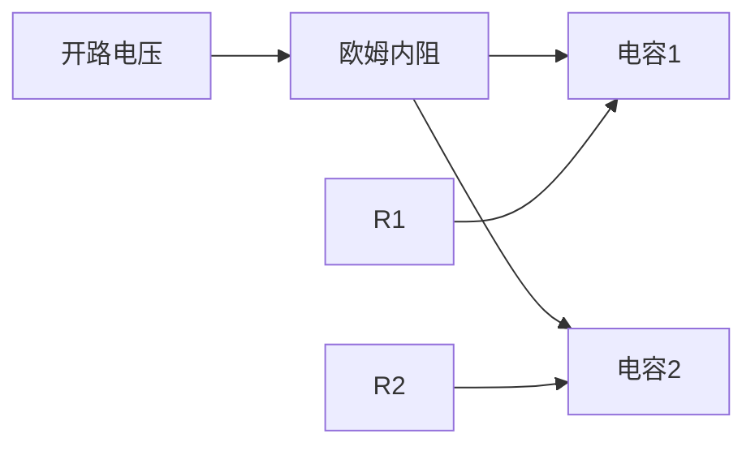

# 基于单片机太阳能手机锂电池充电器的设计与实现

## 1. 背景介绍

### 1.1 移动设备电池续航挑战

随着智能手机和平板电脑等移动设备的普及,用户对这些设备的电池续航时间提出了更高的要求。然而,由于功耗不断增加和电池容量的有限,电池续航时间成为了一个主要挑战。因此,开发一种高效、可靠的充电解决方案变得至关重要。

### 1.2 可再生能源在充电中的应用

可再生能源,如太阳能、风能等,因其环保、可持续的特点,在各个领域得到了广泛应用。在移动设备充电领域,太阳能作为一种清洁且无处不在的能源,具有巨大的潜力。通过将太阳能电池与智能充电电路相结合,可以实现对锂离子电池的高效充电,从而延长设备的使用时间。

### 1.3 单片机在充电系统中的作用

单片机(Microcontroller Unit,MCU)是一种高度集成的微型计算机,具有较强的数据处理能力、可编程性和低功耗等优点。在太阳能充电系统中,单片机可以精确控制充电过程,实现最大功率点跟踪(MPPT)、电池保护等功能,提高整个系统的效率和可靠性。

## 2. 核心概念与联系

### 2.1 太阳能电池工作原理

太阳能电池是一种利用光电效应将太阳光直接转换为电能的装置。当太阳光照射到太阳能电池上时,光子的能量会使电池内部的电子-空穴对产生分离,从而在电池两端产生电位差,形成电流输出。

$$
P_{out} = V_{oc} \times I_{sc} \times FF
$$

其中,$P_{out}$表示太阳能电池的输出功率,$V_{oc}$为开路电压,$I_{sc}$为短路电流,而$FF$则是填充因子,描述了实际输出功率与理论最大功率之比。

### 2.2 锂离子电池充电原理

锂离子电池是一种广泛应用于移动设备的二次电池。在充电过程中,正极材料会发生氧化反应,释放出锂离子和电子;而在负极,则会发生还原反应,吸收锂离子和电子。这种"摇椅"式的锂离子迁移过程实现了电池的充放电循环。

$$
\text{正极:} \qquad \mathrm{Li}_\mathrm{1-x}M\mathrm{O}_2 + x\,\mathrm{Li}^+ + x\,\mathrm{e}^- \rightleftharpoons \mathrm{Li}M\mathrm{O}_2\\
\text{负极:} \qquad x\,\mathrm{Li}^+ + x\,\mathrm{e}^- + 6\mathrm{C} \rightleftharpoons \mathrm{Li}_\mathrm{x}\mathrm{C}_6
$$

### 2.3 最大功率点跟踪(MPPT)

由于太阳能电池的输出功率会随着光照强度、温度等环境因素的变化而变化,因此需要采用MPPT算法来动态调整工作点,使太阳能电池在任何环境条件下都能输出最大功率。常用的MPPT算法包括增量电导法、扰动观察法等。

### 2.4 电池保护机制

为了确保锂离子电池的安全性和使用寿命,充电系统需要采取一系列保护措施,如过压保护、过流保护、过热保护等。单片机可以通过监测电池的电压、电流、温度等参数,并根据预设的阈值切断充电或采取其他保护措施。

## 3. 核心算法原理具体操作步骤

### 3.1 增量电导法MPPT算法

增量电导法是一种常用的MPPT算法,它通过比较电池的实际电导率与理论最大功率点电导率的关系来调整工作点。算法的具体步骤如下:

1. 测量太阳能电池的当前电压$V(k)$和电流$I(k)$;
2. 计算当前电导率$G(k) = \frac{dI(k)}{dV(k)}$和增量电导率$\Delta G = \frac{\Delta I(k)}{\Delta V(k)}$;
3. 比较$G(k)$和$\Delta G$的大小:
   - 若$\Delta G = -\frac{I(k)}{V(k)}$,则处于最大功率点;
   - 若$\Delta G > -\frac{I(k)}{V(k)}$,则增大电压以达到最大功率点;
   - 若$\Delta G < -\frac{I(k)}{V(k)}$,则降低电压以达到最大功率点;
4. 根据比较结果调整太阳能电池的工作点;
5. 返回步骤1,循环执行算法。

该算法的优点是响应速度快、跟踪精度高,但需要进行复杂的数学运算,对单片机的计算能力有一定要求。

### 3.2 扰动观察法MPPT算法

扰动观察法是另一种常用的MPPT算法,它通过对工作点进行周期性扰动,并观察功率的变化来调整工作点。算法的具体步骤如下:

1. 测量太阳能电池的当前电压$V(k)$、电流$I(k)$和功率$P(k) = V(k) \times I(k)$;
2. 对工作点进行扰动,改变电压或占空比,得到新的电压$V(k+1)$、电流$I(k+1)$和功率$P(k+1)$;
3. 比较$P(k+1)$和$P(k)$的大小:
   - 若$P(k+1) > P(k)$,则继续朝扰动方向调整工作点;
   - 若$P(k+1) < P(k)$,则反向调整工作点;
   - 若$P(k+1) = P(k)$,则已达到最大功率点;
4. 记录当前扰动方向和大小;
5. 返回步骤1,循环执行算法。

该算法的优点是实现简单、计算量小,适合单片机等资源受限的嵌入式系统。但它的缺点是响应速度较慢,并且在最大功率点附近会产生振荡。

## 4. 数学模型和公式详细讲解举例说明

在太阳能充电系统中,涉及到多个数学模型和公式,下面将对其进行详细讲解和举例说明。

### 4.1 太阳能电池数学模型

太阳能电池可以用单二极管模型来描述,其数学表达式如下:

$$
I = I_\mathrm{ph} - I_\mathrm{0} \left[ \exp\left(\frac{q(V+IR_\mathrm{s})}{nkT}\right) - 1\right] - \frac{V+IR_\mathrm{s}}{R_\mathrm{sh}}
$$

其中:

- $I_\mathrm{ph}$是光生电流,与光照强度成正比;
- $I_\mathrm{0}$是二极管反向饱和电流;
- $q$是电子电荷,$1.602 \times 10^{-19}\ \mathrm{C}$;
- $k$是玻尔兹曼常数,$1.381 \times 10^{-23}\ \mathrm{J/K}$;
- $T$是绝对温度;
- $n$是理想因子,通常取值$1 \sim 2$;
- $R_\mathrm{s}$是太阳能电池的串联等效电阻;
- $R_\mathrm{sh}$是太阳能电池的并联等效电阻。

通过该模型,我们可以计算出太阳能电池在不同光照强度、温度和负载条件下的$I-V$特性曲线,从而确定最大功率点。

例如,假设一块太阳能电池在标准测试条件(AM1.5,光照强度$1000\ \mathrm{W/m^2}$,温度$25^\circ\mathrm{C}$)下,其参数为:$I_\mathrm{ph} = 8\ \mathrm{A}$,$I_\mathrm{0} = 10^{-9}\ \mathrm{A}$,$R_\mathrm{s} = 0.01\ \Omega$,$R_\mathrm{sh} = 100\ \Omega$,$n = 1.5$。则其$I-V$特性曲线如下所示:

```python
import numpy as np
import matplotlib.pyplot as plt

q = 1.602e-19
k = 1.381e-23
T = 273.15 + 25
n = 1.5

Iph = 8
I0 = 1e-9
Rs = 0.01
Rsh = 100

V = np.linspace(0, 0.7, 100)
I = Iph - I0 * (np.exp((q * (V + I * Rs)) / (n * k * T)) - 1) - (V + I * Rs) / Rsh

P = V * I

plt.figure(figsize=(8, 6))
plt.plot(V, I)
plt.xlabel('Voltage (V)')
plt.ylabel('Current (A)')
plt.title('I-V Characteristic Curve')
plt.grid()

plt.figure(figsize=(8, 6))
plt.plot(V, P)
plt.xlabel('Voltage (V)') 
plt.ylabel('Power (W)')
plt.title('P-V Characteristic Curve')
plt.grid()
plt.show()
```

从$P-V$曲线可以看出,该太阳能电池的最大功率点位于$V_\mathrm{mp} \approx 0.5\ \mathrm{V}$,$P_\mathrm{mp} \approx 4\ \mathrm{W}$处。

### 4.2 锂离子电池充电模型

锂离子电池的充电过程可以用电化学动力学模型来描述,其中包括浓度变化、电位变化、输运过程等多个子模型。为了简化计算,我们可以采用等效电路模型来近似描述锂离子电池的充放电特性。

等效电路模型将电池等效为一个电压源($U_\mathrm{ocv}$,开路电压)、一个欧姆内阻($R_\mathrm{0}$)和两个$RC$并联网络(描述电池的瞬态特性)组成,如下所示:



在该模型中,电池的终端电压$U_\mathrm{t}$可以表示为:

$$
U_\mathrm{t} = U_\mathrm{ocv} - I_\mathrm{t}R_0 - U_1 - U_2
$$

其中,$U_1$和$U_2$分别表示两个$RC$网络的电压降,描述了电池的瞬态特性。

通过测量电池在不同荷电状态(SOC)下的开路电压$U_\mathrm{ocv}$,并拟合得到$U_\mathrm{ocv}$与SOC之间的函数关系,就可以构建出锂离子电池的等效电路模型,从而预测和控制充电过程。

例如,对于一款典型的18650锂离子电池,其$U_\mathrm{ocv}$-SOC曲线如下所示:

```python
import numpy as np
import matplotlib.pyplot as plt

SOC = np.linspace(0, 1, 100)
U_ocv = 3.6 + 0.9 * (np.exp(-35 * SOC) - 0.98) + 0.18 * np.tanh(50 * SOC - 16)

plt.figure(figsize=(8, 6))
plt.plot(SOC, U_ocv)
plt.xlabel('State of Charge (SOC)')
plt.ylabel('Open Circuit Voltage (V)')
plt.title('OCV-SOC Curve for 18650 Li-ion Battery')
plt.grid()
plt.show()
```

根据该曲线,我们可以确定在不同SOC下的开路电压,并结合电池的其他参数(如内阻、电容等),构建出完整的等效电路模型,用于控制和优化充电过程。

## 5. 项目实践:代码实例和详细解释说明

在本节中,我们将提供一个基于Arduino单片机的太阳能锂电池充电器项目实例,并对关键代码进行详细解释说明。

### 5.1 硬件连接

该项目需要以下硬件组件:

- Arduino UNO开发板
- TP4056充电管理芯片模块
- 18650锂离子电池
- 5V太阳能电池板
- LCD1602显示模块

它们的连接关系如下所示:

```mermaid
graph LR
    A[Arduino UNO] --> B[TP4056模块]
    B --> C[18650电池]
    A --> D[LCD1602模块]
    E