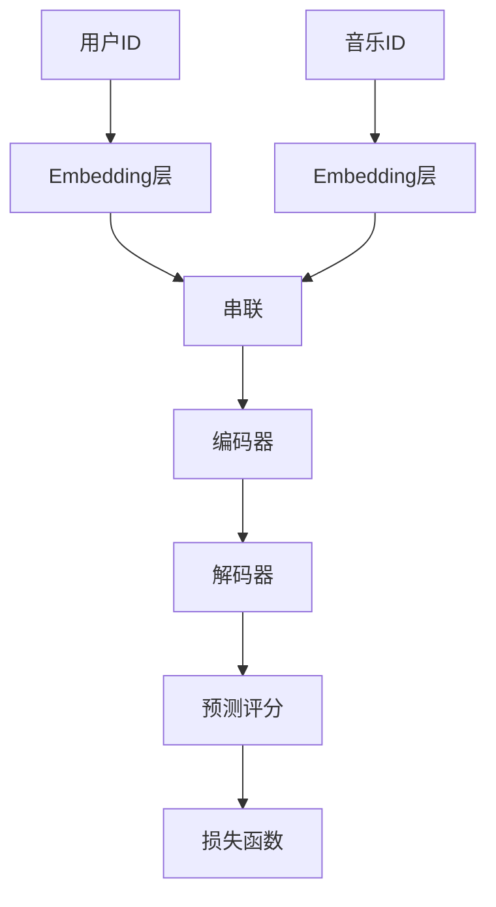

# 基于用户的音乐推荐平台

## 1. 背景介绍

### 1.1 音乐推荐系统的重要性

在当今信息时代,音乐已经成为人们生活中不可或缺的一部分。随着数字音乐平台的兴起,用户可以轻松访问海量的音乐资源。然而,这种资源的丰富性也带来了一个新的挑战:如何从海量音乐中找到符合个人口味的音乐?这就是音乐推荐系统的用武之地。

音乐推荐系统能够根据用户的历史偏好、人口统计信息和音乐元数据等数据,为用户推荐潜在感兴趣的音乐。这不仅能够提高用户的音乐发现效率,也能增强用户的整体音乐体验。因此,构建高效、准确的音乐推荐系统对于音乐流媒体服务提供商而言至关重要。

### 1.2 音乐推荐系统的挑战

尽管音乐推荐系统带来了诸多好处,但它也面临着一些挑战:

1. **数据稀疏性**: 由于音乐品味的多样性,用户对大部分音乐都没有评分或收听记录,导致用户-音乐矩阵高度稀疏,给推荐算法带来困难。

2. **冷启动问题**: 对于新用户或新音乐,由于缺乏历史数据,很难给出准确的推荐。

3. **上下文信息**: 用户对音乐的偏好往往受到时间、地点、心情等上下文因素的影响,如何将这些信息纳入推荐算法是一大挑战。

4. **评估困难**: 由于音乐推荐的主观性,评估推荐系统的准确性并不容易。

## 2. 核心概念与联系

### 2.1 协同过滤

协同过滤(Collaborative Filtering, CF)是音乐推荐系统中最常用的技术之一。它的核心思想是根据用户过去的行为记录(如评分、收听历史等),找到与目标用户有相似兴趣的其他用户,并推荐这些相似用户喜欢的音乐。

协同过滤可以分为两大类:

1. **基于用户的协同过滤(User-based CF)**: 通过计算用户之间的相似度,找到与目标用户兴趣相近的邻居用户,并推荐这些邻居用户喜欢的音乐。

2. **基于物品的协同过滤(Item-based CF)**: 通过计算音乐之间的相似度,为目标用户推荐与其历史收藏音乐相似的音乐。

### 2.2 矩阵分解

矩阵分解技术通过将高维稀疏的用户-音乐评分矩阵分解为低维的用户特征矩阵和音乐特征矩阵的乘积,从而发现用户和音乐的潜在特征,并利用这些特征进行音乐推荐。

常用的矩阵分解算法包括:

- **奇异值分解(SVD)**: 将评分矩阵分解为三个矩阵的乘积,用于降维和去噪。
- **概率矩阵分解(PMF)**: 基于统计模型,将评分矩阵分解为用户特征矩阵和音乐特征矩阵,并引入用户和音乐的偏置项。
- **非负矩阵分解(NMF)**: 将评分矩阵分解为两个非负矩阵的乘积,用于提取用户和音乐的潜在主题特征。

### 2.3 深度学习

近年来,深度学习技术在音乐推荐领域取得了长足进展。深度神经网络能够从原始数据(如音频信号、歌词等)中自动提取高层次特征,并融合多种辅助信息(如元数据、社交网络等),从而提高推荐的准确性和多样性。

常见的深度学习模型包括:

- **自编码器(AutoEncoder)**: 通过重构输入数据来学习潜在特征表示。
- **循环神经网络(RNN)**: 能够有效捕捉序列数据(如播放列表)中的上下文信息。
- **注意力机制(Attention)**: 赋予模型选择性地关注输入数据的不同部分的能力。
- **对比学习(Contrastive Learning)**: 通过最大化相似样本之间的一致性,最小化不相似样本之间的一致性,来学习高质量的表示。

## 3. 核心算法原理具体操作步骤

### 3.1 基于用户的协同过滤算法

基于用户的协同过滤算法主要包括以下步骤:

1. **构建用户-音乐评分矩阵**: 根据用户对音乐的历史评分数据构建一个用户-音乐评分矩阵。

2. **计算用户相似度**: 选择合适的相似度度量方法(如余弦相似度、皮尔逊相关系数等),计算任意两个用户之间的相似度。常见的计算公式如下:

$$
\text{sim}(u, v) = \frac{\sum\limits_{i \in I_{uv}}(r_{ui} - \overline{r_u})(r_{vi} - \overline{r_v})}{\sqrt{\sum\limits_{i \in I_{uv}}(r_{ui} - \overline{r_u})^2}\sqrt{\sum\limits_{i \in I_{uv}}(r_{vi} - \overline{r_v})^2}}
$$

其中 $I_{uv}$ 表示用户 $u$ 和 $v$ 都评分过的音乐集合, $r_{ui}$ 和 $r_{vi}$ 分别表示用户 $u$ 和 $v$ 对音乐 $i$ 的评分, $\overline{r_u}$ 和 $\overline{r_v}$ 分别表示用户 $u$ 和 $v$ 的平均评分。

3. **找到最近邻居**: 对于目标用户 $u$,根据与其他用户的相似度,选取 $K$ 个最相似的用户作为 $u$ 的最近邻居集合 $N_u$。

4. **生成推荐列表**: 对于目标用户 $u$ 未评分的音乐 $i$,通过加权平均 $u$ 的最近邻居对 $i$ 的评分,得到 $u$ 对 $i$ 的预测评分:

$$
\hat{r}_{ui} = \overline{r_u} + \frac{\sum\limits_{v \in N_u}\text{sim}(u, v)(r_{vi} - \overline{r_v})}{\sum\limits_{v \in N_u}|\text{sim}(u, v)|}
$$

根据预测评分从高到低排序,取前 $N$ 个作为推荐列表。

### 3.2 基于物品的协同过滤算法

基于物品的协同过滤算法步骤与基于用户的算法类似,不同之处在于它计算的是音乐之间的相似度,而不是用户之间的相似度。具体步骤如下:

1. **构建用户-音乐评分矩阵**

2. **计算音乐相似度**: 选择合适的相似度度量方法(如余弦相似度、调整余弦相似度等),计算任意两个音乐之间的相似度。常见的计算公式如下:

$$
\text{sim}(i, j) = \frac{\sum\limits_{u \in U_{ij}}(r_{ui} - \overline{r_u})(r_{uj} - \overline{r_u})}{\sqrt{\sum\limits_{u \in U_{ij}}(r_{ui} - \overline{r_u})^2}\sqrt{\sum\limits_{u \in U_{ij}}(r_{uj} - \overline{r_u})^2}}
$$

其中 $U_{ij}$ 表示对音乐 $i$ 和 $j$ 都进行过评分的用户集合, $r_{ui}$ 和 $r_{uj}$ 分别表示用户 $u$ 对音乐 $i$ 和 $j$ 的评分, $\overline{r_u}$ 表示用户 $u$ 的平均评分。

3. **找到最相似音乐集合**: 对于目标音乐 $i$,根据与其他音乐的相似度,选取 $K$ 个最相似的音乐作为 $i$ 的最相似音乐集合 $N_i$。

4. **生成推荐列表**: 对于目标用户 $u$ 未评分的音乐 $j$,通过加权平均 $u$ 对 $j$ 最相似音乐集合 $N_j$ 中音乐的评分,得到 $u$ 对 $j$ 的预测评分:

$$
\hat{r}_{uj} = \overline{r_u} + \frac{\sum\limits_{i \in N_j}\text{sim}(i, j)(r_{ui} - \overline{r_u})}{\sum\limits_{i \in N_j}|\text{sim}(i, j)|}
$$

根据预测评分从高到低排序,取前 $N$ 个作为推荐列表。

### 3.3 基于矩阵分解的协同过滤算法

基于矩阵分解的协同过滤算法将用户-音乐评分矩阵 $R$ 分解为用户特征矩阵 $U$ 和音乐特征矩阵 $V$ 的乘积,即 $R \approx U^T V$。然后,通过最小化预测评分与真实评分之间的差异来学习 $U$ 和 $V$,从而发现用户和音乐的潜在特征。

以概率矩阵分解(PMF)为例,其目标函数如下:

$$
\min_{U, V} \sum_{(u, i) \in \kappa}(r_{ui} - \mu - b_u - b_i - U_u^T V_i)^2 + \lambda(||U||^2 + ||V||^2)
$$

其中 $\kappa$ 表示已观测的用户-音乐评分对集合, $\mu$ 表示全局偏置项, $b_u$ 和 $b_i$ 分别表示用户 $u$ 和音乐 $i$ 的偏置项, $U_u$ 和 $V_i$ 分别表示用户 $u$ 和音乐 $i$ 的特征向量, $\lambda$ 是正则化系数。

通过优化上述目标函数,可以得到用户特征矩阵 $U$ 和音乐特征矩阵 $V$。对于未评分的用户-音乐对 $(u, j)$,可以通过 $U_u^T V_j + \mu + b_u + b_j$ 预测 $u$ 对 $j$ 的评分,并根据预测评分生成推荐列表。

### 3.4 基于深度学习的推荐算法

基于深度学习的推荐算法通常包括以下几个关键步骤:

1. **表示学习**: 利用深度神经网络从原始数据(如音频、歌词等)中自动提取高层次特征表示,或者将手工设计的特征(如音乐元数据)输入到网络中进行融合表示。

2. **融合辅助信息**: 除了用户-音乐交互数据,还可以融合其他辅助信息,如用户的人口统计信息、社交网络信息、上下文信息等,以提高推荐的准确性和多样性。

3. **模型训练**: 根据具体的推荐任务(如评分预测、排序等),设计合适的损失函数和优化算法,在训练数据集上训练深度神经网络模型。

4. **推荐生成**: 对于新的用户-音乐对,将其输入到训练好的模型中,得到预测的评分或排序分数,并根据这些分数生成推荐列表。

以基于自编码器的音乐推荐模型为例,其网络结构如下所示:

该模型首先将用户ID和音乐ID通过Embedding层转换为低维稠密向量表示,然后将这两个向量串联作为输入,送入编码器提取用户-音乐对的潜在特征表示。解码器则试图从这个特征表示中重构原始的用户-音乐对,预测评分就是重构的结果。通过最小化预测评分与真实评分之间的差异(即损失函数),可以学习到能够很好捕获用户偏好的特征表示,进而生成高质量的推荐。

## 4. 数学模型和公式详细讲解举例说明

在音乐推荐系统中,常用的数学模型和公式主要包括:

### 4.1 相似度度量

相似度度量是协同过滤算法的核心,用于量化两个用户或两个音乐之间