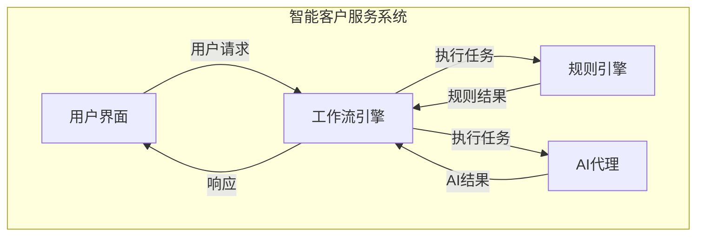
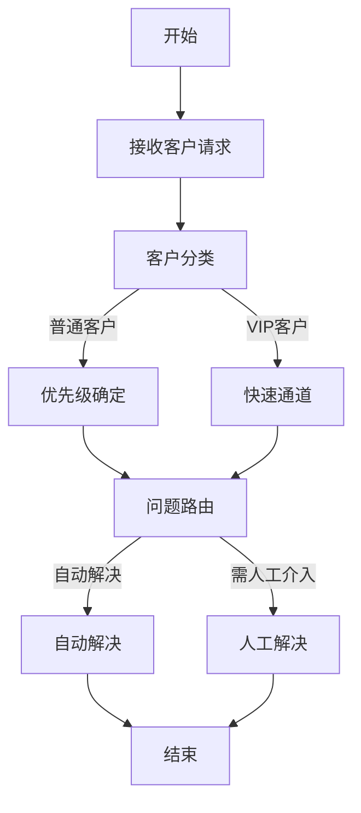

# 基于规则的工作流设计与AI代理的集成应用

## 1. 背景介绍

### 1.1 工作流自动化的重要性

在当今快节奏的商业环境中，工作流自动化已成为提高效率、降低成本和优化业务流程的关键因素。传统的手动流程不仅耗时耗力,而且容易出错,难以满足不断变化的需求。因此,越来越多的组织开始采用基于规则的工作流设计和自动化系统,以提高生产率、确保一致性并实现可扩展性。

### 1.2 人工智能(AI)在工作流自动化中的作用

随着人工智能(AI)技术的不断进步,AI代理已成为工作流自动化不可或缺的组成部分。AI代理可以执行各种复杂的任务,从简单的数据输入到高级的决策制定和问题解决。通过将AI代理集成到基于规则的工作流设计中,组织可以实现真正的智能自动化,提高效率并释放人力资源专注于更有价值的工作。

## 2. 核心概念与联系  

### 2.1 工作流自动化

工作流自动化是一种使用软件系统自动执行业务流程的方法。它通过定义一系列有序的任务和规则来协调人员、系统和数据的工作,从而实现流程的自动化和优化。

### 2.2 基于规则的工作流设计

基于规则的工作流设计是一种将业务规则和决策逻辑明确定义并集成到工作流中的方法。这些规则可以是简单的条件语句,也可以是复杂的决策树或人工智能模型。通过将规则与工作流集成,组织可以确保流程的一致性和可审计性,同时提高灵活性和可扩展性。

### 2.3 AI代理

AI代理是一种基于人工智能技术的软件实体,能够感知环境、处理信息、做出决策并采取行动。在工作流自动化中,AI代理可以执行各种任务,如数据收集、处理、决策制定和行动执行。

### 2.4 集成应用

集成应用是将不同系统、技术和组件结合在一起,形成一个统一的解决方案。在本文的背景下,集成应用指的是将基于规则的工作流设计与AI代理相结合,创建一个智能自动化系统。

## 3. 核心算法原理具体操作步骤

### 3.1 工作流建模

在设计基于规则的工作流时,首先需要对业务流程进行建模。这通常包括以下步骤:

1. **流程识别**: 确定需要自动化的业务流程,并明确其目标和范围。
2. **流程分析**: 分析流程的每个步骤、参与者、数据需求和决策点。
3. **流程设计**: 使用标准符号(如BPMN)绘制流程图,定义任务、事件、网关和流程顺序。

### 3.2 规则引擎集成

规则引擎是一种软件系统,用于执行预定义的业务规则和决策逻辑。将规则引擎集成到工作流中可以实现以下目标:

1. **规则定义**: 使用规则语言或图形化界面定义业务规则,例如条件语句、决策树或人工智能模型。
2. **规则执行**: 在工作流的特定点执行相关规则,以进行决策、数据转换或任务分配。
3. **规则管理**: 提供规则的版本控制、测试和部署功能,确保规则的一致性和可维护性。

### 3.3 AI代理集成

将AI代理集成到基于规则的工作流中可以提供智能自动化功能。常见的集成方式包括:

1. **任务代理**: AI代理可以执行特定的工作流任务,如数据收集、处理和决策制定。
2. **监控代理**: AI代理可以监控工作流的执行,检测异常情况并采取相应措施。
3. **优化代理**: AI代理可以分析工作流数据,并提出优化建议以提高效率和性能。

### 3.4 集成架构

将基于规则的工作流设计与AI代理集成的典型架构包括以下组件:

1. **工作流引擎**: 负责执行和管理工作流实例。
2. **规则引擎**: 执行预定义的业务规则和决策逻辑。
3. **AI代理**: 执行智能任务,如数据处理、决策制定和优化。
4. **集成层**: 确保不同组件之间的无缝通信和数据交换。
5. **用户界面**: 提供用户与系统交互的图形界面。
6. **监控和报告**: 跟踪系统性能并生成报告。

## 4. 数学模型和公式详细讲解举例说明

在工作流自动化和AI代理集成中,常见的数学模型和公式包括:

### 4.1 决策树模型

决策树是一种常用的机器学习模型,可以表示决策规则和逻辑。它由节点和边组成,每个节点代表一个特征,边代表该特征的不同值。决策树可以用于各种决策任务,如分类、回归和预测。

决策树的构建过程可以使用信息增益或基尼系数作为特征选择标准,公式如下:

$$\text{信息增益}(D, a) = \text{熵}(D) - \sum_{v \in \text{值}(a)} \frac{|D^v|}{|D|} \text{熵}(D^v)$$

$$\text{基尼系数}(D, a) = \sum_{i \neq j} p_i(1 - p_j)$$

其中,D是数据集,a是特征,v是特征a的可能值,D^v是数据集D中特征a取值为v的子集,p_i和p_j分别是不同类别的概率。

### 4.2 马尔可夫决策过程

马尔可夫决策过程(MDP)是一种用于决策序列优化的数学框架。它可以描述一个由状态、行动和奖励函数组成的决策过程。MDP的目标是找到一个策略,使得在给定的状态序列下,累积奖励最大化。

MDP可以用一个元组(S,A,P,R,γ)来表示,其中:

- S是状态集合
- A是行动集合
- P是状态转移概率函数,P(s'|s,a)表示在状态s执行行动a后,转移到状态s'的概率
- R是奖励函数,R(s,a,s')表示在状态s执行行动a后,转移到状态s'的即时奖励
- γ是折现因子,用于权衡即时奖励和长期累积奖励

MDP的目标是找到一个策略π,使得期望累积奖励最大化:

$$\max_\pi \mathbb{E}\left[\sum_{t=0}^\infty \gamma^t R(s_t, a_t, s_{t+1})\right]$$

其中,t是时间步长,s_t和a_t分别是时间t的状态和行动。

### 4.3 强化学习算法

强化学习是一种基于MDP的机器学习范式,用于训练AI代理在给定环境中采取最优策略。常见的强化学习算法包括Q-Learning、Sarsa和Actor-Critic。

以Q-Learning为例,它使用一个Q函数来估计在给定状态s执行行动a后,可获得的最大期望累积奖励。Q函数的更新规则如下:

$$Q(s_t, a_t) \leftarrow Q(s_t, a_t) + \alpha \left[r_t + \gamma \max_{a'} Q(s_{t+1}, a') - Q(s_t, a_t)\right]$$

其中,α是学习率,r_t是即时奖励,γ是折现因子。通过不断更新Q函数,AI代理可以逐步学习到最优策略。

## 4. 项目实践:代码实例和详细解释说明

为了更好地理解基于规则的工作流设计与AI代理的集成应用,我们将通过一个实际项目来进行说明。该项目是一个智能客户服务系统,它将工作流自动化与AI代理相结合,以提供高效、个性化的客户支持服务。

### 4.1 系统架构

该系统的架构如下所示:



系统由以下主要组件组成:

- **用户界面(UI)**: 提供用户与系统交互的图形界面,如网页或移动应用程序。
- **工作流引擎(WF)**: 负责执行和管理客户服务流程,包括任务分配、数据传递和状态跟踪。
- **规则引擎(RE)**: 执行预定义的业务规则和决策逻辑,如客户分类、优先级确定和问题路由。
- **AI代理(AI)**: 执行智能任务,如自然语言处理、知识库查询和推荐系统。

### 4.2 工作流设计

客户服务流程可以使用BPMN(业务流程模型和标记法)进行建模,如下所示:



该流程包括以下主要步骤:

1. **接收客户请求**: 系统接收客户的服务请求,可以通过多种渠道,如网站、电话或移动应用程序。
2. **客户分类**: 根据客户信息和历史记录,将客户分类为普通客户或VIP客户。
3. **优先级确定**: 对于普通客户,根据问题类型和紧急程度确定优先级。
4. **快速通道**: VIP客户可以直接进入快速通道,获得优先处理。
5. **问题路由**: 根据问题类型和复杂程度,将问题路由到自动解决或人工解决流程。
6. **自动解决**: 对于简单问题,AI代理可以自动提供解决方案。
7. **人工解决**: 对于复杂问题,由客户服务代表进行人工处理。
8. **结束**: 问题得到解决后,流程结束。

### 4.3 规则引擎集成

在该系统中,规则引擎用于执行各种业务规则和决策逻辑,如客户分类、优先级确定和问题路由。以下是一些示例规则:

1. **客户分类规则**:

```ruby
rule "VIP客户识别"
  when
    customer.annualRevenue > 1000000 || customer.membershipTier == "Platinum"
  then
    customer.setVIP(true)
end
```

2. **优先级确定规则**:

```ruby
rule "紧急问题优先级"
  when
    issue.type == "系统宕机" || issue.type == "安全漏洞"
  then
    issue.setPriority("高")
end
```

3. **问题路由规则**:

```ruby
rule "路由到自动解决"
  when
    issue.type == "密码重置" || issue.type == "账单查询"
  then
    route.setDestination("AutoResolve")
end
```

这些规则可以使用规则语言(如Drools)或图形化界面进行定义,并与工作流引擎集成以实现自动化执行。

### 4.4 AI代理集成

在该系统中,AI代理用于执行各种智能任务,如自然语言处理、知识库查询和推荐系统。以下是一些示例代码:

1. **自然语言处理**:

```python
import nltk

def preprocess_text(text):
    # 文本预处理
    tokens = nltk.word_tokenize(text)
    tokens = [token.lower() for token in tokens]
    return tokens

def classify_intent(tokens):
    # 意图分类
    features = extract_features(tokens)
    intent = intent_classifier.predict(features)
    return intent
```

2. **知识库查询**:

```python
import pandas as pd

knowledge_base = pd.read_csv("knowledge_base.csv")

def query_knowledge_base(query):
    # 知识库查询
    results = knowledge_base[knowledge_base['question'].str.contains(query, case=False)]
    if not results.empty:
        return results['answer'].values[0]
    else:
        return "抱歉,我无法回答这个问题。"