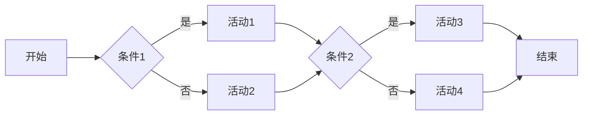
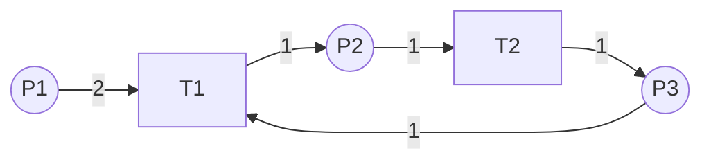
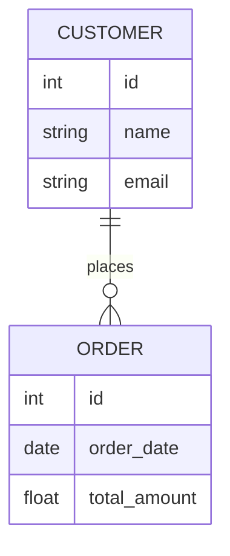
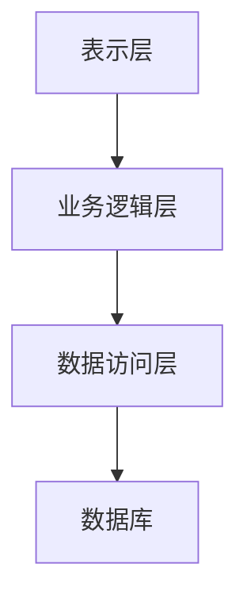
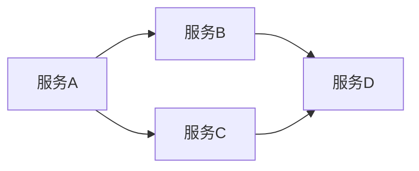

# 大型企业信息化策划、组织、架构、开发、管理

作者：禅与计算机程序设计艺术

## 1.背景介绍
### 1.1 企业信息化的重要性
#### 1.1.1 提高效率和竞争力
#### 1.1.2 优化业务流程
#### 1.1.3 支持决策和创新

### 1.2 大型企业信息化面临的挑战  
#### 1.2.1 复杂的业务和组织结构
#### 1.2.2 多样化的系统和数据
#### 1.2.3 不断变化的市场和技术环境

### 1.3 企业信息化的关键要素
#### 1.3.1 战略规划和组织管理
#### 1.3.2 架构设计和技术选型  
#### 1.3.3 开发实施和运维优化

## 2.核心概念与联系
### 2.1 企业信息化战略规划
#### 2.1.1 业务战略与IT战略的融合
#### 2.1.2 信息化规划方法和流程
#### 2.1.3 信息化成熟度评估与目标设定

### 2.2 企业架构与信息化架构
#### 2.2.1 企业架构的概念和框架
#### 2.2.2 业务架构、数据架构、应用架构、技术架构
#### 2.2.3 架构治理与演进管理

### 2.3 信息化项目组织与管理
#### 2.3.1 项目管理办公室（PMO）的职责与运作
#### 2.3.2 项目团队组建与角色分工
#### 2.3.3 项目生命周期管理与质量控制

## 3.核心算法原理具体操作步骤
### 3.1 企业架构设计方法
#### 3.1.1 业务架构设计
1. 识别业务能力和业务流程
2. 绘制业务流程图和价值链分析
3. 优化业务流程和组织结构

#### 3.1.2 数据架构设计 
1. 数据需求分析和主数据管理
2. 概念数据模型和逻辑数据模型设计
3. 数据标准和数据质量管理

#### 3.1.3 应用架构设计
1. 应用系统分类和功能定义
2. 应用集成模式和接口设计
3. 应用服务化和微服务架构

#### 3.1.4 技术架构设计
1. 基础设施架构设计
2. 安全架构和灾备架构设计
3. 运维架构和自动化运维

### 3.2 敏捷开发与DevOps
#### 3.2.1 敏捷开发方法
1. Scrum框架与实践
2. 极限编程（XP）与工程实践
3. 精益开发与看板管理

#### 3.2.2 DevOps原则与实践
1. 持续集成与持续交付（CI/CD）
2. 基础设施即代码（IaC）
3. 自动化测试与监控

### 3.3 数据治理与大数据分析
#### 3.3.1 数据治理框架
1. 数据治理组织与角色
2. 数据标准与数据质量管理
3. 元数据管理与数据血缘分析

#### 3.3.2 大数据平台架构
1. 大数据采集与存储
2. 大数据处理与分析
3. 数据可视化与数据服务

## 4.数学模型和公式详细讲解举例说明
### 4.1 业务流程建模与分析
#### 4.1.1 BPMN流程建模
BPMN（Business Process Model and Notation）是业务流程建模的标准化方法。通过使用一系列图形符号，如活动、网关、事件等，可以直观地描述业务流程。下面是一个简单的BPMN流程示例：



在这个例子中，流程从开始事件A开始，然后根据条件1进入活动1或活动2。之后，根据条件2进入活动3或活动4，最后到达结束事件H。

#### 4.1.2 Petri网流程分析
Petri网是一种数学建模工具，用于描述和分析并发系统。在业务流程分析中，可以使用Petri网对流程进行建模和性能分析。一个Petri网由库所（Place）、变迁（Transition）和有向弧（Arc）组成。下面是一个简单的Petri网示例：



在这个例子中，库所P1有2个Token，当变迁T1满足触发条件时，会消耗P1的2个Token，并在P2产生1个Token。类似地，变迁T2消耗P2的1个Token，并在P3产生1个Token。P3的Token又可以触发变迁T1，形成一个循环。

通过Petri网的分析方法，如可达性分析、活锁分析等，可以发现流程中的潜在问题，如死锁、资源竞争等，并进行优化。

### 4.2 数据建模与分析
#### 4.2.1 实体-关系模型（ER模型）
ER模型是概念数据建模的经典方法，用于描述数据实体之间的关系。ER模型包括实体、属性和关系三个基本要素。下面是一个简单的ER模型示例：



在这个例子中，有两个实体：CUSTOMER和ORDER，它们之间存在一对多的关系，即一个客户可以下多个订单。CUSTOMER实体有id、name和email三个属性，ORDER实体有id、order_date和total_amount三个属性。

#### 4.2.2 数据立方体与OLAP分析
数据立方体是一种多维数据模型，用于支持联机分析处理（OLAP）。数据立方体由维度（Dimension）和度量（Measure）组成，可以对数据进行切片、切块、钻取等操作。下面是一个简单的数据立方体示例：

```
           Time
            /\
           /  \
          /    \
         /      \
        /        \
       /          \
      /            \
     /              \
    /                \
   /                  \
  /                    \
Product ------------------ Location
```

在这个例子中，数据立方体有三个维度：Time、Product和Location，度量可以是销售额、销量等。通过对数据立方体进行切片、切块、钻取等操作，可以分析不同维度组合下的度量值，发现数据中的规律和趋势。

OLAP分析通常使用MDX（MultiDimensional eXpressions）查询语言，对数据立方体进行查询和计算。例如，下面的MDX查询计算了按时间和地区维度聚合的销售额：

```sql
SELECT 
    [Time].[Year].Members ON COLUMNS,
    [Location].[Region].Members ON ROWS
FROM [Sales]
WHERE [Measures].[Sales Amount]
```

### 4.3 软件架构设计模式
#### 4.3.1 分层架构模式
分层架构是一种常见的软件架构模式，将系统划分为多个逻辑层，每个层负责不同的职责。典型的分层架构包括表示层、业务逻辑层和数据访问层。下面是一个简单的分层架构示例：



在这个例子中，表示层负责用户界面和用户交互，业务逻辑层负责业务规则和流程控制，数据访问层负责与数据库的交互。每个层只与相邻的层进行通信，降低了系统的耦合度。

#### 4.3.2 微服务架构模式
微服务架构是一种将系统拆分为多个小型服务的架构模式，每个服务独立开发、部署和扩展。服务之间通过轻量级的通信机制进行交互，如HTTP/REST、消息队列等。下面是一个简单的微服务架构示例：



在这个例子中，系统被拆分为服务A、B、C、D四个微服务，每个服务负责不同的业务功能。服务之间通过定义良好的接口进行通信，可以独立开发和部署。微服务架构提高了系统的可扩展性、可维护性和容错性。

## 5.项目实践：代码实例和详细解释说明
下面是一个使用Python实现的简单微服务示例，包括服务注册、服务发现和服务通信。

### 5.1 服务注册与发现
服务注册与发现是微服务架构的核心组件之一，用于服务的自动注册和动态发现。下面是一个基于Consul的服务注册与发现示例：

```python
import consul
import requests

# 连接Consul服务
c = consul.Consul()

# 注册服务
service_id = 'my-service'
service_name = 'my-service'
service_address = '127.0.0.1'
service_port = 5000
c.agent.service.register(service_id, service_name, address=service_address, port=service_port)

# 发现服务
service_name = 'my-service'
services = c.agent.services()
service_info = services[service_name]
service_address = service_info['Address']
service_port = service_info['Port']

# 调用服务
url = f'http://{service_address}:{service_port}/api/hello'
response = requests.get(url)
print(response.text)
```

在这个例子中，首先连接Consul服务，然后注册一个名为`my-service`的服务，指定服务的地址和端口。接着，通过服务名称`my-service`发现服务，获取服务的地址和端口。最后，使用`requests`库调用服务的API接口。

### 5.2 服务通信
微服务之间通过轻量级的通信机制进行交互，常见的通信方式包括HTTP/REST、gRPC、消息队列等。下面是一个基于Flask和RESTful API的服务通信示例：

```python
from flask import Flask, jsonify

app = Flask(__name__)

@app.route('/api/hello', methods=['GET'])
def hello():
    return jsonify({'message': 'Hello, World!'})

if __name__ == '__main__':
    app.run(host='0.0.0.0', port=5000)
```

在这个例子中，使用Flask创建了一个简单的Web服务，定义了一个`/api/hello`的RESTful API接口，返回一个包含`message`字段的JSON对象。其他服务可以通过HTTP GET请求调用这个接口，获取服务的响应数据。

### 5.3 服务容器化
服务容器化是微服务架构的重要实践，通过将服务打包为容器镜像，可以实现服务的快速部署、扩展和隔离。下面是一个使用Docker容器化服务的示例：

```dockerfile
# 基于Python 3.9的基础镜像
FROM python:3.9

# 设置工作目录
WORKDIR /app

# 复制requirements.txt文件到工作目录
COPY requirements.txt .

# 安装依赖库
RUN pip install --no-cache-dir -r requirements.txt

# 复制应用程序代码到工作目录
COPY . .

# 暴露服务端口
EXPOSE 5000

# 启动服务
CMD ["python", "app.py"]
```

在这个例子中，使用Dockerfile定义了服务的容器镜像。首先基于Python 3.9的基础镜像，设置工作目录，复制`requirements.txt`文件并安装依赖库。然后复制应用程序代码到工作目录，暴露服务端口，最后指定容器启动命令。

使用以下命令构建和运行容器：

```bash
# 构建容器镜像
docker build -t my-service .

# 运行容器
docker run -d -p 5000:5000 --name my-service my-service
```

这样，服务就以容器的方式运行起来了，可以通过容器的端口访问服务的API接口。

## 6.实际应用场景
### 6.1 电商平台的微服务架构
电商平台是微服务架构的典型应用场景之一。通过将业务拆分为多个微服务，可以实现业务的解耦和独立扩展。下面是一个简单的电商平台微服务架构示例：

```mermaid
graph LR
A[用户服务] --> B[订单