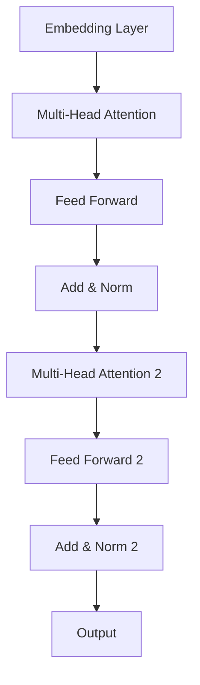

# 大规模语言模型从理论到实践 强化学习概述

## 1.背景介绍

### 1.1 人工智能的发展历程

人工智能(Artificial Intelligence, AI)是一个旨在模拟人类智能行为的广泛领域,包括机器学习、自然语言处理、计算机视觉等多个分支。自20世纪50年代AI概念被正式提出以来,这一领域经历了几个重要的发展阶段。

#### 1.1.1 早期阶段(1950s-1960s)

早期的人工智能系统主要依赖于专家系统和符号主义方法,试图通过编写规则和逻辑推理来模拟人类的思维过程。这一时期的代表性成果包括逻辑理论家机器、通用问题求解器等。

#### 1.1.2 知识库时代(1970s-1980s)  

这一阶段,研究人员意识到需要为AI系统提供大量的知识库,以支持更复杂的推理和决策过程。专家系统、语义网络和框架理论等技术在此期间得到了广泛应用。

#### 1.1.3 统计学习时代(1990s-2000s)

20世纪90年代,机器学习算法开始占据主导地位,特别是神经网络、决策树、支持向量机等算法的兴起,使得AI系统能够从数据中自动学习模式和规律。这一时期奠定了现代AI的基础。

#### 1.1.4 深度学习时代(2010s-至今)

随着计算能力的飞速提升和大数据的出现,深度学习技术在图像、语音、自然语言处理等领域取得了突破性进展,推动了AI的快速发展。深度神经网络、卷积神经网络、循环神经网络等模型在这一阶段得到广泛应用。

### 1.2 语言模型的重要性

在人工智能的各个分支中,自然语言处理(Natural Language Processing, NLP)是一个极为重要的领域。语言模型作为NLP的核心组成部分,对于机器理解和生成自然语言至关重要。高质量的语言模型能够捕捉语言的语法、语义和语用特征,为下游的NLP任务(如机器翻译、问答系统、对话系统等)提供有力支持。

随着深度学习技术的发展,大规模语言模型(Large Language Model, LLM)凭借其强大的语言理解和生成能力,成为NLP领域的研究热点。本文将重点介绍大规模语言模型的理论基础、核心算法、实践应用等内容,为读者提供全面的认识。

## 2.核心概念与联系  

### 2.1 语言模型的定义

语言模型是一种概率分布模型,旨在估计一个语句或一段文本的概率。形式上,给定一个token序列 $S = (t_1, t_2, ..., t_n)$,语言模型需要计算该序列的概率:

$$P(S) = P(t_1, t_2, ..., t_n)$$

根据链式法则,上式可以分解为:

$$P(S) = \prod_{i=1}^{n}P(t_i|t_1, ..., t_{i-1})$$

其中 $P(t_i|t_1, ..., t_{i-1})$ 表示在给定前 $i-1$ 个token的情况下,第 $i$ 个token出现的条件概率。语言模型的目标就是为该条件概率建模。

### 2.2 N-gram语言模型

N-gram语言模型是早期常用的语言模型,它基于马尔可夫假设,即一个token的出现只与前面 $n-1$ 个token相关。因此,条件概率可以近似为:

$$P(t_i|t_1, ..., t_{i-1}) \approx P(t_i|t_{i-n+1}, ..., t_{i-1})$$

N-gram模型通过统计语料库中的 N-gram 频率来估计上述概率。尽管简单,但 N-gram 模型在捕捉局部语言特征方面表现不错,长期被应用于语音识别、机器翻译等任务。

然而,N-gram模型也存在一些明显缺陷:

1. 数据稀疏问题:对于较大的N,语料库中可能缺乏足够的 N-gram 统计数据,导致概率估计不准确。
2. 上下文有限:只考虑有限的历史信息,难以捕捉长程依赖关系。
3. 缺乏语义理解:基于统计方法,无法真正理解语言的语义含义。

### 2.3 神经网络语言模型

为了克服 N-gram 模型的缺陷,研究人员开始探索使用神经网络来构建语言模型。神经网络语言模型(Neural Network Language Model, NNLM)通过学习分布式词向量表示,能够更好地捕捉语义信息和长程依赖关系。

早期的 NNLM 通常采用前馈神经网络或循环神经网络(Recurrent Neural Network, RNN)结构。其中,RNN 由于具有记忆能力,能够有效捕捉序列数据中的长程依赖关系,被广泛应用于语言模型任务。

然而,传统的 RNN 在训练过程中容易出现梯度消失或梯度爆炸问题,难以很好地捕捉长期依赖关系。为了解决这一问题,长短期记忆网络(Long Short-Term Memory, LSTM)和门控循环单元(Gated Recurrent Unit, GRU)等变体被提出,通过精心设计的门控机制有效缓解了梯度问题,极大地提高了 RNN 在序列建模任务上的性能。

### 2.4 自注意力机制与Transformer

尽管 LSTM 和 GRU 取得了长足进展,但它们的序列化计算特性仍然限制了并行能力,难以充分利用现代硬件(如GPU)的计算能力。为了解决这一问题,Transformer 架构被提出,它完全基于注意力机制,摒弃了 RNN 的序列化计算,从而具有更好的并行性。

Transformer 的核心是多头自注意力(Multi-Head Self-Attention)机制,它允许模型在计算某个位置的表示时,直接关注整个序列的所有位置,从而有效捕捉长程依赖关系。自注意力机制的数学表达式如下:

$$\text{Attention}(Q, K, V) = \text{softmax}(\frac{QK^T}{\sqrt{d_k}})V$$

其中 $Q$ 为查询(Query)向量, $K$ 为键(Key)向量, $V$ 为值(Value)向量。通过计算查询向量与所有键向量的相似性得分,然后对得分做 softmax 归一化,最后将得分与值向量相乘,得到输出表示。

多头注意力机制通过线性投影将输入分别映射到查询、键和值的子空间,并执行多个并行注意力计算,最后将结果拼接,从而提高了模型对不同位置关系的建模能力。

### 2.5 大规模语言模型(LLM)

基于 Transformer 的自注意力机制,研究人员开发出了一系列大规模语言模型,如 GPT、BERT、XLNet、RoBERTa等,这些模型通过预训练技术在大规模无标注语料库上进行训练,学习到了丰富的语言知识,并可以通过微调(fine-tuning)等方式迁移到下游任务。

大规模语言模型的优势在于:

1. 规模效应:模型参数量大,可以学习到更丰富的语言知识。
2. 迁移能力强:通过预训练,模型可以学习通用的语言表示,并轻松迁移到各种下游任务。
3. 多任务能力:单一模型可以胜任多种NLP任务,如文本生成、机器翻译、问答等。

然而,训练大规模语言模型需要消耗大量的计算资源,而且存在一些潜在的风险和挑战,如偏见、不实信息的传播等,需要格外注意。

## 3.核心算法原理具体操作步骤

在上一节中,我们介绍了大规模语言模型的核心概念和发展历程。本节将重点讲解其中的核心算法原理和具体操作步骤。

### 3.1 Transformer 架构

Transformer 是大规模语言模型的核心架构,它完全基于自注意力机制,摒弃了 RNN 的序列化计算方式,从而具有更好的并行性。Transformer 的整体架构如下图所示:

Transformer 架构主要包括以下几个核心组件:

1. **Embedding Layer**:将输入的token序列映射为分布式向量表示。
2. **Multi-Head Attention**:通过自注意力机制捕捉序列中元素之间的依赖关系。
3. **Feed Forward**:对每个位置的向量表示进行非线性变换,提供"理解"能力。
4. **Add & Norm**:残差连接和层归一化,有助于训练的稳定性和收敛性。

Transformer 架构的核心在于多头自注意力机制,它允许模型在计算某个位置的表示时,直接关注整个序列的所有位置,从而有效捕捉长程依赖关系。多头注意力机制的计算过程如下:

1. 将输入 $X$ 分别投影到查询 $Q$、键 $K$ 和值 $V$ 的子空间:

   $$Q = XW^Q, K = XW^K, V = XW^V$$

   其中 $W^Q$、$W^K$、$W^V$ 为可学习的投影矩阵。

2. 计算注意力得分:

   $$\text{Attention}(Q, K, V) = \text{softmax}(\frac{QK^T}{\sqrt{d_k}})V$$

   注意力得分表示查询向量与所有键向量的相似性。

3. 执行多头注意力,将多个注意力头的结果拼接:

   $$\text{MultiHead}(Q, K, V) = \text{Concat}(head_1, ..., head_h)W^O$$

   其中 $head_i = \text{Attention}(QW_i^Q, KW_i^K, VW_i^V)$。

通过多头注意力机制,Transformer 能够从不同的表示子空间捕捉序列元素之间的依赖关系,从而更好地建模序列数据。

### 3.2 BERT 模型

BERT(Bidirectional Encoder Representations from Transformers)是一种基于 Transformer 的预训练语言模型,它通过掩蔽语言模型(Masked Language Model)和下一句预测(Next Sentence Prediction)两个预训练任务,在大规模无标注语料库上进行双向预训练,学习到了丰富的语言知识。

BERT 预训练的具体步骤如下:

1. **Masked Language Model**:
   - 随机选择输入序列中的一些token,将它们用特殊的[MASK]标记替换。
   - 模型的目标是基于上下文预测被掩蔽的token。
   - 通过这种方式,BERT 学习到了双向语言表示。

2. **Next Sentence Prediction**:
   - 对于成对的输入序列,判断第二个序列是否为第一个序列的下一句。
   - 这个任务有助于模型理解序列之间的关系。

3. **模型结构**:
   - BERT 使用了 Transformer 的编码器结构,输入为token序列的和位置嵌入的求和。
   - 顶层添加了两个输出层,分别用于掩蔽语言模型和下一句预测任务。

4. **预训练**:
   - 在大规模无标注语料库(如Wikipedia)上进行预训练。
   - 采用双向的自注意力机制,充分利用上下文信息。

5. **微调**:
   - 对于下游的NLP任务,将预训练好的BERT模型进行微调(fine-tuning)。
   - 添加一个输出层,针对具体任务(如文本分类、序列标注等)进行端到端的训练。

通过预训练-微调的范式,BERT 在多个 NLP 任务上取得了出色的表现,极大地推动了迁移学习在自然语言处理领域的应用。

### 3.3 GPT 模型

GPT(Generative Pre-trained Transformer)是另一种基于 Transformer 的大规模语言模型,它采用统一的自回归(Auto-Regressive)语言模型进行预训练,旨在最大化下一个token的条件概率。

GPT 预训练的具体步骤如