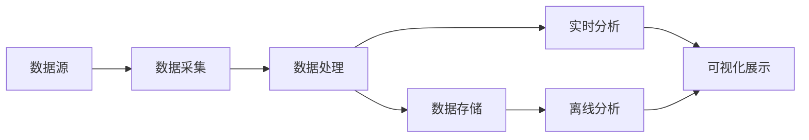

# 实时数据处理 原理与代码实例讲解

作者：禅与计算机程序设计艺术

## 1. 背景介绍

在当今快节奏的数字时代,实时数据处理已成为各行各业的关键技术之一。无论是金融交易、物联网设备,还是社交媒体平台,海量的数据都需要实时收集、处理和分析。实时数据处理能够帮助企业快速洞察市场动向、优化业务决策、提升用户体验,从而在激烈的市场竞争中脱颖而出。

### 1.1 实时数据处理的定义

实时数据处理是指对连续生成的数据进行实时采集、处理、分析和可视化的过程。与传统的批处理方式不同,实时数据处理强调数据的时效性和连续性,要求系统能够在数据产生的同时或极短时间内完成处理和响应。

### 1.2 实时数据处理的应用场景

实时数据处理在各个领域都有广泛的应用,例如:

- 金融领域:实时风控、欺诈检测、高频交易等
- 物联网:设备监控、预测性维护、智能家居等  
- 电商平台:实时推荐、动态定价、用户行为分析等
- 社交媒体:热点事件检测、舆情监控、用户画像等

### 1.3 实时数据处理面临的挑战

实现高效、可靠的实时数据处理并非易事,主要面临以下挑战:

- 数据量大、速度快,对系统吞吐量和延迟提出了很高要求
- 数据格式多样,需要灵活的数据采集和预处理能力
- 业务需求不断变化,系统需要具备良好的可扩展性和可维护性  
- 容错和数据一致性,要确保在故障情况下数据处理的正确性

## 2. 核心概念与联系

要深入理解实时数据处理,需要掌握以下几个核心概念:

### 2.1 数据采集 

数据采集是实时数据处理的第一步,负责将源源不断产生的原始数据高效地传输到数据处理系统。常见的数据采集方式包括:

- 日志收集:通过日志代理将分布式系统中的日志统一收集 
- 消息队列:利用Kafka等消息中间件实现数据的发布和订阅
- 数据库CDC:捕获数据库的变更日志并实时同步

### 2.2 数据处理

数据处理是实时数据处理的核心,根据具体的业务需求对采集到的原始数据进行加工、转换和聚合。主要分为以下几类:  

- 流处理:将连续的数据流按照时间窗口进行切分和聚合,代表技术有Spark Streaming、Flink等
- 规则引擎:根据预定义的规则对数据进行过滤、转换和告警,代表技术有Drools、Esper等
- 机器学习:应用机器学习算法对实时数据进行预测、异常检测和分类,代表技术有Tensorflow、PMML等

### 2.3 数据存储

经过处理后的数据通常需要存储起来,以便后续的分析和查询。实时数据处理常用的存储系统包括:

- 时序数据库:针对时间序列数据优化的数据库,如InfluxDB、OpenTSDB等  
- 内存数据库:将数据存储在内存中,支持超高速的读写,如Redis、Memcached等
- 分布式文件系统:用于存储大规模的结构化和非结构化数据,如HDFS、S3等

### 2.4 数据可视化

为了让业务人员能够直观地洞察数据,需要借助可视化工具将实时数据以图表、仪表盘等形式呈现出来。常用的可视化方案有:

- Grafana:功能强大的开源监控可视化平台
- Kibana:Elastic Stack的可视化组件,与Elasticsearch无缝集成
- Superset:Airbnb开源的商业智能分析平台

下图展示了实时数据处理的整体架构和各组件间的关系:



## 3. 核心算法原理与具体操作步骤

实时数据处理涉及多种算法,本节重点介绍几种常用的流处理和规则引擎算法。

### 3.1 滑动窗口算法

滑动窗口是流处理中最常用的算子之一,可以在无界数据流上进行聚合计算。假设窗口长度为 $t$,滑动步长为 $\delta t$,每次窗口滑动时,会对 $[t-\delta t, t]$ 时间范围内的数据进行计算。

具体步骤如下:

1. 定义窗口长度 $t$ 和滑动步长 $\delta t$
2. 将数据流按照时间戳划分到不同的窗口中 
3. 对每个窗口内的数据进行聚合计算
4. 窗口滑动,更新计算结果

常见的聚合计算有:

- 计数:统计窗口内的元素个数
- 求和:对窗口内的元素求和
- 平均值:计算窗口内元素的平均值
- 最大/最小值:找出窗口内的最大或最小元素

### 3.2 布隆过滤器

布隆过滤器是一种用于检索元素是否在集合中的概率数据结构,具有查询速度快、空间占用小的特点,常用于实时数据去重、防止缓存击穿等场景。

布隆过滤器的核心思想是利用多个哈希函数将元素映射到位数组中,并通过判断位数组中对应位置的值来判断元素是否存在。

具体步骤如下:

1. 初始化一个长度为 $m$ 的位数组,所有位都置为0
2. 选择 $k$ 个不同的哈希函数 $H_1, H_2, ..., H_k$
3. 对于每个插入的元素 $x$,计算其哈希值 $H_1(x), H_2(x), ..., H_k(x)$,将位数组中对应位置的值设为1
4. 查询元素 $y$ 是否存在时,计算其哈希值并判断位数组中对应位置是否都为1,若是则认为元素存在,否则认为不存在

需要注意的是,布隆过滤器判断元素存在时可能会出现误判(false positive),但不会漏判(false negative)。通过合理设置位数组长度 $m$ 和哈希函数个数 $k$ 可以控制误判率。

### 3.3 Rete算法

Rete算法是一种高效的规则匹配算法,被广泛应用于规则引擎系统中。其核心思想是将规则条件拆分为一个个节点,构建一个Rete网络,通过节点间的信息传递来完成规则匹配。

具体步骤如下:

1. 将规则条件拆分为条件节点(Alpha节点)和连接节点(Beta节点)
2. 将事实对象(Fact)逐个插入Rete网络
3. 事实对象在条件节点上进行过滤,并将满足条件的对象传递到连接节点
4. 连接节点对接收到的对象进行连接操作,生成新的事实对象
5. 新的事实对象继续在Rete网络中传播,直到触发规则或到达终止节点

Rete算法的优势在于利用了规则条件的共享性,避免了重复计算,大大提高了规则匹配的效率。但其缺点是构建Rete网络的过程比较耗时,因此更适合规则相对稳定的场景。

## 4. 数学模型和公式详细讲解举例说明

本节以滑动窗口算法为例,详细讲解其数学模型和公式。

### 4.1 时间窗口模型

假设数据流中的元素为 $(x_i, t_i)$,其中 $x_i$ 为数据值,$t_i$ 为时间戳,窗口长度为 $T$,滑动步长为 $\Delta T$。则第 $k$ 个时间窗口 $W_k$ 可以表示为:

$$W_k = \{(x_i, t_i) | t_i \in [k \Delta T, k \Delta T + T]\}$$

即窗口 $W_k$ 包含了时间戳落在 $[k \Delta T, k \Delta T + T]$ 区间内的所有元素。

### 4.2 窗口聚合计算

对于窗口 $W_k$,可以定义不同的聚合函数 $f$ 来计算其聚合结果 $y_k$。常见的聚合函数包括:

- 计数:$f(W_k) = |W_k|$
- 求和:$f(W_k) = \sum_{(x_i, t_i) \in W_k} x_i$
- 平均值:$f(W_k) = \frac{1}{|W_k|} \sum_{(x_i, t_i) \in W_k} x_i$
- 最大值:$f(W_k) = \max_{(x_i, t_i) \in W_k} x_i$
- 最小值:$f(W_k) = \min_{(x_i, t_i) \in W_k} x_i$

例如,要计算每分钟的数据总和,可以设置窗口长度 $T=60s$,滑动步长 $\Delta T=60s$,聚合函数为求和。则第 $k$ 分钟的数据总和为:

$$y_k = \sum_{(x_i, t_i) \in W_k} x_i$$

### 4.3 窗口计算优化

滑动窗口的朴素实现是每次窗口滑动时重新计算聚合结果,这样会导致大量重复计算。实际上,相邻两个窗口之间只有部分数据的差异,可以利用这个特点来优化计算。

以求和为例,设第 $k-1$ 个窗口的求和结果为 $y_{k-1}$,则第 $k$ 个窗口的求和结果可以表示为:

$$y_k = y_{k-1} + \sum_{(x_i, t_i) \in W_k \setminus W_{k-1}} x_i - \sum_{(x_i, t_i) \in W_{k-1} \setminus W_k} x_i$$

其中 $W_k \setminus W_{k-1}$ 表示新进入窗口的元素集合,$W_{k-1} \setminus W_k$ 表示离开窗口的元素集合。这样只需要对差异部分的元素进行计算,避免了重复计算窗口内所有元素的开销。

## 5. 项目实践:代码实例和详细解释说明

下面以Flink为例,演示如何用Java代码实现滑动窗口的数据统计。

### 5.1 Flink流处理基本概念

在编写代码前,先了解一下Flink流处理的几个基本概念:

- DataStream:表示数据流,可以看作是数据的集合
- Transformation:对DataStream进行的各种转换操作,如map、filter、aggregate等
- Window:在DataStream上定义的时间窗口,如滚动窗口、滑动窗口等
- Trigger:触发窗口计算的条件,如每隔一段时间触发、达到一定数据量触发等

### 5.2 代码实例

下面的代码实现了每5秒统计一次最近1分钟内数据的总和、平均值、最大值和最小值。

```java
import org.apache.flink.api.common.functions.AggregateFunction;
import org.apache.flink.api.java.tuple.Tuple2;
import org.apache.flink.streaming.api.datastream.DataStream;
import org.apache.flink.streaming.api.environment.StreamExecutionEnvironment;
import org.apache.flink.streaming.api.windowing.assigners.SlidingProcessingTimeWindows;
import org.apache.flink.streaming.api.windowing.time.Time;

public class SlidingWindowExample {

    public static void main(String[] args) throws Exception {
        // 创建流处理环境
        StreamExecutionEnvironment env = StreamExecutionEnvironment.getExecutionEnvironment();

        // 创建数据源
        DataStream<Tuple2<String, Long>> dataStream = env
                .fromElements(
                        Tuple2.of("sensor_1", 1L),
                        Tuple2.of("sensor_2", 2L),
                        Tuple2.of("sensor_1", 3L),
                        Tuple2.of("sensor_2", 4L),
                        Tuple2.of("sensor_1", 5L),
                        Tuple2.of("sensor_2", 6L)
                );

        // 定义滑动窗口
        DataStream<Tuple2<String, Tuple2<Double, Long>>> resultStream = dataStream