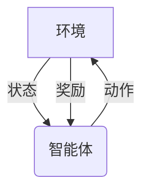

# 强化学习Reinforcement Learning在自动化控制系统中的运用

## 1.背景介绍

### 1.1 自动化控制系统概述

自动化控制系统是一种通过测量系统的输出，根据预先设定的目标对系统进行自动调节的系统。它广泛应用于工业生产、交通运输、航空航天、环境控制等诸多领域。传统的控制系统通常采用经典控制理论或现代控制理论等方法进行设计和优化。然而,这些方法往往需要对系统进行精确建模,并且难以处理高度非线性和不确定性的复杂系统。

### 1.2 强化学习在控制系统中的应用背景

近年来,强化学习(Reinforcement Learning, RL)作为一种全新的机器学习范式,受到了广泛关注。强化学习旨在通过与环境的互动来学习一种最优策略,以最大化预期的累积奖励。由于强化学习不需要精确的系统模型,且能够处理复杂的非线性和随机环境,因此它在解决自动化控制问题方面展现出巨大的潜力。

## 2.核心概念与联系  

### 2.1 强化学习的核心概念

强化学习是一种基于奖惩机制的学习方法,其核心思想是通过与环境进行交互,根据获得的奖励信号来调整策略,最终找到一种最优策略。强化学习主要包括以下几个核心概念:

- **环境(Environment)**:强化学习智能体所处的外部世界,包括状态、动作和奖励。
- **状态(State)**:环境在某个时间点的具体情况。
- **动作(Action)**:智能体对环境采取的操作。
- **奖励(Reward)**:环境对智能体当前动作的反馈,用于指导智能体朝着正确的方向学习。
- **策略(Policy)**:智能体在每个状态下选择动作的策略或规则。
- **价值函数(Value Function)**:评估一个状态或状态-动作对的好坏程度。

强化学习算法的目标是找到一个最优策略,使得在该策略指导下,智能体能够从环境中获得最大的累积奖励。

### 2.2 强化学习与自动化控制系统的联系

将强化学习应用于自动化控制系统,可以将控制系统视为一个强化学习环境。在这种情况下:

- **状态**对应于系统的当前状态,如温度、压力、位置等。
- **动作**对应于对系统施加的控制输入,如加热器功率、阀门开度等。
- **奖励**对应于系统性能指标,如能耗、跟踪误差等。

通过与控制系统持续交互,强化学习算法可以学习到一种最优控制策略,使得系统能够在满足约束条件的前提下,达到预期的性能目标。

## 3.核心算法原理具体操作步骤

强化学习算法通常可以分为两大类:基于价值函数的算法和基于策略的算法。下面将分别介绍这两类算法的核心原理和具体操作步骤。

### 3.1 基于价值函数的算法

#### 3.1.1 Q-Learning算法

Q-Learning是一种基于价值函数的强化学习算法,其核心思想是通过不断更新状态-动作对的Q值,最终找到一个最优的Q函数,从而导出最优策略。Q-Learning算法的具体步骤如下:

1. 初始化Q表,对于所有状态-动作对,将Q值初始化为任意值(通常为0)。
2. 对于每个时间步:
    - 观测当前状态$s_t$。
    - 根据当前Q值,选择一个动作$a_t$(通常采用$\epsilon$-贪婪策略)。
    - 执行动作$a_t$,观测到新的状态$s_{t+1}$和奖励$r_{t+1}$。
    - 更新Q值:
    
    $$Q(s_t, a_t) \leftarrow Q(s_t, a_t) + \alpha \left[ r_{t+1} + \gamma \max_a Q(s_{t+1}, a) - Q(s_t, a_t) \right]$$
    
    其中$\alpha$是学习率,$\gamma$是折现因子。
3. 重复步骤2,直到Q值收敛。

Q-Learning算法的优点是简单、易于实现,并且可以证明在满足适当条件下,算法一定会收敛到最优Q函数。但是,Q-Learning也存在一些缺点,如需要维护一个巨大的Q表,并且在连续状态和动作空间中表现不佳。

#### 3.1.2 Sarsa算法

Sarsa算法是另一种基于价值函数的强化学习算法,与Q-Learning类似,但更新Q值的方式略有不同。Sarsa算法的具体步骤如下:

1. 初始化Q表,对于所有状态-动作对,将Q值初始化为任意值(通常为0)。
2. 对于每个时间步:
    - 观测当前状态$s_t$。
    - 根据当前Q值,选择一个动作$a_t$(通常采用$\epsilon$-贪婪策略)。
    - 执行动作$a_t$,观测到新的状态$s_{t+1}$和奖励$r_{t+1}$。
    - 根据策略选择下一个动作$a_{t+1}$。
    - 更新Q值:
    
    $$Q(s_t, a_t) \leftarrow Q(s_t, a_t) + \alpha \left[ r_{t+1} + \gamma Q(s_{t+1}, a_{t+1}) - Q(s_t, a_t) \right]$$
    
3. 重复步骤2,直到Q值收敛。

Sarsa算法的优点是它直接估计并优化当前策略的Q函数,因此更加适合在线学习场景。但是,与Q-Learning类似,Sarsa算法也存在维护Q表的问题,并且在连续状态和动作空间中表现不佳。

### 3.2 基于策略的算法

#### 3.2.1 策略梯度算法

策略梯度算法是一种直接优化策略参数的强化学习算法。与基于价值函数的算法不同,策略梯度算法不需要维护Q表,因此可以很好地处理连续状态和动作空间。策略梯度算法的具体步骤如下:

1. 初始化策略参数$\theta$。
2. 对于每个时间步:
    - 观测当前状态$s_t$。
    - 根据当前策略$\pi_\theta(a|s)$,选择一个动作$a_t$。
    - 执行动作$a_t$,观测到新的状态$s_{t+1}$和奖励$r_{t+1}$。
    - 计算累积折现奖励:
    
    $$G_t = \sum_{k=t}^{T} \gamma^{k-t} r_k$$
    
    - 根据策略梯度公式更新策略参数:
    
    $$\theta \leftarrow \theta + \alpha \nabla_\theta \log \pi_\theta(a_t|s_t) G_t$$
    
    其中$\alpha$是学习率。
3. 重复步骤2,直到策略收敛。

策略梯度算法的优点是可以直接优化策略参数,并且可以处理连续状态和动作空间。但是,它也存在一些缺点,如高方差问题和样本效率低等。

#### 3.2.2 Actor-Critic算法

Actor-Critic算法是一种结合了价值函数和策略优化的强化学习算法。它包含两个部分:Actor(行为部分)用于生成动作,Critic(评价部分)用于评估状态或状态-动作对的价值。Actor-Critic算法的具体步骤如下:

1. 初始化Actor网络(策略网络)参数$\theta$和Critic网络(价值网络)参数$\phi$。
2. 对于每个时间步:
    - 观测当前状态$s_t$。
    - Actor网络根据当前策略$\pi_\theta(a|s)$,选择一个动作$a_t$。
    - 执行动作$a_t$,观测到新的状态$s_{t+1}$和奖励$r_{t+1}$。
    - 计算TD误差:
    
    $$\delta_t = r_{t+1} + \gamma V_\phi(s_{t+1}) - V_\phi(s_t)$$
    
    - 更新Critic网络参数$\phi$,使得TD误差最小化。
    - 更新Actor网络参数$\theta$,使得期望奖励最大化:
    
    $$\theta \leftarrow \theta + \alpha \nabla_\theta \log \pi_\theta(a_t|s_t) \delta_t$$
    
3. 重复步骤2,直至Actor和Critic网络收敛。

Actor-Critic算法结合了价值函数和策略优化的优点,可以更好地处理连续状态和动作空间,同时也提高了样本效率。但是,它也存在一些挑战,如如何平衡Actor和Critic的更新、如何处理稀疏奖励等。

## 4.数学模型和公式详细讲解举例说明

在强化学习中,数学模型和公式扮演着重要的角色,它们为算法提供了理论基础和计算框架。下面将详细讲解一些核心的数学模型和公式。

### 4.1 马尔可夫决策过程(Markov Decision Process, MDP)

马尔可夫决策过程是强化学习的数学基础,它描述了智能体与环境之间的交互过程。一个MDP可以用一个五元组$(S, A, P, R, \gamma)$来表示:

- $S$是状态集合
- $A$是动作集合
- $P(s'|s, a)$是状态转移概率,表示在状态$s$执行动作$a$后,转移到状态$s'$的概率
- $R(s, a, s')$是奖励函数,表示在状态$s$执行动作$a$后,转移到状态$s'$所获得的奖励
- $\gamma \in [0, 1)$是折现因子,用于权衡即时奖励和长期奖励的重要性

在MDP中,智能体的目标是找到一个最优策略$\pi^*$,使得在该策略指导下,智能体能够获得最大的期望累积折现奖励:

$$\pi^* = \arg\max_\pi \mathbb{E}_\pi \left[ \sum_{t=0}^\infty \gamma^t r_t \right]$$

其中$r_t$是在时间步$t$获得的奖励。

### 4.2 贝尔曼方程(Bellman Equation)

贝尔曼方程是强化学习中的另一个重要概念,它描述了状态价值函数或状态-动作价值函数与奖励和后续状态价值之间的关系。

对于状态价值函数$V(s)$,贝尔曼方程为:

$$V(s) = \mathbb{E}_\pi \left[ r_t + \gamma V(s_{t+1}) | s_t = s \right]$$

对于状态-动作价值函数$Q(s, a)$,贝尔曼方程为:

$$Q(s, a) = \mathbb{E}_\pi \left[ r_t + \gamma \max_{a'} Q(s_{t+1}, a') | s_t = s, a_t = a \right]$$

贝尔曼方程为强化学习算法提供了一种计算价值函数的方式,并且可以证明,在满足适当条件下,通过不断更新价值函数使其满足贝尔曼方程,最终可以收敛到最优价值函数。

### 4.3 策略梯度定理(Policy Gradient Theorem)

策略梯度定理为基于策略的强化学习算法提供了理论基础。它给出了策略梯度的计算公式,用于更新策略参数以最大化期望累积折现奖励。

策略梯度定理可以表示为:

$$\nabla_\theta J(\theta) = \mathbb{E}_{\pi_\theta} \left[ \sum_{t=0}^\infty \nabla_\theta \log \pi_\theta(a_t|s_t) Q^{\pi_\theta}(s_t, a_t) \right]$$

其中:

- $J(\theta)$是期望累积折现奖励,即$J(\theta) = \mathbb{E}_{\pi_\theta} \left[ \sum_{t=0}^\infty \gamma^t r_t \right]$
- $\pi_\theta$是由参数$\theta$参数化的策略
- $Q^{\pi_\theta}(s_t, a_t)$是在策略$\pi_\theta$下,状态-动作对$(s_t, a_t)$的价值函数

策略梯度定理为我们提供了一种计算策略梯度的方式,从而可以通过梯度上