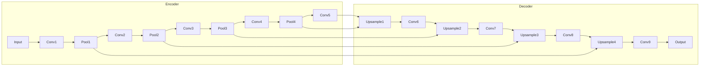
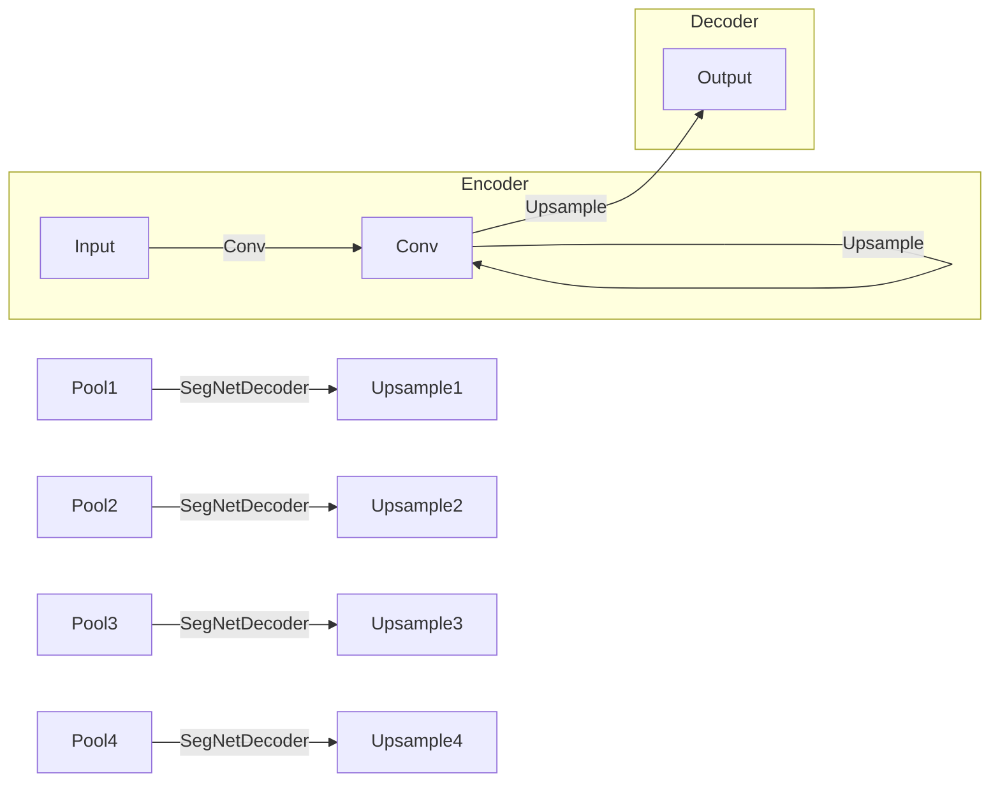
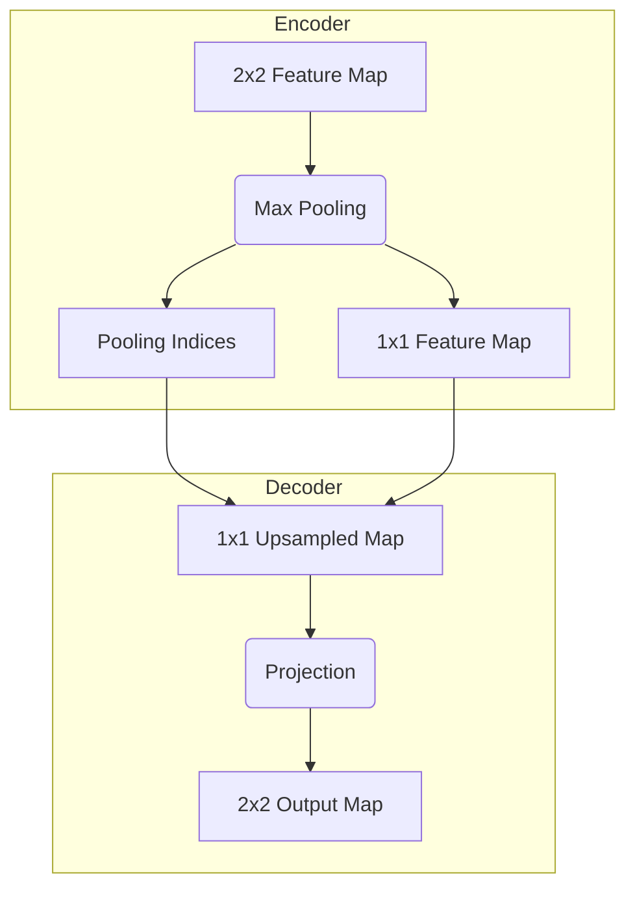

# 搭建SegNet模型：从零开始构建你的语义分割利器

## 1.背景介绍

### 1.1 语义分割的重要性

在计算机视觉领域,语义分割是一项关键任务,旨在将图像像素级别上精确分类到不同的对象类别中。与其他任务如目标检测和图像分类不同,语义分割需要对图像中的每个像素进行分类,从而获得对整个场景的理解。这种像素级别的理解对于诸多应用领域都是至关重要的,例如:

- **自动驾驶**:准确分割道路、行人、车辆等对象,是实现安全自动驾驶的前提条件。
- **医疗影像分析**:从CT、MRI等医学影像中分割出器官和病变区域,可为医生诊断提供重要辅助。
- **增强现实(AR)和虚拟现实(VR)**:通过语义分割理解真实场景,才能实现将虚拟元素自然融入真实环境中。
- **机器人视觉**:语义分割使机器人能够理解复杂环境,实现高级任务如抓取和导航。

随着深度学习技术的不断发展,基于卷积神经网络(CNN)的语义分割模型取得了长足进步,在准确率和实时性方面都有了突破性的提升。其中,SegNet就是一个具有里程碑意义的语义分割模型。

### 1.2 SegNet模型的重要意义

SegNet是2015年由剑桥大学的研究人员提出的一种用于像素级语义分割的全卷积神经网络模型。它的核心创新点在于提出了解码器(decoder)模块,可以有效地从低分辨率的编码特征图(encoder feature maps)恢复出高分辨率的全卷积特征,从而产生与输入图像分辨率相同的语义分割结果。

SegNet的出现打破了当时基于编码器(encoder)的模型在分割任务中分辨率下降的瓶颈,成为了第一个能够保持输入输出分辨率相同的端到端训练的全卷积网络模型。这一创新为后续语义分割模型的发展奠定了基础,影响深远。同时,SegNet本身也具有以下优势:

- **高效内存利用**:与当时其他模型相比,SegNet只需要较少的训练内存。
- **快速端到端训练**:借助解码器设计,SegNet可以直接从图像生成分割结果,无需复杂的前后处理。
- **可扩展性强**:SegNet的编码器解码器结构可以与其他卷积网络骨干网络(如VGG、ResNet等)相结合。

因此,学习并掌握SegNet的原理和实现细节,对于从事计算机视觉、深度学习等领域的工程师和研究人员来说是非常有价值的。本文将全面解析SegNet模型的核心概念、算法细节、项目实践等内容,助你从零开始构建属于自己的语义分割利器。

## 2.核心概念与联系

在深入探讨SegNet模型之前,我们需要先了解一些与之密切相关的基础概念,为后续内容的学习打下坚实基础。

### 2.1 全卷积神经网络

全卷积神经网络(Fully Convolutional Network,FCN)是一种将标准卷积神经网络改造后应用于像素级分割任务的网络结构。与标准CNN不同,FCN完全移除了全连接层,使用反卷积层(也称为转置卷积层)来替代全连接层,从而产生与输入图像相同分辨率的输出特征图。

FCN的核心思想是将整个输入图像映射到相应的输出特征图(如分割图),而不是将图像分类为单个标签。这种设计使FCN能够自然地应用于像素级别的分割任务。

SegNet正是基于FCN的思想发展而来的一种全卷积语义分割模型。它采用了编码器-解码器结构,能够端到端地从输入图像生成分割结果,而无需复杂的图像预处理或后处理步骤。

### 2.2 编码器-解码器架构

编码器-解码器(Encoder-Decoder)架构是一种常见的全卷积网络设计模式,广泛应用于图像分割、图像生成等计算机视觉任务中。如下图所示:

- **编码器(Encoder)**:通常由一系列卷积层和池化层组成,用于从输入图像中提取语义特征,分辨率逐层降低。
- **解码器(Decoder)**:与编码器对应,由一系列反卷积(上采样)层和卷积层组成,将编码器输出的低分辨率特征图逐层上采样和精炼,最终恢复到与输入图像相同的分辨率。

编码器-解码器架构的关键在于,解码器不仅可以从编码器的最终输出中获取特征,还可以利用编码器中间层产生的特征图,通过跳跃连接(skip connection)的方式融合不同分辨率的特征,从而产生更加精细的分割结果。

SegNet正是采用了这种编码器-解码器架构,并在解码器部分做出了创新设计,成为了具有里程碑意义的语义分割模型。我们将在后续章节中详细剖析SegNet的网络结构和工作原理。

## 3.核心算法原理具体操作步骤

### 3.1 SegNet网络架构

SegNet由编码器模块和解码器模块组成,整体网络结构如下所示:

1. **编码器(Encoder)**:编码器部分采用标准的卷积神经网络结构,由13个卷积层和5个池化层组成。每一个池化层都会使特征图分辨率降低一半。编码器的作用是从输入图像中提取语义特征,并在空间维度上逐层降低分辨率。

2. **解码器(Decoder)**:解码器部分包含5个反卷积(上采样)层和5个卷积层。每个反卷积层的作用是将特征图的分辨率放大一倍,而卷积层则用于精炼和组合特征。

3. **SegNet解码器(SegNet Decoder)**:SegNet的核心创新之处在于引入了SegNet解码器模块。该模块通过编码器中池化索引(pooling indices)的传递,将低分辨率的编码器特征图精确地映射(上采样)到高分辨率的解码器特征图上,避免了传统上采样方法中的信息丢失。

4. **跳跃连接(Skip Connection)**:在SegNet中,每个解码器层都会接收到对应编码器层的特征图,通过跳跃连接将不同分辨率的特征融合,从而产生更精细的分割结果。

通过上述创新设计,SegNet成为了第一个能够保持输入输出分辨率相同的端到端全卷积语义分割模型,为后续模型的发展奠定了基础。

### 3.2 SegNet解码器工作原理

SegNet解码器是整个模型的核心创新部分,它的工作原理可以概括为以下三个步骤:

1. **池化索引传递**

   在编码器的每个池化层,除了输出池化后的特征图外,还会记录下每个池化窗口中最大值元素的位置索引。这些池化索引将沿着编码器向上传递,最终被解码器接收和利用。

2. **上采样(Upsampling)**

   在解码器的每个反卷积层,先将低分辨率的编码器特征图通过简单的内插(如最近邻插值)进行上采样,将分辨率放大一倍。

3. **精确映射(Projection)**

   利用从编码器传递过来的池化索引,将上采样后的特征图精确地映射(复制)到高分辨率的解码器特征图上。这一步骤确保了在上采样过程中不会发生信息丢失或失真。

通过上述步骤,SegNet解码器可以高效地从编码器的低分辨率特征图恢复出高分辨率的全卷积特征,为生成精确的语义分割结果奠定了基础。下面我们用一个具体的例子来形象地解释这一过程:

如上图所示,假设编码器的某一层输出一个1x1的特征图C,以及对应的2x2池化索引D。在解码器的同一层,我们首先使用简单的内插(如最近邻插值)将C上采样到2x2的特征图E。

接下来,利用池化索引D,我们可以将E中的值精确地映射(复制)到输出特征图F的正确位置上,从而产生高分辨率的2x2输出特征图F,而不会出现信息丢失或失真。

通过在整个解码器中重复这一过程,SegNet就能够从低分辨率的编码器特征图逐步恢复出与输入图像相同分辨率的高质量分割结果。

### 3.3 SegNet训练和推理过程

经过上面的介绍,相信您已经对SegNet的核心工作原理有了深入的理解。下面我们来看一下SegNet在实际训练和推理过程中是如何运作的。

**训练过程**:

1. **数据准备**:首先需要准备好训练数据集,包括输入图像和对应的像素级分割标签图。通常会采用数据增强等方法扩充训练数据,以提高模型的泛化能力。

2. **前向传播**:将输入图像传入SegNet模型,经过编码器提取特征,并在编码器的每个池化层记录下池化索引。然后特征图进入解码器,利用池化索引进行上采样和精确映射,最终在解码器的输出端得到与输入图像分辨率相同的预测分割图。

3. **损失计算**:将预测分割图与标签分割图进行对比,计算像素级别的损失函数,常用的是交叉熵损失。

4. **反向传播**:根据损失函数的梯度,利用优化算法(如SGD、Adam等)对SegNet的可训练参数(卷积核权值)进行更新。

5. **迭代训练**:重复上述过程,不断优化模型参数,直至模型在验证集上的性能不再提升为止。

**推理过程**:

1. **输入图像**:将待分割的输入图像传入训练好的SegNet模型。

2. **前向计算**:模型按照训练过程中的前向传播步骤,计算出最终的预测分割图。

3. **结果输出**:可视化或后处理预测分割图,得到最终的语义分割结果。

需要注意的是,在实际应用中,我们还需要对SegNet的输入输出进行适当的预处理和后处理,以提高分割质量和效率。例如可以对输入图像进行归一化,对输出分割图进行阈值滤波等。这些细节我们将在后面的项目实践部分进行详细介绍。

## 4.数学模型和公式详细讲解举例说明

在前面的章节中,我们已经对SegNet的整体架构和工作原理有了全面的了解。而要真正掌握SegNet,还需要对其中涉及的数学模型和公式有深入的理解。本章节将为您逐一拨云见日,让这些抽象的公式变得生动形象。

### 4.1 卷积运算

卷