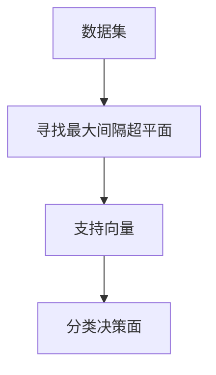

# 支持向量机 (Support Vector Machines, SVM) 原理与代码实例讲解

## 1.背景介绍

### 1.1 什么是支持向量机？

支持向量机(Support Vector Machines, SVM)是一种有监督的机器学习算法,主要用于分类和回归分析。它是在20世纪90年代由Vladimir Vapnik等人提出的,并在之后的几年里得到了广泛的研究和应用。SVM的目标是构建一个超平面,将不同类别的数据点分开,同时最大化两类数据点到超平面的距离。

### 1.2 SVM的应用场景

SVM已经被广泛应用于多个领域,包括:

- 文本分类(如垃圾邮件检测、情感分析等)
- 图像识别(如手写数字识别、人脸检测等)
- 生物信息学(如蛋白质结构预测、基因表达数据分析等)
- 金融领域(如信用评分、欺诈检测等)
- 等等

SVM之所以受到广泛关注,主要有以下几个原因:

1. 泛化能力强,即使在高维空间也能有效工作
2. 只需调整少量参数,简单高效
3. 对噪声和离群点具有很好的鲁棒性
4. 可以处理非线性分类问题

## 2.核心概念与联系

### 2.1 线性可分支持向量机

我们先从一个简单的二维线性可分数据集开始。假设有两类数据,我们需要找到一条直线将它们分开。显然有无数条直线都能将数据分开,但SVM的目标是找到一条能够最大化两类数据点到直线距离的直线,如下图所示:



这条直线被称为最大间隔超平面(Maximum Margin Hyperplane),而落在最大间隔边界上的数据点被称为支持向量(Support Vectors)。

### 2.2 函数间隔与几何间隔

对于任意一个数据点 $\vec{x}$,我们可以定义它到超平面的函数间隔(Functional Margin)为:

$$
\hat{\gamma} = y(\vec{w}^T\vec{x} + b)
$$

其中 $\vec{w}$ 是超平面的法向量, $b$ 是位移项, $y \in \{-1, 1\}$ 是数据点的类别标记。

几何间隔(Geometric Margin)则被定义为函数间隔除以 $\|\vec{w}\|$:

$$
\gamma = \frac{\hat{\gamma}}{\|\vec{w}\|}= \frac{y(\vec{w}^T\vec{x} + b)}{\|\vec{w}\|}
$$

SVM的目标就是最大化几何间隔,从而找到具有最大间隔的超平面。

### 2.3 对偶问题

为了求解SVM的最优化问题,我们需要引入拉格朗日乘子法,将原始问题转化为对偶问题。对偶问题的优点是,它只涉及内积运算,而不需要显式计算数据在某个空间的坐标。这为我们后面引入核技巧奠定了基础。

## 3.核心算法原理具体操作步骤 

### 3.1 硬间隔最大化

我们先考虑线性可分的硬间隔(Hard Margin)情况。假设训练数据集为 $\{(\vec{x}_i, y_i)\}_{i=1}^N$,其中 $\vec{x}_i \in \mathbb{R}^n, y_i \in \{-1, 1\}$。我们的目标是找到一个超平面 $\vec{w}^T\vec{x} + b = 0$,使得:

$$
\begin{cases}
\vec{w}^T\vec{x}_i + b \ge 1, & \text{if } y_i = 1\\
\vec{w}^T\vec{x}_i + b \le -1, & \text{if } y_i = -1
\end{cases}
$$

这两个不等式可以合并为:

$$
y_i(\vec{w}^T\vec{x}_i + b) \ge 1, \quad i = 1, 2, \ldots, N
$$

为了最大化几何间隔 $\gamma$,我们需要最小化 $\|\vec{w}\|$,这等价于最小化 $\frac{1}{2}\|\vec{w}\|^2$。所以我们得到了如下的优化问题:

$$
\begin{aligned}
& \underset{\vec{w},b}{\text{minimize}}
& & \frac{1}{2}\|\vec{w}\|^2 \\
& \text{subject to}
& & y_i(\vec{w}^T\vec{x}_i + b) \ge 1, \quad i=1,2,\ldots,N
\end{aligned}
$$

我们可以通过构造拉格朗日函数,并对偶化得到对偶问题:

$$
\begin{aligned}
& \underset{\alpha}{\text{maximize}}
& & \sum_{i=1}^N \alpha_i - \frac{1}{2} \sum_{i,j=1}^N y_i y_j \alpha_i \alpha_j \vec{x}_i^T\vec{x}_j \\
& \text{subject to}
& & \sum_{i=1}^N \alpha_i y_i = 0\\
& & & \alpha_i \ge 0, \quad i=1,2,\ldots,N
\end{aligned}
$$

其中 $\alpha_i$ 是对偶变量。一旦求解出了最优的 $\alpha^*$,我们就可以得到:

$$
\vec{w}^* = \sum_{i=1}^N y_i\alpha_i^*\vec{x}_i
$$

而 $b^*$ 可以通过任意支持向量 $\vec{x}_j$ 计算得到:

$$
b^* = y_j - \vec{w}^{*T}\vec{x}_j
$$

于是我们得到了最优超平面:

$$
\vec{w}^{*T}\vec{x} + b^* = 0
$$

对于新的测试数据 $\vec{x}_{new}$,我们可以计算:

$$
f(\vec{x}_{new}) = \text{sign}(\vec{w}^{*T}\vec{x}_{new} + b^*)
$$

来预测它的类别。

### 3.2 软间隔最大化

在现实中,数据往往是线性不可分的,我们需要引入软间隔(Soft Margin)来处理这种情况。我们引入了松弛变量 $\xi_i \ge 0$,使得约束条件变为:

$$
y_i(\vec{w}^T\vec{x}_i + b) \ge 1 - \xi_i, \quad i=1,2,\ldots,N
$$

同时,我们在目标函数中加入了惩罚项 $C\sum_{i=1}^N \xi_i$,其中 $C > 0$ 是一个超参数,用于权衡最大间隔和误分类的相对重要性。

于是,我们得到了软间隔SVM的优化问题:

$$
\begin{aligned}
& \underset{\vec{w},b,\xi}{\text{minimize}}
& & \frac{1}{2}\|\vec{w}\|^2 + C\sum_{i=1}^N \xi_i\\
& \text{subject to}
& & y_i(\vec{w}^T\vec{x}_i + b) \ge 1 - \xi_i, \quad i=1,2,\ldots,N\\
& & & \xi_i \ge 0, \quad i=1,2,\ldots,N
\end{aligned}
$$

与硬间隔情况类似,我们可以通过对偶化得到软间隔SVM的对偶问题。

### 3.3 核技巧

对于非线性可分的数据,我们可以使用核技巧(Kernel Trick)将数据从原始空间映射到一个更高维的特征空间,使得在新的特征空间中数据变为线性可分。这种非线性映射通常由一个核函数 $\kappa(\vec{x}_i, \vec{x}_j) = \phi(\vec{x}_i)^T\phi(\vec{x}_j)$ 给出,其中 $\phi$ 是从输入空间到特征空间的映射。

常用的核函数包括:

- 线性核: $\kappa(\vec{x}_i, \vec{x}_j) = \vec{x}_i^T\vec{x}_j$
- 多项式核: $\kappa(\vec{x}_i, \vec{x}_j) = (\gamma\vec{x}_i^T\vec{x}_j + r)^d$
- 高斯核(RBF核): $\kappa(\vec{x}_i, \vec{x}_j) = \exp(-\gamma\|\vec{x}_i - \vec{x}_j\|^2)$
- 等等

利用核技巧,我们无需显式计算映射 $\phi$,只需将内积项 $\vec{x}_i^T\vec{x}_j$ 替换为核函数 $\kappa(\vec{x}_i, \vec{x}_j)$ 即可。这极大地简化了计算,使得SVM可以高效地工作在高维甚至无限维的特征空间上。

## 4.数学模型和公式详细讲解举例说明

在这一部分,我们将通过一个具体的例子,来详细说明SVM的数学模型和公式。假设我们有如下一个二维数据集:

```python
import numpy as np
import matplotlib.pyplot as plt
from matplotlib import style
style.use('ggplot')

X = np.array([[1,2], 
              [5,8],
              [1.5,1.8],
              [8,8],
              [1,0.6],
              [9,11],
              [8,2],
              [10,5],
              [7,3.8]])

y = np.array([0,1,0,1,0,1,0,1,0])
```

我们将使用scikit-learn库中的SVM模块来训练一个SVM分类器。首先,我们需要将数据集分为训练集和测试集:

```python
from sklearn.model_selection import train_test_split
X_train, X_test, y_train, y_test = train_test_split(X, y, test_size=0.33)
```

接下来,我们实例化一个SVM分类器对象,并用训练集数据进行训练:

```python
from sklearn.svm import SVC
clf = SVC(kernel='linear') # 线性核函数
clf.fit(X_train, y_train)
```

训练完成后,我们可以在测试集上评估模型的性能:

```python
print('Accuracy:', clf.score(X_test, y_test))
```

假设我们得到的准确率为0.67。现在我们来可视化一下SVM在训练集上的分类结果:

```python
def visu(X, y, clf):
    plt.scatter(X[:, 0], X[:, 1], c=y, s=30, cmap=plt.cm.Paired)
    
    # 绘制分类超平面和间隔边界
    ax = plt.gca()
    xlim = ax.get_xlim()
    ylim = ax.get_ylim()
    
    # 生成网格采样数据
    xx = np.linspace(xlim[0], xlim[1], 30)
    yy = np.linspace(ylim[0], ylim[1], 30)
    YY, XX = np.meshgrid(yy, xx)
    xy = np.vstack([XX.ravel(), YY.ravel()]).T
    Z = clf.decision_function(xy).reshape(XX.shape)
    
    # 绘制决策边界和间隔
    ax.contour(XX, YY, Z, colors='k', levels=[-1, 0, 1], alpha=0.5, linestyles=['--', '-', '--'])
    
visu(X_train, y_train, clf)
```

在绘制的图像中,我们可以清晰地看到SVM找到的分类超平面,以及两类数据点到超平面的距离(即间隔)。那些落在间隔边界上的数据点就是支持向量。

现在,我们来计算一下几何间隔 $\gamma$。根据公式,我们有:

$$
\gamma = \frac{1}{\|\vec{w}\|}
$$

其中 $\vec{w}$ 可以从训练好的分类器中获取:

```python
w = clf.coef_[0] # 对于二维数据,w是一个二元向量
print('几何间隔 gamma = 1/||w|| =', 1.0/np.linalg.norm(w))
```

假设我们得到的几何间隔为0.25。这个值越大,说明SVM找到的分类超平面就越好。

最后,我们来看一个新的测试样本,比如 $\vec{x}_{new} = (6, 5)$,它会被分类为哪一类呢?我们可以计算:

```python
x_new = np.array([6, 5])
print('新样本(6, 5)的预测类别为:', clf.predict([x_new]))
```

如果输出为1,则说明该样本被分类为正类,否则为负类。

通过这个具体的例子,我们对SVM的数学模型和公式有了更加直观的理解。

## 5.项目实践:代码实例和详细解释说明

在这一部分,我们将使用Python中的scikit-learn库,通过一个实际的代码示例来实现SVM分类器。我们将使用一个常见的数据集: