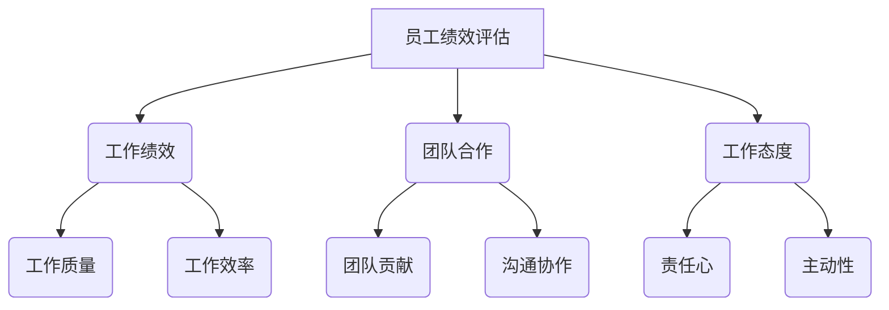
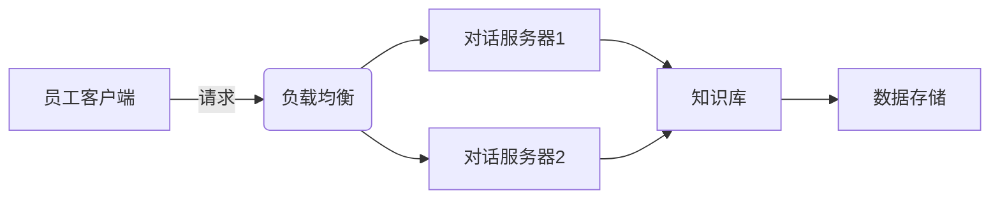

# 数字化员工关系管理:提升员工满意度与敬业度

## 1.背景介绍

### 1.1 员工关系管理的重要性

在当今快节奏的商业环境中,员工是组织最宝贵的资产之一。高效的员工关系管理对于吸引、留住和激励人才至关重要,这直接影响着组织的成功与发展。良好的员工关系不仅能够提高员工的工作满意度和敬业度,还能促进团队协作、增强组织凝聚力,进而提高生产力和效率。

### 1.2 传统员工关系管理的挑战

然而,传统的员工关系管理方式面临着诸多挑战:

- 信息不对称:员工与管理层之间存在信息鸿沟,导致双方缺乏有效沟通。
- 流程低效:大量手工操作和繁琐的审批流程,效率低下。
- 数据孤岛:员工数据分散在不同系统中,难以整合和利用。
- 体验差劲:传统方式缺乏个性化和互动性,无法满足员工日益增长的需求。

### 1.3 数字化转型的必要性

为了应对这些挑战,组织需要转向数字化的员工关系管理模式。数字化转型不仅能够优化流程、提高效率,更重要的是能够为员工提供无缝、个性化的体验,增强员工对企业的认同感和归属感。

## 2.核心概念与联系

### 2.1 数字化员工关系管理概念

数字化员工关系管理(Digital Employee Relations Management, DERM)是一种利用现代信息技术来管理和优化员工与组织之间关系的方法。它旨在建立高效、透明、互动的沟通渠道,充分利用数据分析和智能化工具,为员工提供个性化的服务和体验。

### 2.2 核心技术

实现数字化员工关系管理需要多种技术的支持和融合,包括但不限于:

- 云计算与大数据
- 人工智能与机器学习
- 移动互联网与APP开发
- 物联网与传感器技术
- 区块链与分布式存储

这些技术的融合应用,为数字化员工关系管理提供了强大的技术基础。

### 2.3 关键环节

数字化员工关系管理贯穿员工全生命周期,涉及多个关键环节:

- 招聘与入职
- 培训与发展
- 绩效管理
- 薪酬福利
- 劳动关系
- 离职管理

每个环节都需要数字化改造,实现流程优化、数据整合和个性化服务。

## 3.核心算法原理具体操作步骤

### 3.1 大数据分析

员工数据是数字化员工关系管理的核心资产。通过对结构化和非结构化数据(如员工信息、考勤记录、绩效评估、社交媒体等)进行收集、整理和分析,可以发现隐藏的模式和洞见,为决策提供依据。

大数据分析的具体步骤如下:

1. **数据采集**:从多个来源(如HR系统、OA系统、考勤系统等)收集相关数据,并进行数据清洗和转换,统一格式。
2. **数据存储**:将处理后的数据存储到分布式存储系统(如Hadoop)或云存储中,方便后续分析。
3. **数据分析**:利用大数据分析工具(如Spark)对数据进行建模、挖掘和可视化,发现有价值的模式和规律。
4. **模型部署**:将分析模型部署到生产环境,为决策提供支持。
5. **持续优化**:根据新数据和反馈,不断优化分析模型。

常用的数据分析算法包括:聚类分析、关联规则挖掘、时序模式挖掘、异常检测等。

### 3.2 智能化服务

利用人工智能和机器学习技术,可以为员工提供智能化、个性化的服务,提升员工体验。

智能化服务的核心步骤包括:

1. **数据准备**:收集和标注大量的员工问题和对话数据,作为训练样本。
2. **模型训练**:使用深度学习模型(如序列到序列模型)在训练数据上进行训练,得到对话模型。
3. **模型优化**:通过迭代训练和人工标注,不断优化对话模型的准确性。
4. **模型部署**:将训练好的对话模型部署到生产环境,集成到员工服务系统中。
5. **在线学习**:在线收集员工反馈,持续优化对话模型。

常用的智能服务包括:智能问答系统、智能推荐系统、智能助手等。

### 3.3 流程自动化

通过工作流引擎和机器人流程自动化(Robotic Process Automation, RPA)技术,可以自动化大量重复性的任务,减轻员工负担,提高效率。

流程自动化的步骤如下:

1. **流程建模**:使用工作流建模工具(如BPMN)对业务流程进行可视化建模。
2. **规则定义**:根据业务规则,定义流程执行的条件和约束。
3. **任务分配**:将流程中的任务分配给人工操作或机器人执行。
4. **执行监控**:实时监控流程执行情况,发现并处理异常。
5. **优化迭代**:根据执行数据,不断优化流程模型和规则。

常见的自动化场景包括:入职流程、离职流程、请假审批、报销审批等。

## 4.数学模型和公式详细讲解举例说明

### 4.1 员工满意度模型

员工满意度是衡量员工关系管理效果的重要指标。我们可以构建一个基于多元线性回归的员工满意度模型,用于预测和分析影响因素。

设员工满意度为$y$,影响因素为$x_1,x_2,...,x_n$,则满意度模型为:

$$y = \beta_0 + \beta_1x_1 + \beta_2x_2 + ... + \beta_nx_n + \epsilon$$

其中$\beta_i(i=0,1,...,n)$为模型参数,需要通过训练数据用最小二乘法等方式估计;$\epsilon$为随机误差项。

例如,假设主要影响因素为薪酬水平($x_1$)、工作时间($x_2$)和职业发展前景($x_3$),则模型为:

$$\text{满意度} = 0.3 + 0.5\times\text{薪酬水平} - 0.2\times\text{工作时间} + 0.4\times\text{职业发展前景}$$

该模型表明,提高薪酬水平和职业发展前景可以提升员工满意度,而过长的工作时间会降低满意度。

### 4.2 员工流失预测

预测员工流失风险,并采取留人措施,对于降低人员流失率至关重要。我们可以使用逻辑回归等分类算法构建员工流失预测模型。

设员工流失为0/1二元变量,影响因素为$x_1,x_2,...,x_n$,则逻辑回归模型为:

$$\log\left(\frac{p}{1-p}\right) = \beta_0 + \beta_1x_1 + \beta_2x_2 + ... + \beta_nx_n$$

其中$p$为员工流失的概率,$\beta_i(i=0,1,...,n)$为模型参数。

通过对历史数据的训练,我们可以得到参数估计值,进而对新员工的流失风险进行评估:

$$\hat{p} = \frac{e^{\hat{\beta_0} + \hat{\beta_1}x_1 + ... + \hat{\beta_n}x_n}}{1+e^{\hat{\beta_0} + \hat{\beta_1}x_1 + ... + \hat{\beta_n}x_n}}$$

若$\hat{p}$超过某个阈值,则视为高流失风险,需要采取留人措施。

### 4.3 员工绩效评估

员工绩效评估是员工关系管理的重要组成部分。我们可以使用层次分析法(Analytic Hierarchy Process, AHP)对员工绩效进行科学评估。

AHP的基本思想是将评估目标分解为多个层次和多个评估指标,通过构造判断矩阵并计算权重,得到各指标的重要性排序,最终合成出综合评估结果。

对于员工绩效评估,我们可以构建如下层次结构:



对于每个评估指标,通过专家打分构造判断矩阵,计算其权重。然后根据权重组合,得到员工的综合绩效评分。

AHP方法能够量化主观评估,提高评估的科学性和公平性。

## 4.项目实践:代码实例和详细解释说明

为了说明数字化员工关系管理的实现,我们以一个智能员工服务助手为例,介绍相关技术的应用。

该助手基于自然语言处理技术,可以回答员工的各类问题,如薪酬福利、培训发展、绩效考核等,为员工提供个性化的服务和指导。

### 4.1 系统架构

智能助手的系统架构如下所示:



- 员工客户端:员工通过Web或移动APP与助手进行交互。
- 负载均衡:将请求分发到多个对话服务器,实现负载均衡和高可用。
- 对话服务器:运行自然语言处理模型,根据员工输入生成回复。
- 知识库:存储员工手册、政策文档等知识源,为回复生成提供依据。
- 数据存储:存储员工对话记录、反馈等数据,用于模型优化。

### 4.2 核心模块

智能助手的核心模块包括:

1. **语义理解模块**:将员工输入的自然语言转换为结构化的语义表示,提取关键信息。
2. **对话管理模块**:根据当前对话状态和语义信息,决策下一步的对话行为。
3. **知识查询模块**:从知识库中查询相关知识,作为回复生成的依据。
4. **回复生成模块**:将查询结果和对话状态综合考虑,生成自然语言回复。
5. **反馈学习模块**:收集员工反馈,持续优化上述模块的模型。

我们以知识查询模块为例,介绍其核心代码:

```python
import re
import jieba
from gensim import corpora, models, similarities

# 加载知识库文档
docs = load_docs()

# 文本预处理
texts = [re.sub(r'[^\w]', ' ', doc).split() for doc in docs]
dictionary = corpora.Dictionary(texts)
corpus = [dictionary.doc2bow(text) for text in texts]

# 构建TF-IDF模型
tfidf = models.TfidfModel(corpus)
corpus_tfidf = tfidf[corpus]

# 构建LSI主题模型
lsi = models.LsiModel(corpus_tfidf, id2word=dictionary, num_topics=100)
index = similarities.MatrixSimilarity(lsi[corpus_tfidf])

# 查询相关知识
def query(query_text):
    query_bow = dictionary.doc2bow(jieba.lcut(query_text))
    query_lsi = lsi[query_bow]
    sims = index[query_lsi]
    sorted_ids = sorted(enumerate(sims), key=lambda x: x[1], reverse=True)
    return [docs[id] for id, score in sorted_ids[:5]]
```

该模块使用了Gensim库,基于潜在语义索引(LSI)模型实现了知识查询功能。具体步骤如下:

1. 加载知识库文档,进行文本预处理(分词、去除标点等)。
2. 构建文档词典,将文档转换为词袋(Bag-of-Words)表示。
3. 基于TF-IDF模型计算词项权重,建立加权词袋表示。
4. 使用LSI模型从加权词袋中提取潜在语义主题。
5. 构建语义相似度索引,用于快速查询与输