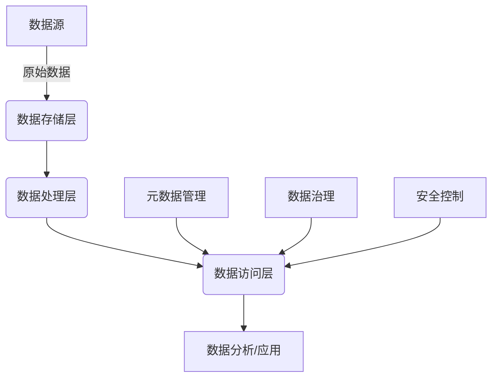
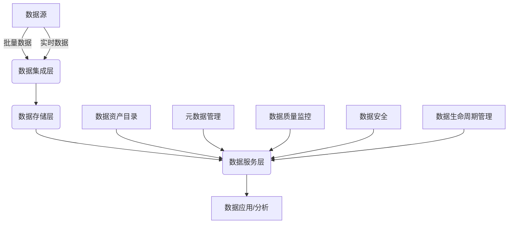

# 数据湖与数据中台的差异

## 1. 背景介绍

### 1.1 数据驱动时代的来临

在当今时代,数据被视为新的"燃料",推动着各行业的创新与发展。随着数字化转型的加速,海量的数据不断涌现,传统的数据管理方式已经无法满足企业的需求。因此,数据湖(Data Lake)和数据中台(Data Middle Office)等新兴概念应运而生,旨在帮助企业更好地管理和利用数据资产。

### 1.2 数据治理的挑战

企业面临着数据来源多样化、数据量爆炸式增长、数据格式多样化等挑战,传统的数据仓库架构难以应对。同时,数据孤岛、数据质量问题、数据使用效率低下等问题也亟待解决。有效的数据治理对于释放数据价值至关重要。

## 2. 核心概念与联系

### 2.1 数据湖

数据湖(Data Lake)是一种新型的大数据存储和处理架构,它允许以原始格式存储各种类型的数据,包括结构化、半结构化和非结构化数据。数据湖采用分布式存储技术,可以存储海量数据,并支持各种分析工作负载。

#### 2.1.1 数据湖的特点

- 存储各种格式的数据
- 可扩展的分布式存储
- 低成本存储
- 支持批处理和流处理
- 支持各种分析工作负载

#### 2.1.2 数据湖的优势

- 降低数据整合成本
- 支持多种数据类型和工作负载
- 灵活的数据探索
- 存储成本低廉

### 2.2 数据中台

数据中台(Data Middle Office)是一种新型的数据架构,旨在实现数据资产的统一管理、治理和服务。它是企业数字化转型的关键基础设施,连接数据源和数据消费者,提供统一的数据访问、处理和分发服务。

#### 2.2.1 数据中台的特点

- 统一的数据管理和治理
- 标准化的数据服务
- 数据资产目录和元数据管理
- 支持数据质量监控和数据安全

#### 2.2.2 数据中台的优势

- 提高数据质量和一致性
- 增强数据可见性和可访问性
- 促进数据共享和协作
- 加快数据驱动决策

### 2.3 数据湖与数据中台的关系

数据湖和数据中台是紧密相关的概念,它们共同构建了现代数据架构的基础。数据湖作为数据存储和处理层,而数据中台则负责数据管理、治理和服务层。它们相辅相成,共同推动企业数据驱动战略的实施。

## 3. 核心架构与原理

### 3.1 数据湖架构

数据湖架构通常包括以下几个核心组件:

#### 3.1.1 数据存储层

数据湖采用分布式文件系统(如HDFS)或对象存储(如AWS S3)存储原始数据,支持各种数据格式。

#### 3.1.2 数据处理层

数据湖支持批处理(如Apache Spark)和流处理(如Apache Kafka)等多种计算引擎,用于数据转换、清洗和分析。

#### 3.1.3 数据访问层

数据湖提供统一的数据访问接口,如Apache Hive、Apache Impala等SQL引擎,以及Apache Spark等分析框架。

#### 3.1.4 数据管理层

数据湖需要元数据管理、数据治理、安全控制等功能,以确保数据的可管理性和可靠性。



### 3.2 数据中台架构

数据中台架构通常包括以下几个核心组件:

#### 3.2.1 数据集成层

负责从各种数据源采集数据,包括批量数据和实时数据,并进行初步的数据转换和清洗。

#### 3.2.2 数据存储层

提供统一的数据存储平台,如数据湖或数据仓库,用于存储已处理的数据。

#### 3.2.3 数据服务层

提供标准化的数据服务接口,包括数据查询、数据订阅、数据流式处理等,供上层应用和分析工具调用。

#### 3.2.4 数据管理层

负责数据资产目录、元数据管理、数据质量监控、数据安全和数据生命周期管理等功能。



## 4. 数学模型和公式

在数据湖和数据中台的架构中,一些关键的数学模型和公式可以帮助我们更好地理解和优化系统。

### 4.1 数据分布模型

数据分布模型描述了数据在集群节点上的分布情况,对于优化数据存储和计算任务调度至关重要。常用的数据分布模型包括:

#### 4.1.1 均匀分布

假设数据均匀分布在$N$个节点上,每个节点存储的数据量为$D/N$,其中$D$为总数据量。在这种情况下,数据访问和计算任务可以均匀分布在各个节点上,实现良好的负载均衡。

#### 4.1.2 偏斜分布

在实际场景中,数据通常呈现偏斜分布,即部分节点存储的数据量远大于其他节点。这可能导致计算任务在部分节点上堆积,影响整体性能。我们可以使用数据偏斜度$\alpha$来衡量数据分布的不均匀程度:

$$\alpha = \frac{1}{N}\sum_{i=1}^{N}\left|\frac{D_i}{D}-\frac{1}{N}\right|$$

其中$D_i$为第$i$个节点上的数据量。$\alpha$的取值范围为$[0,1]$,值越大表示数据分布越不均匀。

为了优化数据分布,我们可以采用数据重分布策略,如数据分区、数据复制等,以降低数据偏斜度,提高系统性能。

### 4.2 数据生命周期模型

数据在企业内部经历了一个完整的生命周期,从创建、存储、处理到最终归档或删除。数据生命周期模型可以帮助我们更好地管理和优化数据资源。

假设数据生命周期包括$M$个阶段,每个阶段的持续时间为$T_i(i=1,2,...,M)$,则数据的总生命周期长度为:

$$T = \sum_{i=1}^{M}T_i$$

我们可以根据数据的重要性、访问频率等因素,调整每个阶段的持续时间,从而优化数据存储成本和数据可用性。例如,对于热数据,我们可以将其存储在高速存储介质上,以提高访问速度;对于冷数据,我们可以将其归档到低成本存储介质上,以节省存储成本。

## 5. 项目实践:代码示例

为了更好地理解数据湖和数据中台的实现,我们提供了一些代码示例。

### 5.1 数据湖示例

以下是使用Apache Spark构建数据湖的示例代码:

```python
# 读取数据源
df = spark.read.json("data/*.json")

# 数据转换和清洗
cleaned_df = df.na.drop().dropDuplicates()

# 数据写入数据湖
cleaned_df.write.parquet("datalake/cleaned")
```

在这个示例中,我们首先从JSON文件中读取原始数据,然后进行数据清洗(去除空值和重复值),最后将处理后的数据以Parquet格式写入数据湖。

### 5.2 数据中台示例

以下是使用Apache Kafka和Apache Flink构建数据中台的示例代码:

```java
// 从Kafka消费实时数据
DataStream<String> stream = env.addSource(new FlinkKafkaConsumer<>("topic", new SimpleStringSchema(), props));

// 数据转换和处理
DataStream<Alert> alerts = stream
    .flatMap(new JsonToAlertMapper())
    .keyBy(Alert::getType)
    .window(TumblingEventTimeWindows.of(Time.seconds(10)))
    .trigger(CountTrigger.of(100))
    .apply(new AlertAggregator());

// 将结果写回Kafka
alerts.addSink(new FlinkKafkaProducer<>("alert-topic", new AlertSchema(), props));
```

在这个示例中,我们从Apache Kafka消费实时数据流,使用Apache Flink进行数据转换、聚合和处理,最后将处理结果写回Kafka,供其他应用订阅和消费。

通过这些代码示例,我们可以更好地理解数据湖和数据中台的实现细节,为实际项目提供参考。

## 6. 实际应用场景

数据湖和数据中台在各个行业都有广泛的应用场景,下面我们列举一些典型的应用案例。

### 6.1 金融行业

在金融行业,数据湖和数据中台可以用于:

- 风险管理和反欺诈分析
- 客户洞察和营销活动
- 交易监控和合规性分析
- 算法交易和量化投资

### 6.2 制造业

在制造业,数据湖和数据中台可以用于:

- 预测性维护和设备监控
- 供应链优化和库存管理
- 产品质量控制和缺陷分析
- 能源管理和节能优化

### 6.3 零售业

在零售业,数据湖和数据中台可以用于:

- 客户行为分析和个性化推荐
- 价格优化和促销策略
- 供应链和物流优化
- 销售预测和库存管理

### 6.4 医疗健康

在医疗健康领域,数据湖和数据中台可以用于:

- 临床数据分析和疾病预测
- 药物研发和临床试验管理
- 医疗保险欺诈检测
- 患者健康管理和远程监控

## 7. 工具和资源推荐

为了更好地实施数据湖和数据中台项目,我们推荐以下一些流行的开源工具和资源:

### 7.1 数据湖工具

- Apache Hadoop/HDFS: 分布式文件系统和大数据处理框架
- Apache Spark: 统一的大数据处理引擎
- Apache Hive: 基于Hadoop的数据仓库工具
- Apache Kafka: 分布式流处理平台
- Apache Impala: 低延迟的SQL查询引擎

### 7.2 数据中台工具

- Apache NiFi: 数据流程编排和集成工具
- Apache Atlas: 元数据管理和数据治理工具
- Apache Ranger: 数据安全和访问控制工具
- Apache Griffin: 数据质量监控和管理工具
- Apache Superset: 数据可视化和分析工具

### 7.3 学习资源

- 数据湖和数据中台相关书籍和在线课程
- Apache软件基金会官方文档和社区
- 行业会议和技术博客
- 开源社区和技术论坛

通过利用这些工具和资源,我们可以更高效地构建和维护数据湖和数据中台解决方案。

## 8. 总结:未来发展趋势与挑战

### 8.1 未来发展趋势

#### 8.1.1 云原生架构

随着云计算的普及,数据湖和数据中台将逐渐向云原生架构演进,充分利用云服务提供的弹性扩展、自动化运维等优势。

#### 8.1.2 人工智能与自动化

人工智能和机器学习技术将被广泛应用于数据治理、元数据管理、数据质量监控等领域,实现更高级别的自动化和智能化。

#### 8.1.3 数据虚拟化和数据网格

数据虚拟化和数据网格将成为新的趋势,旨在提供统一的数据访问层,屏蔽底层数据存储的复杂性。

#### 8.1.4 数据价值货币化

企业将更加关注如何从数据中释放价值,并将