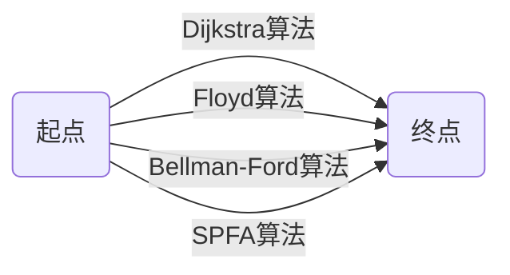

# 最短路径 原理与代码实例讲解

作者：禅与计算机程序设计艺术

## 1. 背景介绍

在图论和网络优化领域中,最短路径问题是一个基础而又重要的问题。它在交通运输、网络路由、资源调度等众多实际应用中都有着广泛的应用。最短路径问题就是在带权图中,找到从起点到终点的权值之和最小的一条路径。

### 1.1 最短路径问题的定义
### 1.2 最短路径问题的实际应用
#### 1.2.1 交通运输中的最短路径规划
#### 1.2.2 通信网络中的最优路由选择  
#### 1.2.3 工程项目中的关键路径分析

## 2. 核心概念与联系

要深入理解和求解最短路径问题,首先需要掌握图论中的一些核心概念。

### 2.1 图的基本概念
#### 2.1.1 顶点与边
#### 2.1.2 有向图与无向图
#### 2.1.3 权值与带权图

### 2.2 最短路径的数学表示
#### 2.2.1 最短路径的定义
#### 2.2.2 最短路径的性质

### 2.3 最短路径问题的分类
#### 2.3.1 单源最短路径问题
#### 2.3.2 全源最短路径问题
#### 2.3.3 限制条件下的最短路径问题

## 3. 核心算法原理具体操作步骤

求解最短路径问题的算法有很多,下面重点介绍几种经典算法的原理和步骤。

### 3.1 Dijkstra算法
#### 3.1.1 Dijkstra算法的基本思想  
#### 3.1.2 Dijkstra算法的具体步骤
#### 3.1.3 Dijkstra算法的代码实现

### 3.2 Floyd算法
#### 3.2.1 Floyd算法的基本思想
#### 3.2.2 Floyd算法的具体步骤  
#### 3.2.3 Floyd算法的代码实现

### 3.3 Bellman-Ford算法 
#### 3.3.1 Bellman-Ford算法的基本思想
#### 3.3.2 Bellman-Ford算法的具体步骤
#### 3.3.3 Bellman-Ford算法的代码实现

### 3.4 SPFA算法
#### 3.4.1 SPFA算法的基本思想  
#### 3.4.2 SPFA算法的具体步骤
#### 3.4.3 SPFA算法的代码实现

## 4. 数学模型和公式详细讲解举例说明

最短路径问题可以用数学语言进行精确刻画和建模,下面给出一些重要公式的详细讲解和举例说明。

### 4.1 最短路径的数学定义
### 4.2 Dijkstra算法的数学模型 
#### 4.2.1 Dijkstra算法数学模型的建立
#### 4.2.2 Dijkstra算法数学模型的求解

### 4.3 Floyd算法的数学模型
#### 4.3.1 Floyd算法数学模型的建立
#### 4.3.2 Floyd算法数学模型的求解

### 4.4 动态规划模型
#### 4.4.1 最短路径问题的动态规划模型  
#### 4.4.2 状态转移方程的推导与求解

## 5. 项目实践:代码实例和详细解释说明

理论结合实践是学习和掌握算法的最佳途径。下面给出几个具体项目的代码实例和详细解释说明。

### 5.1 城市地图最短路径规划 
#### 5.1.1 问题描述与建模
#### 5.1.2 Dijkstra算法求解
#### 5.1.3 Python代码实现与注释

### 5.2 社交网络中的六度分隔理论验证
#### 5.2.1 问题描述与建模
#### 5.2.2 Floyd算法求解
#### 5.2.3 C++代码实现与注释

### 5.3 负环路的检测  
#### 5.3.1 问题描述与建模
#### 5.3.2 Bellman-Ford算法求解
#### 5.3.3 Java代码实现与注释

## 6. 实际应用场景

最短路径问题在诸多领域都有着广泛应用,下面列举一些具体的应用场景。

### 6.1 智能交通
### 6.2 网络流量优化
### 6.3 资源调度与分配

## 7. 工具和资源推荐

### 7.1 常用图论算法库
### 7.2 网络分析工具
### 7.3 相关书籍与教程

## 8. 总结:未来发展趋势与挑战

### 8.1 算法改进与优化
### 8.2 与其他理论的结合应用  
### 8.3 对新型复杂网络的挑战

## 9. 附录:常见问题与解答

### 9.1 为什么Dijkstra算法不能处理负权边?
### 9.2 最短路径一定是唯一的吗?  
### 9.3 最短路径问题与旅行商问题的区别与联系?

最短路径问题作为图论的经典问题,本质上反映了网络中成本最优化的普遍规律。深入理解其内在原理,灵活运用各类算法,对于解决众多实际网络优化问题具有重要意义。未来随着网络规模与复杂性的不断增加,最短路径问题必将呈现出新的理论形态与应用场景,值得我们持续探索。

最短路径算法的核心是通过松弛操作逐步逼近最优解,不同算法的时间复杂度和对负权边的处理能力各有千秋。图中展示了几种主要算法的原理联系。

让我们以开放的心态,不断学习和实践,在最短路径问题的探索中寻找智慧的闪光。