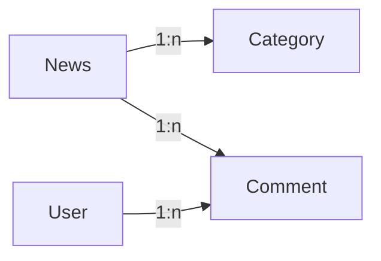

# 校园新闻管理系统设计与实现

作者：禅与计算机程序设计艺术

## 1. 背景介绍

### 1.1 校园新闻管理系统的意义

在当今信息化时代,高校校园新闻工作面临着新的机遇和挑战。传统的校园新闻管理方式已经无法满足现代化校园的需求。因此,开发一个功能完善、易于操作的校园新闻管理系统具有重要意义。

### 1.2 系统开发目标

校园新闻管理系统旨在实现校园新闻的在线编辑、发布、管理和浏览,提高校园新闻工作的效率和质量。系统应具备以下功能:

- 新闻编辑与发布
- 新闻分类管理 
- 用户权限管理
- 新闻检索与浏览
- 新闻评论与互动

### 1.3 技术选型

为了实现上述功能,我们选择使用以下技术:

- 前端:HTML5、CSS3、JavaScript、Vue.js
- 后端:Java、Spring Boot、MyBatis
- 数据库:MySQL
- 部署:Docker

## 2. 核心概念与关系

### 2.1 新闻(News)

新闻是系统的核心实体,包含标题、内容、作者、发布时间、分类等属性。一条新闻属于一个分类,可以接收多条评论。

### 2.2 分类(Category)

分类用于对新闻进行归类,便于管理和检索。一个分类下可以有多条新闻。分类包含名称、描述等属性。

### 2.3 用户(User)

用户分为管理员和普通用户两种角色。管理员可以进行新闻的编辑、发布和删除,普通用户可以浏览新闻和发表评论。用户包含用户名、密码、角色等属性。

### 2.4 评论(Comment)

评论是用户对新闻的反馈,包含内容、作者、发表时间等属性。一条评论属于一条新闻和一个用户。

以下是核心概念之间的关系图:



## 3. 核心算法原理具体操作步骤

### 3.1 新闻检索算法

新闻检索是系统的重要功能之一,我们采用倒排索引和TF-IDF算法实现新闻的全文检索。

#### 3.1.1 倒排索引构建

1. 对新闻内容进行分词,提取关键词
2. 建立关键词到新闻ID的映射关系
3. 存储关键词的文档频率(DF)

#### 3.1.2 查询处理

1. 对查询语句进行分词,提取查询关键词
2. 从倒排索引中获取包含查询关键词的新闻ID
3. 计算每条新闻与查询的相关度(使用TF-IDF)
4. 按相关度排序,返回结果

### 3.2 新闻自动摘要算法

为了方便用户快速了解新闻主要内容,我们使用TextRank算法自动提取新闻摘要。

#### 3.2.1 TextRank算法步骤

1. 将新闻内容划分为若干句子
2. 构建句子之间的相似度矩阵
3. 迭代计算每个句子的重要性得分
4. 选取得分最高的若干句子作为摘要

## 4. 数学模型和公式详细讲解举例说明

### 4.1 TF-IDF模型

TF-IDF(Term Frequency-Inverse Document Frequency)是一种用于评估词语在文档中重要性的统计方法。它由两部分组成:

- TF(词频):词语在文档中出现的频率
- IDF(逆文档频率):词语在整个语料库中的稀缺程度

TF-IDF的计算公式如下:

$$
tfidf(t,d,D) = tf(t,d) \times idf(t,D)
$$

其中,$tf(t,d)$表示词语$t$在文档$d$中的词频,$idf(t,D)$表示词语$t$在语料库$D$中的逆文档频率,计算公式为:

$$
idf(t,D) = \log \frac{|D|}{|\{d \in D: t \in d\}|}
$$

$|D|$表示语料库中文档的总数,$|\{d \in D: t \in d\}|$表示包含词语$t$的文档数。

举例说明:假设我们有以下三条新闻:

- $d_1$:"计算机学院举办人工智能讲座"
- $d_2$:"人工智能在医疗领域的应用"
- $d_3$:"校园文化艺术节开幕式圆满结束"

对于词语"人工智能",其在$d_1$和$d_2$中出现,因此$df("人工智能")=2$。假设语料库共有1000条新闻,则:

$$
idf("人工智能") = \log \frac{1000}{2} \approx 6.21
$$

如果"人工智能"在$d_1$中出现2次,在$d_2$中出现3次,则:

$$
tfidf("人工智能",d_1) = 2 \times 6.21 = 12.42 \\
tfidf("人工智能",d_2) = 3 \times 6.21 = 18.63
$$

可见,"人工智能"这个词语对$d_2$的重要性更高。

### 4.2 TextRank模型

TextRank是一种基于图的排序算法,用于提取文本中的关键词和摘要。它的基本思想是:一个句子的重要性取决于与其相连的其他句子的重要性。

TextRank算法的步骤如下:

1. 将文本划分为若干句子$S=(s_1,s_2,...,s_n)$
2. 构建句子之间的相似度矩阵$M$,其中$M_{ij}$表示句子$s_i$和$s_j$的相似度
3. 初始化每个句子的重要性得分$R=(r_1,r_2,...,r_n)$,通常取相同的初值
4. 迭代更新每个句子的得分,直到收敛。更新公式为:

$$
r_i = (1-d) + d \times \sum_{j \in In(s_i)} \frac{M_{ji}}{\sum_{k \in Out(s_j)} M_{jk}} r_j
$$

其中,$d$是阻尼系数,$In(s_i)$表示指向$s_i$的句子集合,$Out(s_j)$表示$s_j$指向的句子集合。

5. 选取得分最高的若干句子作为摘要

举例说明:假设有以下三个句子:

- $s_1$:"计算机学院举办人工智能讲座,吸引了众多师生参加。"
- $s_2$:"讲座邀请了人工智能领域的知名专家,分享了最新的研究成果。"  
- $s_3$:"与会师生表示收获颇丰,对人工智能的发展有了新的认识。"

假设$s_1$与$s_2$的相似度为0.6,$s_1$与$s_3$的相似度为0.3,$s_2$与$s_3$的相似度为0.5。取阻尼系数$d=0.85$,初始得分$r_1=r_2=r_3=1$。

第一次迭代:

$$
r_1 = 0.15 + 0.85 \times (0.6 \times \frac{1}{0.6+0.5} \times 1 + 0.3 \times \frac{1}{0.3} \times 1) \approx 1.28 \\
r_2 = 0.15 + 0.85 \times (0.6 \times \frac{1}{0.6+0.3} \times 1 + 0.5 \times \frac{1}{0.5} \times 1) \approx 1.41 \\  
r_3 = 0.15 + 0.85 \times (0.3 \times \frac{1}{0.6+0.3} \times 1 + 0.5 \times \frac{1}{0.6+0.5} \times 1) \approx 0.89
$$

经过多次迭代后,每个句子的得分会收敛。最终得分最高的1~2个句子可以作为全文摘要。

## 5. 项目实践:代码实例和详细解释说明

下面我们使用Java语言实现新闻检索和自动摘要的核心功能。

### 5.1 倒排索引构建

```java
public class InvertedIndex {
    private Map<String, List<Integer>> index = new HashMap<>();
    private Map<String, Integer> df = new HashMap<>();
    
    public void addDocument(int docId, String[] words) {
        for (String word : words) {
            if (!index.containsKey(word)) {
                index.put(word, new ArrayList<>());
            }
            index.get(word).add(docId);
            df.put(word, df.getOrDefault(word, 0) + 1);
        }
    }
    
    public List<Integer> search(String keyword) {
        return index.getOrDefault(keyword, Collections.emptyList());
    }
    
    public int getDocFreq(String keyword) {
        return df.getOrDefault(keyword, 0);
    }
}
```

- `addDocument`方法用于向索引中添加一条新闻,`docId`为新闻ID,`words`为新闻内容的分词结果。
- `search`方法用于查询包含指定关键词的新闻ID列表。
- `getDocFreq`方法用于获取指定关键词的文档频率。

### 5.2 新闻相关度计算

```java
public class TfIdf {
    private InvertedIndex index;
    private int numDocs;
    
    public TfIdf(InvertedIndex index, int numDocs) {
        this.index = index;
        this.numDocs = numDocs;
    }
    
    public double calculate(int docId, String[] words) {
        double score = 0.0;
        for (String word : words) {
            int tf = Collections.frequency(Arrays.asList(words), word);
            int df = index.getDocFreq(word);
            double idf = Math.log((double) numDocs / (df + 1));
            score += tf * idf;
        }
        return score;
    }
}
```

- `TfIdf`类的构造函数接受倒排索引和总文档数作为参数。
- `calculate`方法用于计算指定新闻与查询的相关度得分。

### 5.3 TextRank摘要提取

```java
public class TextRank {
    private static final double D = 0.85;
    private static final int MAX_ITER = 100;
    
    public String[] extractSummary(String[] sentences, int numSentences) {
        int n = sentences.length;
        double[][] M = new double[n][n];
        for (int i = 0; i < n; i++) {
            for (int j = 0; j < n; j++) {
                if (i != j) {
                    M[i][j] = similarity(sentences[i], sentences[j]);
                }
            }
        }
        
        double[] R = new double[n];
        Arrays.fill(R, 1.0);
        
        for (int iter = 0; iter < MAX_ITER; iter++) {
            double[] newR = new double[n];
            for (int i = 0; i < n; i++) {
                double sum = 0.0;
                for (int j = 0; j < n; j++) {
                    if (M[j][i] > 0) {
                        sum += M[j][i] / sumOut(M[j]) * R[j];
                    }
                }
                newR[i] = (1 - D) + D * sum;
            }
            R = newR;
        }
        
        int[] indices = new int[n];
        for (int i = 0; i < n; i++) {
            indices[i] = i;
        }
        Arrays.sort(indices, (i, j) -> Double.compare(R[j], R[i]));
        
        String[] summary = new String[numSentences];
        for (int i = 0; i < numSentences; i++) {
            summary[i] = sentences[indices[i]];
        }
        return summary;
    }
    
    private double similarity(String s1, String s2) {
        // 计算两个句子的相似度,可以使用词向量等方法
    }
    
    private double sumOut(double[] row) {
        double sum = 0.0;
        for (double x : row) {
            sum += x;
        }
        return sum;
    }
}
```

- `extractSummary`方法接受句子数组和摘要句子数作为参数,返回提取的摘要句子数组。
- `similarity`方法用于计算两个句子的相似度,可以使用词向量等方法实现。
- `sumOut`方法用于计算矩阵某一行的元素之和。

## 6. 实际应用场景

校园新闻管理系统可以应用于以下场景:

- 学校官网的新闻发布和管理
- 校园移动APP的新闻模块
- 各学院、部门的新闻编辑和发布
- 校园新闻的检索和分析

通过使用该系统,学校可以:

- 提高新闻发布的效率和及时性
- 加强新闻管理的规范性和