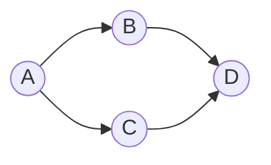
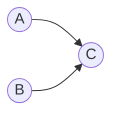
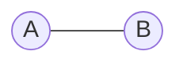

# 概率图模型原理与代码实战案例讲解

## 1.背景介绍

### 1.1 概率图模型的重要性

在当今的数据驱动时代，概率图模型已成为机器学习和人工智能领域中不可或缺的工具。它们提供了一种直观而强大的方式来表示复杂的概率分布,并推理出感兴趣的量。概率图模型广泛应用于诸如计算机视觉、自然语言处理、生物信息学和决策理论等各个领域。

### 1.2 概率图模型的发展历史

概率图模型的起源可以追溯到20世纪60年代,当时人们开始尝试将概率论与图论相结合。1988年,贝叶斯网络(Bayesian Network)的提出标志着概率图模型的正式诞生。随后,马尔可夫随机场(Markov Random Field)、因子图(Factor Graph)等概率图模型相继被提出和发展。近年来,受深度学习的推动,概率图模型也发展出了一些新的变体,如深度信念网络(Deep Belief Network)和深度马尔可夫网络(Deep Markov Network)等。

## 2.核心概念与联系

### 2.1 概率图模型的基本概念

概率图模型由两个关键部分组成:

1. **图结构(Graph Structure)**: 用来表示随机变量之间的条件独立性假设。
2. **因子(Factors)**: 用来定义随机变量的联合概率分布。

根据图结构的不同,概率图模型可分为两大类:

1. **有向图模型(Directed Graphical Model)**: 又称为贝叶斯网络,使用有向无环图(DAG)来表示变量间的因果关系。
2. **无向图模型(Undirected Graphical Model)**: 又称为马尔可夫随机场,使用无向图来表示变量间的相关性。

### 2.2 核心概念解析

1. **随机变量(Random Variable)**: 概率图模型中的节点,用来表示需要建模的不确定量。
2. **条件独立性(Conditional Independence)**: 概率图模型的核心思想,用来简化复杂的联合概率分布。
3. **因子(Factor)**: 概率图模型中的函数,用来定义随机变量的条件概率分布。
4. **推理(Inference)**: 在给定部分观测数据的情况下,计算出其他变量的条件概率分布。
5. **学习(Learning)**: 从训练数据中估计概率图模型的参数。

### 2.3 概率图模型与其他机器学习模型的关系

概率图模型与其他机器学习模型有着密切的联系:

- **生成模型(Generative Model)**: 概率图模型属于生成模型,试图学习数据的潜在分布。
- **判别模型(Discriminative Model)**: 概率图模型也可以用于构建判别模型,如条件随机场(Conditional Random Field)。
- **深度学习(Deep Learning)**: 概率图模型可以与深度学习模型相结合,形成深度概率图模型。
- **结构化预测(Structured Prediction)**: 概率图模型擅长处理结构化数据,在结构化预测任务中有广泛应用。

## 3.核心算法原理具体操作步骤

### 3.1 表示:概率图模型的构建

构建概率图模型的步骤如下:

1. **确定随机变量**: 根据问题的性质,确定需要建模的随机变量。
2. **定义图结构**: 根据变量间的条件独立性假设,构建有向图或无向图。
3. **定义因子**: 为每个最大团(对于无向图)或每个变量(对于有向图)定义因子。

以下是一个简单的贝叶斯网络示例:



$$P(A,B,C,D) = P(A)P(B|A)P(C|A)P(D|B,C)$$

其中,$P(A)$、$P(B|A)$、$P(C|A)$和$P(D|B,C)$就是相应的因子。

### 3.2 推理:概率计算

给定部分观测数据,我们需要计算出其他变量的条件概率分布,这个过程称为推理。常见的推理算法有:

1. **精确推理算法**:
    - 变量消除(Variable Elimination)
    - 信念传播(Belief Propagation)
2. **近似推理算法**:
    - 马尔可夫蒙特卡罗(Markov Chain Monte Carlo,MCMC)
    - 变分推理(Variational Inference)

以变量消除为例,其步骤如下:

1. 构建因子图
2. 对无关变量进行边缘化
3. 对相关变量进行乘积运算

### 3.3 学习:参数估计

学习的目标是从训练数据中估计概率图模型的参数,主要有以下方法:

1. **最大似然估计(Maximum Likelihood Estimation,MLE)**: 通过最大化数据的似然函数来估计参数。
2. **贝叶斯估计(Bayesian Estimation)**: 在MLE的基础上引入先验分布,结合后验分布估计参数。
3. **结构学习(Structure Learning)**: 从数据中自动学习概率图模型的结构。

以最大似然估计为例,对于有向图模型,其步骤如下:

1. 编写对数似然函数
2. 对参数求导并等于0,得到极大似然方程
3. 使用数值优化或解析方法求解参数值

## 4.数学模型和公式详细讲解举例说明

### 4.1 有向图模型:贝叶斯网络

贝叶斯网络的核心思想是利用条件独立性来简化联合概率分布的计算。对于一个有向无环图$\mathcal{G}$,其联合概率分布可以表示为:

$$P(X_1,X_2,\ldots,X_n) = \prod_{i=1}^n P(X_i|\text{Pa}(X_i))$$

其中,$\text{Pa}(X_i)$表示$X_i$的父节点。

**例子**: 设有三个二值随机变量$A$、$B$和$C$,它们的关系可用下图表示:



则联合概率分布为:

$$P(A,B,C) = P(A)P(B)P(C|A,B)$$

我们可以进一步展开:

$$\begin{aligned}
P(A,B,C) &= P(A)P(B)P(C|A,B)\\
         &= P(A)P(B)\sum_C P(C|A,B)\\
         &= P(A)P(B)\left[P(C=1|A,B)+P(C=0|A,B)\right]\\
         &= P(A)P(B)\left[\theta_{A,B}^C+\left(1-\theta_{A,B}^C\right)\right]\\
         &= P(A)P(B)
\end{aligned}$$

其中,$\theta_{A,B}^C=P(C=1|A,B)$是条件概率参数,需要从数据中估计。

### 4.2 无向图模型:马尔可夫随机场

马尔可夫随机场利用了马尔可夫性质,即一个变量的条件概率分布只与其邻居变量有关。对于一个无向图$\mathcal{G}=(V,E)$,其联合概率分布可以表示为:

$$P(X_1,X_2,\ldots,X_n) = \frac{1}{Z}\prod_{C\in\mathcal{C}}\phi_C(X_C)$$

其中:
- $\mathcal{C}$是$\mathcal{G}$的最大团
- $\phi_C$是定义在团$C$上的因子函数
- $Z$是配分函数,用于归一化

**例子**: 设有两个二值随机变量$A$和$B$,它们的关系可用下图表示:



则联合概率分布为:

$$P(A,B) = \frac{1}{Z}\phi(A,B)$$

我们可以进一步定义$\phi(A,B)$为:

$$\phi(A,B) = \exp\left\{\theta_1\delta(A=1)+\theta_2\delta(B=1)+\theta_3\delta(A=1,B=1)\right\}$$

其中,$\delta$是指示函数,$\theta_1$、$\theta_2$和$\theta_3$是需要估计的参数。

### 4.3 因子图模型

因子图模型是一种更一般的概率图模型,它可以表示有向图模型和无向图模型。在因子图中,每个因子节点对应一个函数,连接到该因子的变量节点就是该函数的参数。

**例子**: 设有三个随机变量$A$、$B$和$C$,它们的关系可用下图表示:

```mermaid
graph LR
    A((A))--f1
    B((B))--f1
    f1[f1]--f2
    C((C))--f2
    f2[f2]
```

则联合概率分布为:

$$P(A,B,C) = \frac{1}{Z}f_1(A,B)f_2(B,C)$$

其中,$f_1$和$f_2$是需要定义的因子函数。

## 5.项目实践:代码实例和详细解释说明

在这一部分,我们将通过一个实际案例来展示如何使用Python中的概率编程框架实现概率图模型。我们将构建一个简单的贝叶斯网络,用于对学生的期末成绩进行建模和预测。

### 5.1 问题描述

假设我们有以下几个影响学生期末成绩的因素:

- 智力水平(Intelligence)
- 学习努力程度(Effort)
- 课程难度(Difficulty)
- 助教质量(Assistant)
- 期中考试成绩(Midterm)

我们的目标是构建一个贝叶斯网络来模拟这些变量之间的关系,并基于观测到的部分数据(如期中成绩)预测学生的期末成绩。

### 5.2 使用PyMC3构建贝叶斯网络

PyMC3是一个流行的概率编程框架,它支持构建和推理各种概率模型。我们将使用PyMC3来实现上述问题。

首先,我们需要定义模型的结构:

```python
import pymc3 as pm

# 定义随机变量
intelligence = pm.DiscreteUniform('intelligence', lower=0, upper=5)
effort = pm.DiscreteUniform('effort', lower=0, upper=5)
difficulty = pm.DiscreteUniform('difficulty', lower=0, upper=5)
assistant = pm.DiscreteUniform('assistant', lower=0, upper=5)
midterm = pm.DiscreteUniform('midterm', lower=0, upper=100)

# 定义期末成绩的分数函数
final_score = pm.Deterministic('final_score', (intelligence + effort * 2 + assistant - difficulty) * midterm / 100)
```

在这里,我们使用`pm.DiscreteUniform`分布定义了5个离散均匀随机变量,分别代表智力水平、学习努力程度、课程难度、助教质量和期中考试成绩。然后,我们定义了一个确定性变量`final_score`,它是一个分数函数,将上述5个因素综合考虑。

接下来,我们需要定义观测数据和模型:

```python
# 定义观测数据
observed_data = {
    'midterm': 80
}

# 定义模型
with pm.Model() as model:
    # 定义先验分布
    pm.DiscreteUniform('intelligence_prior', lower=0, upper=5)
    pm.DiscreteUniform('effort_prior', lower=0, upper=5)
    pm.DiscreteUniform('difficulty_prior', lower=0, upper=5)
    pm.DiscreteUniform('assistant_prior', lower=0, upper=5)
    
    # 将随机变量与先验分布相关联
    intelligence = pm.DiscreteUniform('intelligence', lower=0, upper=5, testval=observed_data['midterm'] // 20)
    effort = pm.DiscreteUniform('effort', lower=0, upper=5, testval=observed_data['midterm'] // 20)
    difficulty = pm.DiscreteUniform('difficulty', lower=0, upper=5, testval=observed_data['midterm'] // 20)
    assistant = pm.DiscreteUniform('assistant', lower=0, upper=5, testval=observed_data['midterm'] // 20)
    midterm = pm.DiscreteUniform('midterm', lower=0, upper=100, observed=observed_data['midterm'])
    
    # 定义期末成绩的分数函数
    final_score = pm.Deterministic('final_score', (intelligence + effort * 2 + assistant - difficulty) * midterm / 100)
```

在这里,我们首先定义了观测数据,即期中考试成绩为80分。然后,我们使用`pm.Model`定义了一个模型,包括先验分布和随机变量。我们将随机变量与先验分布相关联,并将