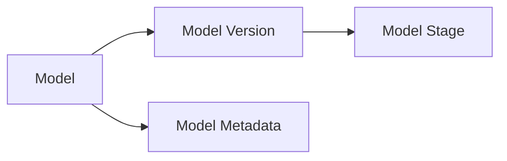
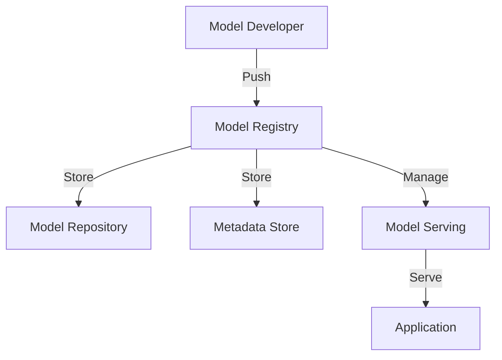

# 模型注册中心:构建企业级模型资产管理平台

作者：禅与计算机程序设计艺术

## 1. 背景介绍

随着人工智能和机器学习技术的快速发展,越来越多的企业开始将AI能力应用到各个业务场景中。在这个过程中,训练好的机器学习模型成为了企业的核心资产。然而,如何有效管理和利用这些模型资产,成为了一个亟待解决的问题。

模型注册中心(Model Registry)应运而生。它是一个用于存储、管理、版本化和部署机器学习模型的中央存储库。通过模型注册中心,数据科学家和机器学习工程师可以方便地协作开发模型,跟踪模型的版本变化,以及将模型部署到生产环境中。

### 1.1 企业面临的模型管理挑战

在构建企业级AI平台时,我们面临着诸多挑战:

#### 1.1.1 模型版本管理困难

随着模型不断迭代优化,如何追踪和管理模型的版本变得非常困难。缺乏统一的版本管理机制,导致模型版本混乱,难以回溯。

#### 1.1.2 模型部署流程复杂

将训练好的模型部署到生产环境是一个涉及多个团队协作的复杂过程。缺乏标准化的部署流程,导致模型上线效率低下,风险难控。

#### 1.1.3 模型治理和审计缺失

对于受监管行业,模型治理和审计尤为重要。然而,由于缺乏统一的模型管理平台,导致无法对模型进行有效的治理和审计。

### 1.2 模型注册中心的价值

模型注册中心通过提供一个统一的平台来管理机器学习模型,有效解决了上述挑战:

#### 1.2.1 规范模型管理流程

通过模型注册中心,可以规范化模型开发、训练、评估和部署的全生命周期管理流程,提高团队协作效率。

#### 1.2.2 简化模型部署过程

模型注册中心提供标准化的模型打包和部署机制,简化了模型的部署过程,降低了部署风险。

#### 1.2.3 支持模型治理和审计

通过集中管理模型元数据和版本信息,模型注册中心为模型治理和审计提供了数据基础,满足合规性要求。

## 2. 核心概念与关系

要构建一个企业级的模型注册中心,我们需要理解其中的一些核心概念:

### 2.1 模型(Model)

模型是指训练好的机器学习模型,如深度学习模型、树模型等。每个模型都有其特定的输入输出接口定义。

### 2.2 模型版本(Model Version)

同一个模型会不断迭代优化,每次迭代就形成一个新的模型版本。模型版本记录了模型的迭代历史。

### 2.3 模型阶段(Model Stage)

模型从开发阶段到部署上线,通常要经历多个阶段,如开发、测试、预发、生产等。不同阶段的模型版本代表了模型的成熟度。

### 2.4 模型元数据(Model Metadata)

模型元数据记录了模型的各种属性信息,如模型名称、所有者、训练数据集、超参数、评估指标等。通过元数据可以方便地查询和管理模型。

### 2.5 概念关系

下图展示了以上核心概念之间的关系:



## 3. 核心架构与实现

### 3.1 系统架构

模型注册中心的系统架构如下图所示:



- Model Developer: 模型开发者,负责开发和训练模型
- Model Registry: 模型注册中心,提供模型管理功能
- Model Repository: 模型仓库,存储模型文件
- Metadata Store: 元数据存储,存储模型的各种属性信息 
- Model Serving: 模型服务,负责将模型部署为在线服务
- Application: 应用程序,调用模型服务获得预测结果

### 3.2 核心功能实现

#### 3.2.1 模型管理

- 模型注册: 允许用户将训练好的模型注册到系统中
- 模型版本管理: 记录模型的版本演进,支持版本对比
- 模型阶段管理: 管理模型在不同阶段的状态流转
- 模型搜索: 根据模型元数据实现多维度的模型检索

#### 3.2.2 模型部署

- 模型格式转换: 将各种模型转换为统一的中间格式
- 模型打包: 将模型代码和依赖打包为可部署的制品
- 模型服务化: 将模型部署为在线服务,提供预测API

#### 3.2.3 模型监控

- 模型性能监控: 监控模型的各项性能指标,如延迟、吞吐、准确率等
- 模型数据监控: 监控模型服务的输入数据,捕捉数据漂移
- 模型告警: 对异常情况进行告警,实现模型的主动运维

### 3.3 技术选型

构建模型注册中心需要选择合适的技术栈:

- 后端框架: Spring Boot、Flask等
- 元数据存储: MySQL、PostgreSQL等
- 模型仓库: S3、HDFS、MinIO等
- 部署工具: Docker、Kubernetes等
- 监控工具: Prometheus、Grafana等

## 4. 数学模型和公式详解

在模型注册中心中,我们需要一些数学模型和公式来量化评估模型的性能。

### 4.1 分类模型评估指标

对于分类模型,常用的评估指标包括:

- 准确率(Accuracy): 
$$Accuracy = \frac{TP+TN}{TP+TN+FP+FN}$$

- 精确率(Precision):
$$Precision = \frac{TP}{TP+FP}$$

- 召回率(Recall):
$$Recall = \frac{TP}{TP+FN}$$

- F1分数(F1-score):
$$F1 = 2 \cdot \frac{Precision \cdot Recall}{Precision+Recall}$$

其中:
- TP: 真正例,模型预测为正例,实际也为正例
- TN: 真负例,模型预测为负例,实际也为负例 
- FP: 假正例,模型预测为正例,实际为负例
- FN: 假负例,模型预测为负例,实际为正例

### 4.2 回归模型评估指标

对于回归模型,常用的评估指标包括:

- 平均绝对误差(MAE):

$$MAE = \frac{1}{n}\sum_{i=1}^n \lvert y_i-\hat{y}_i \rvert$$

- 均方误差(MSE):

$$MSE = \frac{1}{n}\sum_{i=1}^n (y_i-\hat{y}_i)^2$$

- 均方根误差(RMSE):

$$RMSE = \sqrt{\frac{1}{n}\sum_{i=1}^n (y_i-\hat{y}_i)^2}$$

- $R^2$决定系数:

$$R^2 = 1-\frac{\sum_{i=1}^n (y_i-\hat{y}_i)^2}{\sum_{i=1}^n (y_i-\bar{y})^2}$$

其中:
- $y_i$: 第$i$个样本的真实值
- $\hat{y}_i$: 第$i$个样本的预测值
- $\bar{y}$: 所有样本真实值的平均值
- $n$: 样本数量

在模型注册中心中,可以在模型元数据中记录这些评估指标,以便于对模型进行评估和比较。

## 5. 项目实践

下面我们通过一个简单的示例来演示如何使用模型注册中心来管理机器学习模型。

### 5.1 模型开发

首先,我们使用Python训练一个简单的逻辑回归模型:

```python
from sklearn.datasets import load_iris
from sklearn.linear_model import LogisticRegression
from sklearn.metrics import accuracy_score

# 加载数据集
X, y = load_iris(return_X_y=True)

# 训练模型
model = LogisticRegression()
model.fit(X, y)

# 评估模型
y_pred = model.predict(X)
accuracy = accuracy_score(y, y_pred)
print(f"Model accuracy: {accuracy:.2f}")

# 保存模型
import joblib
joblib.dump(model, "model.pkl")
```

### 5.2 模型注册

接下来,我们将训练好的模型注册到模型注册中心:

```python
import requests

# 模型元数据
metadata = {
    "name": "iris_classifier",
    "version": "1.0",
    "stage": "dev",
    "metrics": {
        "accuracy": accuracy
    }
}

# 上传模型文件
files = {
    "model": open("model.pkl", "rb")
}

# 注册模型
response = requests.post("http://localhost:8080/models", 
                         files=files,
                         data=metadata)
print(response.json())
```

### 5.3 模型部署

最后,我们将注册的模型部署为在线服务:

```python
import requests

# 部署模型
response = requests.post("http://localhost:8080/models/iris_classifier/deploy")
print(response.json())

# 调用模型服务
data = [[5.1, 3.5, 1.4, 0.2]]
response = requests.post("http://localhost:8080/models/iris_classifier/predict",
                         json=data)
print(response.json())
```

通过以上步骤,我们就可以使用模型注册中心来管理和部署机器学习模型了。

## 6. 实际应用场景

模型注册中心可以应用于企业的各个AI场景,例如:

### 6.1 智能客服

在客服场景下,我们可以使用模型注册中心来管理意图识别、槽位提取、对话生成等各类NLP模型,实现智能客服应用。

### 6.2 风控反欺诈

在风控场景下,我们可以使用模型注册中心来管理各种风险评估模型,如信用评分、反欺诈等,提升风控效率。

### 6.3 智能推荐

在推荐场景下,我们可以使用模型注册中心来管理用户画像、物品推荐等模型,实现个性化推荐。

## 7. 工具和资源推荐

以下是一些开源的模型注册中心工具和资源:

- MLflow: 一个开源的ML平台,提供了模型管理功能
- ModelDB: 一个开源的模型版本控制系统
- TensorFlow Serving: TensorFlow官方的模型服务工具
- Kubeflow: 一个基于Kubernetes的ML平台,提供了模型管理功能
- Seldon Core: 一个用于在Kubernetes上部署ML模型的工具

## 8. 总结与展望

模型注册中心是一个实现企业级AI平台不可或缺的基础设施。它帮助我们规范化机器学习模型的开发、管理和部署流程,提高了AI开发效率,降低了应用风险。

未来,模型注册中心将与特征平台、算法平台等形成synergy,共同构建起企业的AI中台,赋能业务创新。同时,模型治理、模型解释等领域也将成为研究热点,推动模型注册中心的功能进一步完善。

## 9. 附录:常见问题

### 9.1 如何为模型注册中心选择存储方案?

需要综合考虑数据量、访问频率、成本等因素。通常对于结构化的模型元数据,可以选择MySQL等关系型数据库;对于非结构化的模型文件,可以选择S3等对象存储。

### 9.2 如何设计模型注册中心的API?

可以遵循RESTful API设计原则,围绕模型这个核心资源设计各种操作的API。同时要注意API的版本管理,以应对接口变更。

### 9.3 如何实现模型注册中心的权限管控?

需要对模型的创建、修改、删除等操作进行权限控制。可以参考RBAC(基于角色的访问控制)的思路,根据用户的角色来控制其对模型的操作权限。

### 9.4 如何打造模型注册中心的生态?

要建立起完善的文档体系,提供SDK/CLI等工具,并积极构建社区,鼓励大家共建生态。