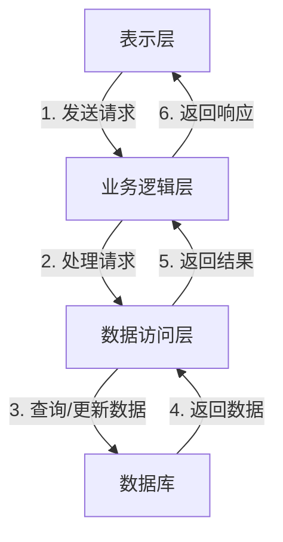

# 水费管理系统详细设计与具体代码实现

## 1. 背景介绍

### 1.1 水费管理系统概述

水费管理系统是一种用于管理供水公司的用水信息、收费情况以及相关业务流程的软件系统。它能够有效地跟踪用户的用水量、计算相应的费用,并为用户提供账单和缴费服务。同时,该系统还可以帮助供水公司优化资源分配、提高运营效率,并为决策者提供数据支持。

### 1.2 系统的必要性

随着城市化进程的加快,供水公司面临着日益增长的用户数量和用水需求。传统的手工记录和计费方式已经无法满足现代化管理的需求,因此需要一个自动化的水费管理系统来提高工作效率,降低人工成本,并提供更好的用户服务体验。

### 1.3 系统的主要功能

水费管理系统的主要功能包括:

- 用户信息管理:记录用户的基本信息、用水地址、用水性质等。
- 用水量采集:自动采集用户的实际用水量数据。
- 费用计算:根据用水量和现行的水费标准计算应缴纳的费用。
- 账单管理:生成用户的水费账单,并提供多种方式(如邮寄、短信、电子邮件等)通知用户。
- 缴费管理:提供多种缴费渠道,如网上支付、银行转账、现金缴费等。
- 报表统计:生成各种统计报表,如收入报表、用水量分析报表等,为决策提供数据支持。
- 系统维护:对系统参数、水价标准等进行维护和调整。

## 2. 核心概念与联系

### 2.1 用户(User)

用户是指使用供水服务的个人或单位,是整个系统的核心对象。用户具有唯一的用户编号、姓名(或单位名称)、用水地址、用水性质(居民或企业)等属性。每个用户都会被分配一个水表,用于记录其实际用水量。

### 2.2 水表(WaterMeter)

水表是用于测量用户用水量的仪表设备。每个水表都有一个唯一的编号,并与一个用户相关联。水表的读数会定期被采集,作为计算用水量和水费的依据。

### 2.3 水费标准(WaterRate)

水费标准是指供水公司根据不同用水性质(如居民用水或企业用水)制定的计费标准。通常情况下,水费标准会划分多个阶梯,用水量越高,单位水费越贵。水费标准还可能因季节或其他因素而有所调整。

### 2.4 账单(Bill)

账单是根据用户的用水量和水费标准计算得出的应缴纳水费金额。账单包含用户信息、计费周期、用水量、应缴水费等内容。账单会通过多种渠道(如邮寄、短信、电子邮件等)发送给用户。

### 2.5 缴费记录(Payment)

缴费记录是用户实际缴纳水费的记录,包括缴费金额、缴费时间、缴费方式等信息。缴费记录与账单相关联,用于跟踪用户的缴费情况。

### 2.6 核心关系

上述核心概念之间存在以下关系:

- 一个用户对应一个水表
- 一个水表记录一个用户的用水量
- 用水量和水费标准共同决定应缴水费金额
- 每个账单对应一个用户和一个计费周期
- 每个缴费记录对应一个账单

这些概念和关系构成了水费管理系统的核心业务逻辑,是系统设计和实现的基础。

## 3. 核心算法原理具体操作步骤

### 3.1 用水量采集算法

用水量采集是水费管理系统的核心环节之一。常见的用水量采集方式有:

1. **人工抄表**:由抄表员定期上门抄录每个用户的水表读数。这种方式工作量大、效率低下,并且容易出现人为错误。

2. **远程抄表**:在水表上安装远程传输设备,将读数通过无线网络传输到数据中心。这种方式自动化程度高,但需要较高的硬件投入。

3. **智能水表**:智能水表内置计算和通信模块,可以自动计算用水量并将数据传输到数据中心。这是目前最先进的用水量采集方式。

无论采用何种方式,用水量采集算法的核心步骤如下:

1. 获取用户水表的本期读数和上期读数。
2. 计算本期用水量 = 本期读数 - 上期读数。
3. 将本期用水量与用户信息关联,存储到数据库中。
4. 对异常数据(如负值或过大值)进行检查和处理。

在实际应用中,还需要考虑并发读写、数据传输可靠性、故障容错等问题,以确保数据的准确性和完整性。

### 3.2 水费计算算法

水费计算是根据用户的用水量和水费标准计算应缴纳的水费金额。算法步骤如下:

1. 获取用户的用水量和用水性质(居民或企业)。
2. 根据用水性质查询对应的水费标准,通常包括基本水费和超出部分的阶梯水费。
3. 计算基本水费金额。
4. 计算超出部分的阶梯水费金额:
   - 按阶梯区间划分用水量
   - 对每个区间内的用水量,分别乘以对应的单价,求和得到阶梯水费金额
5. 总水费 = 基本水费 + 阶梯水费
6. 将计算结果与用户信息关联,生成账单,存储到数据库中。

在实际计算过程中,还需要考虑免费水量、季节性浮动价格、附加税费等因素,使算法更加精确和完善。

### 3.3 账单生成算法

账单生成是将用户的用水量和应缴水费汇总成正式账单的过程。算法步骤如下:

1. 获取用户信息、用水量和应缴水费金额。
2. 根据账单模板,填充用户信息、计费周期、用水量、应缴水费等字段。
3. 生成账单号码(可以是顺序号或根据某种规则生成)。
4. 根据用户的账单收取方式,决定账单的发送方式(邮寄、短信、电子邮件等)。
5. 将账单信息存储到数据库中。
6. 发送账单给用户。

账单生成算法需要与用户信息管理、用水量采集、水费计算等模块紧密集成,以获取所需的数据。同时,还需要考虑账单模板的定制、发送渠道的扩展等功能,以满足不同用户的需求。

## 4. 数学模型和公式详细讲解举例说明

### 4.1 水费计算公式

水费计算是水费管理系统的核心环节之一,其数学模型和公式如下:

假设用户的用水量为 $Q$ 立方米,水费标准包括基本水费和阶梯水费两部分。

基本水费公式:

$$
B = Q_0 \times P_0
$$

其中:
- $B$ 是基本水费金额
- $Q_0$ 是免费水量(如果有)
- $P_0$ 是基本单价(元/立方米)

阶梯水费公式:

$$
S = \sum_{i=1}^{n}Q_i \times P_i
$$

其中:
- $S$ 是阶梯水费金额
- $n$ 是阶梯级数
- $Q_i$ 是第 $i$ 个阶梯区间的用水量
- $P_i$ 是第 $i$ 个阶梯区间的单价(元/立方米)

总水费公式:

$$
T = B + S
$$

其中 $T$ 是应缴纳的总水费金额。

### 4.2 举例说明

假设某用户本期用水量为 20 立方米,水费标准如下:

- 基本水费:
  - 免费水量 $Q_0 = 5$ 立方米
  - 基本单价 $P_0 = 2$ 元/立方米
- 阶梯水费:
  - 0-10 立方米,单价 $P_1 = 3$ 元/立方米
  - 10-20 立方米,单价 $P_2 = 4$ 元/立方米
  - 20 立方米以上,单价 $P_3 = 5$ 元/立方米

计算过程如下:

1. 计算基本水费:
   $$
   B = (20 - 5) \times 2 = 30 \text{元}
   $$

2. 计算阶梯水费:
   $$
   \begin{aligned}
   S &= (10 - 0) \times 3 + (20 - 10) \times 4 \\
     &= 30 + 40 \\
     &= 70 \text{元}
   \end{aligned}
   $$

3. 计算总水费:
   $$
   T = B + S = 30 + 70 = 100 \text{元}
   $$

因此,该用户本期应缴纳的总水费为 100 元。

通过上述公式和示例,我们可以清晰地看到水费计算的数学模型,并能够根据不同的用水量和水费标准,准确计算出应缴纳的水费金额。

## 5. 项目实践:代码实例和详细解释说明

在本节中,我们将通过一个基于 Java 语言的代码示例,演示如何实现水费管理系统的核心功能。

### 5.1 系统架构

我们采用三层架构设计,包括表示层(UI)、业务逻辑层和数据访问层。其中,业务逻辑层负责实现核心功能,如用户管理、用水量采集、水费计算等。数据访问层则负责与数据库进行交互,存储和读取相关数据。



### 5.2 核心类设计

#### 5.2.1 User 类

```java
public class User {
    private String id;
    private String name;
    private String address;
    private UserType type;
    private WaterMeter waterMeter;

    // 构造函数、getter 和 setter 方法
    // ...
}
```

`User` 类表示系统中的用户,包含用户编号、姓名、地址、用水性质(居民或企业)以及关联的水表对象。

#### 5.2.2 WaterMeter 类

```java
public class WaterMeter {
    private String id;
    private double currentReading;
    private double previousReading;

    // 构造函数、getter 和 setter 方法
    // ...

    public double getWaterUsage() {
        return currentReading - previousReading;
    }
}
```

`WaterMeter` 类表示用户的水表,包含水表编号、当前读数和上期读数。`getWaterUsage()` 方法用于计算本期用水量。

#### 5.2.3 WaterRate 类

```java
public class WaterRate {
    private UserType userType;
    private double baseFee;
    private double freeAllowance;
    private List<RateTier> tiers;

    // 构造函数、getter 和 setter 方法
    // ...
}

class RateTier {
    private double start;
    private double end;
    private double rate;

    // 构造函数、getter 和 setter 方法
    // ...
}
```

`WaterRate` 类表示水费标准,包含用水性质、基本水费、免费水量以及阶梯水费的具体级别。`RateTier` 类表示每个阶梯区间的起止用水量和对应的单价。

#### 5.2.4 Bill 类

```java
public class Bill {
    private String id;
    private User user;
    private Date billingPeriod;
    private double waterUsage;
    private double totalFee;

    // 构造函数、getter 和 setter 方法
    // ...
}
```

`Bill` 类表示用户的水费账单,包含账单编号、用户对象、计费周期、用水量和应缴水费总额。

#### 5.2.5 Payment 类

```java
public class Payment {
    private String id;
    private Bill bill;
    private double amount;
    private Date paymentDate;
    private PaymentMethod method;

    // 构造函数、getter 和 setter 方法
    // ...
}
```

`Payment` 类表示用户的缴费记录,包含