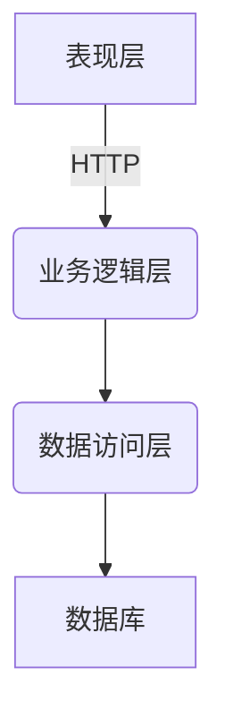
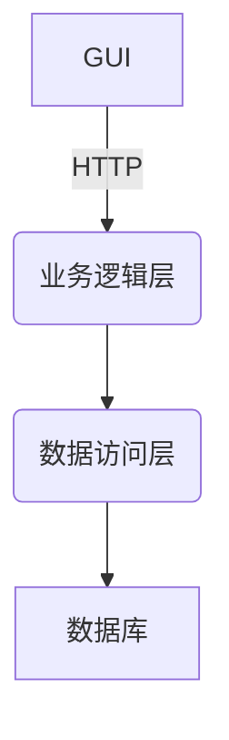

# 汽车销售管理信息系统详细设计与具体代码实现

## 1. 背景介绍

### 1.1 汽车销售行业概况

汽车销售行业是一个巨大的市场,涉及从制造商到经销商再到最终消费者的整个供应链。随着汽车保有量的不断增加和消费者需求的日益多样化,对于高效、可靠的销售管理系统的需求也与日俱增。

### 1.2 传统销售管理系统的缺陷

传统的销售管理系统通常是基于纸质记录或简单的电子表格,存在以下几个主要缺陷:

- 数据录入效率低下,容易出错
- 无法实时跟踪库存和销售情况 
- 缺乏对客户关系的系统化管理
- 无法进行数据分析和决策支持

### 1.3 现代销售管理信息系统的需求

为了提高运营效率、改善客户体验和支持数据驱动的决策,现代汽车销售企业亟需一套集成的信息管理系统,具有以下关键功能:

- 实时准确的库存管理
- 高效的销售订单处理流程
- 系统化的客户关系管理(CRM)
- 灵活的报表和数据分析能力
- 移动端的无缝集成支持

## 2. 核心概念与联系  

### 2.1 系统架构概览

汽车销售管理信息系统通常采用三层或多层架构,包括:

- **表现层**: 用户界面,包括Web界面和移动App
- **业务逻辑层**: 实现系统的核心业务功能
- **数据访问层**: 对数据库的访问和操作
- **其他层**(可选): 如服务层、工具层等



### 2.2 核心概念

- **库存管理(Inventory Management)**: 跟踪车辆库存数量、状态和位置,支持进货入库、销售出库等操作。
- **销售订单(Sales Order)**: 记录客户购车的详细信息,包括车型、配置、付款方式等,并与库存进行关联。
- **客户关系管理(CRM)**: 系统化地管理潜在客户、现有客户和历史客户的信息,包括联系方式、购买记录、服务记录等,以支持营销和售后服务。
- **车型配置(Vehicle Configuration)**: 定义不同车型的可选配置项,如发动机、变速箱、车身颜色等,以满足客户个性化需求。

### 2.3 关键流程

1. **销售流程**: 客户选配车型 -> 创建销售订单 -> 处理付款 -> 出库交付
2. **进货流程**: 采购车辆 -> 到货入库 -> 更新库存
3. **客户关系管理流程**: 潜在客户开发 -> 客户信息采集 -> 营销活动 -> 售后服务

## 3. 核心算法原理具体操作步骤

### 3.1 库存管理算法

为了高效管理车辆库存,需要一种合理的存储和检索算法。常用的数据结构包括:

- **散列表(Hash Table)**: 使用车辆唯一标识(VIN)作为键,存储车辆详细信息,查询时间复杂度为O(1)。
- **树状结构(Tree)**: 如红黑树等自平衡树,可根据车型、颜色等属性进行快速查找,查询时间复杂度为O(log n)。

```python
class Vehicle:
    def __init__(self, vin, model, color, status, location):
        self.vin = vin  # 车辆唯一标识
        self.model = model
        self.color = color
        self.status = status  # 如"在库存"、"已售出"
        self.location = location

class InventoryManager:
    def __init__(self):
        self.inventory = {}  # 散列表存储库存车辆

    def add_vehicle(self, vehicle):
        self.inventory[vehicle.vin] = vehicle

    def remove_vehicle(self, vin):
        if vin in self.inventory:
            del self.inventory[vin]

    def get_vehicle(self, vin):
        if vin in self.inventory:
            return self.inventory[vin]
        return None

    def search_vehicles(self, model=None, color=None):
        results = []
        for vehicle in self.inventory.values():
            if (model is None or vehicle.model == model) and \
               (color is None or vehicle.color == color):
                results.append(vehicle)
        return results
```

### 3.2 销售订单处理算法

当客户下订单时,需要执行以下步骤:

1. 检查所需车型和配置的库存情况
2. 如有库存,创建销售订单,锁定相应库存
3. 处理付款,付款成功后出库交付

```python
class SalesOrder:
    def __init__(self, customer, vehicle, payment):
        self.customer = customer
        self.vehicle = vehicle
        self.payment = payment
        self.status = "Pending"

class SalesManager:
    def __init__(self, inventory_manager):
        self.inventory_manager = inventory_manager
        self.orders = []

    def create_order(self, customer, model, color, payment):
        vehicle = self.inventory_manager.search_vehicles(model, color)
        if vehicle:
            order = SalesOrder(customer, vehicle, payment)
            self.orders.append(order)
            self.inventory_manager.remove_vehicle(vehicle.vin)
            return order
        return None

    def process_payment(self, order):
        if order.payment.process():
            order.status = "Completed"
            # 发货和后续流程
        else:
            order.status = "Failed"

    def get_orders(self, status=None):
        if status:
            return [order for order in self.orders if order.status == status]
        return self.orders
```

### 3.3 客户关系管理算法

客户关系管理(CRM)需要存储和处理大量客户数据,常用的数据结构包括:

- **关系数据库**: 使用多个表存储客户信息、购买记录、服务记录等,通过连接查询获取所需数据。
- **图数据库**: 将客户、产品、订单等实体作为节点,关系作为边,方便追踪客户全生命周期。

```python
class Customer:
    def __init__(self, id, name, contact):
        self.id = id
        self.name = name
        self.contact = contact
        self.orders = []
        self.services = []

class CRMManager:
    def __init__(self):
        self.customers = {}

    def add_customer(self, customer):
        self.customers[customer.id] = customer

    def get_customer(self, id):
        if id in self.customers:
            return self.customers[id]
        return None

    def add_order(self, customer_id, order):
        customer = self.get_customer(customer_id)
        if customer:
            customer.orders.append(order)

    def add_service(self, customer_id, service):
        customer = self.get_customer(customer_id)
        if customer:
            customer.services.append(service)
```

## 4. 数学模型和公式详细讲解举例说明

在汽车销售管理系统中,数学模型和公式主要应用于以下几个方面:

### 4.1 库存优化模型

为了确定最优库存水平,需要权衡库存成本和缺货损失。常用的模型包括经济订货量(EOQ)模型、安全库存模型等。

**EOQ模型**:

已知:
- 需求率(D): 单位时间内的需求量
- 订货成本(S): 每次进货的固定成本
- 库存持有成本(H): 单位时间内单位库存量的成本

目标是最小化总成本TC:

$$
TC = \frac{DS}{Q} + \frac{HQ}{2}
$$

其中Q为订货量。取导数并令其等于0,可得最优订货量EOQ:

$$
EOQ = \sqrt{\frac{2DS}{H}}
$$

在实际应用中,还需考虑其他因素如运输时间、供应商能力等,并结合仿真分析确定最终库存策略。

### 4.2 销售预测模型

准确预测未来销量对于供应链规划至关重要。常用的预测模型包括移动平均模型、指数平滑模型、回归分析模型等。

**简单移动平均模型**:

设有n个时间段的历史销量数据$y_1, y_2, ..., y_n$,移动平均预测值为最近n个时间段的平均值:

$$
\hat{y}_{n+1} = \frac{1}{n}\sum_{i=1}^{n}y_i
$$

通过调整n的值,可以平衡模型对历史数据的敏感程度。

### 4.3 营销策略优化模型

在客户关系管理中,我们希望制定有效的营销策略来提高客户价值。这可以通过营销组合优化模型来实现。

**线性规划模型**:

已知:
- 不同营销活动的成本$c_1, c_2, ..., c_n$
- 不同营销活动对客户价值的贡献系数$a_{1j}, a_{2j}, ..., a_{nj}$ (j为客户群编号)
- 营销预算B
- 对每个客户群的最小期望价值$v_j$

目标是最大化总客户价值:

$$
\max \sum_j \left(\sum_{i=1}^{n}a_{ij}x_i\right)
$$

约束条件:

$$
\begin{aligned}
&\sum_{i=1}^{n}c_ix_i \le B\\
&\sum_{i=1}^{n}a_{ij}x_i \ge v_j \qquad \forall j\\
&x_i \ge 0 \qquad \forall i
\end{aligned}
$$

通过求解这个线性规划问题,可以得到最优的营销活动组合。

## 5. 项目实践: 代码实例和详细解释说明

在本节中,我们将通过一个基于Python的项目实例,演示如何实现汽车销售管理信息系统的核心功能。

### 5.1 系统架构

我们将采用经典的三层架构,包括表现层(GUI)、业务逻辑层和数据访问层。



### 5.2 数据模型

我们首先定义系统中的核心数据模型,包括Vehicle、SalesOrder、Customer等。

```python
class Vehicle:
    def __init__(self, vin, model, color, status, location):
        self.vin = vin
        self.model = model
        self.color = color
        self.status = status
        self.location = location

class SalesOrder:
    def __init__(self, customer, vehicle, payment):
        self.customer = customer
        self.vehicle = vehicle
        self.payment = payment
        self.status = "Pending"

class Customer:
    def __init__(self, id, name, contact):
        self.id = id
        self.name = name
        self.contact = contact
        self.orders = []
        self.services = []
```

### 5.3 业务逻辑层

接下来,我们实现业务逻辑层的核心模块,包括库存管理、销售订单处理和客户关系管理。

```python
class InventoryManager:
    # 省略...

class SalesManager:
    # 省略...

class CRMManager:
    # 省略...
```

### 5.4 数据访问层

为了持久化数据,我们需要一个数据访问层与数据库交互。这里我们使用SQLite作为示例。

```python
import sqlite3

class DatabaseManager:
    def __init__(self, db_file):
        self.conn = sqlite3.connect(db_file)
        self.create_tables()

    def create_tables(self):
        c = self.conn.cursor()
        c.execute("""CREATE TABLE IF NOT EXISTS vehicles
                     (vin TEXT PRIMARY KEY, model TEXT, color TEXT, 
                      status TEXT, location TEXT)""")
        c.execute("""CREATE TABLE IF NOT EXISTS customers
                     (id INTEGER PRIMARY KEY, name TEXT, contact TEXT)""")
        c.execute("""CREATE TABLE IF NOT EXISTS orders
                     (id INTEGER PRIMARY KEY, customer_id INTEGER,
                      vin TEXT, payment TEXT, status TEXT,
                      FOREIGN KEY(customer_id) REFERENCES customers(id),
                      FOREIGN KEY(vin) REFERENCES vehicles(vin))""")
        self.conn.commit()

    def add_vehicle(self, vehicle):
        c = self.conn.cursor()
        c.execute("INSERT INTO vehicles VALUES (?, ?, ?, ?, ?)",
                  (vehicle.vin, vehicle.model, vehicle.color,
                   vehicle.status, vehicle.location))
        self.conn.commit()

    # 其他数据库操作方法...
```

### 5.5 表现层(GUI)

最后,我们创建一个简单的GUI作为系统的表现层,允许用户执行各种操作。

```python
import tkinter as tk
from tkinter import ttk

class SalesGUI:
    def __init__(self, root):
        self.root = root
        root.title("汽车销售管理系统")

        # 创建选项卡
        notebook = ttk.Notebook(root)
        notebook.pack(fill="both", expand=True)

        # 库存管理选项卡
        inventory_tab = ttk.Frame(notebook)
        notebook.add(inventory_tab, text="库存管理")
        # 添