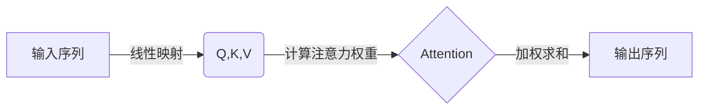
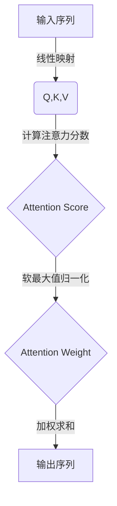

# 注意力机制可视化原理与代码实战案例讲解

## 1.背景介绍

### 1.1 注意力机制的兴起

近年来,注意力机制(Attention Mechanism)在自然语言处理(NLP)和计算机视觉(CV)等领域取得了巨大的成功。传统的序列模型如RNN(循环神经网络)和LSTM(长短期记忆网络)在处理长序列时存在梯度消失或爆炸的问题。注意力机制被提出来解决这一难题,它允许模型专注于输入序列的不同部分,并根据上下文动态地分配权重。

### 1.2 注意力机制的应用领域

注意力机制已广泛应用于机器翻译、文本摘要、图像描述生成、视频描述等任务中。以机器翻译为例,注意力机制使得模型可以更好地捕捉源语言和目标语言之间的对应关系,从而提高了翻译质量。此外,注意力机制还被用于解释模型的预测结果,有助于提高模型的可解释性。

## 2.核心概念与联系

### 2.1 注意力机制的核心思想

注意力机制的核心思想是允许模型在处理输入序列时,对不同位置的输入元素分配不同的注意力权重。具体来说,注意力机制通过计算查询(Query)向量与键(Key)向量的相似性得分,从而确定每个值(Value)向量对输出的贡献程度。

### 2.2 注意力机制的基本运算

注意力机制的基本运算可以表示为:

$$\mathrm{Attention}(Q, K, V) = \mathrm{softmax}(\frac{QK^T}{\sqrt{d_k}})V$$

其中:
- $Q$是查询向量(Query)
- $K$是键向量(Key)
- $V$是值向量(Value)
- $d_k$是缩放因子,用于防止内积过大导致的梯度饱和

通过对键向量进行软最大值归一化,我们可以得到每个值向量对应的注意力权重。然后,将注意力权重与对应的值向量进行加权求和,即可得到注意力机制的输出。

### 2.3 注意力机制的多头机制

为了捕捉不同的子空间表示,注意力机制通常采用多头(Multi-Head)机制。多头注意力将查询、键和值映射到不同的表示子空间,并在这些子空间中并行计算注意力,最后将所有头的输出进行拼接。多头注意力的计算公式为:

$$\mathrm{MultiHead}(Q, K, V) = \mathrm{Concat}(head_1, ..., head_h)W^O$$
$$\text{where } head_i = \mathrm{Attention}(QW_i^Q, KW_i^K, VW_i^V)$$

其中 $W_i^Q$、$W_i^K$、$W_i^V$ 和 $W^O$ 是可学习的线性映射。

### 2.4 自注意力机制

自注意力(Self-Attention)是一种特殊的注意力机制,其中查询、键和值都来自同一个输入序列。自注意力机制允许模型捕捉输入序列中任意两个位置之间的依赖关系,从而更好地建模序列数据。自注意力广泛应用于Transformer等模型中。



## 3.核心算法原理具体操作步骤

注意力机制的核心算法步骤如下:

1. **准备输入数据**
   - 将输入序列(如文本或图像)映射为查询向量$Q$、键向量$K$和值向量$V$。

2. **计算注意力分数**
   - 计算查询向量$Q$与所有键向量$K$的相似性分数,通常使用缩放点积注意力:
     $$\mathrm{Attention}(Q, K, V) = \mathrm{softmax}(\frac{QK^T}{\sqrt{d_k}})V$$

3. **应用软最大值归一化**
   - 对注意力分数应用软最大值函数,以获得归一化的注意力权重。

4. **加权求和**
   - 使用注意力权重对值向量$V$进行加权求和,得到注意力机制的输出。

5. **多头注意力(可选)**
   - 对于多头注意力,重复步骤2-4,使用不同的线性映射获得多个注意力头。
   - 将所有注意力头的输出拼接在一起。

6. **后续处理**
   - 注意力输出可以馈送到下游任务中,如序列到序列模型的解码器等。

需要注意的是,上述步骤适用于标准的缩放点积注意力。不同的注意力变体(如多头注意力、因式分解注意力等)可能会有一些细微差异,但核心思想是相似的。



## 4.数学模型和公式详细讲解举例说明

### 4.1 缩放点积注意力

缩放点积注意力(Scaled Dot-Product Attention)是注意力机制中最基本和最广泛使用的一种形式。它的数学表达式为:

$$\mathrm{Attention}(Q, K, V) = \mathrm{softmax}(\frac{QK^T}{\sqrt{d_k}})V$$

其中:

- $Q \in \mathbb{R}^{n \times d_q}$ 是查询向量矩阵,包含 $n$ 个查询向量,每个向量维度为 $d_q$。
- $K \in \mathbb{R}^{m \times d_k}$ 是键向量矩阵,包含 $m$ 个键向量,每个向量维度为 $d_k$。
- $V \in \mathbb{R}^{m \times d_v}$ 是值向量矩阵,包含 $m$ 个值向量,每个向量维度为 $d_v$。
- $\sqrt{d_k}$ 是缩放因子,用于防止内积过大导致的梯度饱和。

计算步骤如下:

1. 计算查询向量 $Q$ 与所有键向量 $K$ 的点积,得到一个 $n \times m$ 的注意力分数矩阵 $S$:
   $$S = QK^T$$

2. 对注意力分数矩阵 $S$ 的每一行进行缩放,即除以 $\sqrt{d_k}$:
   $$S' = \frac{S}{\sqrt{d_k}}$$

3. 对缩放后的注意力分数矩阵 $S'$ 的每一行应用软最大值函数,得到归一化的注意力权重矩阵 $A$:
   $$A = \mathrm{softmax}(S')$$

4. 将注意力权重矩阵 $A$ 与值向量矩阵 $V$ 相乘,得到注意力机制的输出矩阵 $O$:
   $$O = AV$$

通过上述步骤,注意力机制可以自动学习如何从输入序列中选择相关的部分,并将它们组合成有意义的表示。

### 4.2 多头注意力

多头注意力(Multi-Head Attention)是一种常用的注意力机制变体,它可以从不同的表示子空间捕捉不同的注意力模式。多头注意力的数学表达式为:

$$\mathrm{MultiHead}(Q, K, V) = \mathrm{Concat}(head_1, ..., head_h)W^O$$
$$\text{where } head_i = \mathrm{Attention}(QW_i^Q, KW_i^K, VW_i^V)$$

其中:

- $h$ 是注意力头的数量。
- $W_i^Q \in \mathbb{R}^{d_{\text{model}} \times d_q}$、$W_i^K \in \mathbb{R}^{d_{\text{model}} \times d_k}$、$W_i^V \in \mathbb{R}^{d_{\text{model}} \times d_v}$ 是可学习的线性映射矩阵,用于将查询、键和值映射到不同的表示子空间。
- $W^O \in \mathbb{R}^{hd_v \times d_{\text{model}}}$ 是可学习的线性映射矩阵,用于将所有注意力头的输出拼接在一起。

计算步骤如下:

1. 对查询向量矩阵 $Q$、键向量矩阵 $K$ 和值向量矩阵 $V$ 分别应用线性映射,得到 $h$ 组查询、键和值:
   $$Q_i = QW_i^Q, \quad K_i = KW_i^K, \quad V_i = VW_i^V$$

2. 对每组查询、键和值应用缩放点积注意力,得到 $h$ 个注意力头的输出:
   $$\text{head}_i = \mathrm{Attention}(Q_i, K_i, V_i)$$

3. 将所有注意力头的输出拼接在一起,并应用线性映射 $W^O$,得到多头注意力的最终输出:
   $$\mathrm{MultiHead}(Q, K, V) = \mathrm{Concat}(head_1, ..., head_h)W^O$$

通过多头注意力机制,模型可以从不同的表示子空间捕捉不同的注意力模式,从而提高模型的表示能力和性能。

### 4.3 自注意力机制

自注意力(Self-Attention)是一种特殊的注意力机制,其中查询、键和值都来自同一个输入序列。自注意力机制允许模型捕捉输入序列中任意两个位置之间的依赖关系,从而更好地建模序列数据。

自注意力机制的数学表达式与标准注意力机制相同,只是查询、键和值都来自同一个输入序列 $X$:

$$\mathrm{SelfAttention}(X) = \mathrm{Attention}(Q, K, V)$$
$$\text{where } Q = XW^Q, \quad K = XW^K, \quad V = XW^V$$

其中 $W^Q$、$W^K$ 和 $W^V$ 是可学习的线性映射矩阵,用于将输入序列 $X$ 映射到查询、键和值表示。

自注意力机制的计算步骤如下:

1. 将输入序列 $X$ 分别映射到查询向量矩阵 $Q$、键向量矩阵 $K$ 和值向量矩阵 $V$。

2. 计算查询向量 $Q$ 与所有键向量 $K$ 的相似性分数,得到注意力分数矩阵。

3. 对注意力分数矩阵应用软最大值函数,得到归一化的注意力权重矩阵。

4. 将注意力权重矩阵与值向量矩阵 $V$ 相乘,得到自注意力机制的输出。

自注意力机制广泛应用于 Transformer 等模型中,它允许模型直接捕捉输入序列中任意两个位置之间的依赖关系,而不需要依赖序列的顺序结构。这种灵活性使得自注意力机制在处理长序列时表现出色。

## 4.项目实践:代码实例和详细解释说明

在本节中,我们将通过一个实际的代码示例来展示如何实现和可视化注意力机制。我们将使用 PyTorch 框架,并利用 Matplotlib 库进行可视化。

### 4.1 导入所需库

```python
import torch
import torch.nn as nn
import matplotlib.pyplot as plt
import numpy as np
```

### 4.2 实现缩放点积注意力

我们首先实现缩放点积注意力的核心函数:

```python
def scaled_dot_product_attention(q, k, v, mask=None):
    """
    计算缩放点积注意力
    
    参数:
    q (Tensor): 查询向量,形状为 [batch_size, num_heads, seq_len_q, depth]
    k (Tensor): 键向量,形状为 [batch_size, num_heads, seq_len_k, depth]
    v (Tensor): 值向量,形状为 [batch_size, num_heads, seq_len_v, depth]
    mask (Tensor, 可选): 掩码张量,形状为 [batch_size, 1, 1, seq_len_q]
    
    返回:
    output (Tensor): 注意力输出,形状为 [batch_size, num_heads, seq_len_q, depth]
    attention_weights (Tensor): 注意力权重,形状为 [batch_size, num_heads, seq_len_q, seq_len_k]
    """
    
    # 计