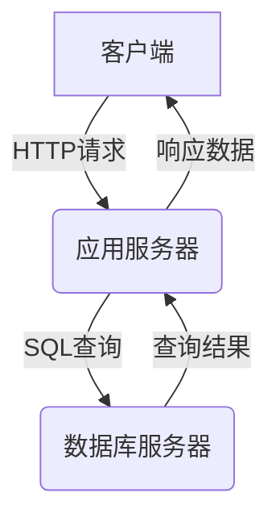

# 煤气站管理系统详细设计与具体代码实现

## 1.背景介绍

### 1.1 煤气行业概述

煤气作为一种重要的城市燃料,在居民生活和工业生产中发挥着重要作用。随着城市化进程的加快和人们生活水平的不断提高,对煤气供应的需求也与日俱增。因此,建立一个高效、安全、可靠的煤气管理系统对于满足用户需求、确保供应稳定至关重要。

### 1.2 煤气站管理的挑战

煤气站的管理工作涉及多个环节,包括煤气生产、储存、输送、销售等,需要对大量数据进行采集、存储和分析。传统的手工管理方式效率低下,容易出现数据遗漏和错误,难以满足现代化管理的需求。此外,煤气属于易燃易爆物质,安全性是首要考虑因素,必须实现对生产、储存等环节的实时监控和预警。

### 1.3 管理系统的必要性

为了提高煤气站的管理水平,提升运营效率,确保安全生产,迫切需要构建一套完善的煤气站管理信息系统。该系统应当集生产调度、库存管理、设备监控、安全预警、数据分析于一体,为决策者提供全面的数据支持,实现煤气站的智能化、自动化管理。

## 2.核心概念与联系

### 2.1 系统架构

煤气站管理系统通常采用经典的三层架构(C/S架构),包括表现层(客户端)、业务逻辑层(应用服务器)和数据访问层(数据库服务器)。

### 2.2 核心功能模块

煤气站管理系统的核心功能模块通常包括:

1. **生产管理模块**:负责监控煤气生产过程,记录生产数据,管理生产计划等。
2. **库存管理模块**:实现对煤气储存设施的监控,记录入库、出库数据,分析库存情况。
3. **设备监控模块**:对生产、输送等设备的运行状态进行实时监测,发现异常及时报警。
4. **销售管理模块**:记录煤气销售数据,管理客户信息,开具销售单据等。
5. **安全管理模块**:监测生产环境各项安全指标,设置预警阈值,发现隐患及时处理。
6. **数据分析模块**:对历史数据进行多维度分析,为决策提供依据。

### 2.3 关键技术

煤气站管理系统的关键技术包括:

1. **物联网技术**:通过传感器采集生产、储存等环节的实时数据。
2. **大数据技术**:存储和处理海量的生产、销售等数据。
3. **可视化技术**:直观展现生产、库存、设备等状态。
4. **移动技术**:支持移动端访问和操作。
5. **安全技术**:保证系统和数据的安全性。

## 3.核心算法原理具体操作步骤  

### 3.1 生产计划优化算法

生产计划优化是煤气站管理系统的一项核心功能,其目标是在满足用户需求的前提下,最小化生产成本。这可以通过线性规划或者其他优化算法来实现。

假设有 $n$ 种原材料,每种原材料的单价为 $c_i(i=1,2,...,n)$,生产一单位煤气需要消耗 $a_{ij}$ 单位第 $j$ 种原材料。用 $x_j$ 表示第 $j$ 种原材料的使用量,则生产成本为:

$$
\min \sum_{j=1}^{n}c_jx_j
$$

此外,还需要满足一些约束条件,如:

- 生产量满足用户需求:$\sum_{j=1}^{n}a_{ij}x_j \geq d_i,i=1,2,...,m$
- 原材料使用量限制:$l_j \leq x_j \leq u_j,j=1,2,...,n$

其中 $d_i$ 表示第 $i$ 种产品的需求量, $l_j,u_j$ 分别表示第 $j$ 种原材料的下限和上限。

将上述条件代入线性规划模型,就可以求解出最优的生产方案。算法的具体步骤如下:

1. 收集相关数据,包括原材料价格、消耗系数、产品需求量、原材料限制等。
2. 构建线性规划模型,确定目标函数和约束条件。
3. 使用单纯形法等算法求解线性规划问题,得到最优解。
4. 根据最优解制定生产计划,安排原材料采购和生产排程。
5. 实施生产计划,并根据实际情况动态调整。

### 3.2 库存管理算法

合理的库存管理对于控制成本、保证供应至关重要。常见的库存管理策略有经济订货量模型(EOQ)和材料需求计划(MRP)等。

#### 3.2.1 经济订货量模型

经济订货量模型试图在订货成本和库存成本之间寻求一个平衡点,以最小化总成本。设单次订货成本为 $C_o$,每单位煤气的库存成本为 $C_h$,年需求量为 $D$,则总成本为:

$$
TC(Q) = \frac{DC_o}{Q} + \frac{QC_h}{2}
$$

上式第一项是订货成本,第二项是库存成本。通过求导可以得到最优订货量 $Q^*$:

$$
Q^* = \sqrt{\frac{2DC_o}{C_h}}
$$

算法步骤如下:

1. 估算年需求量 $D$、订货成本 $C_o$ 和库存成本 $C_h$。
2. 计算最优订货量 $Q^*$。
3. 根据 $Q^*$ 制定订货计划,当库存降至一定水平时下订单。

#### 3.2.2 材料需求计划

材料需求计划(MRP)根据主生产计划和物料清单(BOM),计算出所需原材料的数量和交期,以满足生产需求。算法步骤如下:

1. 获取主生产计划、BOM、现有库存和在途库存信息。
2. 净化主生产计划,计算每期所需原材料的总量。
3. 根据现有库存和安全库存量,计算每期所需补货量。
4. 考虑交货时间,提前下单,制定详细的补货计划。
5. 实施补货计划,并根据实际情况动态调整。

### 3.3 设备故障预测算法

及时发现设备故障,预防事故发生,是煤气站管理的重中之重。通过分析设备的运行数据,利用机器学习算法,可以对设备故障进行预测。

假设设备有 $n$ 个监测指标,如温度、压力、振动等,用 $\boldsymbol{x}=(x_1,x_2,...,x_n)$ 表示。已知设备的历史运行数据 $\boldsymbol{X}=\{\boldsymbol{x}_1,\boldsymbol{x}_2,...,\boldsymbol{x}_m\}$ 及其对应的故障标记 $\boldsymbol{y}=\{y_1,y_2,...,y_m\}$,其中 $y_i=1$ 表示发生故障,否则 $y_i=0$。

我们可以使用逻辑回归模型进行故障预测,其目标是找到一个最优参数 $\boldsymbol{\theta}$,使得:

$$
P(y=1|\boldsymbol{x};\boldsymbol{\theta})=\frac{1}{1+e^{-\boldsymbol{\theta}^T\boldsymbol{x}}}
$$

最大化似然函数:

$$
L(\boldsymbol{\theta})=\prod_{i=1}^{m}P(y_i|\boldsymbol{x}_i;\boldsymbol{\theta})^{y_i}(1-P(y_i|\boldsymbol{x}_i;\boldsymbol{\theta}))^{1-y_i}
$$

对数似然函数:

$$
l(\boldsymbol{\theta})=\sum_{i=1}^{m}y_i\log P(y_i|\boldsymbol{x}_i;\boldsymbol{\theta})+(1-y_i)\log(1-P(y_i|\boldsymbol{x}_i;\boldsymbol{\theta}))
$$

使用梯度下降法等优化算法求解 $\boldsymbol{\theta}$。算法步骤如下:

1. 收集设备的历史运行数据和故障记录。
2. 对数据进行预处理,剔除异常值和缺失值。
3. 使用逻辑回归模型,基于训练数据训练故障预测模型。
4. 对新的运行数据使用模型进行故障预测。
5. 当预测故障概率超过阈值时,发出预警,并采取相应措施。

## 4.数学模型和公式详细讲解举例说明

### 4.1 生产计划优化模型

生产计划优化模型的目标是最小化生产成本,可以用下面的线性规划模型表示:

$$
\begin{aligned}
\min \quad & \sum_{j=1}^{n}c_jx_j\\
\text{s.t.}\quad & \sum_{j=1}^{n}a_{ij}x_j \geq d_i,\quad i=1,2,...,m\\
             & l_j \leq x_j \leq u_j,\quad j=1,2,...,n\\
             & x_j \geq 0,\quad j=1,2,...,n
\end{aligned}
$$

其中:

- $n$: 原材料种类数
- $m$: 产品种类数
- $c_j$: 第 $j$ 种原材料的单价
- $x_j$: 第 $j$ 种原材料的使用量
- $a_{ij}$: 生产1单位第 $i$ 种产品需要消耗的第 $j$ 种原材料量
- $d_i$: 第 $i$ 种产品的需求量
- $l_j,u_j$: 第 $j$ 种原材料的下限和上限

**举例**:假设有3种原材料(煤、石油、天然气),单价分别为10元/吨、20元/桶、5元/立方米。生产1吨煤气需要消耗2吨煤、0.5桶石油和500立方米天然气。现有原材料库存分别为1000吨、200桶和20000立方米,上限为2000吨、500桶和50000立方米。用户需求为500吨煤气,求最优生产方案。

可以构建如下线性规划模型:

$$
\begin{aligned}
\min \quad & 10x_1 + 20x_2 + 5x_3\\
\text{s.t.}\quad & 2x_1 + 0.5x_2 + 500x_3 \geq 500\\
             & 1000 \leq x_1 \leq 2000\\  
             & 200 \leq x_2 \leq 500\\
             & 20000 \leq x_3 \leq 50000\\
             & x_1,x_2,x_3 \geq 0
\end{aligned}
$$

求解上述模型,可以得到最优解 $x_1=250,x_2=200,x_3=20000$,即使用250吨煤、200桶石油和20000立方米天然气,总成本为7500元。

### 4.2 经济订货量模型

经济订货量(EOQ)模型用于确定每次订货的最优数量,以最小化订货成本和库存成本的总和。模型如下:

$$
TC(Q) = \frac{DC_o}{Q} + \frac{QC_h}{2}
$$

$$
Q^* = \sqrt{\frac{2DC_o}{C_h}}
$$

其中:

- $Q$: 订货量
- $D$: 年需求量
- $C_o$: 单次订货成本
- $C_h$: 每单位库存成本
- $Q^*$: 最优订货量

**举例**:某煤气站年需求量为10000吨,单次订货成本为500元,每吨煤气的库存成本为2元,求最优订货量。

将数据代入公式:

$$
Q^* = \sqrt{\frac{2\times10000\times500}{2}} = 5000\text{(吨)}
$$

因此,最优订货量为5000吨,即每次订货5000吨最经济。

### 4.3 逻辑回归模型

逻辑回归是一种常用的机器学习分类模型,可用于设备故障预测。设有 $n$ 个特征 $\boldsymbol{x}=(x_1,x_2,...,x_n)$