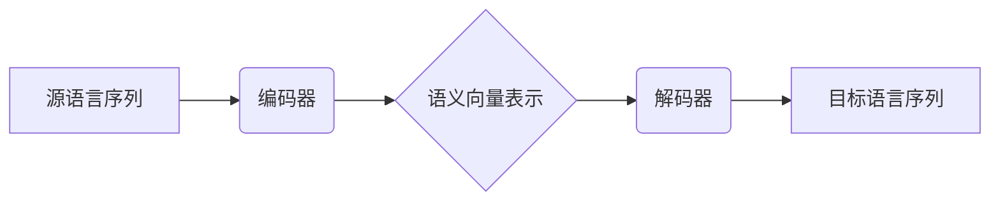

# 神经机器翻译:自然语言处理的革命性突破

## 1.背景介绍

### 1.1 机器翻译的重要性

在这个全球化时代,有效的跨语言沟通对于促进不同文化之间的理解和合作至关重要。机器翻译(Machine Translation, MT)技术的发展为克服语言障碍提供了强大的工具,极大地促进了信息交流和知识传播。

### 1.2 传统机器翻译方法的局限性  

早期的机器翻译系统主要基于规则(Rule-based)和统计(Statistical)方法。规则方法需要语言学家手动编写大量的语法规则,工作量巨大且缺乏灵活性。统计方法则依赖于大规模的平行语料库进行参数估计,但很难处理语义歧义和长距离依赖关系。

### 1.3 神经网络机器翻译的崛起

近年来,受深度学习技术的驱动,基于神经网络的机器翻译(Neural Machine Translation, NMT)方法取得了革命性的突破。与传统方法相比,NMT具有以下优势:

- 端到端的训练方式,无需分阶段处理
- 能够自动学习语义表示和上下文依赖关系 
- 翻译质量和流畅性显著提高

NMT正在彻底改变机器翻译的发展轨迹,成为自然语言处理领域的关键技术。

## 2.核心概念与联系

### 2.1 序列到序列学习

机器翻译可被视为一个序列到序列(Sequence-to-Sequence)的学习问题。给定一个源语言句子序列,模型需要生成一个与之对应的目标语言句子序列。

### 2.2 编码器-解码器框架

编码器-解码器(Encoder-Decoder)架构是NMT的核心框架。编码器将源语言序列映射为语义向量表示,解码器则根据该表示生成目标语言序列。



### 2.3 注意力机制

注意力机制(Attention Mechanism)是NMT的关键创新,允许模型在生成每个目标词时,动态地关注源序列中的不同部分,从而更好地捕获长距离依赖关系。

### 2.4 神经网络模型

循环神经网络(RNN)、长短期记忆网络(LSTM)和门控循环单元(GRU)等模型被广泛应用于NMT的编码器和解码器中。近年来,Transformer等基于注意力机制的全新架构也取得了巨大成功。

## 3.核心算法原理具体操作步骤

### 3.1 编码器

编码器将源语言序列 $X=(x_1, x_2, ..., x_n)$ 映射为语义向量表示 $C$。常用的编码器包括:

1. **RNN编码器**

$$h_t = \text{RNN}(x_t, h_{t-1})$$
$$C = h_n$$

其中 $h_t$ 为时间步 $t$ 的隐状态向量,最终隐状态 $h_n$ 作为整个序列的语义向量 $C$。

2. **LSTM/GRU编码器**

与RNN类似,但使用LSTM/GRU单元来更好地捕获长期依赖关系。

3. **Transformer编码器**

采用多头注意力机制和位置编码,完全放弃了RNN结构。

### 3.2 解码器 

解码器根据语义向量 $C$ 生成目标语言序列 $Y=(y_1, y_2, ..., y_m)$。常用的解码器包括:

1. **RNN解码器**

$$s_t = \text{RNN}(y_{t-1}, s_{t-1}, C)$$
$$P(y_t|y_{<t}, C) = \text{Generate}(y_t, s_t, C)$$

其中 $s_t$ 为时间步 $t$ 的解码器隐状态向量,通过 $\text{Generate}$ 函数预测下一个词 $y_t$。

2. **LSTM/GRU解码器**

与RNN解码器类似,但使用LSTM/GRU单元。

3. **Transformer解码器**

采用多头注意力机制,同时关注编码器输出和已生成的目标序列。

### 3.3 注意力机制

注意力机制允许解码器在生成每个目标词时,动态关注源序列的不同部分。

$$\alpha_{t,i} = \text{Attention}(s_t, h_i)$$
$$c_t = \sum_{i=1}^n \alpha_{t,i}h_i$$

其中 $\alpha_{t,i}$ 表示时间步 $t$ 对源序列第 $i$ 个词的注意力权重, $c_t$ 为加权后的上下文向量。

### 3.4 模型训练

NMT模型通常采用最大似然估计,在大规模平行语料库上最小化负对数似然损失:

$$\mathcal{L} = -\frac{1}{N}\sum_{n=1}^N\sum_{t=1}^{m_n}\log P(y_t^{(n)}|X^{(n)}, y_{<t}^{(n)})$$

其中 $N$ 为语料库大小, $m_n$ 为第 $n$ 个句对的目标序列长度。

## 4.数学模型和公式详细讲解举例说明

### 4.1 Transformer模型

Transformer是一种全新的基于注意力机制的NMT架构,不再使用RNN或卷积网络,而是完全依赖注意力机制来捕获序列的长期依赖关系。

#### 4.1.1 编码器

Transformer编码器由多个相同的层组成,每层包含两个子层:多头注意力机制和前馈全连接网络。

**多头注意力机制**

$$\begin{aligned}
\text{MultiHead}(Q, K, V) &= \text{Concat}(head_1, ..., head_h)W^O\\
\text{where } head_i &= \text{Attention}(QW_i^Q, KW_i^K, VW_i^V)
\end{aligned}$$

其中 $Q$、$K$、$V$ 分别为查询(Query)、键(Key)和值(Value)矩阵。通过线性变换将输入分别映射到这三个矩阵,然后在每个注意力头 $head_i$ 中计算缩放点积注意力,最后将所有头的注意力结果拼接起来并经过线性变换输出。

**前馈全连接网络**

$$\text{FFN}(x) = \max(0, xW_1 + b_1)W_2 + b_2$$

前馈全连接网络包含两个线性变换,中间使用ReLU激活函数。

编码器的每一层都包含上述两个子层,并使用残差连接和层归一化来促进梯度传播和加速收敛。

#### 4.1.2 解码器

Transformer解码器的结构与编码器类似,但增加了一个掩码的多头注意力子层,用于防止在生成每个目标词时关注到后续的词。

**掩码多头注意力机制**

$$\begin{aligned}
\text{MaskedMultiHead}(Q, K, V) &= \text{Concat}(head_1, ..., head_h)W^O\\
\text{where } head_i &= \text{MaskedAttention}(QW_i^Q, KW_i^K, VW_i^V)
\end{aligned}$$

在计算注意力时,会将矩阵 $K$ 和 $V$ 的未来位置进行掩码,使得每个目标词只能关注到它前面的词。

**编码器-解码器注意力**

除了上述两个子层,解码器还包含一个关注编码器输出的多头注意力子层,用于融合源语言的语义信息。

#### 4.1.3 位置编码

由于Transformer不使用RNN或卷积网络,因此需要一些方式为序列中的词编码位置信息。位置编码是一种将词位置嵌入到词向量中的方法:

$$\begin{aligned}
\text{PE}_{(pos, 2i)} &= \sin(pos/10000^{2i/d_{model}})\\
\text{PE}_{(pos, 2i+1)} &= \cos(pos/10000^{2i/d_{model}})
\end{aligned}$$

其中 $pos$ 为位置索引, $i$ 为维度索引,  $d_{model}$ 为词向量维度。位置编码会直接加到词向量上,使模型能够学习到序列的位置信息。

### 4.2 Transformer-XL模型

Transformer-XL是对原始Transformer的改进,通过引入循环机制和相对位置编码,显著提高了长序列的建模能力。

#### 4.2.1 循环机制

Transformer-XL在编码器和解码器中都引入了循环机制,可以在处理新的序列时,将上一个序列的隐状态作为记忆状态传递过来,从而捕获更长的上下文依赖关系。

#### 4.2.2 相对位置编码

相对位置编码是一种更加灵活的位置编码方式,它不是直接编码绝对位置,而是编码每个词与其他词之间的相对位置差异。这种方式能够更好地处理任意长度的序列。

$$\begin{aligned}
\text{RPE}_{(i,j)} &= \omega^{(k)}_{clip(j-i, k)}\\
\omega^{(k)}_n &= \sin(n/10000^{2k/d_{model}})
\end{aligned}$$

其中 $\text{RPE}_{(i,j)}$ 表示第 $i$ 个词与第 $j$ 个词之间的相对位置编码, $\omega^{(k)}_n$ 为一个可学习的编码向量。

### 4.3 BERT及其变体

BERT(Bidirectional Encoder Representations from Transformers)是一种基于Transformer的双向编码器模型,在自然语言理解任务上取得了卓越的成绩,也被广泛应用于机器翻译等任务中。

#### 4.3.1 BERT模型结构

BERT的模型结构与Transformer编码器类似,由多层Transformer编码器堆叠而成。不同之处在于,BERT在输入序列中添加了特殊的[CLS]和[SEP]标记,用于表示句子和句对的边界。

#### 4.3.2 预训练任务

BERT采用了两种无监督的预训练任务:

1. **遮蔽语言模型(Masked Language Model, MLM)**

随机将输入序列中的一些词替换为特殊的[MASK]标记,然后让模型基于上下文预测被遮蔽的词。

2. **下一句预测(Next Sentence Prediction, NSP)** 

判断两个句子是否为连续的句对,以捕获句子之间的关系。

通过在大规模语料库上进行上述两种任务的联合预训练,BERT可以学习到通用的语义表示,为下游任务提供强大的迁移能力。

#### 4.3.3 BERT变体

基于BERT的思想,研究人员提出了多种变体模型:

- **RoBERTa**: 通过更大的模型尺寸、更多的训练数据和训练步骤等改进,显著提升了BERT的性能。
- **ALBERT**: 采用参数分解和跨层参数共享等技术,大幅减少了模型参数量,提高了训练效率。
- **XLNet**: 通过使用自回归语言模型的目标函数,避免了BERT中的[MASK]标记,获得了更好的语义表示。
- **ELECTRA**: 采用了全新的替代训练目标,将预训练任务建模为伪标记器与生成器之间的对抗游戏,进一步提高了效率。

这些变体模型在保留BERT优势的同时,针对不同方面进行了改进,为特定任务和场景提供了更好的解决方案。

## 4.项目实践:代码实例和详细解释说明

以下是使用PyTorch实现的一个简化版Transformer模型,用于英语到德语的机器翻译任务。

```python
import torch
import torch.nn as nn
import math

# 定义模型超参数
src_vocab_size = 10000  # 源语言词表大小
tgt_vocab_size = 12000  # 目标语言词表大小
d_model = 512  # 词向量维度
nhead = 8  # 多头注意力头数
num_encoder_layers = 6  # 编码器层数
num_decoder_layers = 6  # 解码器层数
dim_feedforward = 2048  # 前馈全连接网络维度
max_seq_length = 100  # 最大序列长度

# 位置编码
class PositionalEncoding(nn.Module):
    def __init__(self, d_model, max_len=5000):
        super(PositionalEncoding, self).__init__()
        pe = torch.zeros(max_len, d_model)
        position = torch.arange