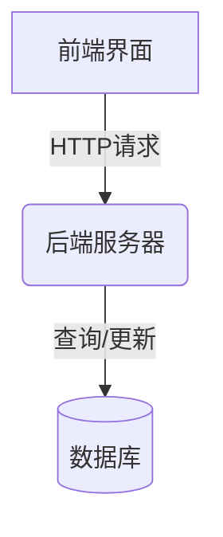
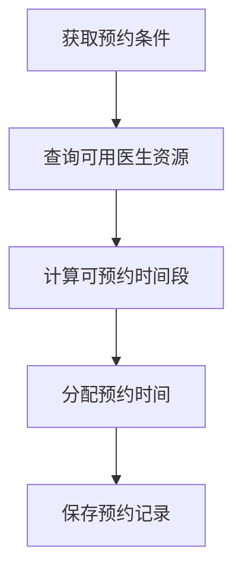
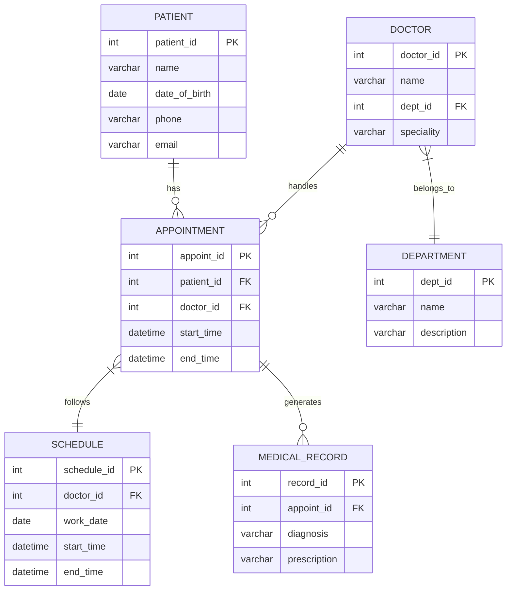

# 网上挂号系统详细设计与具体代码实现

## 1. 背景介绍

### 1.1 医疗服务现状

当前,随着人口老龄化和医疗需求不断增长,传统的医院就诊模式已经无法满足人们对高效、便捷医疗服务的需求。长时间的排队等候、重复填写个人信息等问题严重影响了就医体验。因此,构建一个高效、智能的网上挂号系统,不仅可以优化就医流程,还能为患者和医院带来诸多益处。

### 1.2 网上挂号系统的优势

1. **提高就医效率**:患者可以在线预约并获取就诊时间,避免长时间排队,提高就医效率。

2. **优化资源利用**:通过合理分配医疗资源,减少资源浪费,提高医院运营效率。

3. **改善就医体验**:患者可以在线查看医生信息、病历等,获得更好的就医体验。

4. **数据收集与分析**:系统可收集患者就医数据,为医院决策提供数据支持。

### 1.3 系统架构概览

网上挂号系统通常采用 B/S(Browser/Server)架构,包括前端界面、后端服务器和数据库三个主要部分。其中,前端界面提供用户注册、预约挂号等功能;后端服务器处理业务逻辑,与数据库交互;数据库存储患者信息、医生排班等数据。



## 2. 核心概念与联系

### 2.1 用户角色

网上挂号系统主要包括三类用户角色:

1. **患者(Patient)**:使用系统预约挂号、查看就诊记录等。
2. **医生(Doctor)**:维护个人信息、排班信息等。
3. **管理员(Admin)**:管理医院、科室、医生等基础数据。

### 2.2 主要功能模块

1. **用户模块**:实现用户注册、登录、个人信息维护等功能。
2. **预约模块**:患者可以根据科室、医生、时间等条件预约挂号。
3. **排班模块**:医生可以维护个人排班信息,管理员可以分配医生排班。
4. **就诊模块**:患者可以查看历史就诊记录、医嘱等信息。
5. **数据统计模块**:统计就诊人数、收入等数据,为医院决策提供支持。

### 2.3 系统设计原则

1. **模块化设计**:将系统功能划分为独立模块,有利于代码复用和维护。
2. **数据安全性**:确保患者隐私数据的安全性,采取加密存储等措施。
3. **可扩展性**:系统设计应具有良好的可扩展性,以适应未来需求变化。
4. **用户友好性**:界面设计简洁明了,操作流程合理,提升用户体验。

## 3. 核心算法原理具体操作步骤  

### 3.1 预约算法

预约算法是网上挂号系统的核心算法,用于根据患者的预约要求合理分配医生资源。算法的基本流程如下:

1. **获取预约条件**:包括就诊科室、医生、就诊日期等。
2. **查询可用医生资源**:根据预约条件筛选出可用的医生及其排班信息。
3. **计算可预约时间段**:分析医生的排班情况,确定可预约的时间段。
4. **分配预约时间**:根据特定策略(如先来先服务)为患者分配预约时间。
5. **保存预约记录**:将预约信息保存到数据库中。



#### 3.1.1 查询可用医生资源

该步骤的主要任务是根据患者的预约条件(如科室、医生等)筛选出可用的医生资源。算法流程如下:

1. 从数据库中获取所有医生的基本信息和排班信息。
2. 根据预约科室过滤医生列表,只保留相应科室的医生。
3. 如果患者指定了特定医生,则只保留该医生。
4. 根据预约日期过滤医生列表,只保留在该日期有排班的医生。

```python
def query_available_doctors(dept, doctor_name, appoint_date):
    # 从数据库获取所有医生信息
    all_doctors = get_all_doctors()
    
    # 根据科室过滤
    dept_doctors = [d for d in all_doctors if d.dept == dept]
    
    # 根据医生名过滤
    if doctor_name:
        dept_doctors = [d for d in dept_doctors if d.name == doctor_name]
    
    # 根据排班日期过滤
    available_doctors = []
    for doctor in dept_doctors:
        schedules = doctor.get_schedules(appoint_date)
        if schedules:
            available_doctors.append((doctor, schedules))
    
    return available_doctors
```

#### 3.1.2 计算可预约时间段

在获取到可用医生及其排班信息后,需要进一步分析医生的排班情况,计算出可预约的时间段。算法流程如下:

1. 遍历医生的排班记录,获取每个排班时间段。
2. 对于每个时间段,检查是否已有预约记录,如果有,则将该时间段划分为已预约和未预约两部分。
3. 将所有未预约的时间段合并,作为可预约时间段输出。

```python
def compute_available_slots(doctor, schedules, appoint_date):
    # 获取医生在该日期的所有排班时间段
    date_schedules = [s for s in schedules if s.date == appoint_date]
    
    # 将时间段划分为已预约和未预约两部分
    available_slots = []
    for schedule in date_schedules:
        start = schedule.start_time
        end = schedule.end_time
        
        # 获取该时间段内的已预约记录
        appointments = get_appointments(doctor, start, end, appoint_date)
        
        # 划分时间段
        prev_end = start
        for appoint in appointments:
            if appoint.start_time > prev_end:
                available_slots.append((prev_end, appoint.start_time))
            prev_end = appoint.end_time
        if prev_end < end:
            available_slots.append((prev_end, end))
    
    return available_slots
```

#### 3.1.3 分配预约时间

在获取到可预约时间段后,需要根据特定策略为患者分配预约时间。常用的策略包括:

1. **先来先服务(FCFS)**:按照预约请求的时间顺序,依次为患者分配可用时间段。
2. **最短时间优先(SJF)**:优先分配时间较短的可用时间段,以提高医生的看诊效率。
3. **高优先级优先**:为不同级别的患者(如老年人、孕妇等)设置不同的优先级,优先为高优先级患者分配时间段。

```python
def allocate_appointment(patient, available_slots, strategy):
    if strategy == 'FCFS':
        # 先来先服务策略
        return available_slots[0]
    elif strategy == 'SJF':
        # 最短时间优先策略
        return min(available_slots, key=lambda x: x[1] - x[0])
    elif strategy == 'PRIORITY':
        # 高优先级优先策略
        priority = get_patient_priority(patient)
        # 根据优先级排序时间段,并返回最高优先级的时间段
        sorted_slots = sorted(available_slots, key=lambda x: compute_slot_priority(x, priority))
        return sorted_slots[0]
```

### 3.2 数据库设计

数据库设计是网上挂号系统的基础,需要合理存储患者信息、医生信息、预约记录等数据。以下是一个简化的数据库设计示例:

#### 3.2.1 实体关系图



#### 3.2.2 表结构说明

1. **PATIENT**:存储患者的基本信息,如姓名、出生日期、联系方式等。
2. **DOCTOR**:存储医生的基本信息,如姓名、所属科室、专长等。
3. **DEPARTMENT**:存储医院的科室信息,如科室名称、描述等。
4. **APPOINTMENT**:存储预约记录,包括患者ID、医生ID、预约时间等。
5. **SCHEDULE**:存储医生的排班信息,包括工作日期、时间段等。
6. **MEDICAL_RECORD**:存储就诊记录,包括诊断结果、处方等。

## 4. 数学模型和公式详细讲解举例说明

在网上挂号系统中,我们可以使用数学模型来优化医生资源的分配,提高就诊效率。以下是一个基于整数规划的医生排班优化模型。

### 4.1 符号说明

- $N$:医生总数
- $D$:工作日总数
- $T$:每天的总时间段数
- $P_{it}$:医生 $i$ 在时间段 $t$ 的工作情况,如果工作则为 1,否则为 0
- $R_{it}$:医生 $i$ 在时间段 $t$ 的预约人数
- $C_i$:医生 $i$ 的每天最大工作时间段数
- $X_{it}$:决策变量,如果医生 $i$ 在时间段 $t$ 工作则为 1,否则为 0

### 4.2 目标函数

我们的目标是最大化医生的总工作时间,从而看诊更多患者:

$$
\max \sum_{i=1}^{N}\sum_{t=1}^{D\times T}R_{it}X_{it}
$$

### 4.3 约束条件

1. 每个医生每天的工作时间不超过最大工作时间:

$$
\sum_{t=1}^{T}X_{it} \leq C_i, \quad \forall i, d
$$

2. 医生只能在自己的排班时间内工作:

$$
X_{it} \leq P_{it}, \quad \forall i, t
$$

3. 决策变量为 0 或 1:

$$
X_{it} \in \{0, 1\}, \quad \forall i, t
$$

### 4.4 求解方法

该整数规划问题可以使用商业求解器(如 CPLEX、Gurobi 等)或开源求解器(如 GLPK、CBC 等)来求解。以 Python 的 PuLP 库为例,我们可以如下构建和求解该模型:

```python
import pulp

# 创建问题实例
prob = pulp.LpProblem("Doctor Scheduling", pulp.LpMaximize)

# 创建决策变量
X = pulp.LpVariable.dicts("X", (range(N), range(D*T)), cat="Binary")

# 构建目标函数
prob += pulp.lpSum(R[i][t] * X[i][t] for i in range(N) for t in range(D*T))

# 添加约束条件
for i in range(N):
    for d in range(D):
        prob += pulp.lpSum(X[i][t] for t in range(d*T, (d+1)*T)) <= C[i]

for i in range(N):
    for t in range(D*T):
        prob += X[i][t] <= P[i][t]

# 求解问题
prob.solve()

# 输出结果
for i in range(N):
    for t in range(D*T):
        if pulp.value(X[i][t]) == 1:
            print(f"Doctor {i} works in time slot {t}")
```

通过构建和求解该优化模型,我们可以得到一个最优的医生排班方案,从而提高医疗资源的利用效率。

## 5. 项目实践:代码实例和详细解释说明

在本节中,我们将通过具体的代码实例,展示如何实现网上挂号系统的核心功能模块。

### 5.1