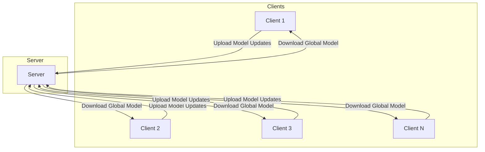

# 联邦学习(Federated Learning) - 原理与代码实例讲解

## 1. 背景介绍

### 1.1 数据隐私和机器学习的矛盾

在当今的数字时代,数据被视为"新石油",是推动人工智能和机器学习算法发展的关键燃料。然而,随着对个人隐私保护的日益重视,如何在保护数据隐私的同时利用分散的数据源来训练高质量的机器学习模型,成为了一个亟待解决的挑战。

传统的集中式机器学习方法要求将所有训练数据集中在一个中心服务器上进行训练,这不仅存在数据隐私风险,而且由于数据无法跨越不同的组织和设备边界,也限制了可用数据的规模。

### 1.2 联邦学习的兴起

为了解决上述矛盾,联邦学习(Federated Learning)作为一种创新的分布式机器学习范式应运而生。联邦学习允许多个客户端(如手机、平板电脑或其他移动设备)在不共享原始数据的情况下协同训练一个统一的机器学习模型。每个客户端只需在本地训练模型,然后将模型更新(如权重或梯度)上传到一个中央服务器。服务器则聚合来自所有客户端的模型更新,并将聚合后的全局模型分发回各个客户端,从而实现模型的协同训练。

### 1.3 联邦学习的优势

相比传统集中式方法,联邦学习具有以下优势:

1. **数据隐私保护**: 原始数据永远不会离开设备,从根本上杜绝了数据泄露的风险。
2. **数据heterogeneity**: 联邦学习可以有效利用异构的分散数据源,从而提高模型的泛化能力。
3. **模型个性化**: 联邦学习支持在全局模型的基础上进行个性化调整,满足不同客户端的特定需求。
4. **通信效率**: 只需传输模型更新(如权重或梯度),而不是原始数据,从而大幅减少了通信开销。

由于其独特的优势,联邦学习已经在医疗保健、金融、物联网等多个领域得到广泛应用,并成为人工智能领域的一个研究热点。

## 2. 核心概念与联系

### 2.1 联邦学习系统架构

一个典型的联邦学习系统通常包括以下三个核心组件:

1. **客户端(Client)**: 客户端可以是手机、平板电脑或其他智能设备,负责在本地数据上训练模型,并将模型更新上传到服务器。
2. **服务器(Server)**: 服务器负责协调整个联邦学习过程,包括选择参与客户端、聚合客户端模型更新、更新全局模型等。
3. **通信通道(Communication Channel)**: 客户端和服务器之间通过安全的通信通道进行模型更新的传输。

下面是一个简化的联邦学习系统架构示意图:

### 2.2 联邦学习算法流程

联邦学习算法的基本流程如下:

1. **初始化**: 服务器初始化一个全局模型,并将其分发给所有参与的客户端。
2. **本地训练**: 每个客户端在本地数据上训练模型,得到模型更新(如权重或梯度)。
3. **模型上传**: 客户端将本地模型更新上传到服务器。
4. **模型聚合**: 服务器聚合来自所有客户端的模型更新,得到新的全局模型。
5. **模型下发**: 服务器将新的全局模型分发回各个客户端。
6. **重复训练**: 重复执行步骤2-5,直到模型收敛或达到预定的训练轮次。

这种分布式协作训练方式使得联邦学习能够在保护数据隐私的同时,利用大规模分散的数据源来提高模型质量。

### 2.3 联邦学习中的关键挑战

尽管联邦学习在理论上看似很有前景,但在实践中仍然面临一些关键挑战:

1. **统计异构性(Statistical Heterogeneity)**: 由于客户端数据分布的差异,如何有效聚合不同客户端的模型更新成为一个难题。
2. **系统异构性(System Heterogeneity)**: 不同客户端的硬件配置和计算能力存在差异,如何公平地分配计算任务并保证系统效率是一个挑战。
3. **隐私和安全**: 虽然联邦学习在一定程度上保护了数据隐私,但仍需要防范模型逆向工程、差分隐私攻击等隐私风险。
4. **通信效率**: 大规模的客户端参与会导致巨大的通信开销,如何在保证模型质量的同时提高通信效率是一个值得探讨的问题。
5. **激励机制**: 如何激励客户端主动参与联邦学习,并为其做出贡献提供相应的回报,是联邦学习的一个重要课题。

研究人员正在不断探索新的算法和技术来应对这些挑战,以推动联邦学习的发展和应用。

## 3. 核心算法原理具体操作步骤

### 3.1 联邦平均算法(FedAvg)

联邦平均算法(FedAvg)是联邦学习中最基础和广为人知的算法,它由Google AI团队在2017年提出。FedAvg算法的核心思想是在每一轮训练中,服务器从所有可用的客户端中随机选择一部分参与训练,然后对这些客户端的模型更新进行加权平均,得到新的全局模型。

具体的FedAvg算法步骤如下:

1. **初始化**: 服务器初始化一个全局模型 $w_0$,并将其分发给所有客户端。
2. **客户端选择**: 在第 $t$ 轮训练中,服务器从所有 $N$ 个客户端中随机选择一个子集 $\mathcal{S}_t$,其中 $|\mathcal{S}_t| = C$ (通常 $C \ll N$)。
3. **本地训练**: 对于每个选中的客户端 $k \in \mathcal{S}_t$,在本地数据 $\mathcal{D}_k$ 上用小批量随机梯度下降(SGD)训练 $E$ 个epochs,得到模型更新 $\Delta w_k^t$:

   $$\Delta w_k^t = w_k^t - w_{t-1}$$

4. **模型上传**: 客户端 $k$ 将模型更新 $\Delta w_k^t$ 上传到服务器。
5. **模型聚合**: 服务器对来自所有选中客户端的模型更新进行加权平均,得到新的全局模型 $w_t$:

   $$w_t = w_{t-1} + \sum_{k \in \mathcal{S}_t} \frac{n_k}{n} \Delta w_k^t$$

   其中 $n_k$ 是客户端 $k$ 的本地数据样本数,而 $n = \sum_{k \in \mathcal{S}_t} n_k$ 是所有选中客户端的总样本数。
   
6. **模型下发**: 服务器将新的全局模型 $w_t$ 分发回各个客户端。
7. **重复训练**: 重复执行步骤2-6,直到模型收敛或达到预定的训练轮次。

FedAvg算法的优点是简单易懂,并且在独立同分布(IID)的数据分布下表现良好。然而,在非IID的数据分布情况下,FedAvg的性能会受到一定影响,因此研究人员提出了许多改进的联邦学习算法来应对这一挑战。

### 3.2 联邦近端更新(FedProx)

联邦近端更新(FedProx)算法是一种改进的联邦学习算法,旨在解决数据分布不均匀(Non-IID)的问题。FedProx在FedAvg的基础上引入了一个正则化项,用于限制客户端模型与全局模型之间的偏差,从而提高模型的稳定性和收敛性。

FedProx算法的步骤与FedAvg类似,不同之处在于本地训练阶段。对于每个选中的客户端 $k \in \mathcal{S}_t$,它在本地数据 $\mathcal{D}_k$ 上优化以下目标函数:

$$\min_{w_k^t} F_k(w_k^t) + \frac{\mu}{2} \left\lVert w_k^t - w_{t-1} \right\rVert_2^2$$

其中 $F_k(w_k^t)$ 是客户端 $k$ 的本地损失函数,而第二项是一个正则化项,用于惩罚客户端模型 $w_k^t$ 与全局模型 $w_{t-1}$ 之间的偏差。$\mu$ 是一个超参数,用于控制正则化强度。

通过添加这个正则化项,FedProx算法可以在一定程度上缓解数据异构性带来的负面影响,使得客户端模型更加接近全局模型,从而提高模型的泛化能力。

### 3.3 联邦增强(FedBoost)

联邦增强(FedBoost)算法是另一种改进的联邦学习算法,它借鉴了传统机器学习中的boosting思想,旨在提高模型在非IID数据分布下的性能。

FedBoost算法的核心思想是将联邦学习过程视为一系列弱学习器(weak learners)的组合,每一轮迭代都会训练一个新的弱学习器,并根据其在不同客户端上的表现,动态调整客户端的权重。具体步骤如下:

1. **初始化**: 服务器初始化一个全局模型 $w_0$,并将其分发给所有客户端。同时,为每个客户端 $k$ 分配初始权重 $\alpha_k^0 = 1/N$。
2. **客户端选择**: 在第 $t$ 轮训练中,服务器从所有客户端中按权重 $\alpha_k^{t-1}$ 随机选择一个子集 $\mathcal{S}_t$。
3. **本地训练**: 对于每个选中的客户端 $k \in \mathcal{S}_t$,在本地数据 $\mathcal{D}_k$ 上训练一个新的弱学习器 $h_k^t$,得到模型更新 $\Delta w_k^t$。
4. **模型上传**: 客户端 $k$ 将模型更新 $\Delta w_k^t$ 上传到服务器。
5. **模型聚合**: 服务器对来自所有选中客户端的模型更新进行加权平均,得到新的全局模型 $w_t$:

   $$w_t = w_{t-1} + \sum_{k \in \mathcal{S}_t} \alpha_k^{t-1} \Delta w_k^t$$

6. **权重更新**: 根据每个客户端在本地数据上的表现,更新客户端权重 $\alpha_k^t$。具体来说,对于表现较差的客户端,增加其权重;对于表现较好的客户端,降低其权重。
7. **模型下发**: 服务器将新的全局模型 $w_t$ 分发回各个客户端。
8. **重复训练**: 重复执行步骤2-7,直到模型收敛或达到预定的训练轮次。

通过动态调整客户端权重,FedBoost算法可以更好地捕捉数据分布的异构性,从而提高模型在非IID数据分布下的性能。然而,FedBoost的计算开销相对较大,需要在效率和性能之间进行权衡。

## 4. 数学模型和公式详细讲解举例说明

在联邦学习中,常常需要使用数学模型和公式来描述和分析算法的行为。在这一部分,我们将详细讲解一些常见的数学模型和公式,并给出具体的例子说明。

### 4.1 联邦学习目标函数

在联邦学习中,我们通常希望最小化以下目标函数:

$$\min_{w} F(w) = \sum_{k=1}^{N} \frac{n_k}{n} F_k(w)$$