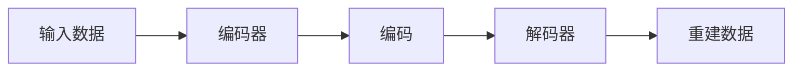

## 1.背景介绍

在深度学习的世界中，自动编码器（Autoencoder）是一种强大的工具，可用于学习数据的有效表示。它们是无监督学习的一种形式，这意味着我们可以在没有标签的数据上训练它们。自动编码器的目标是通过学习一种有效的编码来压缩输入数据，然后再将这种编码解压缩以重建输入数据。这种能力使得自动编码器在许多领域都有广泛的应用，包括图像去噪、异常检测、以及生成模型。

## 2.核心概念与联系

自动编码器由两个主要部分组成：编码器（Encoder）和解码器（Decoder）。编码器将输入数据压缩成一种较小的、更有效的表示形式，这种表示形式通常称为“编码”。解码器则使用这种编码来重建输入数据。



## 3.核心算法原理具体操作步骤

训练自动编码器的过程通常包括以下步骤：

1. 将输入数据传递给编码器。
2. 编码器将输入数据压缩成编码。
3. 将编码传递给解码器。
4. 解码器尝试使用编码重建输入数据。
5. 通过比较重建数据和原始输入数据，计算重建误差。
6. 使用反向传播算法来更新模型的权重，以减小重建误差。

## 4.数学模型和公式详细讲解举例说明

自动编码器的训练过程可以被看作是一个优化问题，我们的目标是找到一种能够最小化重建误差的编码。假设我们的输入数据是 $x$，编码是 $h$，解码器的输出（即重建数据）是 $\hat{x}$。那么重建误差可以被定义为：

$$
L(x, \hat{x}) = ||x - \hat{x}||^2
$$

其中 $||\cdot||^2$ 表示欧几里得距离。我们的目标是找到一种能够最小化所有训练样本的平均重建误差的编码：

$$
\min_{\theta,\phi} \frac{1}{n} \sum_{i=1}^{n} L(x^{(i)}, \hat{x}^{(i)})
$$

其中 $\theta$ 和 $\phi$ 分别是编码器和解码器的参数，$n$ 是训练样本的数量。

## 4.项目实践：代码实例和详细解释说明

以下是一个使用Python和Keras库实现的简单自动编码器的例子：

```python
from keras.layers import Input, Dense
from keras.models import Model

# 定义编码器
input_img = Input(shape=(784,))
encoded = Dense(128, activation='relu')(input_img)
encoded = Dense(64, activation='relu')(encoded)
encoded = Dense(32, activation='relu')(encoded)

# 定义解码器
decoded = Dense(64, activation='relu')(encoded)
decoded = Dense(128, activation='relu')(decoded)
decoded = Dense(784, activation='sigmoid')(decoded)

# 构建自动编码器模型
autoencoder = Model(input_img, decoded)

# 编译模型
autoencoder.compile(optimizer='adadelta', loss='binary_crossentropy')

# 训练模型
autoencoder.fit(x_train, x_train, epochs=50, batch_size=256, shuffle=True, validation_data=(x_test, x_test))
```

在这个例子中，我们首先定义了编码器，它由三个全连接层组成，每一层的神经元数量分别是128、64和32。然后我们定义了解码器，它也由三个全连接层组成，每一层的神经元数量分别是64、128和784。最后，我们构建了自动编码器模型，编译模型，并在训练数据上进行训练。

## 5.实际应用场景

自动编码器在许多领域都有广泛的应用。例如，在图像处理中，自动编码器可以被用于去噪，即通过学习一个能够忽略噪声的编码，我们可以重建出干净的图像。在异常检测中，自动编码器可以被用于学习正常数据的表示，然后用这种表示来检测异常数据。此外，自动编码器也可以被用于生成模型，例如变分自动编码器（VAE）就是一种流行的生成模型。

## 6.工具和资源推荐

如果你对自动编码器感兴趣，以下是一些有用的工具和资源：

- Keras：一个易于使用的深度学习库，可以用于构建和训练自动编码器。
- TensorFlow：一个强大的深度学习框架，提供了许多高级功能，如自动微分和分布式计算。
- PyTorch：另一个强大的深度学习框架，提供了动态计算图，使得模型的构建和调试更加方便。
- Deep Learning Book：一本深入介绍深度学习的书籍，其中有一章专门介绍了自动编码器。

## 7.总结：未来发展趋势与挑战

自动编码器是一种强大的工具，但是它还有许多挑战需要解决。例如，如何设计更有效的编码器和解码器结构，如何处理更复杂的数据类型，如何将自动编码器与其他深度学习技术（如卷积神经网络和循环神经网络）结合起来。尽管有这些挑战，但是我相信随着深度学习技术的进步，自动编码器将会有更广泛的应用。

## 8.附录：常见问题与解答

Q: 自动编码器可以用于有监督学习吗？

A: 自动编码器本身是无监督学习的一种形式，但是它的编码可以被用于有监督学习。例如，我们可以首先使用自动编码器来学习数据的表示，然后在这种表示上训练一个分类器或者回归器。

Q: 自动编码器和PCA（主成分分析）有什么区别？

A: PCA是一种线性降维技术，它通过找到数据的主要方向来压缩数据。相比之下，自动编码器是一种非线性降维技术，它可以学习数据的更复杂的结构。