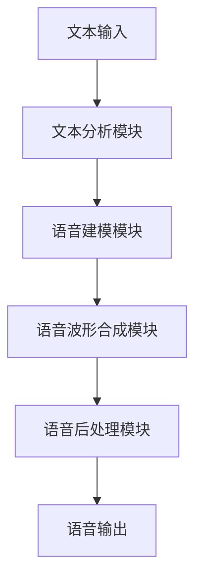

# 语音合成在汽车导航中的应用实践

## 1.背景介绍

### 1.1 汽车导航系统的重要性

在当今快节奏的生活中,汽车已经成为人们日常出行的重要交通工具。然而,驾驶过程中,司机需要同时处理多项任务,如观察路况、阅读导航指示等,这可能会分散注意力,增加发生事故的风险。因此,汽车导航系统的设计应当尽可能减轻驾驶员的认知负担,提供安全、便捷的驾驶体验。

### 1.2 语音交互在汽车导航中的作用

传统的汽车导航系统通常依赖视觉显示和手动操作,这在驾驶过程中可能会产生分心。而语音交互技术的引入,使得驾驶员无需将注意力转移到显示屏或操作界面上,只需通过简单的语音命令即可获取所需的导航信息,从而大大提高了驾驶安全性。

此外,语音交互在特殊场景下也具有独特优势,如夜间驾驶、极端天气等,可以避免驾驶员被其他因素干扰。因此,语音合成技术在汽车导航领域具有广阔的应用前景。

## 2.核心概念与联系  

### 2.1 语音合成技术概述

语音合成(Text-to-Speech,TTS)是一种将文本转换为人类可理解的语音的技术。它通常包括以下几个核心模块:

1. **文本分析(Text Analysis)**:对输入文本进行预处理,如分词、词性标注等,为后续模块提供必要的语义信息。

2. **语音建模(Acoustic Modeling)**:根据文本内容和语音特征,构建声学模型,描述语音的频谱、节奏等声学属性。

3. **语音波形合成(Waveform Generation)**:基于声学模型,合成最终的语音波形信号。

4. **语音后处理(Post-processing)**:对合成语音进行优化,如控制语速、语调等,提高自然度。

### 2.2 语音合成技术在汽车导航中的应用

语音合成技术在汽车导航系统中的应用,可以分为以下几个主要方面:

1. **导航指令播报**:系统可以根据当前路况、路线规划等信息,自动合成语音指令,为驾驶员提供导航服务。

2. **车载信息系统**:语音合成可以为驾驶员播报车辆状态信息、天气情况、交通信息等,提高驾驶安全性。

3. **车载娱乐系统**:语音合成技术可以将文本内容(如新闻、有声书等)转化为语音,为驾驶员提供车载娱乐服务。

4. **语音交互系统**:通过语音识别和语音合成技术的结合,实现人机语音对话,为驾驶员提供更自然、安全的交互方式。

### 2.3 语音合成系统架构

一个典型的语音合成系统架构通常包括以下几个核心模块:

1. **文本输入模块**:接收用户输入的文本,可以是导航指令、新闻内容等。

2. **文本分析模块**:对输入文本进行分词、词性标注等预处理,输出带有语义信息的中间表示。

3. **语音建模模块**:根据文本内容和语音特征,构建声学模型,描述语音的频谱、节奏等声学属性。

4. **语音波形合成模块**:基于声学模型,合成最终的语音波形信号。

5. **语音后处理模块**:对合成语音进行优化,如控制语速、语调等,提高自然度。

6. **语音输出模块**:将优化后的语音输出到扬声器等音频设备。

## 3.核心算法原理具体操作步骤

语音合成系统的核心算法主要包括声学建模和语音波形合成两个部分。下面将分别介绍它们的具体原理和操作步骤。

### 3.1 声学建模

声学建模的目标是构建一个模型,能够将文本内容映射到相应的声学特征,描述语音的频谱、节奏等声学属性。常见的声学建模方法包括:

1. **统计参数化语音合成(Statistical Parametric Speech Synthesis,SPSS)**

   SPSS是基于隐马尔可夫模型(HMM)的声学建模方法,它将语音信号建模为一系列状态的概率序列。具体步骤如下:

   a) **语音分段**:将训练语音数据分割成小段(如音素、三音素等)。
   
   b) **特征提取**:提取每个语音段的声学特征,如频谱包络、基频等。
   
   c) **模型训练**:使用HMM等统计模型,根据语音段及其对应的文本内容,学习语音与文本的映射关系。
   
   d) **模型合成**:给定新的文本输入,使用训练好的HMM模型生成对应的声学特征序列。

2. **深度神经网络语音合成(Deep Neural Network based TTS,DN-TTS)** 

   DN-TTS则是基于深度学习的声学建模方法,它使用神经网络直接从文本中预测声学特征。具体步骤如下:

   a) **数据预处理**:对训练数据进行必要的预处理,如文本分词、标注、语音特征提取等。
   
   b) **模型设计**:设计神经网络模型结构,如序列到序列模型(Seq2Seq)、注意力模型(Attention Model)等。
   
   c) **模型训练**:使用预处理后的数据对神经网络模型进行训练,学习文本到声学特征的映射。
   
   d) **模型推理**:给定新的文本输入,使用训练好的神经网络模型生成对应的声学特征序列。

无论采用何种声学建模方法,最终目标都是生成一个声学特征序列,描述语音的频谱、基频等声学属性,为后续的语音波形合成奠定基础。

### 3.2 语音波形合成

语音波形合成的目标是根据声学特征序列,合成出最终的语音波形信号。常见的语音波形合成方法包括:

1. **源滤波合成(Source-Filter Synthesis)**

   源滤波合成是一种经典的语音合成方法,它将语音产生过程建模为两个部分:激励源(源)和声道(滤波器)。具体步骤如下:

   a) **激励源建模**:根据声学特征中的基频信息,生成脉冲串(voiced)或白噪声(unvoiced)作为激励源。
   
   b) **滤波器建模**:根据声学特征中的频谱包络信息,设计一个滤波器(如线性预测编码LPC滤波器)。
   
   c) **合成波形**:将激励源通过滤波器,得到最终的语音波形。

2. **波形参数化合成(Waveform Parametric Synthesis)** 

   波形参数化合成则是直接对语音波形进行建模,常见方法有:

   - **STRAIGHT**:基于时域pitch同步重建技术,对频谱包络和基频分别建模。
   - **TANDEM-STRAIGHT**:在STRAIGHT基础上,引入了残差信号的建模。
   - **WORLD**:将语音分解为三个部分(基频、频谱包络、非周期性成分)分别建模。

3. **端到端神经网络语音合成(End-to-End Neural TTS)**

   最新的端到端神经网络语音合成方法,则是直接使用深度神经网络从文本或声学特征生成语音波形。常见模型有:

   - **WaveNet**:基于扩展的卷积神经网络,直接对原始语音波形进行建模。
   - **Tacotron2**:序列到序列模型,可直接从文本生成语音波形。
   - **TransformerTTS**:基于Transformer结构,端到端生成语音波形。

无论采用何种语音波形合成方法,最终目标都是根据声学特征序列,生成与之对应的语音波形信号,作为系统的最终输出。

## 4.数学模型和公式详细讲解举例说明

在语音合成系统中,数学模型和公式扮演着重要角色,用于描述和建模语音的各种属性。下面将详细介绍一些常见的数学模型和公式。

### 4.1 隐马尔可夫模型(HMM)

隐马尔可夫模型(Hidden Markov Model,HMM)是统计参数化语音合成中常用的声学建模方法。HMM将语音信号建模为一系列状态的概率序列,每个状态对应一个高斯混合模型(GMM)来描述观测序列的概率分布。

对于给定的观测序列 $O = \{o_1, o_2, \dots, o_T\}$ 和状态序列 $Q = \{q_1, q_2, \dots, q_T\}$,HMM模型的目标是最大化观测序列的概率 $P(O|λ)$,其中 $λ$ 表示HMM模型参数。根据贝叶斯公式,我们有:

$$
P(O|λ) = \sum_{Q}P(O|Q,λ)P(Q|λ)
$$

其中 $P(O|Q,λ)$ 表示观测序列在给定状态序列时的概率,称为发射概率; $P(Q|λ)$ 表示状态序列的先验概率。

在语音合成任务中,我们通常已知观测序列(语音特征序列),目标是估计最优的状态序列,即:

$$
\hat{Q} = \arg\max_{Q}P(Q|O,λ)
$$

这个过程称为解码(Decoding),可以使用维特比算法(Viterbi Algorithm)高效求解。

### 4.2 神经网络语音合成

在神经网络语音合成中,常用的模型结构包括序列到序列模型(Seq2Seq)、注意力模型(Attention Model)等。以Tacotron2模型为例,它采用了Seq2Seq结构,将文本序列映射到梅尔频谱序列。

假设输入文本序列为 $X = \{x_1, x_2, \dots, x_N\}$,目标梅尔频谱序列为 $Y = \{y_1, y_2, \dots, y_T\}$,那么模型的目标是最大化条件概率 $P(Y|X)$。根据链式法则,我们有:

$$
P(Y|X) = \prod_{t=1}^{T}P(y_t|y_{<t}, X)
$$

其中 $y_{<t}$ 表示时间步 $t$ 之前的梅尔频谱序列。

在Seq2Seq模型中,我们使用编码器(Encoder)将输入文本序列 $X$ 编码为中间表示 $H$,再使用解码器(Decoder)根据 $H$ 生成目标序列 $Y$。具体来说,编码器可以是双向LSTM或Transformer等结构,解码器则常采用注意力机制,在每个时间步关注输入序列的不同部分。

此外,还可以引入辅助特征(如语音特征)作为条件,进一步提高模型性能。总的来说,神经网络语音合成模型通过端到端的方式直接从文本生成语音特征序列,避免了传统方法中的中间步骤,能够更好地建模语音的细节特征。

### 4.3 声学特征参数化

无论采用何种语音合成方法,对语音信号的参数化描述都是必要的。常见的声学特征包括:

1. **频谱参数**

   - 线性预测系数(LPC):描述语音的频谱包络
   - 梅尔频率倒谱系数(MFCC):基于人耳听觉感知的频谱表示
   - 梅尔频谱(Mel-Spectrogram):对应梅尔刻度的频谱图

2. **基频(F0)参数**

   基频描述了语音的基本频率,与说话人的音高、音调等特征相关。常用的基频参数化方法有:

   - 简单峰值拾取(Simple Peak Picking)
   - 自相关函数(Autocorrelation Function)
   - 倒谱平坦度(Cepstrum)

3. **激励参数**

   激励参数用于描述激励源的性质,如是否为浊音(voiced)或清音(unvoiced)。常用的激励参数有:

   - 准周期性评分(Quasi-Periodicity Score)
   - 