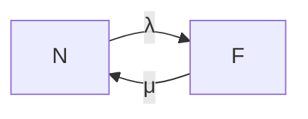

## 1.背景介绍

在计算机科学中，调度器是那些决定工作负载如何在系统资源中分配的关键组件。这些工作负载可能是进程、线程、任务、等等。调度器的设计和实现对于系统的性能和稳定性至关重要。然而，随着计算环境的复杂性和动态性的增加，调度器本身也需要设计出强大的容错能力和高可用性，以确保系统在面临故障和异常时，能够持续稳定地运行。本文将深入探讨调度器的容错和高可用性设计。

## 2.核心概念与联系

### 2.1 调度器

调度器是一个管理和分配系统资源的程序，它决定了哪些任务可以在何时运行，以及运行的优先级。

### 2.2 容错

容错是系统设计的一个重要方面，它确保系统在硬件或软件故障发生时，能够继续提供正确的服务。容错设计需要考虑如何检测故障，如何恢复正常运行，以及如何防止故障的再次发生。

### 2.3 高可用性

高可用性是指系统能够在长时间内保持运行状态，即使在部分组件出现故障的情况下也能够继续提供服务。高可用性设计需要考虑如何最小化系统停机时间，如何快速恢复服务，以及如何在故障发生时自动切换到备用系统。

## 3.核心算法原理具体操作步骤

设计一个具有容错和高可用性的调度器，需要遵循以下步骤：

### 3.1 故障检测

首先，调度器需要有能力检测到系统中的故障。这可能通过各种机制实现，例如心跳检测、超时机制、异常检测等。

### 3.2 故障恢复

一旦检测到故障，调度器需要能够启动恢复机制。这可能包括重新分配任务，重启故障节点，或者将工作负载迁移到备用系统。

### 3.3 系统冗余

为了提高系统的可用性，调度器可能需要管理多个冗余的系统组件。这样，当某个组件出现故障时，可以立即切换到备用组件，从而保持系统的持续运行。

### 3.4 负载均衡

调度器需要能够在系统的各个组件之间均匀地分配工作负载。这样可以避免某个组件过载，从而提高系统的整体性能和稳定性。

## 4.数学模型和公式详细讲解举例说明

在设计调度器的容错和高可用性时，我们可以使用一些数学模型来帮助我们进行设计和分析。例如，我们可以使用马尔可夫模型来描述系统的故障和恢复过程。

假设系统在任意时刻只能处于两种状态之一：正常（N）或故障（F）。系统在正常状态下以速率λ转移到故障状态，而在故障状态下以速率μ恢复到正常状态。这可以用以下马尔可夫链来描述：



在这个模型中，系统的稳态可用性A可以用以下公式来计算：

$$ A = \frac{\mu}{\lambda + \mu} $$

这个公式告诉我们，为了提高系统的可用性，我们需要尽可能地减小故障率λ，或者尽可能地增大恢复率μ。

## 4.项目实践：代码实例和详细解释说明

在项目实践中，我们可以使用开源的调度器框架，例如Apache Mesos或Kubernetes，来实现我们的容错和高可用性设计。这些框架提供了丰富的特性和工具，可以帮助我们更容易地实现我们的设计目标。

以下是一个使用Kubernetes实现的高可用性调度器的简单示例：

```yaml
apiVersion: apps/v1
kind: Deployment
metadata:
  name: my-scheduler
  labels:
    app: my-scheduler
spec:
  replicas: 3
  selector:
    matchLabels:
      app: my-scheduler
  template:
    metadata:
      labels:
        app: my-scheduler
    spec:
      containers:
      - name: my-scheduler
        image: my-scheduler:latest
        ports:
        - containerPort: 80
```

在这个示例中，我们创建了一个名为my-scheduler的部署，它启动了3个调度器的副本。这样，即使其中一个副本出现故障，其他的副本仍然可以继续提供服务。

## 5.实际应用场景

调度器的容错和高可用性设计在许多实际应用中都非常重要。例如，在云计算环境中，调度器需要能够处理大量的工作负载，并且需要能够在硬件或软件故障发生时，快速地恢复服务。

此外，在物联网（IoT）应用中，调度器需要能够管理大量的设备和传感器。由于这些设备可能分布在各种不同的地理位置，因此调度器需要具有强大的容错能力，以应对网络故障和设备故障。

## 6.工具和资源推荐

以下是一些在设计和实现调度器的容错和高可用性时，可能会用到的工具和资源：

- Apache Mesos：一个开源的集群管理器，它可以提供有效的资源隔离和共享，以支持容错和高可用性。

- Kubernetes：一个开源的容器编排平台，它提供了丰富的特性和工具，可以帮助我们实现高可用性和容错设计。

- ZooKeeper：一个开源的分布式协调服务，它可以提供一致性、可靠性和原子性的保证，以支持高可用性和容错设计。

- Consul：一个提供服务发现和配置的工具，它可以帮助我们在分布式环境中实现高可用性和容错设计。

## 7.总结：未来发展趋势与挑战

随着计算环境的复杂性和动态性的增加，调度器的容错和高可用性设计将变得越来越重要。在未来，我们可能会看到更多的研究和开发集中在如何提高调度器的容错能力，以及如何设计出更高可用性的调度器。

然而，这也将带来一些挑战。例如，如何在保持高可用性的同时，还能保持系统的性能和效率？如何在面临更复杂和更动态的计算环境时，设计出更强大的容错机制？这些都是我们在未来需要面对的挑战。

## 8.附录：常见问题与解答

**Q: 为什么调度器需要设计容错和高可用性？**

A: 调度器是系统中的关键组件，它负责管理和分配系统的工作负载。如果调度器出现故障，那么整个系统可能会停止运行。因此，调度器需要设计出强大的容错能力和高可用性，以确保系统在面临故障和异常时，能够持续稳定地运行。

**Q: 如何设计一个具有容错和高可用性的调度器？**

A: 设计一个具有容错和高可用性的调度器，需要遵循一些基本的步骤，包括故障检测、故障恢复、系统冗余和负载均衡。此外，我们还可以使用一些开源的调度器框架，例如Apache Mesos或Kubernetes，来帮助我们实现我们的设计目标。

**Q: 什么是高可用性？**

A: 高可用性是指系统能够在长时间内保持运行状态，即使在部分组件出现故障的情况下也能够继续提供服务。高可用性设计需要考虑如何最小化系统停机时间，如何快速恢复服务，以及如何在故障发生时自动切换到备用系统。