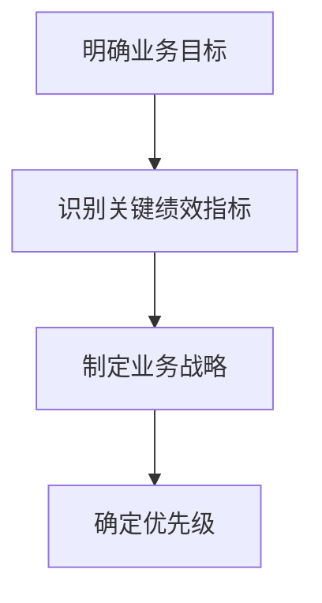
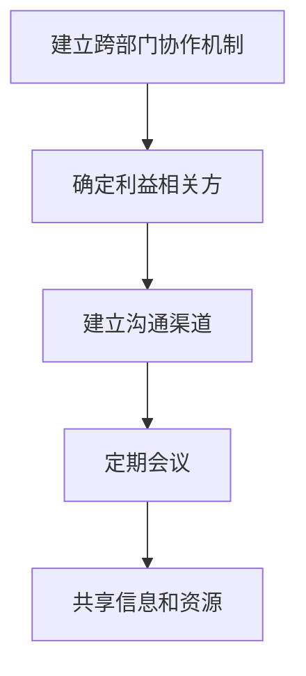
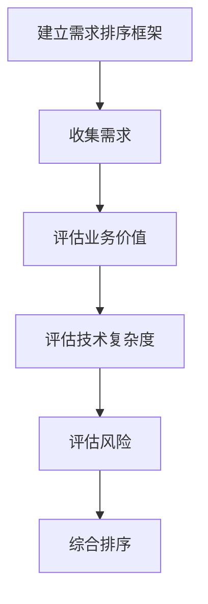
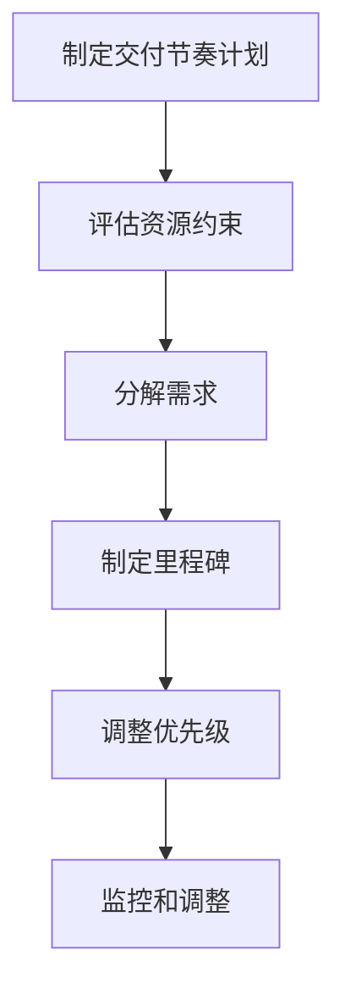
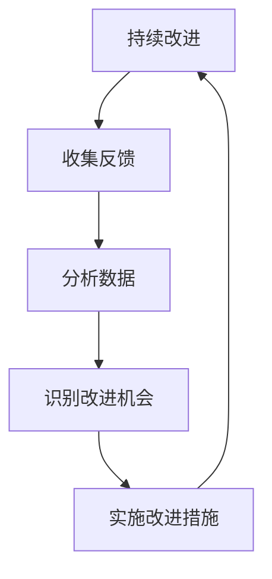

# 跨部门协调资源，依赖对业务的理解对需求进行排序和把控落地节奏

## 1.背景介绍

### 1.1 现代企业面临的挑战

在当今快节奏的商业环境中，企业不断面临着来自市场、技术和客户需求的多重挑战。为了保持竞争力和持续创新,企业需要高效地协调各部门资源,快速响应业务需求。然而,这种跨部门协作并非易事,往往存在诸多障碍和挑战。

### 1.2 传统需求管理的缺陷

传统的需求管理过程通常是线性的、分散的,缺乏对整体业务目标的理解。这可能导致以下问题:

- 资源分配不当,导致瓶颈和效率低下
- 需求排序混乱,无法对齐业务优先级
- 缺乏对交付节奏的控制,无法满足市场期望
- 部门之间的沟通不畅,导致冲突和重复工作

### 1.3 改进需求管理的必要性

为了解决这些问题,企业需要采用一种更加全面、协调和敏捷的方法来管理需求。这种方法应该建立在对整体业务目标的深入理解之上,并能够有效协调跨部门资源,优化需求排序,并精准控制交付节奏。

## 2.核心概念与联系

### 2.1 业务目标驱动

业务目标是指企业为实现其战略愿景而设定的具体目标,如提高收入、扩大市场份额、降低成本等。它们为整个需求管理过程提供了方向和优先级。通过将需求与业务目标对齐,企业可以确保资源投入到最关键的领域。

### 2.2 跨部门协作

现代企业由多个部门组成,如产品、开发、营销、客户支持等。每个部门都对实现业务目标做出贡献,但也存在着特定的需求和约束。有效的跨部门协作可以确保各部门之间的沟通顺畅,资源得到合理分配,从而提高整体效率。

### 2.3 需求排序

需求排序是根据业务优先级对需求进行优先级排列的过程。合理的需求排序可以确保高价值需求得到优先处理,从而最大化投资回报。同时,它还有助于管理风险,因为高风险需求可以被推迟或分解。

### 2.4 交付节奏控制

交付节奏指的是需求实现和上线的时间表。通过对交付节奏的精确控制,企业可以满足市场期望,保持竞争优势。同时,合理的节奏还可以避免团队过度操劳,确保交付质量。

### 2.5 核心概念关联

这四个核心概念相互关联、相辅相成。业务目标驱动确定了需求的优先级,跨部门协作则为需求排序和交付节奏的制定提供了必要的信息和资源。而合理的需求排序和交付节奏控制又有助于更好地实现业务目标。它们共同构成了一个闭环系统,推动企业持续创新和发展。

## 3.核心算法原理具体操作步骤

为了实现有效的跨部门协调、需求排序和交付节奏控制,我们提出了一种基于业务目标驱动的需求管理框架。该框架包含以下关键步骤:

### 3.1 明确业务目标



首先,企业需要明确其当前和未来的业务目标。这可以通过与高层管理人员、利益相关方和客户进行广泛讨论来实现。接下来,需要识别与这些目标相关的关键绩效指标(KPI),如收入增长率、客户满意度等。然后,根据这些KPI制定具体的业务战略和计划。最后,根据对业务目标的贡献程度,确定各项需求的优先级。

### 3.2 建立跨部门协作机制



有效的跨部门协作对于需求管理至关重要。首先,企业需要确定所有相关部门的利益相关方,包括产品经理、开发人员、营销人员等。然后,建立正式和非正式的沟通渠道,如定期会议、即时通讯工具等。通过这些渠道,各部门可以共享信息、资源和约束条件,从而达成共识并协调行动。

### 3.3 建立需求排序框架



需求排序框架旨在根据业务目标、技术复杂度和风险因素,对需求进行优先级排序。首先,从各部门收集所有需求。然后,针对每个需求,评估其对业务目标的贡献程度,从而确定其业务价值。接下来,评估需求的技术复杂度,包括所需资源、技术难度等。同时,还需要评估需求的风险,如上线延迟、质量问题等。最后,将这三个因素综合考虑,对需求进行排序。

### 3.4 制定交付节奏计划



根据需求排序结果和可用资源,企业需要制定一个合理的交付节奏计划。首先,评估各种资源约束,如人力、预算、基础设施等。然后,将大型需求分解为更小的可交付单元。接下来,根据优先级和资源情况,为每个单元设置里程碑交付日期。在实施过程中,需要持续监控进度,并根据实际情况调整优先级和节奏。

### 3.5 持续改进



需求管理是一个持续的过程,需要不断改进以适应变化的业务环境。企业应该从各个利益相关方那里收集反馈,并分析过程数据,以识别改进机会。一旦发现问题,就应该立即实施相应的改进措施,从而优化整个流程。这种持续改进将有助于企业保持竞争力,满足不断变化的客户需求。

## 4.数学模型和公式详细讲解举例说明

在需求管理过程中,我们可以使用一些数学模型和公式来量化和优化决策。以下是一些常用模型:

### 4.1 需求价值评估模型

需求价值评估模型用于量化需求对业务目标的贡献程度。一种常见的方法是使用加权评分模型:

$$
V_i = \sum_{j=1}^{n} w_j \cdot s_{ij}
$$

其中:
- $V_i$ 表示第 i 个需求的总体价值评分
- $w_j$ 表示与业务目标 j 相关的权重,反映其重要性
- $s_{ij}$ 表示第 i 个需求对业务目标 j 的贡献评分(通常在 1-5 分之间)
- n 表示业务目标的总数

通过计算每个需求的总体价值评分,我们可以对需求进行排序,优先处理那些对关键业务目标有重大贡献的需求。

### 4.2 技术复杂度评估模型

技术复杂度评估模型用于量化实现需求所需的技术难度和资源投入。一种常见的方法是使用加权评分模型:

$$
C_i = \sum_{k=1}^{m} w_k \cdot s_{ik}
$$

其中:
- $C_i$ 表示第 i 个需求的技术复杂度评分
- $w_k$ 表示与技术因素 k 相关的权重,反映其重要性
- $s_{ik}$ 表示第 i 个需求在技术因素 k 上的评分(通常在 1-5 分之间)
- m 表示技术因素的总数

技术因素可能包括编码难度、测试复杂度、集成挑战等。通过计算每个需求的技术复杂度评分,我们可以更好地估计所需资源,并优先处理那些相对简单的需求。

### 4.3 风险评估模型

风险评估模型用于量化需求实现过程中可能遇到的风险。一种常见的方法是使用概率影响模型:

$$
R_i = P_i \cdot I_i
$$

其中:
- $R_i$ 表示第 i 个需求的风险评分
- $P_i$ 表示第 i 个需求发生风险事件的概率(0-1 之间)
- $I_i$ 表示风险事件对需求实现的影响程度评分(通常在 1-5 分之间)

风险事件可能包括延期交付、质量问题、资源短缺等。通过计算每个需求的风险评分,我们可以优先处理那些风险较低的需求,或者为高风险需求制定缓解措施。

### 4.4 综合评分模型

为了同时考虑需求价值、技术复杂度和风险因素,我们可以使用综合评分模型:

$$
S_i = \alpha V_i - \beta C_i - \gamma R_i
$$

其中:
- $S_i$ 表示第 i 个需求的综合评分
- $\alpha$、$\beta$、$\gamma$ 分别表示需求价值、技术复杂度和风险的权重系数,反映它们的相对重要性

通过计算每个需求的综合评分,我们可以对需求进行排序,优先处理那些综合评分较高的需求。同时,我们还可以根据具体情况调整权重系数,以满足不同的业务需求。

以上数学模型和公式为需求管理过程提供了量化和优化决策的工具。但是,它们只是辅助手段,最终决策还需要结合实际情况和专家经验。

## 5. 项目实践:代码实例和详细解释说明

为了更好地理解上述需求管理框架的实际应用,我们将以一个电子商务网站的需求管理项目为例,提供代码实例和详细解释。

### 5.1 明确业务目标

在这个项目中,我们将电子商务网站的主要业务目标定义为:

1. 提高销售额
2. 增加客户满意度
3. 降低运营成本

根据这些目标,我们可以确定相应的关键绩效指标(KPI):

- 销售额增长率
- 客户留存率
- 订单履行时间
- 客户支持响应时间
- 基础设施成本

### 5.2 建立跨部门协作机制

为了实现有效的跨部门协作,我们建立了以下沟通渠道:

- 每周一次的需求评审会议,由产品经理、开发经理、营销经理和客户支持经理参加
- 基于 Slack 的即时通讯渠道,用于日常沟通和问题解决
- 基于 Confluence 的在线协作空间,用于共享文档和资源

此外,我们还制定了一套明确的角色和职责,以确保每个部门都能够充分参与并做出贡献。

### 5.3 建立需求排序框架

为了对需求进行排序,我们开发了一个基于 Python 的需求评估工具。该工具包含以下核心功能:

1. 收集需求
2. 评估需求价值
3. 评估技术复杂度
4. 评估风险
5. 综合排序

以下是一些关键代码片段:

```python
# 定义业务目标和权重
business_goals = {
    "增加销售额": 0.4,
    "提高客户满意度": 0.3,
    "降低运营成本": 0.2
}

# 定义技术因素和权重
tech_factors = {
    "编码难度": 0.3,
    "测试复杂度": 0.2,
    "集成挑战": 0.3,
    "基础设施需求": 0.2