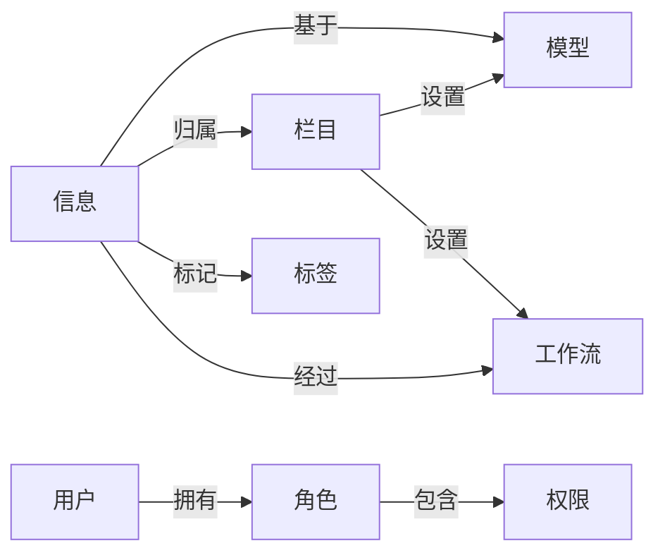

# 软件信息发布系统详细设计与具体代码实现

作者：禅与计算机程序设计艺术

## 1.背景介绍

在当今互联网时代,软件信息发布系统在各行各业中扮演着越来越重要的角色。无论是企业内部的信息共享,还是面向公众的产品推广,一个高效、易用、功能完善的信息发布系统都是必不可少的。本文将深入探讨软件信息发布系统的详细设计与具体代码实现,为开发者提供实用的参考和指导。

### 1.1 软件信息发布系统的定义与功能

软件信息发布系统是一种基于Web技术,用于管理和发布各类信息的应用系统。其主要功能包括:

- 信息的录入、编辑和审核
- 信息的分类、检索和展示  
- 用户权限管理与访问控制
- 信息的统计分析与报表生成

### 1.2 软件信息发布系统的应用场景

软件信息发布系统广泛应用于以下场景:

- 企业官网的新闻动态、产品介绍等信息发布
- 政府机构的公告通知、政策法规等信息公开
- 媒体网站的新闻资讯、专题报道等内容生产  
- 电商平台的商品详情、促销活动等信息更新

### 1.3 软件信息发布系统面临的挑战

随着信息量的爆炸式增长和用户需求的日益多样化,软件信息发布系统在设计和实现上面临诸多挑战,例如:

- 海量信息的高效存储与快速检索
- 多终端、跨平台的响应式布局适配
- 个性化信息推荐与智能化内容生成  
- 系统安全性、稳定性、可扩展性的保障

## 2.核心概念与关联

要设计和实现一个优秀的软件信息发布系统,首先需要理解其中的一些核心概念,以及它们之间的关联关系。

### 2.1 信息(Information)

信息是系统的核心对象,可以是文字、图片、视频等多种形式的数字化内容。每条信息包含标题、作者、发布时间、正文、附件等基本要素。

### 2.2 栏目(Column)

栏目是对信息进行分类组织的容器,具有树形层级结构。不同栏目可设置不同的信息模型、工作流、访问权限等属性。

### 2.3 模型(Model)

模型定义了信息的数据结构和表现形式。一个模型包含多个字段,字段支持文本、整型、日期、图片、附件等多种数据类型。模型与栏目关联,为栏目下的信息提供统一的结构模板。

### 2.4 工作流(Workflow)

工作流规定了信息从创建到发布的审核流程。分为串行工作流和并行工作流两种,涉及录入、审核、发布等多个节点。每个节点可指定一个或多个操作角色。

### 2.5 角色(Role)与权限(Permission)  

角色是对用户的分类,如管理员、编辑、作者等。权限是对用户可执行操作的控制,如信息的增删改查。角色与权限关联,不同角色拥有不同的权限。

### 2.6 标签(Tag)

标签是对信息的关键词描述,可由编辑人员手动添加,也可由系统自动提取。通过标签可实现信息的快速检索和聚合展示。

### 2.7 概念关联图

以下是软件信息发布系统核心概念的关联图:



从关联图可见,信息是系统的核心,其归属于栏目、基于模型、经过工作流、被用户操作、标记标签,由此构成了软件信息发布系统的基本骨架。

## 3.核心算法原理与具体操作步骤

软件信息发布系统涉及的核心算法主要包括信息检索、相似度计算、自动摘要、智能标签等。本节以信息检索为例,讲解其基本原理和实现步骤。

### 3.1 信息检索算法原理

信息检索是根据用户的查询词,从海量信息中快速找出相关信息的过程。其核心是建立信息倒排索引,即将信息进行分词处理,提取关键词,建立关键词到信息ID的映射关系。

常用的信息检索模型有布尔模型、向量空间模型、概率模型等。以向量空间模型(VSM)为例,其基本思想是:

1. 将查询词和信息都表示成向量的形式,向量的每个维度对应一个关键词的权重。

2. 计算查询词向量与信息向量的相似度,常用的相似度计算方法有余弦相似度、Jaccard相似度等。

3. 按相似度得分由高到低排序,返回Top-K个信息作为检索结果。

### 3.2 信息检索的具体实现步骤

#### 3.2.1 信息分词与关键词提取

对信息正文进行分词,提取名词、动词、形容词等实词作为关键词,并过滤停用词。可使用jieba、hanlp等中文分词工具。

#### 3.2.2 关键词加权

采用TF-IDF(词频-逆文档频率)算法对关键词进行加权,权重计算公式为:

$w_{i,j} = tf_{i,j} * log(\frac{N}{df_i})$

其中,$w_{i,j}$表示关键词$i$在信息$j$中的权重,$tf_{i,j}$表示关键词$i$在信息$j$中的词频,$N$为信息总数,$df_i$为包含关键词$i$的信息数。

#### 3.2.3 建立倒排索引

将每条信息的关键词及其权重构建成一个向量,建立关键词到信息ID的倒排索引。

倒排索引的数据结构如下:

```
keyword1: [(info_id1, weight1), (info_id2, weight2), ...]
keyword2: [(info_id3, weight3), (info_id4, weight4), ...]
...
```

#### 3.2.4 查询词向量化

对用户输入的查询词进行分词,提取关键词,生成查询词向量$\vec{q}$。

#### 3.2.5 相似度计算与排序

对于每条信息向量$\vec{d}$,计算其与查询词向量$\vec{q}$的余弦相似度:

$$sim(\vec{q},\vec{d}) = \frac{\vec{q} \cdot \vec{d}}{|\vec{q}| |\vec{d}|}$$

按相似度得分排序,取Top-K个信息作为检索结果返回。

## 4.数学模型与公式详解

在信息检索的向量空间模型中,涉及到几个重要的数学概念和公式。

### 4.1 词频(Term Frequency, TF)

词频$tf_{i,j}$表示关键词$i$在信息$j$中出现的次数。直观地说,一个词在文档中出现的次数越多,其重要性就越高。

### 4.2 逆文档频率(Inverse Document Frequency, IDF)

逆文档频率$idf_i$表示关键词$i$的稀缺程度,计算公式为:

$$idf_i = log(\frac{N}{df_i})$$

其中,$N$为信息总数,$df_i$为包含关键词$i$的信息数。直观地说,如果一个词在很多文档中都出现,其区分度就较低,权重应该降低。

### 4.3 TF-IDF权重

TF-IDF权重$w_{i,j}$综合考虑了词频和逆文档频率两个因素,计算公式为:

$$w_{i,j} = tf_{i,j} * idf_i$$

一个词在文档中出现次数多,在其他文档中出现次数少,其TF-IDF权重就越大。

举例说明:假设有100条信息,其中10条包含关键词"区块链",1条包含关键词"比特币"。则两个关键词的逆文档频率为:

$$
idf_{区块链} = log(\frac{100}{10}) = 1\\
idf_{比特币} = log(\frac{100}{1}) = 2
$$

可见"比特币"的权重高于"区块链",更能体现信息的特征。

### 4.4 向量空间模型

向量空间模型(Vector Space Model, VSM)将查询词$\vec{q}$和信息$\vec{d}$都表示成$n$维向量的形式:

$$
\vec{q} = (w_{1,q}, w_{2,q}, ..., w_{n,q})\\
\vec{d} = (w_{1,d}, w_{2,d}, ..., w_{n,d})
$$

其中,$n$为关键词的总数,$w_{i,q}$和$w_{i,d}$分别表示关键词$i$在查询词和信息中的TF-IDF权重。

两个向量的余弦相似度为:

$$
sim(\vec{q},\vec{d}) = \frac{\sum_{i=1}^n w_{i,q}w_{i,d}}{\sqrt{\sum_{i=1}^n w_{i,q}^2} \sqrt{\sum_{i=1}^n w_{i,d}^2}}
$$

余弦相似度的取值范围为$[0,1]$,值越大表示两个向量的方向越接近,查询词与信息的相关度越高。

## 5.项目实践:代码实例与详解

下面以Python为例,演示如何实现一个简单的信息检索系统。

### 5.1 安装依赖库

```bash
pip install jieba
pip install sklearn
```

### 5.2 信息分词与关键词提取

```python
import jieba

def extract_keywords(text):
    # 对文本进行分词
    words = jieba.cut(text)
    # 过滤停用词
    stopwords = [line.strip() for line in open('stopwords.txt', encoding='utf-8')]
    keywords = [w for w in words if w not in stopwords and len(w.strip()) > 1]
    return keywords
```

### 5.3 TF-IDF权重计算

```python
from sklearn.feature_extraction.text import TfidfVectorizer

def calc_tfidf(corpus):
    # 将文本集合转化为TF-IDF矩阵
    vectorizer = TfidfVectorizer()
    tfidf = vectorizer.fit_transform(corpus)
    # 获取词袋模型中的所有词语  
    words = vectorizer.get_feature_names()
    # 获取TF-IDF矩阵的稀疏表示
    weights = tfidf.toarray()
    return words, weights
```

### 5.4 倒排索引的构建

```python
def build_inverted_index(infos):
    # 初始化倒排索引
    inverted_index = {}
    for i, info in enumerate(infos):
        # 提取信息的关键词
        keywords = extract_keywords(info['text'])
        for k in keywords:
            # 添加关键词到信息ID的映射
            if k not in inverted_index:
                inverted_index[k] = set()
            inverted_index[k].add(i)
    return inverted_index
```

### 5.5 查询词相关信息检索

```python
from collections import defaultdict

def search_infos(query, inverted_index, words, weights):
    # 提取查询词的关键词
    keywords = extract_keywords(query)
    # 获取包含查询词的信息ID
    info_ids = set()
    for k in keywords:
        if k in inverted_index:
            info_ids |= inverted_index[k]
    # 计算查询词与信息的相似度
    scores = defaultdict(float)
    for i in info_ids:
        scores[i] = cosine_similarity(query, words, weights[i])
    # 按相似度排序
    sorted_scores = sorted(scores.items(), key=lambda x: x[1], reverse=True)
    # 返回相关信息ID
    return [i for i, s in sorted_scores]

def cosine_similarity(query, words, weights):
    # 计算查询词向量
    q_vec = [1 if w in query else 0 for w in words]
    # 计算信息向量
    d_vec = weights
    # 计算余弦相似度
    dot = sum(a*b for a,b in zip(q_vec, d_vec))
    norm_q = sum(a*a for a in q_vec) ** 0.5
    norm_d = sum(b*b for b in d_vec) ** 0.5
    return dot / (norm_q * norm_d)
```

### 5.6 测试与验证

```python
# 测试数据
infos = [
    {'id': 1, 'text': '区块链是分布式数据存储、点对点传输、共识机制、加密算法等计算机技术的新型应用模式。'},
    {'id': 2, 'text': '区块链