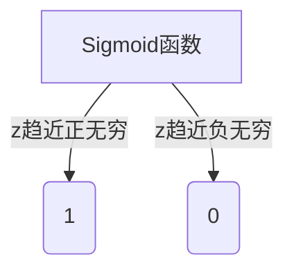

# 逻辑回归原理与代码实例讲解

## 1.背景介绍

逻辑回归(Logistic Regression)是机器学习中一种广泛使用的监督学习算法,主要用于解决二分类问题。它基于概率估计模型,可以预测实例属于某一类别的概率。尽管名称中含有"回归"一词,但逻辑回归实际上是一种分类模型,而非回归模型。

在现实世界中,逻辑回归有着广泛的应用场景,例如:

- 疾病诊断(患病/未患病)
- 信用评分(违约/未违约)
- 垃圾邮件过滤(垃圾邮件/正常邮件)
- 广告点击预测(点击/未点击)

逻辑回归模型简单且易于理解,计算代价也不高,因此在工业界得到了广泛应用。即使在大数据时代,逻辑回归仍然是数据科学家的基本工具之一。

## 2.核心概念与联系

### 2.1 线性回归 vs 逻辑回归

线性回归和逻辑回归都是通过拟合数据点来构建模型,但是它们在应用场景和模型输出上存在显著差异。

线性回归用于解决回归问题,即预测一个连续的数值输出。比如,预测房价、销量等。线性回归模型的输出可以取任意实数值。

而逻辑回归则用于解决分类问题,预测实例属于某个离散类别的概率。比如,预测电子邮件是否为垃圾邮件。逻辑回归模型的输出是一个介于0和1之间的概率值。

### 2.2 Sigmoid函数

逻辑回归的核心是Sigmoid函数(也称为logistic函数),它将线性回归的输出映射到(0,1)范围内,从而可以将其解释为概率值。Sigmoid函数的公式如下:

$$
\sigma(z) = \frac{1}{1 + e^{-z}}
$$

其中,z是线性回归的输出。Sigmoid函数的图形如下:



可以看出,当z趋近正无穷时,Sigmoid函数的值趋近于1;当z趋近负无穷时,Sigmoid函数的值趋近于0。这使得Sigmoid函数非常适合于二分类问题。

### 2.3 决策边界

在逻辑回归中,我们通常将概率大于0.5的实例划分为正类,小于0.5的实例划分为负类。这条概率为0.5的边界线就是决策边界。

对于线性可分的数据,决策边界是一条直线;对于非线性数据,决策边界是一条曲线。逻辑回归试图找到一个最佳的决策边界,使正负实例分开。

## 3.核心算法原理具体操作步骤  

逻辑回归算法的目标是找到最佳的参数θ,使得对于给定的输入x,模型输出的概率y∈{0,1}与真实标记尽可能接近。

### 3.1 模型表示

给定输入特征向量x=(x1,x2,...,xn),逻辑回归模型的假设函数为:

$$
h_\theta(x) = \sigma(\theta^T x) = \frac{1}{1 + e^{-\theta^T x}}
$$

其中,θ=(θ0,θ1,...,θn)是模型参数,θ0是偏置项。

我们的目标是找到最优参数θ,使得对于所有的训练实例(x,y),h(x)尽可能接近y。

### 3.2 代价函数

为了评估假设函数h(x)与真实标记y之间的差异,我们定义了逻辑回归的代价函数(Loss Function):

$$
J(\theta) = -\frac{1}{m}\sum_{i=1}^{m}[y^{(i)}\log(h_\theta(x^{(i)})) + (1-y^{(i)})\log(1-h_\theta(x^{(i)}))]
$$

其中,m是训练实例的总数。

代价函数J(θ)是一个非凸函数,我们需要找到能够最小化J(θ)的参数θ。

### 3.3 梯度下降

逻辑回归通常使用梯度下降算法来优化代价函数J(θ)。梯度下降的核心思想是沿着代价函数下降最陡的方向,每次迭代都更新参数θ,使得代价函数J(θ)不断减小,直到收敛到局部最小值。

对于每个参数θj,梯度下降的更新规则为:

$$
\theta_j := \theta_j - \alpha \frac{\partial}{\partial \theta_j}J(\theta)
$$

其中,α是学习率,控制每次更新的步长。

对于逻辑回归的代价函数J(θ),其偏导数为:

$$
\frac{\partial}{\partial \theta_j}J(\theta) = \frac{1}{m}\sum_{i=1}^{m}(h_\theta(x^{(i)}) - y^{(i)})x_j^{(i)}
$$

通过不断迭代更新参数θ,直到代价函数J(θ)收敛,我们就可以得到最优的参数θ。

### 3.4 算法步骤总结

逻辑回归算法的具体步骤如下:

1. 准备数据,将特征向量x和标记y组成训练集。
2. 初始化参数θ为0向量。
3. 计算代价函数J(θ)。
4. 使用梯度下降算法,根据代价函数的偏导数更新参数θ。
5. 重复步骤3和4,直到代价函数J(θ)收敛。
6. 使用最终得到的参数θ对新的实例x进行预测:如果h(x)≥0.5,则预测为正类;否则预测为负类。

## 4.数学模型和公式详细讲解举例说明

为了更好地理解逻辑回归的数学模型,我们来看一个具体的例子。假设我们有一个二分类问题,需要根据考生的数学成绩x1和英语成绩x2来预测该考生是否能被录取(y=1表示被录取,y=0表示未被录取)。

### 4.1 模型表示

我们使用如下线性模型来表示考生被录取的概率:

$$
h_\theta(x) = g(\theta_0 + \theta_1 x_1 + \theta_2 x_2)
$$

其中,g(z)是Sigmoid函数:

$$
g(z) = \frac{1}{1 + e^{-z}}
$$

θ0是偏置项,θ1和θ2分别是数学成绩和英语成绩的权重系数。

例如,如果θ0=-3,θ1=0.5,θ2=0.7,那么对于一个数学成绩为80分,英语成绩为90分的考生,其被录取的概率为:

$$
\begin{aligned}
h_\theta(x) &= g(-3 + 0.5 \times 80 + 0.7 \times 90) \\
           &= g(7) \\
           &= \frac{1}{1 + e^{-7}} \\
           &\approx 0.9991
\end{aligned}
$$

可以看出,这个考生有99.91%的概率被录取。

### 4.2 代价函数

为了找到最优的参数θ,我们需要定义代价函数J(θ)。在二分类问题中,逻辑回归的代价函数为:

$$
J(\theta) = -\frac{1}{m}\sum_{i=1}^{m}[y^{(i)}\log(h_\theta(x^{(i)})) + (1-y^{(i)})\log(1-h_\theta(x^{(i)}))]
$$

其中,m是训练实例的总数。

对于上面的例子,假设我们有一个训练集,包含5个实例:

| 数学成绩 | 英语成绩 | 被录取(y) |
|----------|-----------|-----------|
| 80       | 90        | 1         |
| 75       | 92        | 1         |
| 65       | 85        | 0         |
| 92       | 72        | 1         |
| 88       | 79        | 0         |

如果我们使用θ0=-3,θ1=0.5,θ2=0.7这组参数,那么代价函数J(θ)的值为:

$$
\begin{aligned}
J(\theta) &= -\frac{1}{5}[\log(0.9991) + \log(0.9994) + \log(1-0.9965) \\
         &\qquad\qquad + \log(0.9997) + \log(1-0.9989)] \\
         &\approx 0.0348
\end{aligned}
$$

我们的目标就是找到一组参数θ,使得代价函数J(θ)的值最小。

### 4.3 梯度下降

为了最小化代价函数J(θ),我们使用梯度下降算法。对于每个参数θj,梯度下降的更新规则为:

$$
\theta_j := \theta_j - \alpha \frac{\partial}{\partial \theta_j}J(\theta)
$$

其中,α是学习率,控制每次更新的步长。

对于逻辑回归的代价函数J(θ),其偏导数为:

$$
\frac{\partial}{\partial \theta_j}J(\theta) = \frac{1}{m}\sum_{i=1}^{m}(h_\theta(x^{(i)}) - y^{(i)})x_j^{(i)}
$$

我们可以使用这个公式,不断迭代更新参数θ,直到代价函数J(θ)收敛。

例如,对于上面的训练集,如果我们使用学习率α=0.1,初始参数θ0=0,θ1=0,θ2=0,经过多次迭代后,最终得到的参数为:

- θ0 = -6.9
- θ1 = 0.7
- θ2 = 0.6

此时,代价函数J(θ)的值约为0.0001,已经非常接近最小值。

使用这组最优参数,我们可以对新的实例进行预测。比如,对于一个数学成绩为85分,英语成绩为75分的考生,其被录取的概率为:

$$
\begin{aligned}
h_\theta(x) &= g(-6.9 + 0.7 \times 85 + 0.6 \times 75) \\
           &= g(11.5) \\
           &\approx 0.9997
\end{aligned}
$$

由于概率大于0.5,因此我们预测该考生会被录取。

通过上述例子,我们可以更好地理解逻辑回归的数学模型和公式。在实际应用中,我们需要根据具体问题调整模型参数和超参数,以获得最佳的预测效果。

## 5.项目实践:代码实例和详细解释说明

为了更好地理解逻辑回归算法,我们来看一个使用Python实现的代码示例。在这个示例中,我们将使用一个关于学生入学的数据集,根据学生的考试成绩来预测他们是否会被录取。

### 5.1 导入所需库

```python
import numpy as np
import matplotlib.pyplot as plt
```

我们将使用NumPy进行数值计算,并使用Matplotlib绘制决策边界。

### 5.2 准备数据

```python
# 生成模拟数据
np.random.seed(0)
X_train = np.random.randn(200, 2)
Y_train = (np.dot(X_train, np.array([1.5, -0.3])) + np.random.randn(200) > 0.5).astype(int)
```

我们生成了200个二维数据点作为训练集,其中X_train是特征矩阵(每个样本有两个特征),Y_train是对应的标签(0或1)。标签是根据一个线性函数和随机噪声生成的。

### 5.3 可视化数据

```python
plt.scatter(X_train[:, 0], X_train[:, 1], c=Y_train, cmap='bwr')
plt.xlabel('Feature 1')
plt.ylabel('Feature 2')
plt.show()
```

我们可以绘制数据点,正类用蓝色表示,负类用红色表示。可视化有助于我们直观地理解数据分布。

### 5.4 实现逻辑回归

```python
def sigmoid(z):
    return 1 / (1 + np.exp(-z))

def logistic_regression(X, Y, learning_rate=0.01, num_iterations=10000):
    m, n = X.shape
    theta = np.zeros(n + 1)
    
    for i in range(num_iterations):
        z = np.dot(X, theta[1:]) + theta[0]
        h = sigmoid(z)
        gradient = np.dot(X.T, (h - Y)) / m
        theta -= learning_rate * gradient
        
    return theta

theta = logistic_regression(np.column_stack((np.ones(X_train.shape[0]), X_train