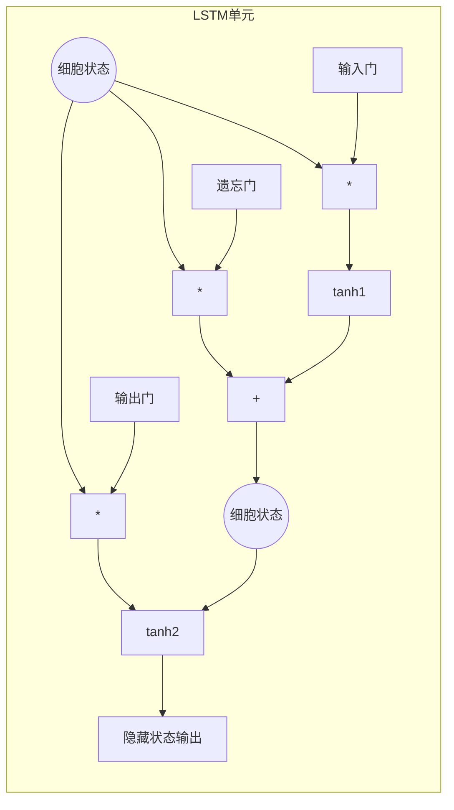

# 长短期记忆网络(LSTM)：捕捉长期依赖关系

## 1.背景介绍

### 1.1 序列数据处理的挑战

在自然语言处理、语音识别、时间序列预测等领域中,我们经常会遇到序列数据,即一系列按时间顺序排列的数据点。传统的机器学习算法如隐马尔可夫模型(HMM)在处理这类数据时存在一个重大缺陷,即无法很好地捕捉序列中长期的依赖关系。

例如,在自然语言处理任务中,一个句子的语义往往依赖于句子开头的内容,而HMM等传统模型由于存在"遗忘性",很难学习到这种长期依赖关系。因此,我们需要一种新的神经网络模型来有效地解决这个问题。

### 1.2 循环神经网络的局限性

循环神经网络(RNN)是最早被提出来解决序列数据问题的神经网络模型。它通过在隐藏层中引入循环连接,使得网络具有"记忆"能力,能够捕捉序列数据中的动态行为。

然而,在实践中发现,标准的RNN在学习长期依赖关系时存在梯度消失或梯度爆炸的问题,导致无法很好地捕捉长期依赖关系。这主要是由于反向传播算法中的梯度值在通过多层网络时会指数级衰减或爆炸。

### 1.3 长短期记忆网络的提出

为了解决RNN在捕捉长期依赖关系时的困难,1997年,Sepp Hochreiter和Jurgen Schmidhuber提出了长短期记忆网络(Long Short-Term Memory, LSTM)。LSTM通过精心设计的门控机制和记忆细胞状态,有效地解决了梯度消失和梯度爆炸问题,从而能够学习长期依赖关系。

LSTM迅速成为序列数据建模的主流方法,在语音识别、机器翻译、文本生成等领域取得了巨大成功。本文将重点介绍LSTM的核心概念、数学原理、实现细节以及在实际应用中的技巧和挑战。

## 2.核心概念与联系

### 2.1 LSTM网络结构概述

LSTM网络是一种特殊的RNN,它的核心思想是使用一种称为"细胞状态"(cell state)的传输通道,将信息有选择性地传递下去。细胞状态通过一些特殊的门结构来控制信息的流动,从而解决了RNN中的梯度消失和爆炸问题。

一个典型的LSTM单元如下图所示:

上图展示了LSTM单元的核心结构和信息流动过程。细胞状态$c_t$通过特殊的门结构控制着信息的流动,包括:

- 遗忘门($f_t$):控制从上一时刻细胞状态$c_{t-1}$中遗忘哪些信息。
- 输入门($i_t$):控制当前时刻输入$x_t$和上一隐藏状态$h_{t-1}$中的哪些信息被更新到细胞状态中。
- 输出门($o_t$):控制细胞状态$c_t$中的哪些信息被输出到当前隐藏状态$h_t$中,并传递到下一时刻。

通过这种特殊的门控机制,LSTM能够有效地捕捉长期依赖关系,避免了梯度消失和爆炸问题。

### 2.2 LSTM与RNN的关系

LSTM实际上是RNN的一种特殊变种。标准的RNN在计算隐藏状态时,只有一个非线性函数层:

$$h_t = \tanh(W_{hx}x_t + W_{hh}h_{t-1} + b_h)$$

而LSTM则在这个基础上引入了细胞状态和门控机制,使得信息的传递更加复杂和有选择性。

尽管LSTM的结构比标准RNN更加复杂,但它在捕捉长期依赖关系方面有着无与伦比的优势。这使得LSTM在处理序列数据时表现出色,成为深度学习领域的一个重要模型。

## 3.核心算法原理具体操作步骤

接下来,我们将详细介绍LSTM单元内部的门控机制和状态更新过程。为了便于理解,我们先给出LSTM的前向传播计算步骤,然后再解释每个门控单元的作用。

在时刻$t$,LSTM的前向传播计算步骤如下:

1) 计算遗忘门: 

$$f_t = \sigma(W_f \cdot [h_{t-1}, x_t] + b_f)$$

2) 计算输入门:

$$i_t = \sigma(W_i \cdot [h_{t-1}, x_t] + b_i)$$ 
$$\tilde{C}_t = \tanh(W_C \cdot [h_{t-1}, x_t] + b_C)$$

3) 更新细胞状态:

$$C_t = f_t * C_{t-1} + i_t * \tilde{C}_t$$

4) 计算输出门: 

$$o_t = \sigma(W_o \cdot [h_{t-1}, x_t] + b_o)$$

5) 计算隐藏状态输出:

$$h_t = o_t * \tanh(C_t)$$

其中,$\sigma$是sigmoid函数,用于将门的值限制在0到1之间。$W$和$b$分别是权重矩阵和偏置向量,是LSTM需要学习的参数。

下面我们逐一解释每个门控单元的作用:

### 3.1 遗忘门

遗忘门$f_t$决定了上一时刻的细胞状态$C_{t-1}$中有多少信息被保留下来,有多少被遗忘。它通过一个sigmoid层,根据当前输入$x_t$和上一隐藏状态$h_{t-1}$,为每个元素$C_{t-1}$计算一个0到1之间的值。

1表示完全保留,0表示完全遗忘。通过这种方式,LSTM可以有选择性地抛弃不再需要的信息,从而缓解长期依赖问题。

### 3.2 输入门

输入门$i_t$决定了当前输入$x_t$和上一隐藏状态$h_{t-1}$中的哪些信息被更新到细胞状态$C_t$中。它也是通过一个sigmoid层计算0到1之间的值,用于控制每个元素的更新程度。

与此同时,还有一个tanh层计算出一个与输入门$i_t$相应的候选细胞状态值$\tilde{C}_t$。最终,新的细胞状态$C_t$是上一时刻细胞状态$C_{t-1}$的遗忘部分与当前输入的更新部分的综合。

通过这种门控机制,LSTM可以学习到哪些新的信息是需要被记住的,从而避免了RNN中的梯度消失或爆炸问题。

### 3.3 输出门

输出门$o_t$决定了细胞状态$C_t$中的哪些信息被输出到隐藏状态$h_t$中,并传递到下一时刻。它也是通过一个sigmoid层计算0到1之间的值。

最终的隐藏状态输出$h_t$是细胞状态$C_t$通过tanh函数做非线性转换后,与输出门$o_t$相乘得到的。这样,LSTM就可以控制细胞状态中的哪些信息对当前任务是重要的,应该被传递到下游网络。

通过上述门控机制的协同作用,LSTM能够很好地捕捉序列数据中的长期依赖关系,避免了梯度消失和爆炸问题。下面我们来看看LSTM在数学上是如何实现这一点的。

## 4.数学模型和公式详细讲解举例说明

为了更好地理解LSTM的工作原理,我们来详细分析其数学模型和反向传播过程。

### 4.1 LSTM前向传播

我们已经在前面介绍了LSTM前向传播的计算步骤,现在让我们用数学形式来表示。

给定一个长度为$T$的输入序列$\{x_1, x_2, ..., x_T\}$,LSTM在时刻$t$的前向传播计算如下:

1) 遗忘门:

$$f_t = \sigma(W_f \cdot [h_{t-1}, x_t] + b_f)$$

2) 输入门和候选细胞状态:

$$i_t = \sigma(W_i \cdot [h_{t-1}, x_t] + b_i)$$
$$\tilde{C}_t = \tanh(W_C \cdot [h_{t-1}, x_t] + b_C)$$

3) 细胞状态更新:

$$C_t = f_t * C_{t-1} + i_t * \tilde{C}_t$$

4) 输出门:

$$o_t = \sigma(W_o \cdot [h_{t-1}, x_t] + b_o)$$ 

5) 隐藏状态输出:

$$h_t = o_t * \tanh(C_t)$$

其中,$W$和$b$分别是权重矩阵和偏置向量,是LSTM需要学习的参数。

通过上述计算,LSTM在每个时刻$t$都会输出一个隐藏状态$h_t$,它综合了当前输入$x_t$、上一时刻隐藏状态$h_{t-1}$以及长期记忆的细胞状态$C_t$的信息。

### 4.2 LSTM反向传播

为了训练LSTM模型,我们需要计算损失函数关于模型参数的梯度,并使用随机梯度下降等优化算法来更新参数。这就需要对LSTM进行反向传播。

LSTM的反向传播过程相对标准RNN更加复杂,因为它需要计算每个门控单元和细胞状态的梯度。不过,由于LSTM的特殊设计,这一过程可以很好地解决梯度消失和爆炸问题。

我们以计算$\frac{\partial L}{\partial W_f}$为例,其中$L$是损失函数。根据链式法则,我们有:

$$\frac{\partial L}{\partial W_f} = \sum_t \frac{\partial L}{\partial f_t} \frac{\partial f_t}{\partial W_f}$$

其中,$\frac{\partial f_t}{\partial W_f}$可以直接计算得到,而$\frac{\partial L}{\partial f_t}$需要通过反向传播得到。具体地:

$$\frac{\partial L}{\partial f_t} = \frac{\partial L}{\partial h_t} \frac{\partial h_t}{\partial C_t} \frac{\partial C_t}{\partial f_t}$$

$$\frac{\partial C_t}{\partial f_t} = C_{t-1}$$

$$\frac{\partial h_t}{\partial C_t} = o_t(1 - \tanh^2(C_t))$$

$$\frac{\partial L}{\partial h_t}$$可以从后续网络层反向传播得到。

通过类似的方式,我们可以计算出损失函数关于LSTM其他参数的梯度,并使用优化算法如Adam等进行训练。

值得注意的是,由于LSTM的门控设计,在反向传播时梯度不会出现指数级衰减或爆炸,从而有效解决了长期依赖问题。这正是LSTM能够捕捉长期依赖关系的关键所在。

### 4.3 数学模型举例说明

为了更好地理解LSTM的工作原理,我们来看一个简单的例子。

假设我们有一个长度为3的输入序列$\{x_1, x_2, x_3\}$,其中$x_1 = [1, 0]$,$x_2 = [0, 1]$,$x_3 = [1, 1]$。我们的目标是根据这个序列预测一个标量输出$y$。

我们使用一个单层LSTM,其中隐藏状态和细胞状态的维度都为2。为了简化计算,我们假设所有的偏置项$b$都为0,权重矩阵$W$初始化为:

$$W_f = \begin{bmatrix} 0.1 & 0.2 \\ 0.3 & 0.4 \end{bmatrix}, W_i = \begin{bmatrix} 0.5 & 0.6 \\ 0.