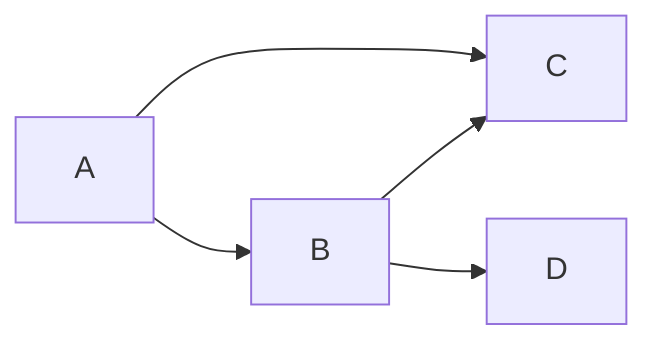

# 顶点镜像:Pregel中的数据存储方式

## 1. 背景介绍

### 1.1 大数据时代的到来

在当今时代,数据正以前所未有的规模和速度被产生和收集。来自社交媒体、物联网设备、电子商务平台等各种来源的海量数据不断涌现。这些数据蕴含着巨大的价值,但同时也带来了巨大的挑战,尤其是在存储和处理方面。传统的数据处理方式已经无法满足当前的需求。

### 1.2 图计算的重要性

在这种背景下,图计算(Graph Computing)作为一种新兴的数据处理范式备受关注。许多现实世界中的问题本质上都可以表示为图结构,例如社交网络、交通网络、知识图谱等。图计算可以高效地处理这些复杂的关系数据,为解决诸如推荐系统、路径规划、知识推理等问题提供了强大的工具。

### 1.3 Pregel简介

Pregel是谷歌于2010年提出的一种大规模图并行计算框架。它将图计算问题抽象为"顶点镜像"(Vertex-Centric)的计算模型,使得开发人员可以专注于设计顶点程序(Vertex Program),而不必关注底层的分布式执行细节。Pregel的出现极大地简化了大规模图计算的编程难度,推动了图计算在工业界的广泛应用。

## 2. 核心概念与联系

### 2.1 图的表示

在Pregel中,图被表示为一组顶点(Vertex)和边(Edge)的集合。每个顶点都有一个唯一的ID,并且可以关联任意类型的值(如整数、字符串等)。边则描述了顶点之间的关系,通常也会携带一些属性信息。

### 2.2 超步(Superstep)概念

Pregel采用了"超步"(Superstep)的概念来协调整个计算过程。每个超步都由以下三个阶段组成:

1. **顶点计算阶段**:每个顶点并行执行用户定义的顶点程序,可以读取自身的值和邻居的值,进行计算并更新自身的值。
2. **消息传递阶段**:顶点可以向邻居发送消息,这些消息将在下一个超步中被接收。
3. **顶点镜像更新阶段**:将本次超步计算出的新值应用到顶点镜像中,为下一个超步做准备。

### 2.3 顶点程序(Vertex Program)

顶点程序是用户需要实现的核心逻辑,它定义了每个顶点在每个超步中应该执行的操作。通常,顶点程序会读取当前顶点的值和邻居发送的消息,进行计算并更新顶点值,同时可以向邻居发送新的消息。

### 2.4 顶点镜像(Vertex Mirror)

顶点镜像是Pregel中一个关键概念,它表示了顶点及其相关数据在计算过程中的一个快照。每个顶点都有一个对应的顶点镜像,存储着顶点的值、边缘信息、发送和接收的消息等数据。在每个超步结束时,顶点镜像会被更新,以反映当前计算状态。

## 3. 核心算法原理具体操作步骤  

Pregel的核心算法原理可以概括为以下几个步骤:

1. **图分区**:将整个图数据划分为多个分区(Partition),每个分区包含一部分顶点和边。
2. **Worker分配**:将每个分区分配给一个Worker进程进行处理。
3. **初始化**:为每个顶点创建一个初始的顶点镜像,并将其分配给相应的Worker。
4. **超步迭代**:进入超步迭代循环,每个超步包括以下步骤:
   a. **顶点计算**:每个Worker并行执行分配给它的顶点镜像上的顶点程序。
   b. **消息传递**:Worker之间交换消息,将发送的消息传递给目标顶点所在的Worker。
   c. **顶点镜像更新**:根据计算结果和接收的消息,更新每个顶点镜像的状态。
   d. **终止检查**:检查是否满足终止条件(例如所有顶点的值都不再改变),如果满足则终止迭代,否则进入下一个超步。
5. **结果收集**:从Worker中收集最终的顶点镜像数据,组装成最终的计算结果。

这种设计使得Pregel能够高效地在分布式环境下执行大规模图计算任务,同时屏蔽了底层的并行和容错细节,大大简化了图算法的开发和部署。

## 4. 数学模型和公式详细讲解举例说明

在Pregel中,图计算问题通常可以用一组数学模型和公式来表示和求解。下面我们将介绍一些常见的数学模型和公式,并给出具体的例子说明。

### 4.1 图的表示

一个无向图 $G$ 可以表示为一个顶点集合 $V$ 和一个边集合 $E$,即 $G = (V, E)$。其中,顶点集合 $V = \{v_1, v_2, \dots, v_n\}$,边集合 $E = \{(v_i, v_j) | v_i, v_j \in V\}$。

例如,下图是一个简单的无向图:



该图可以表示为:
$$
V = \{A, B, C, D\}\\
E = \{(A, B), (A, C), (B, C), (B, D)\}
$$

### 4.2 邻接矩阵

邻接矩阵是表示图的一种常用方式。对于一个有 $n$ 个顶点的图 $G$,它的邻接矩阵 $A$ 是一个 $n \times n$ 的矩阵,其中 $A_{ij}$ 表示顶点 $v_i$ 和 $v_j$ 之间是否有边相连。

对于无向图,如果 $(v_i, v_j) \in E$,则 $A_{ij} = A_{ji} = 1$,否则为 0。
对于有向图,如果有一条从 $v_i$ 指向 $v_j$ 的边,则 $A_{ij} = 1$,否则为 0。

例如,上面示例图的邻接矩阵为:

$$
A = \begin{bmatrix}
0 & 1 & 1 & 0\\
1 & 0 & 1 & 1\\
1 & 1 & 0 & 0\\
0 & 1 & 0 & 0
\end{bmatrix}
$$

### 4.3 PageRank算法

PageRank是一种著名的链接分析算法,它被广泛应用于网页排名、社交网络影响力分析等领域。在Pregel中,PageRank算法可以用以下公式表示:

$$
PR(v_i) = \frac{1-d}{N} + d \sum_{v_j \in In(v_i)} \frac{PR(v_j)}{Out(v_j)}
$$

其中:
- $PR(v_i)$ 表示顶点 $v_i$ 的PageRank值
- $N$ 是图中顶点的总数
- $d$ 是一个阻尼系数,通常取值 0.85
- $In(v_i)$ 表示指向顶点 $v_i$ 的所有顶点集合
- $Out(v_j)$ 表示从顶点 $v_j$ 出发的边的数量

在Pregel中,PageRank算法可以通过以下步骤实现:

1. 初始化:为每个顶点赋予一个初始的PageRank值,通常为 $\frac{1}{N}$。
2. 超步迭代:
   a. 每个顶点根据公式计算新的PageRank值。
   b. 将新的PageRank值发送给所有出边的目标顶点。
   c. 更新顶点镜像,将新计算的PageRank值应用到顶点镜像中。
3. 终止条件:当所有顶点的PageRank值收敛或达到最大迭代次数时,算法终止。

通过这种"顶点镜像"的计算模型,PageRank算法可以在分布式环境下高效执行,处理大规模图数据。

## 5. 项目实践:代码实例和详细解释说明

为了更好地理解Pregel的工作原理,我们将通过一个简单的示例项目来演示如何使用Pregel进行图计算。在这个示例中,我们将实现一个基本的PageRank算法。

### 5.1 环境准备

我们将使用Apache Giraph作为Pregel的实现,它是一个开源的大规模图处理系统,可以在Hadoop集群上运行。首先,我们需要安装并配置好Hadoop和Giraph的运行环境。

### 5.2 数据准备

我们将使用一个简单的示例图数据,包含5个顶点和6条边。图数据将以Giraph支持的简单文本格式存储,每行表示一条边,格式为 `<源顶点ID> <目标顶点ID> <边值>`。

```
1 2 1.0
1 3 1.0
2 3 1.0
2 4 1.0
3 4 1.0
4 5 1.0
```

### 5.3 实现PageRank算法

我们将实现一个`PageRankVertexComputation`类,继承自Giraph的`BasicComputation`类,并重写`compute()`方法。这个方法将在每个超步中被执行,用于实现PageRank算法的逻辑。

```java
public class PageRankVertexComputation extends BasicComputation<LongWritable, DoubleWritable, DoubleWritable, MessageWriter<LongWritable, DoubleWritable>> {
    private static final double DAMPING_FACTOR = 0.85;
    private static final double MASS = 1.0;

    @Override
    public void compute(Vertex<LongWritable, DoubleWritable, DoubleWritable> vertex, Iterable<DoubleWritable> messages) throws IOException {
        double sum = 0;
        for (DoubleWritable message : messages) {
            sum += message.get();
        }

        long numOutEdges = vertex.getNumEdges();
        double newValue = (1 - DAMPING_FACTOR) / getTotalNumVertices() + DAMPING_FACTOR * sum / numOutEdges;

        vertex.setValue(new DoubleWritable(newValue));

        if (getSuperstep() < getMaxIterations()) {
            double messageToBeSent = newValue / numOutEdges;
            for (Edge<LongWritable, DoubleWritable> edge : vertex.getEdges()) {
                sendMessage(edge.getTargetVertexId(), new DoubleWritable(messageToBeSent));
            }
        }
        vertex.voteToHalt();
    }
}
```

在这个实现中,我们首先计算顶点接收到的所有消息的总和。然后,根据PageRank公式计算新的PageRank值。接下来,我们将新计算的PageRank值除以出边数量,并将结果作为消息发送给所有邻居顶点。最后,我们更新顶点镜像中的PageRank值,并投票终止当前超步。

### 5.4 运行PageRank作业

我们将创建一个`PageRankDriver`类,用于配置和启动PageRank作业。

```java
public class PageRankDriver {
    public static void main(String[] args) throws Exception {
        if (args.length != 3) {
            System.err.println("Usage: PageRankDriver <input path> <output path> <num iterations>");
            System.exit(-1);
        }

        String inputPath = args[0];
        String outputPath = args[1];
        int numIterations = Integer.parseInt(args[2]);

        Configuration conf = new Configuration();
        conf.setVertexInputFormatClass(SimpleTextVertexInputFormat.class);

        GiraphJob job = new GiraphJob(conf, "PageRank");
        job.getConfiguration().setComputationClass(PageRankVertexComputation.class);
        job.getConfiguration().setVertexOutputFormatClass(SimpleTextVertexOutputFormat.class);
        job.getConfiguration().setWorkerConfiguration(numIterations, numIterations, 100.0f);

        FileInputFormat.addInputPath(job.getInternalJob(), new Path(inputPath));
        FileOutputFormat.setOutputPath(job.getInternalJob(), new Path(outputPath));

        job.run(true);
    }
}
```

在这个驱动程序中,我们首先解析命令行参数,获取输入路径、输出路径和最大迭代次数。然后,我们配置Giraph作业,设置计算类、输入/输出格式等参数。最后,我们提交作业并等待执行完成。

### 5.5 运行示例

现在,我们可以在Hadoop集群上运行这个PageRank示例了。假设我们的输入数据存储在HDFS上的`/user/input/graph.txt`路径,我们希望将结果输出到`/user/output/pagerank`路径,最大迭代次数为10。我们可以使用以下命令启动作业:

```
hadoop jar giraph-examples.