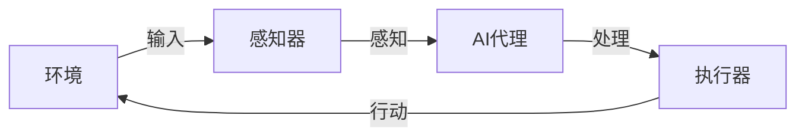

## 1.背景介绍

在过去的十年里，我们看到了人工智能(AI)的快速发展和广泛应用。尤其是在自然语言处理、图像识别、推荐系统等领域，AI已经取得了显著的成果。然而，这些成果的取得，离不开AI代理的工作流。AI代理工作流是AI系统的核心部分，它决定了AI系统如何接收输入，处理信息，然后生成输出。因此，对AI代理工作流的理解和研究，对我们理解和利用AI技术具有重要的意义。

## 2.核心概念与联系

AI代理工作流主要包括以下几个核心概念：

- **AI代理**：AI代理是一个可以感知环境并采取行动以达成目标的实体。它可以是一个简单的程序，也可以是一个复杂的机器人。
- **环境**：环境是AI代理所处的上下文，包括所有AI代理可以感知和影响的事物。
- **感知器**：感知器是AI代理用来获取环境信息的部件。例如，摄像头、麦克风等。
- **执行器**：执行器是AI代理用来在环境中采取行动的部件。例如，电机、扬声器等。
- **工作流**：工作流是AI代理从感知环境到采取行动的过程。它包括感知、处理和行动三个阶段。

这些概念之间的关系可以用下面的Mermaid流程图表示：



## 3.核心算法原理具体操作步骤

AI代理工作流的核心算法原理主要包括以下几个步骤：

1. **感知**：AI代理使用感知器从环境中获取信息。这些信息可以是图像、声音、文本等。
2. **处理**：AI代理根据获取的信息，使用AI算法进行处理。这些算法可以是深度学习、强化学习、决策树等。
3. **行动**：AI代理根据处理的结果，使用执行器在环境中采取行动。这些行动可以是移动、说话、写作等。

## 4.数学模型和公式详细讲解举例说明

在AI代理工作流中，处理阶段是最核心的部分，它主要依赖于AI算法。下面我们以深度学习为例，介绍其数学模型和公式。

深度学习是一种基于神经网络的机器学习方法。其基本单元是神经元，神经元的输出由下面的公式给出：

$$
y = f(\sum_{i=1}^{n} w_i x_i + b)
$$

其中，$x_i$是输入，$w_i$是权重，$b$是偏置，$f$是激活函数，$y$是输出。

深度学习的目标是通过训练数据调整权重和偏置，使得神经网络的输出尽可能接近真实值。这个过程可以通过梯度下降算法实现，其更新规则由下面的公式给出：

$$
w_i = w_i - \alpha \frac{\partial L}{\partial w_i}
$$

其中，$L$是损失函数，$\alpha$是学习率。

## 5.项目实践：代码实例和详细解释说明

下面我们以Python和TensorFlow为例，展示一个简单的深度学习项目。

```python
import tensorflow as tf
from tensorflow.keras import layers

# 创建模型
model = tf.keras.Sequential()
model.add(layers.Dense(64, activation='relu'))
model.add(layers.Dense(64, activation='relu'))
model.add(layers.Dense(10, activation='softmax'))

# 编译模型
model.compile(optimizer=tf.keras.optimizers.Adam(0.01),
              loss=tf.keras.losses.CategoricalCrossentropy(),
              metrics=[tf.keras.metrics.CategoricalAccuracy()])

# 训练模型
model.fit(data, labels, epochs=10, batch_size=32)
```

这段代码首先创建了一个深度神经网络模型，然后编译了模型，最后训练了模型。训练的过程就是上面提到的梯度下降算法。

## 6.实际应用场景

AI代理工作流在许多领域都有广泛的应用。例如：

- 在自然语言处理中，AI代理可以感知文本信息，处理文本信息，然后生成新的文本。例如，聊天机器人、自动写作等。
- 在图像识别中，AI代理可以感知图像信息，处理图像信息，然后识别图像中的对象。例如，人脸识别、物体识别等。
- 在推荐系统中，AI代理可以感知用户行为，处理用户行为，然后推荐相关的商品。例如，电商推荐、新闻推荐等。

## 7.工具和资源推荐

在AI代理工作流的实现中，有许多优秀的工具和资源，例如：

- **TensorFlow**：一个强大的深度学习框架，提供了丰富的API和工具，支持多种硬件平台。
- **PyTorch**：一个易于使用的深度学习框架，提供了直观的API和工具，支持动态图。
- **OpenAI Gym**：一个用于开发和比较强化学习算法的工具包，提供了许多预定义的环境。

## 8.总结：未来发展趋势与挑战

随着AI技术的发展，AI代理工作流将会更加复杂和智能。例如，AI代理将能够处理更多类型的信息，采取更复杂的行动，更好地适应环境。

然而，这也带来了许多挑战。例如，如何设计更有效的AI算法？如何处理更大规模的数据？如何保证AI代理的安全性和可控性？

这些问题需要我们在未来的研究中去解决。

## 9.附录：常见问题与解答

1. **Q: AI代理工作流是什么？**
   A: AI代理工作流是AI系统的核心部分，它决定了AI系统如何接收输入，处理信息，然后生成输出。

2. **Q: AI代理工作流的主要步骤是什么？**
   A: AI代理工作流的主要步骤是感知、处理和行动。

3. **Q: AI代理工作流有哪些应用？**
   A: AI代理工作流在自然语言处理、图像识别、推荐系统等领域都有广泛的应用。

4. **Q: AI代理工作流的未来发展趋势是什么？**
   A: AI代理工作流将会更加复杂和智能，但也面临许多挑战。