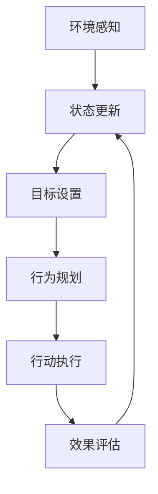
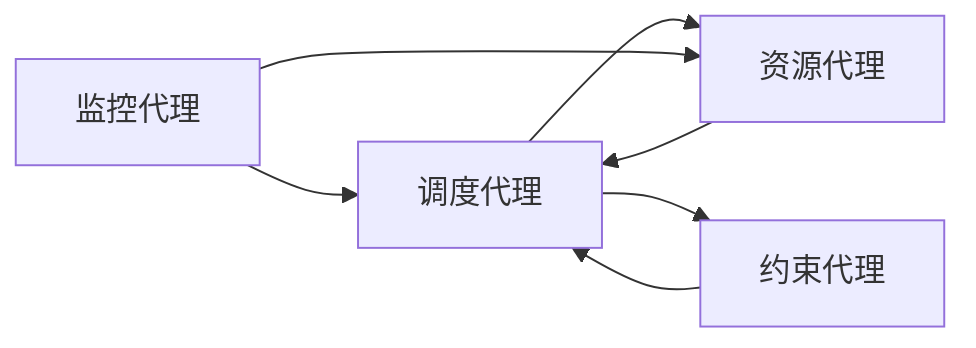

# AI人工智能代理工作流AI Agent WorkFlow：智能代理在航空领域系统中的应用

## 1.背景介绍

### 1.1 航空领域系统的复杂性

航空领域系统是一个高度复杂的领域,涉及多个子系统和组件的紧密协作。这些系统包括机场运营、空中交通管理、飞行计划、机队管理、维修和供应链等。每个子系统都有自己的任务和目标,但它们又相互依赖,需要协调一致地工作。

### 1.2 人工智能在航空领域的应用需求

传统的航空系统主要依赖人工操作和决策,但随着航空运输量的不断增长和运营复杂度的提高,人工处理能力已经无法满足日益增长的需求。因此,航空公司和相关机构开始寻求人工智能(AI)技术的支持,以提高效率、降低成本、提高安全性和可靠性。

### 1.3 智能代理在航空领域的作用

智能代理是一种基于人工智能技术的软件实体,能够自主地感知环境、规划行动并执行任务。在航空领域,智能代理可以用于各种应用场景,如:

- 机场运营优化
- 空中交通管理
- 航班调度和资源规划
- 预测性维修
- 乘客服务优化
- 安全和风险管理

通过部署智能代理,航空公司和相关机构可以实现自动化决策、实时响应和智能协作,从而提高整体运营效率和服务质量。

## 2.核心概念与联系

### 2.1 智能代理的定义

智能代理是一种具有自主性、反应性、主动性和社会能力的软件实体。它能够感知环境,根据预定义的目标和知识库进行reasoning(推理)和planning(规划),并采取相应的行动。

### 2.2 多智能体系统(Multi-Agent System)

在复杂的航空系统中,通常需要多个智能代理协同工作,形成一个多智能体系统(Multi-Agent System, MAS)。MAS允许代理之间进行通信、协调和协作,以解决复杂的问题。

### 2.3 代理工作流(Agent Workflow)

代理工作流定义了智能代理在特定场景下的行为模式和决策过程。它规定了代理如何感知环境、处理信息、做出决策和执行行动。代理工作流通常采用有限状态机或其他形式的流程模型来表示。

### 2.4 核心技术

智能代理技术涉及多个人工智能领域,包括:

- 机器学习
- 规划与决策
- 多智能体协作
- 自然语言处理
- 计算机视觉
- 知识表示与推理

## 3.核心算法原理具体操作步骤  

智能代理的工作流程通常包括以下几个关键步骤:



### 3.1 环境感知

智能代理需要通过各种传感器(如摄像头、雷达、传感器网络等)来感知环境的当前状态。这些原始数据需要进行预处理和特征提取,以获得对代理有意义的信息。

### 3.2 状态更新

基于感知到的环境信息,代理需要更新其内部状态模型,反映当前的环境状态。这可能涉及概率推理、数据融合和状态估计等技术。

### 3.3 目标设置

根据代理的任务和优先级,需要设置具体的目标。目标可以是单一的,也可以是多个目标的组合,甚至是动态变化的。

### 3.4 行为规划

给定当前状态和目标,代理需要生成一系列行动计划来实现目标。这通常涉及搜索、优化和决策理论等技术。规划过程需要考虑各种约束条件和不确定性因素。

### 3.5 行动执行  

代理根据规划好的行动计划,通过执行器(如机器人手臂、无人机等)在环境中执行相应的行动。

### 3.6 效果评估

代理需要监测行动的执行效果,评估是否达到预期目标。如果没有达到目标,则需要重新规划或调整目标。

该循环过程持续进行,直到完成任务或遇到不可恢复的错误。

## 4.数学模型和公式详细讲解举例说明

在智能代理系统中,通常需要使用各种数学模型和算法来描述和解决问题。以下是一些常用的模型和公式:

### 4.1 马尔可夫决策过程(Markov Decision Process, MDP)

MDP是一种用于建模序列决策问题的数学框架。它由一个五元组 $(S, A, P, R, \gamma)$ 组成,其中:

- $S$ 是状态集合
- $A$ 是行动集合  
- $P(s'|s,a)$ 是状态转移概率,表示在状态 $s$ 下执行行动 $a$ 后,转移到状态 $s'$ 的概率
- $R(s,a)$ 是回报函数,表示在状态 $s$ 执行行动 $a$ 后获得的即时回报
- $\gamma \in [0,1)$ 是折现因子,用于权衡即时回报和长期回报

目标是找到一个策略 $\pi: S \rightarrow A$,使得期望的累积折现回报最大化:

$$
\max_\pi \mathbb{E}\left[ \sum_{t=0}^\infty \gamma^t R(s_t, a_t) \right]
$$

其中 $s_t$ 和 $a_t$ 分别表示时间步 $t$ 的状态和行动。

MDP可以通过各种算法求解,如值迭代(Value Iteration)、策略迭代(Policy Iteration)和强化学习算法(如 Q-Learning)等。

### 4.2 多智能体马尔可夫游戏(Multi-Agent Markov Game)

在多智能体环境中,每个代理的决策不仅取决于环境状态,还取决于其他代理的行为。这种情况可以用多智能体马尔可夫游戏(Multi-Agent Markov Game, MAMG)来建模。

MAMG由一个元组 $(n, S, A_1, \ldots, A_n, P, R_1, \ldots, R_n, \gamma)$ 表示,其中:

- $n$ 是代理个数
- $S$ 是状态集合
- $A_i$ 是第 $i$ 个代理的行动集合
- $P(s'|s,a_1,\ldots,a_n)$ 是状态转移概率
- $R_i(s,a_1,\ldots,a_n)$ 是第 $i$ 个代理的回报函数
- $\gamma$ 是折现因子

每个代理都试图最大化自己的期望累积折现回报:

$$
\max_{\pi_i} \mathbb{E}\left[ \sum_{t=0}^\infty \gamma^t R_i(s_t, a_{1,t}, \ldots, a_{n,t}) \right]
$$

其中 $\pi_i$ 是第 $i$ 个代理的策略。

MAMG问题通常更加复杂,因为代理之间存在竞争或合作的关系,需要考虑其他代理的策略。解决方法包括非合作游戏理论、协作多智能体学习等。

### 4.3 部分可观测马尔可夫决策过程(Partially Observable Markov Decision Process, POMDP)

在现实环境中,代理通常无法完全观测到环境的真实状态,只能获得部分观测。这种情况可以用 POMDP 来建模。

POMDP 由一个六元组 $(S, A, P, R, \Omega, O)$ 表示,其中:

- $S$ 是状态集合
- $A$ 是行动集合
- $P(s'|s,a)$ 是状态转移概率
- $R(s,a)$ 是回报函数
- $\Omega$ 是观测集合
- $O(o|s',a)$ 是观测概率,表示在执行行动 $a$ 并转移到状态 $s'$ 时,获得观测 $o$ 的概率

代理的目标是基于历史观测序列 $o_1, o_2, \ldots, o_t$ 来选择最优行动,使期望累积折现回报最大化。

POMDP 问题通常更加困难,因为代理无法直接访问真实状态。常用的求解算法包括点基值迭代(Point-Based Value Iteration)、蒙特卡罗树搜索(Monte Carlo Tree Search)等。

### 4.4 约束马尔可夫决策过程(Constrained Markov Decision Process, CMDP)

在某些应用场景中,我们不仅需要最大化期望累积回报,还需要满足一些约束条件。这种情况可以用 CMDP 来建模。

CMDP 在 MDP 的基础上增加了一个或多个约束:

$$
\begin{align*}
\max_\pi &\mathbb{E}\left[ \sum_{t=0}^\infty \gamma^t R(s_t, a_t) \right] \\
\text{s.t. } &\mathbb{E}\left[ \sum_{t=0}^\infty \gamma^t C_i(s_t, a_t) \right] \leq d_i, \quad i = 1, \ldots, m
\end{align*}
$$

其中 $C_i(s,a)$ 是第 $i$ 个约束的成本函数,而 $d_i$ 是相应的约束上限。

CMDP 问题可以通过拉格朗日乘子法、线性规划等方法求解。

以上是一些常用的数学模型和公式,在实际应用中还可能需要结合其他技术,如机器学习、规划算法等。

## 5. 项目实践:代码实例和详细解释说明

为了更好地理解智能代理在航空领域的应用,我们将通过一个具体的项目实例来演示。该项目的目标是开发一个智能代理系统,用于优化机场的登机门分配。

### 5.1 问题描述

在机场运营中,登机门的合理分配对于提高运营效率至关重要。传统的分配方式通常由人工决策,容易出现错误和低效率。我们希望开发一个智能代理系统,能够自动分配登机门,从而优化航班流程。

该问题可以建模为一个约束优化问题:

- 目标函数:最小化航班延误时间、最大化登机门利用率等
- 决策变量:每个航班分配到哪个登机门
- 约束条件:登机门数量有限、不同航班之间的时间间隔要求、航班类型与登机门类型的匹配等

### 5.2 系统架构

我们采用多智能体系统(MAS)的架构,其中包括以下几种智能代理:

1. **调度代理(Scheduling Agent)**: 负责航班登机门的分配决策
2. **资源代理(Resource Agent)**: 管理登机门等资源的状态和可用性
3. **约束代理(Constraint Agent)**: 维护和检查各种约束条件
4. **监控代理(Monitoring Agent)**: 监控实际航班进度,并将反馈提供给其他代理

这些代理通过消息传递进行协作,形成一个分布式的优化系统。



### 5.3 算法设计

调度代理使用约束优化算法来解决登机门分配问题。我们采用 Python 语言和 Google OR-Tools 库进行开发。

以下是核心算法的伪代码:

```python
def solve_gate_assignment(flights, gates, constraints):
    # 创建模型
    model = cp_model.CpModel()
    
    # 决策变量: 每个航班分配到哪个登机门
    assignments = {}
    for f in flights:
        for g in gates:
            assignments[f, g] = model.NewBoolVar(f'assign_{f}_{g}')
    
    # 目标函数: 最小化延误时间
    obj_expr = sum(delays[f, g] * assignments[f, g] for f in flights for g in gates)
    model.Minimize(obj_expr)
    
    # 约束条件
    # 1. 每个航班只能分配到一个登机门
    for f in flights:
        model.AddExactlyOne(assignments[f, g] for g in gates)
    
    # 2. 每个登机门在同一时间只能服务一个航班
    for g in gates:
        intervals = []
        for f in flights:
            intervals.append(model.NewIntervalVar(...))
            model.AddNoOverlap(intervals)
    
    # 3. 其他约束条件...