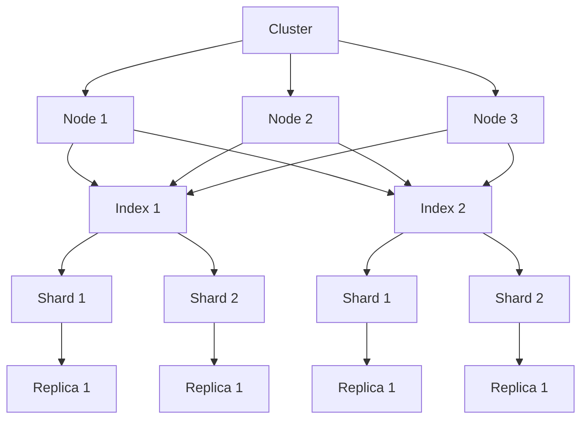

# ElasticSearch监控：洞察集群运行状态

## 1.背景介绍

作为一种分布式、RESTful 风格的搜索和分析引擎，Elasticsearch 已经成为当今大数据时代不可或缺的核心组件之一。它提供了近乎实时的搜索、高度可扩展的数据探索能力以及强大的数据分析功能。然而，随着数据量的不断增长和业务需求的日益复杂化,有效监控 Elasticsearch 集群的运行状态变得至关重要。通过合理的监控策略,我们不仅可以及时发现并解决潜在的问题,还能优化集群资源利用率,确保系统的高效运行。

### 1.1 监控的重要性

良好的监控机制对于维护 Elasticsearch 集群的稳定性和性能至关重要。以下是一些监控带来的主要好处:

- **问题发现和故障排查**:及时发现集群中的异常情况,如节点宕机、磁盘空间不足、集群红色状态等,有助于快速定位和解决问题。
- **性能优化**:监视关键指标如查询延迟、堆内存使用情况等,有助于发现性能瓶颈并进行相应优化。
- **容量规划**:通过监控数据增长趋势、资源利用率等,可以合理规划集群扩容需求。
- **安全合规**:监控审计日志、访问模式等,有助于发现潜在的安全风险并保证合规性。

### 1.2 监控的挑战

尽管监控对于维护 Elasticsearch 集群运行状态至关重要,但也面临着一些挑战:

- **大量指标**:Elasticsearch 暴露了大量的监控指标,涵盖了集群健康状况、索引统计、JVM 指标等多个方面,如何高效地收集和分析这些指标是一个挑战。
- **分布式架构**:由于 Elasticsearch 采用分布式架构,需要对多个节点进行监控,并能够整合各节点的监控数据,形成全局视图。
- **动态特性**:Elasticsearch 集群具有动态特性,节点可能会加入或离开,索引可能会创建、更新或删除。监控系统需要能够适应这种动态变化。
- **监控开销**:过度的监控操作可能会给 Elasticsearch 集群带来额外的负载,因此需要平衡监控的粒度和开销。

## 2.核心概念与联系

在深入探讨 Elasticsearch 监控之前,我们需要先了解一些核心概念及它们之间的关系。

### 2.1 Elasticsearch 集群架构

Elasticsearch 采用分布式架构,由一个或多个节点(node)组成。每个节点都是一个独立的 Elasticsearch 实例,可以处理数据相关的服务。节点之间通过形成集群(cluster)的方式互相协作,共享分布在各节点上的数据。

集群中的节点可以分为以下几种角色:

- **主节点(Master Node)**: 负责集群范围内的管理操作,如创建或删除索引、跟踪集群中的节点等。集群中可以有多个主节点供故障转移使用。
- **数据节点(Data Node)**: 负责存储分片数据,在数据相关的操作时起主导作用。
- **协调节点(Coordinating Node)**: 负责处理客户端请求,并根据请求的性质将其转发给相应的节点。
- **机器学习节点(Machine Learning Node)**: 负责运行机器学习任务。

在生产环境中,通常会将这些角色分布在不同的节点上,以提高系统的可用性和伸缩性。

### 2.2 Elasticsearch 核心组件

Elasticsearch 的核心由以下几个主要组件组成:

- **集群(Cluster)**:一个或多个节点的集合,共同承担数据存储和相关服务。
- **节点(Node)**: 单个 Elasticsearch 实例,作为集群的一部分。
- **索引(Index)**: 用于存储关联数据的地方,相当于关系数据库中的"数据库"。
- **分片(Shard)**: 索引被水平分隔成多个分片,分布在不同节点上,以支持数据的水平扩展。
- **副本(Replica)**: 每个分片都可以有一个或多个副本,用于提高数据的可用性和容错性。

这些组件之间的关系如下图所示:



理解这些核心概念及其关系对于有效监控 Elasticsearch 集群至关重要。

## 3.核心算法原理具体操作步骤

Elasticsearch 提供了多种方式来监控集群的运行状态,包括通过 Elasticsearch 自身的 API、第三方工具以及外部监控系统等。本节将介绍其中的核心算法原理和具体操作步骤。

### 3.1 通过 Elasticsearch API 进行监控

Elasticsearch 提供了一系列内置的 API,用于获取集群、节点、索引等各个层面的监控指标。这些 API 可以通过 HTTP 请求直接访问,也可以通过客户端库进行调用。

#### 3.1.1 集群健康状态监控

通过 `_cluster/health` API 可以获取集群的整体健康状态,包括集群状态(green、yellow 或 red)、节点数量、数据分片和副本分片数量等信息。

```bash
GET /_cluster/health
```

响应示例:

```json
{
  "cluster_name": "my-cluster",
  "status": "green", 
  "timed_out": false,
  "number_of_nodes": 3,
  "number_of_data_nodes": 3,
  "active_primary_shards": 10,
  "active_shards": 20,
  "relocating_shards": 0,
  "initializing_shards": 0,
  "unassigned_shards": 0,
  "delayed_unassigned_shards": 0,
  "number_of_pending_tasks": 0,
  "number_of_in_flight_fetch": 0,
  "task_max_waiting_in_queue_millis": 0,
  "active_shards_percent_as_number": 100.0
}
```

#### 3.1.2 节点统计信息监控

通过 `_nodes/stats` API 可以获取集群中各个节点的详细统计信息,包括 JVM 指标、文件系统指标、线程池指标、索引指标等。

```bash
GET /_nodes/stats
```

#### 3.1.3 索引统计信息监控

通过 `_cat/indices` API 可以获取集群中所有索引的概览信息,包括索引大小、文档数量、分片和副本情况等。

```bash
GET /_cat/indices?v
```

#### 3.1.4 慢查询监控

通过 `_nodes/stats/indices` API 可以获取集群中各个索引的慢查询信息,包括查询耗时、查询源等。

```bash 
GET /_nodes/stats/indices
```

这些 API 可以根据需要进行组合使用,以获取全面的监控数据。同时,Elasticsearch 还提供了一些聚合 API,如 `_cluster/stats`、`_cluster/pending_tasks` 等,用于获取集群级别的统计信息。

### 3.2 通过第三方工具进行监控

除了使用 Elasticsearch 自身的 API 之外,还有许多第三方工具可以用于监控 Elasticsearch 集群。这些工具通常提供了更加友好的可视化界面,并集成了更多的监控功能。

#### 3.2.1 Elasticsearch Head 插件

Elasticsearch Head 是一个流行的 Elasticsearch 前端可视化工具,它提供了监控集群状态、查看索引映射、执行查询等功能。

安装方式:

1. 从 GitHub 下载最新版本的 Head 插件: `git clone git://github.com/mobz/elasticsearch-head.git`
2. 进入插件目录,启动 Head 插件: `npm run start`
3. 在浏览器中访问 `http://localhost:9100/`

Head 插件提供了一个直观的 Web 界面,可以方便地查看集群的健康状态、节点信息、索引统计等。

#### 3.2.2 Kibana

Kibana 是 Elasticsearch 官方提供的可视化分析和监控工具。它不仅可以用于创建仪表板、可视化数据,还提供了集群监控功能。

安装方式:

1. 下载并解压 Kibana 安装包
2. 修改 `config/kibana.yml` 文件,配置 Elasticsearch 集群地址
3. 启动 Kibana: `bin/kibana`
4. 在浏览器中访问 `http://localhost:5601/`

在 Kibana 的监控界面中,可以查看集群健康状态、节点指标、索引统计等信息。同时,Kibana 还提供了一些预定义的监控仪表板,可以快速查看关键指标。

#### 3.2.3 其他工具

除了上述两个工具之外,还有一些其他的第三方监控工具可供选择,如 Cerebro、ElasticsearchHQ 等。这些工具提供了不同的功能和特性,可以根据具体需求进行选择。

### 3.3 通过外部监控系统进行监控

除了使用 Elasticsearch 自身的 API 和第三方工具之外,我们还可以将 Elasticsearch 的监控指标集成到外部的监控系统中,如 Prometheus、Grafana 等。这种方式可以更好地与现有的监控体系相集成,并提供更加灵活的可视化和报警功能。

#### 3.3.1 Prometheus + Grafana

Prometheus 是一个开源的监控和警报系统,它可以通过各种方式从不同的目标服务中拉取监控数据。而 Grafana 则是一个开源的数据可视化和监控平台,它可以与 Prometheus 等多种数据源进行集成。

将 Elasticsearch 集成到 Prometheus + Grafana 中的步骤如下:

1. 安装并配置 Prometheus,添加 Elasticsearch 作为监控目标。
2. 安装并配置 Grafana,添加 Prometheus 作为数据源。
3. 在 Grafana 中导入预定义的 Elasticsearch 监控仪表板,或自定义创建新的仪表板。

通过这种方式,我们可以在 Grafana 中查看 Elasticsearch 集群的各种监控指标,并设置相应的报警规则。同时,Grafana 还提供了丰富的可视化功能,如图表、表格、热力图等,可以更直观地展示监控数据。

#### 3.3.2 其他监控系统

除了 Prometheus + Grafana 之外,我们还可以将 Elasticsearch 集成到其他的监控系统中,如 Zabbix、Nagios 等。具体的集成方式因监控系统而异,通常需要编写相应的插件或脚本来收集 Elasticsearch 的监控数据。

无论采用何种监控系统,关键是要根据具体的业务需求和运维环境,选择合适的监控方案,并合理配置监控规则和报警机制,以确保 Elasticsearch 集群的稳定运行。

## 4.数学模型和公式详细讲解举例说明

在 Elasticsearch 监控中,有一些常见的数学模型和公式可以帮助我们更好地理解和分析监控数据。本节将详细介绍其中的几个重要模型和公式。

### 4.1 集群状态评估模型

Elasticsearch 集群的状态可以分为三种:green、yellow 和 red。这三种状态的评估依赖于分片和副本的分配情况,可以用以下数学模型表示:

$$
\begin{align}
\text{ClusterState} = \begin{cases}
\text{green}, & \text{if } \text{ActivePrimaryShards} = \text{ExpectedPrimaryShards} \\
             & \quad \text{and } \text{ActiveShards} = \text{ExpectedShards} \\
\text{yellow}, & \text{if } \text{ActivePrimaryShards} = \text{ExpectedPrimaryShards} \\
              & \quad \text{and } \text{ActiveShards} < \text{ExpectedShards} \\
\text{red}, & \text{if } \text{ActivePrimaryShards} < \text{ExpectedPrimaryShards}
\end{cases}
\end{align}
$$

其中:

- `ActivePrimaryShards` 表示当前活跃的主分片数量。
- `ExpectedPrimaryShards` 表示预期的主分片数量。
- `ActiveShards`