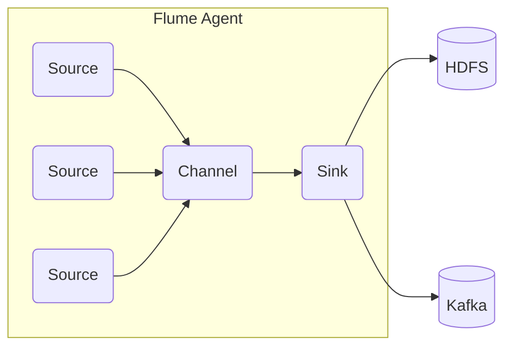
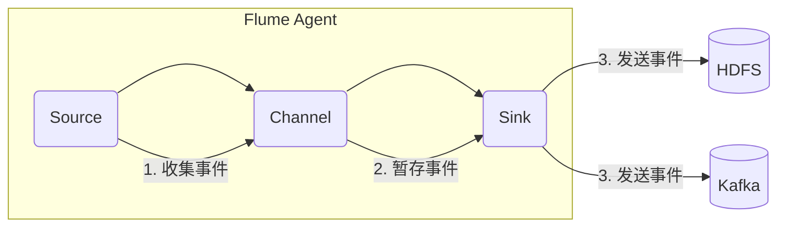

# Flume日志收集系统原理与代码实例讲解

## 1.背景介绍

### 1.1 什么是日志

在计算机系统中,日志(log)是一种记录系统活动、事件或操作的文件。它们提供了有关系统运行状态、性能、错误和其他重要信息的宝贵数据。日志对于监控、故障排查、审计和分析等任务至关重要。

随着现代分布式系统的复杂性不断增加,有效管理和处理大量日志数据变得越来越具有挑战性。这就需要一个强大的日志收集系统来确保日志数据的集中存储、处理和分析。

### 1.2 日志收集的重要性

- **系统监控**: 日志数据可用于监控系统的运行状况,检测异常行为并采取相应措施。
- **故障排查**: 当系统出现问题时,日志可以提供有关错误和异常的宝贵线索,有助于快速定位和解决问题。
- **安全审计**: 日志记录了系统的访问和操作信息,对于检测安全威胁和违规行为非常重要。
- **业务分析**: 日志数据可用于分析用户行为、系统性能和业务趋势,为业务决策提供依据。

### 1.3 日志收集系统的作用

日志收集系统的主要作用是从分布在不同节点上的应用程序中收集日志数据,并将其传输到中央存储系统(如Hadoop分布式文件系统HDFS)或消息队列系统(如Kafka)中,以便进一步处理和分析。

一个优秀的日志收集系统应该具备以下特性:

- **可靠性**: 能够确保日志数据的完整性和持久性,避免数据丢失。
- **可扩展性**: 能够处理大规模的日志数据,并支持水平扩展以满足不断增长的需求。
- **容错性**: 能够自动检测和恢复故障,确保系统的高可用性。
- **安全性**: 能够保护日志数据的机密性和完整性,防止未经授权的访问和篡改。
- **灵活性**: 能够支持多种日志格式和来源,并提供丰富的过滤、路由和转换功能。

## 2.核心概念与联系

### 2.1 Flume架构概览

Apache Flume是一个分布式、可靠且可用的日志收集系统,由Cloudera公司开发并捐献给Apache软件基金会。它被广泛用于收集和聚合大数据环境中的日志数据。

Flume的核心架构由以下三个主要组件组成:

1. **Source(源头)**: 从外部系统(如Web服务器、应用程序等)收集日志数据。
2. **Channel(通道)**: 作为Source和Sink之间的临时数据存储区域,用于缓冲事件(事件即日志数据)。
3. **Sink(下游)**: 将事件从Channel传输到下一个目的地(如HDFS、Kafka等)。

这些组件可以灵活组合,构建出复杂的日志收集拓扑结构,满足各种需求。



### 2.2 Flume事件(Event)

Flume中的基本数据单元称为事件(Event),它由以下几个部分组成:

- **Headers**: 键值对形式的元数据,用于描述事件的属性。
- **Body**: 事件的实际内容,通常是日志数据的字节数组。

事件在Flume内部以高效的二进制格式传输,以减少网络开销和提高性能。

### 2.3 Flume Agent

Flume Agent是Flume的基本单元,由一个Source、一个Channel和一个或多个Sink组成。它负责从Source接收事件,将事件临时存储在Channel中,然后由Sink将事件传输到下一个目的地。

Flume Agent可以独立运行,也可以与其他Agent组成复杂的拓扑结构,实现更加灵活和可靠的日志收集。

### 2.4 Flume拓扑结构

根据需求,Flume可以构建多种拓扑结构,例如:

- **简单拓扑**: 一个Agent包含一个Source、一个Channel和一个Sink。
- **多路复用拓扑**: 一个Agent包含多个Source,将事件发送到同一个Channel。
- **多路分流拓扑**: 一个Agent包含一个Source和多个Channel,每个Channel连接一个Sink。
- **级联拓扑**: 多个Agent级联连接,后一个Agent的Source从前一个Agent的Sink接收事件。

这种灵活性使Flume能够适应各种复杂的日志收集场景。

## 3.核心算法原理具体操作步骤

### 3.1 Flume事件流程

Flume的核心工作原理是通过Source、Channel和Sink之间的交互来传输和处理事件。事件在Flume内部流转的基本步骤如下:

1. **Source收集事件**:Source从外部系统(如Web服务器、应用程序等)收集日志数据,并将其封装为Flume事件。

2. **Channel暂存事件**:Source将收集到的事件写入Channel。Channel作为一个临时存储区域,可以缓冲事件,防止在Source和Sink之间出现数据丢失。

3. **Sink发送事件**:Sink从Channel中取出事件,并将其传输到下一个目的地(如HDFS、Kafka等)。

4. **事务处理**:Flume使用事务机制来确保事件的可靠传输。每个事件都被视为一个事务,只有当事务成功提交后,事件才被视为已成功传输。



### 3.2 事务处理机制

Flume的事务处理机制确保了事件在整个传输过程中的可靠性和一致性。事务处理的基本步骤如下:

1. **开始事务**:Source或Sink向Channel发起一个事务请求。

2. **写入事件**:Source将事件写入Channel的事务批次中。

3. **提交事务**:当所有事件都成功写入Channel后,Source向Channel发送提交请求。

4. **事务确认**:Channel确认事务已成功提交,并将事件从事务批次移除。

5. **回滚事务**:如果在任何步骤发生错误,Channel将回滚整个事务,确保事件的一致性。

这种事务机制确保了事件在传输过程中的原子性、一致性和持久性,从而实现了Flume的可靠性。

### 3.3 故障容错机制

为了提高系统的可用性和容错性,Flume采用了多种故障容错机制:

1. **Channel持久化**:Channel可以选择将事件持久化存储到本地文件系统或数据库中,以防止在Agent重启或崩溃时数据丢失。

2. **故障转移**:当一个Sink出现故障时,Flume可以自动将事件转移到备用Sink,确保数据传输的连续性。

3. **重试机制**:对于临时性的网络或目标系统故障,Flume会自动重试事件传输,直到成功或达到最大重试次数。

4. **故障监控**:Flume提供了丰富的监控指标和日志,方便管理员及时发现和处理故障。

这些机制使Flume能够在出现故障时自动恢复,确保日志数据的可靠收集和传输。

## 4.数学模型和公式详细讲解举例说明

在Flume中,并没有直接涉及复杂的数学模型或公式。但是,我们可以从系统性能和可靠性的角度,使用一些简单的数学概念和公式来量化和分析Flume的特性。

### 4.1 吞吐量和延迟

吞吐量是指Flume在单位时间内能够处理的事件数量,通常以事件/秒(events/second)来衡量。延迟是指事件从Source进入到离开Sink所需的时间,通常以毫秒(ms)为单位。

假设我们有一个Flume Agent,其吞吐量为$T$,平均延迟为$D$,那么在时间$t$内,它可以处理的事件数量$N$可以表示为:

$$N = T \times t$$

而在时间$t$内,所有事件的总延迟$L$可以表示为:

$$L = N \times D = T \times t \times D$$

通过优化Flume的配置和资源分配,我们可以提高吞吐量$T$,降低延迟$D$,从而提升Flume的整体性能。

### 4.2 可靠性和数据丢失率

Flume的核心目标之一是确保日志数据的可靠传输,避免数据丢失。我们可以使用数据丢失率来衡量Flume的可靠性。

假设在时间$t$内,Flume收集到$N_1$个事件,但只有$N_2$个事件成功传输到目的地,那么数据丢失率$L_r$可以表示为:

$$L_r = \frac{N_1 - N_2}{N_1} \times 100\%$$

理想情况下,数据丢失率$L_r$应该为0%,表示所有事件都被成功传输。但在实际场景中,由于各种原因(如网络故障、磁盘错误等),一定程度的数据丢失是难以完全避免的。

Flume通过采用持久化Channel、故障转移、重试机制等策略,尽可能降低数据丢失率,提高可靠性。同时,我们也可以通过监控数据丢失率,及时发现和解决潜在问题。

### 4.3 资源利用率

为了高效利用系统资源,我们需要合理分配和调度Flume的各个组件。例如,Channel的大小、Source和Sink的线程数等参数,都会影响Flume的资源利用率。

假设一个Flume Agent有$M$个Source,每个Source的吞吐量为$T_s$,有$N$个Sink,每个Sink的吞吐量为$T_k$,那么整个Agent的最大吞吐量$T_{max}$可以表示为:

$$T_{max} = min(M \times T_s, N \times T_k)$$

如果$M \times T_s > N \times T_k$,那么Sink就会成为瓶颈;反之,Source就会成为瓶颈。通过分析这些公式,我们可以合理调整Flume的配置,提高资源利用率。

总的来说,虽然Flume本身没有复杂的数学模型,但是我们可以借助一些简单的数学概念和公式,来量化和优化Flume的性能、可靠性和资源利用率。

## 5.项目实践:代码实例和详细解释说明

在本节中,我们将通过一个实际的代码示例,展示如何配置和运行一个简单的Flume Agent,并详细解释每一步骤的含义。

### 5.1 环境准备

在开始之前,请确保您已经正确安装并配置了Apache Flume。您可以从官方网站下载Flume的二进制包,或者使用包管理工具(如yum或apt-get)进行安装。

此外,我们还需要准备一个用于测试的日志文件。您可以使用任何文本编辑器创建一个简单的文本文件,并填充一些日志数据。

### 5.2 配置Flume Agent

首先,我们需要创建一个Flume Agent的配置文件。在本示例中,我们将使用一个名为`example.conf`的文件。

```properties
# example.conf

# 定义一个名为"log-source"的Source
log-source.sources = log-source

# 配置Source的类型和相关参数
log-source.sources.log-source.type = exec
log-source.sources.log-source.command = tail -F /path/to/your/log/file.log

# 定义一个名为"channel"的Channel
log-source.channels = channel

# 配置Channel的类型和相关参数
log-source.channels.channel.type = memory
log-source.channels.channel.capacity = 1000
log-source.channels.channel.transactionCapacity = 100

# 定义一个名为"log-sink"的Sink
log-source.sinks = log-sink

# 配置Sink的类型和相关参数
log-source.sinks.log-sink.type = logger

# 将Source与Channel和Sink连接起来
log-source