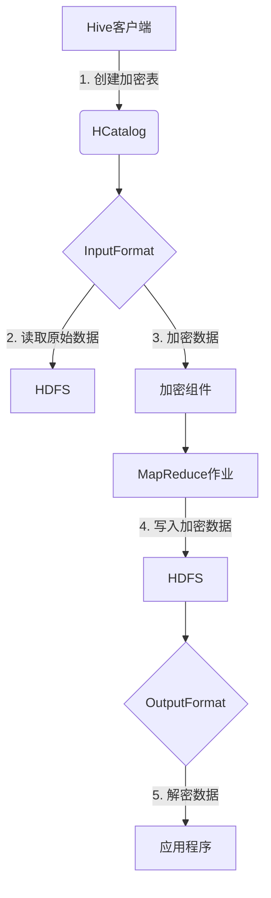

# HCatalogTable数据加密：保障数据机密性

## 1.背景介绍

随着大数据时代的到来,数据安全问题越来越受到关注。无论是政府机构、金融机构还是普通企业,都有大量的敏感数据需要妥善保护,防止数据泄露和被恶意利用。在Hadoop生态系统中,HCatalog为用户提供了元数据服务,可以对底层数据进行统一抽象和管理。而HCatalogTable则是HCatalog中用于存储数据的表结构。由于HCatalogTable中可能存储着机密数据,因此对其进行加密显得尤为重要。

## 2.核心概念与联系

### 2.1 HCatalog

HCatalog是Apache Hive中的一个组件,主要用于为Hadoop生态系统中的数据提供统一的元数据管理服务。它可以对底层存储的数据进行抽象,使得用户无需关心数据的物理存储格式和位置,只需通过HCatalog提供的接口即可访问数据。HCatalog支持多种数据格式,如RCFile、SequenceFile、TextFile等,并且可以与MapReduce、Pig、Hive等框架无缝集成。

### 2.2 HCatalogTable

HCatalogTable是HCatalog中用于存储数据的表结构。它类似于关系数据库中的表,由多个列(Column)组成,每个列都有对应的数据类型。HCatalogTable还支持分区(Partition)和存储桶(Bucket),可以根据需要对数据进行分区和分桶存储,提高查询效率。

### 2.3 数据加密

数据加密是保护数据安全的一种重要手段。通过对数据进行加密,即使数据被窃取,也无法直接获取明文数据,从而保障了数据的机密性。加密算法通常分为对称加密和非对称加密两大类,前者使用相同的密钥进行加密和解密,后者使用一对公钥和私钥。常见的加密算法有DES、AES、RSA等。

## 3.核心算法原理具体操作步骤

对HCatalogTable进行数据加密,主要包括以下几个步骤:

1. **选择合适的加密算法和密钥长度**

   首先需要根据数据的敏感程度和性能要求,选择合适的加密算法和密钥长度。一般来说,对称加密算法如AES具有较高的加密效率,而非对称加密算法如RSA则更加安全但效率较低。密钥长度越长,加密强度越高,但同时也会降低加密速度。

2. **生成加密密钥**

   根据选择的加密算法,生成相应的加密密钥。对于对称加密,只需生成一个密钥;对于非对称加密,需要生成一对公钥和私钥。密钥的生成和管理是数据加密的关键环节,必须确保密钥的安全性。

3. **设置加密策略**

   确定加密策略,即对哪些数据进行加密、使用何种加密方式等。可以选择对整个HCatalogTable进行加密,也可以只对其中的某些列进行加密。同时还需要决定是在数据写入时进行加密,还是在读取时进行加密。

4. **实现加密功能**

   根据选择的加密算法和策略,在Hadoop生态系统中实现相应的加密功能。可以在HCatalog的InputFormat和OutputFormat中添加加密/解密逻辑,或者在MapReduce作业中进行加密操作。

5. **密钥管理**

   加密密钥的安全管理是整个加密过程中最为关键的环节。需要采用专门的密钥管理工具,如密钥库(KeyStore)等,对密钥进行集中存储和管理,并设置严格的访问控制策略,防止密钥泄露。

以上是对HCatalogTable进行数据加密的基本步骤。实际操作时,还需要根据具体的应用场景和需求进行调整和优化。

## 4.数学模型和公式详细讲解举例说明

数据加密算法通常基于一些数学原理和模型,下面将对常见的对称加密算法AES(Advanced Encryption Standard)进行详细介绍。

AES是一种替代DES的高级加密标准,由比利时的Joan Daemen和Vincent Rijmen两位密码学家所设计,并于2001年被美国政府正式采用。AES属于对称密钥加密,加密和解密使用相同的密钥。

### 4.1 AES算法原理

AES算法的核心是使用一个可逆的字节替代变换,一个行移位变换,以及列混合运算和加密密钥加成等运算。加密过程包括以下几个步骤:

1. **字节代替(ByteSub)**

   将明文按16进制表示,并将每个字节替换为另一个字节。这一步使用了一个预定义的S盒(Substitution Box)。

2. **行移位(ShiftRow)**

   对每一行进行循环移位变换。

3. **列混合(MixColumn)**

   对每一列进行特殊的数学变换,使用多项式乘法。

4. **密钥加(AddRoundKey)**

   将当前的数据与当前轮的密钥进行异或运算。

上述四个步骤就是AES的一轮变换,需要重复执行多轮才能完成加密。AES加密的轮数由密钥长度决定,分别为128位(10轮)、192位(12轮)和256位(14轮)。最后一轮不包括列混合步骤。

解密过程则是加密过程的逆运算,先进行密钥加、逆列混合、逆行移位和逆字节代替。

### 4.2 数学模型

AES算法中的关键步骤是列混合运算,它使用了有限域 $GF(2^8)$ 上的多项式乘法。有限域 $GF(2^8)$ 是由 $2^8$ 个元素组成的有限集合,元素之间的运算满足代数封闭性。

在 $GF(2^8)$ 中,每个元素可以用一个8位二进制数表示,即 $GF(2^8)=\{0,1,\alpha,\alpha^2,\cdots,\alpha^{254}\}$,其中 $\alpha$ 是一个原根,满足 $\alpha^8+\alpha^4+\alpha^3+\alpha+1=0$。

列混合运算使用了一个固定的多项式 $a(x)=\{03\}x^3+\{01\}x^2+\{01\}x+\{02\}$,其中的系数在 $GF(2^8)$ 中。对于一个4字节的列向量 $b=\begin{bmatrix}b_0\\b_1\\b_2\\b_3\end{bmatrix}$,列混合运算可以表示为:

$$
\begin{bmatrix}
b'_0\\b'_1\\b'_2\\b'_3
\end{bmatrix}
=
\begin{bmatrix}
02&03&01&01\\
01&02&03&01\\
01&01&02&03\\
03&01&01&02
\end{bmatrix}
\begin{bmatrix}
b_0\\b_1\\b_2\\b_3
\end{bmatrix}
$$

其中的乘法运算在 $GF(2^8)$ 上进行,可以使用对数表和反对数表来加速计算。

通过上述数学变换,AES算法能够有效地扩展密钥空间,增强密文的混淆性,从而提高加密强度。

## 4.项目实践:代码实例和详细解释说明

为了更好地理解HCatalogTable数据加密的实现过程,下面将给出一个基于Hadoop生态系统的加密示例项目。

### 4.1 项目架构

该示例项目基于Hadoop 2.7.3、Hive 1.2.1和HCatalog 0.13.1版本,采用AES-128算法对HCatalogTable中的数据进行加密。项目架构如下:



项目主要包括以下几个模块:

1. **Hive客户端**: 用于创建加密的HCatalogTable。
2. **InputFormat**: 自定义的InputFormat,用于从HDFS读取原始数据。
3. **加密组件**: 使用AES-128算法对数据进行加密。
4. **MapReduce作业**: 并行执行加密操作。
5. **OutputFormat**: 自定义的OutputFormat,用于将加密数据写入HDFS。
6. **应用程序**: 读取并解密HCatalogTable中的数据。

### 4.2 代码实现

下面是该项目中一些关键代码的实现,供参考。

**1. 创建加密表**

在Hive客户端中,使用以下语句创建一个加密的HCatalogTable:

```sql
CREATE TABLE encrypted_table (
  id INT,
  name STRING,
  email STRING
)
PARTITIONED BY (country STRING)
STORED AS encrypted
WITH SERDEPROPERTIES (
  'encrypt.mode'='AES/CBC/PKCS5Padding',
  'encrypt.key'='encryptionKey123'
);
```

其中,`STORED AS encrypted`指定该表的数据将被加密存储,`WITH SERDEPROPERTIES`则设置了加密模式和密钥。

**2. 自定义InputFormat**

```java
public class EncryptedInputFormat extends FileInputFormat<NullWritable, BytesWritable> {

    @Override
    public RecordReader<NullWritable, BytesWritable> createRecordReader(InputSplit split, TaskAttemptContext context) {
        return new EncryptedRecordReader();
    }

    public static class EncryptedRecordReader extends RecordReader<NullWritable, BytesWritable> {

        // 读取原始数据
        // ...

        @Override
        public boolean nextKeyValue() throws IOException {
            // 从HDFS读取原始数据
            // ...

            // 使用AES算法加密数据
            byte[] encryptedData = AESEncryptor.encrypt(data, encryptionKey);

            currentValue = new BytesWritable(encryptedData);
            return true;
        }
    }
}
```

自定义的`EncryptedInputFormat`在读取数据时,会使用`AESEncryptor`对数据进行加密。

**3. 加密组件**

```java
public class AESEncryptor {

    private static final String ALGORITHM = "AES/CBC/PKCS5Padding";

    public static byte[] encrypt(byte[] data, String key) throws Exception {
        SecretKeySpec secretKey = new SecretKeySpec(key.getBytes(), "AES");
        Cipher cipher = Cipher.getInstance(ALGORITHM);
        cipher.init(Cipher.ENCRYPT_MODE, secretKey);
        return cipher.doFinal(data);
    }

    public static byte[] decrypt(byte[] encryptedData, String key) throws Exception {
        SecretKeySpec secretKey = new SecretKeySpec(key.getBytes(), "AES");
        Cipher cipher = Cipher.getInstance(ALGORITHM);
        cipher.init(Cipher.DECRYPT_MODE, secretKey);
        return cipher.doFinal(encryptedData);
    }
}
```

`AESEncryptor`使用Java的`javax.crypto`包实现了AES-128算法的加密和解密功能。

**4. 自定义OutputFormat**

```java
public class EncryptedOutputFormat extends FileOutputFormat<NullWritable, BytesWritable> {

    @Override
    public RecordWriter<NullWritable, BytesWritable> getRecordWriter(TaskAttemptContext context) throws IOException {
        return new EncryptedRecordWriter(context);
    }

    public static class EncryptedRecordWriter extends RecordWriter<NullWritable, BytesWritable> {

        @Override
        public void write(NullWritable key, BytesWritable value) throws IOException {
            // 将加密数据写入HDFS
            // ...
        }
    }
}
```

自定义的`EncryptedOutputFormat`将加密后的数据写入HDFS。

**5. 应用程序**

```java
public class EncryptedDataReader {

    public static void main(String[] args) throws Exception {
        Configuration conf = new Configuration();
        JobConf jobConf = new JobConf(conf);

        String tableName = args[0];
        String databaseName = args[1];
        String encryptionKey = args[2];

        HCatReader reader = HCatReader.create(jobConf, databaseName, tableName);

        // 读取并解密数据
        while (reader.hasNext()) {
            HCatRecord record = reader.read();
            byte[] encryptedData = record.getBytes("data");
            byte[] decryptedData = AESEncryptor.decrypt(encryptedData, encryptionKey);
            // 处理解密后的数据
            // ...
        }

        reader.close();
    }
}
```

应用程序使用`HCatReader`从HCatalogTable中读取加密数据,然后使用`AESEncryptor`进行解密,获取明文数据。

以上代码只是示例,在实际项目中还需要进行更多的错误处理、性能优化