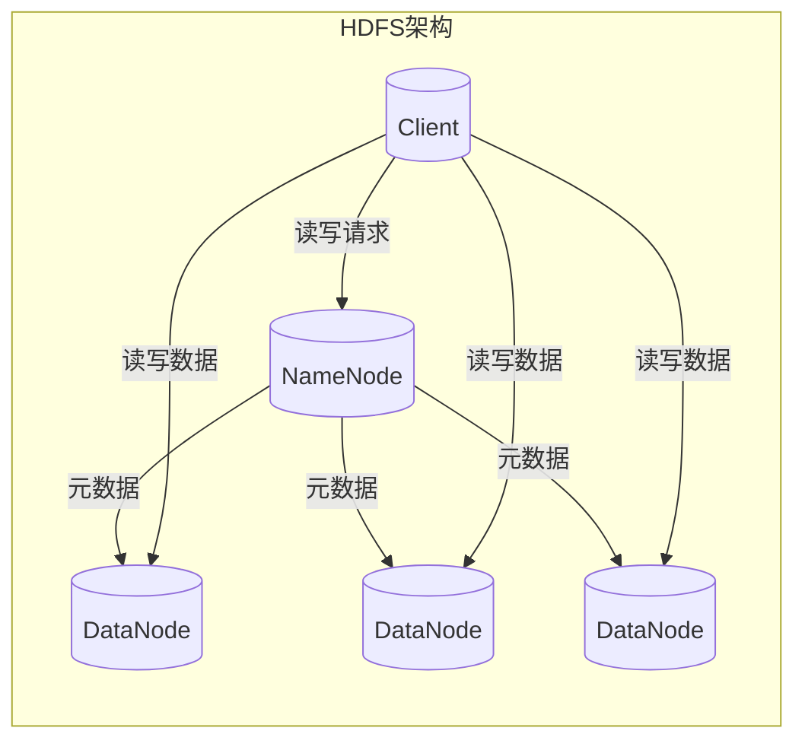
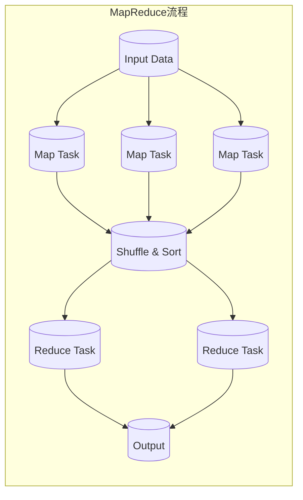
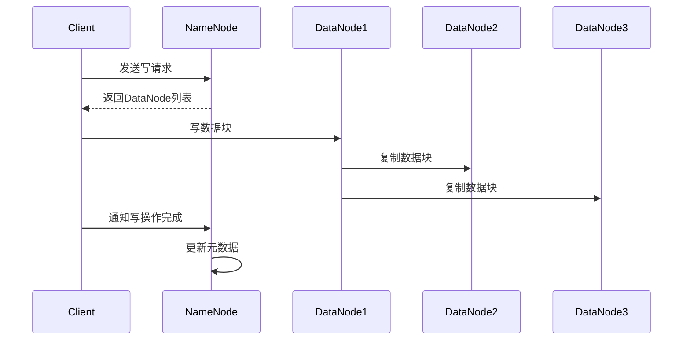
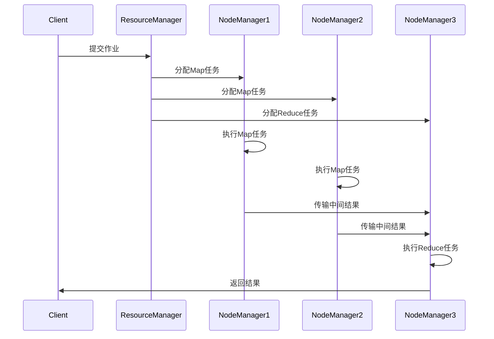

# Hadoop原理与代码实例讲解

## 1.背景介绍

### 1.1 大数据时代的到来

在当今的数字时代，数据正以前所未有的规模和速度呈爆炸式增长。无论是社交媒体、物联网设备、电子商务平台还是传统行业,都在产生海量的结构化和非结构化数据。这些数据蕴藏着巨大的价值,但同时也带来了存储、管理和分析的挑战。为了有效地处理这些大规模数据,分布式计算框架应运而生,其中最著名的就是Hadoop。

### 1.2 Hadoop的起源与发展

Hadoop源于Apache的开源项目Nutch,最初是为了构建一个开源的网页搜索引擎而设计的。它的名字来自于创始人Doug Cutting对他儿时的一款玩具大象的命名。Hadoop的灵感来自于Google发表的两篇论文:《The Google File System》和《MapReduce:Simplified Data Processing on Large Clusters》,这两篇论文分别描述了Google的分布式文件系统GFS和分布式计算框架MapReduce。

Hadoop于2006年1月正式发布第一个版本,并迅速被广泛采用。它提供了一个可靠、可扩展、分布式的计算框架,能够在廉价的商用硬件集群上存储和处理大规模数据。Hadoop的核心组件包括分布式文件系统HDFS(Hadoop Distributed File System)和分布式计算框架MapReduce。随着大数据技术的不断发展,Hadoop生态系统也在不断扩展,包括Hive、Pig、HBase、Spark等多种工具和框架。

## 2.核心概念与联系

### 2.1 HDFS(Hadoop Distributed File System)

HDFS是Hadoop的分布式文件系统,它被设计为适合运行在廉价的商用硬件上,具有高容错性和高吞吐量的特点。HDFS采用主从架构,由一个NameNode(名称节点)和多个DataNode(数据节点)组成。

NameNode负责管理文件系统的命名空间和客户端对文件的访问,而DataNode负责实际存储数据块。HDFS将文件划分为多个数据块(默认128MB),并在多个DataNode上存储多个副本,以提高容错性和数据可用性。



### 2.2 MapReduce

MapReduce是Hadoop的分布式计算框架,它将大规模的数据处理任务分解为两个主要阶段:Map(映射)和Reduce(归约)。

1. **Map阶段**:输入数据被划分为多个数据块,并由多个Map任务并行处理。每个Map任务会读取输入数据,执行用户自定义的Map函数,并生成中间结果。

2. **Reduce阶段**:MapReduce框架会对Map阶段产生的中间结果进行分组和排序,然后由Reduce任务处理。每个Reduce任务会执行用户自定义的Reduce函数,对相同的键值对进行汇总或者其他操作,最终生成最终结果。



MapReduce的优势在于它可以自动并行化计算,并且具有高容错性和可扩展性。它可以在大规模的商用硬件集群上运行,处理TB甚至PB级别的数据。

## 3.核心算法原理具体操作步骤

### 3.1 HDFS写数据流程

1. 客户端向NameNode发送写请求,NameNode会进行一系列检查,如命名空间是否合法、磁盘配额等。

2. NameNode确定数据块的存储位置,并返回给客户端。

3. 客户端按照NameNode返回的DataNode列表,依次向DataNode发送写请求。

4. 第一个DataNode收到请求后,会在本地创建一个数据块文件,并向其他DataNode发送复制请求。

5. 其他DataNode开始从第一个DataNode复制数据块。

6. 当数据块被复制到指定数量的DataNode后,客户端完成写操作,并通知NameNode。

7. NameNode更新元数据,记录数据块的位置信息。



### 3.2 MapReduce执行流程

1. **作业提交**:客户端向ResourceManager提交MapReduce作业,ResourceManager负责协调和分配资源。

2. **任务分配**:ResourceManager将作业划分为多个Map任务和Reduce任务,并分配给NodeManager运行。

3. **Map阶段**:每个Map任务会读取输入数据,并执行用户自定义的Map函数,生成中间结果。

4. **Shuffle阶段**:MapReduce框架会对Map阶段产生的中间结果进行分组和排序,并分发给相应的Reduce任务。

5. **Reduce阶段**:每个Reduce任务会执行用户自定义的Reduce函数,对相同的键值对进行汇总或其他操作,生成最终结果。

6. **结果输出**:Reduce任务将最终结果写入HDFS或其他存储系统。



## 4.数学模型和公式详细讲解举例说明

在Hadoop中,数学模型和公式主要应用于以下几个方面:

### 4.1 HDFS数据块放置策略

HDFS采用机架感知数据块放置策略,以提高数据可靠性和网络带宽利用率。该策略可以用数学公式表示如下:

$$
\begin{aligned}
&\text{第一个副本放在}\ UpNode\ \text{所在的节点}\\
&\text{第二个副本放在与}\ UpNode\ \text{不同机架的节点}\\
&\text{第三个副本放在与第二个副本不同的节点}\\
&\text{其他副本随机放置}
\end{aligned}
$$

其中,UpNode是客户端与之交互的节点。这种策略可以最大限度地利用机架内部的高带宽网络,同时也保证了跨机架的容错性。

### 4.2 MapReduce任务调度

MapReduce任务调度器需要根据集群资源状况,合理地分配Map和Reduce任务。常用的调度策略包括FIFO(先进先出)、Fair Scheduler(公平调度器)和Capacity Scheduler(容量调度器)等。

假设有M个Map任务和R个Reduce任务,集群有N个节点,每个节点的资源为$r_i(1 \leq i \leq N)$,则调度器的目标是:

$$
\begin{aligned}
&\text{最小化}\ \max\limits_{1 \leq i \leq N} \frac{\sum\limits_{j \in \text{tasks on }n_i} r_j}{r_i}\\
&\text{满足}\ \sum\limits_{i=1}^N r_i \geq \sum\limits_{j=1}^{M+R} r_j
\end{aligned}
$$

也就是说,调度器需要最小化集群中最繁忙节点的负载,并且保证集群总资源足够运行所有任务。

### 4.3 MapReduce数据局部性

MapReduce框架会尽量将Map任务调度到存储输入数据的节点上,以减少数据传输开销。假设输入数据总大小为$D$,集群中有$N$个节点,每个节点存储的数据大小为$d_i(1 \leq i \leq N)$,则数据局部性可以用下式表示:

$$
\text{数据局部性} = \frac{\sum\limits_{i=1}^N \min(d_i, \frac{D}{M})}{D}
$$

该公式表示,所有节点上最多可以本地读取的数据量占总输入数据量的比例。数据局部性越高,MapReduce作业的性能就越好。

## 5.项目实践:代码实例和详细解释说明

### 5.1 HDFS Java API示例

以下代码示例展示了如何使用HDFS Java API读取和写入文件:

```java
// 配置HDFS文件系统
Configuration conf = new Configuration();
conf.set("fs.defaultFS", "hdfs://namenode:9000");
FileSystem fs = FileSystem.get(conf);

// 写入文件
Path path = new Path("/user/hadoop/file.txt");
FSDataOutputStream out = fs.create(path);
out.writeUTF("Hello Hadoop!");
out.close();

// 读取文件
FSDataInputStream in = fs.open(path);
String content = in.readUTF();
System.out.println(content); // 输出: Hello Hadoop!
in.close();
```

1. 首先,我们创建一个`Configuration`对象,并设置NameNode的地址。

2. 然后,使用`FileSystem.get()`方法获取HDFS文件系统实例。

3. 要写入文件,我们使用`FileSystem.create()`方法创建一个`FSDataOutputStream`,并写入数据。

4. 要读取文件,我们使用`FileSystem.open()`方法获取一个`FSDataInputStream`,并读取数据。

5. 最后,别忘记关闭流。

### 5.2 MapReduce WordCount示例

WordCount是MapReduce的经典示例,它统计给定文本文件中每个单词出现的次数。以下是Java代码实现:

```java
// Mapper类
public static class TokenizerMapper
    extends Mapper<Object, Text, Text, IntWritable>{

    private final static IntWritable one = new IntWritable(1);
    private Text word = new Text();

    public void map(Object key, Text value, Context context) throws IOException, InterruptedException {
        StringTokenizer itr = new StringTokenizer(value.toString());
        while (itr.hasMoreTokens()) {
            word.set(itr.nextToken());
            context.write(word, one);
        }
    }
}

// Reducer类
public static class IntSumReducer
    extends Reducer<Text,IntWritable,Text,IntWritable> {
    private IntWritable result = new IntWritable();

    public void reduce(Text key, Iterable<IntWritable> values, Context context) throws IOException, InterruptedException {
        int sum = 0;
        for (IntWritable val : values) {
            sum += val.get();
        }
        result.set(sum);
        context.write(key, result);
    }
}

// 主程序
public static void main(String[] args) throws Exception {
    Configuration conf = new Configuration();
    Job job = Job.getInstance(conf, "word count");
    job.setJarByClass(WordCount.class);
    job.setMapperClass(TokenizerMapper.class);
    job.setCombinerClass(IntSumReducer.class);
    job.setReducerClass(IntSumReducer.class);
    job.setOutputKeyClass(Text.class);
    job.setOutputValueClass(IntWritable.class);
    FileInputFormat.addInputPath(job, new Path(args[0]));
    FileOutputFormat.setOutputPath(job, new Path(args[1]));
    System.exit(job.waitForCompletion(true) ? 0 : 1);
}
```

1. `TokenizerMapper`是Map阶段的实现,它将输入文本拆分为单词,并为每个单词输出`<word, 1>`键值对。

2. `IntSumReducer`是Reduce阶段的实现,它对相同单词的值进行求和,输出`<word, count>`键值对。

3. 在主程序中,我们配置Job,设置Mapper、Combiner(可选)和Reducer类,以及输入输出路径