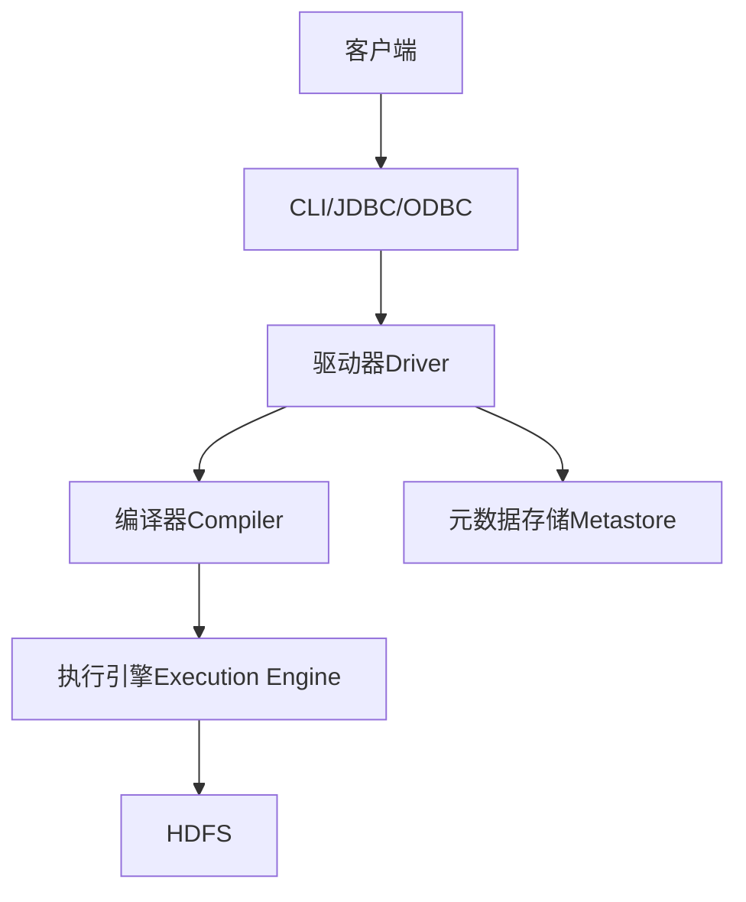
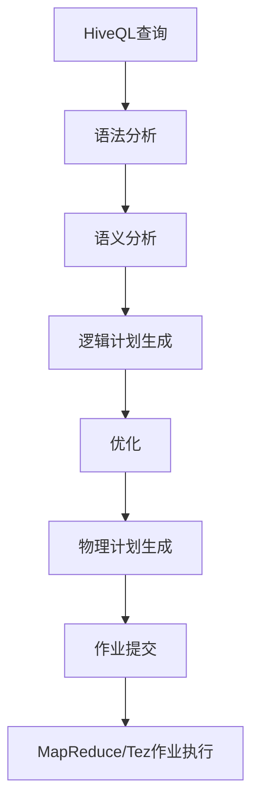
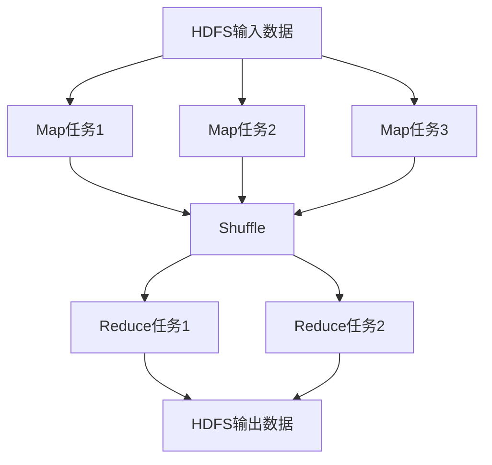
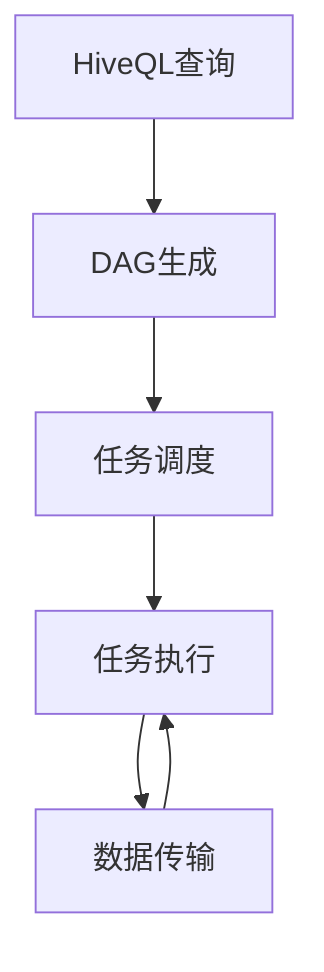

# HiveQL在数据仓库中的使用案例

## 1. 背景介绍

### 1.1 数据仓库的重要性

在当今的数字时代,数据被视为企业的关键资产。随着数据量的快速增长,企业需要有效地管理和分析这些海量数据,以获取有价值的见解并支持业务决策。这就是数据仓库的用武之地。

数据仓库是一种专门设计用于数据分析和报告的数据存储系统。它将来自多个异构数据源的数据集中存储,并进行清理、转换和整合,为企业提供一个统一、一致和可靠的数据视图。

### 1.2 Hive和HiveQL的作用

Apache Hive是一个建立在Hadoop之上的数据仓库基础架构,旨在提供数据汇总、查询和分析。它使用类似SQL的语言HiveQL(Hive Query Language)来管理和查询存储在Hadoop分布式文件系统(HDFS)中的大数据。

HiveQL为数据分析人员提供了一种熟悉的SQL类查询接口,使他们无需直接编写复杂的MapReduce程序即可访问和处理HDFS中的数据。这极大地降低了使用Hadoop的门槛,使大数据分析变得更加简单和高效。

## 2. 核心概念与联系

### 2.1 Hive架构概览

Hive的架构由以下几个核心组件组成:

1. **元数据存储(Metastore)**: 存储Hive中所有数据库、表、分区和列的元数据信息。
2. **驱动器(Driver)**: 负责处理HiveQL查询,生成查询计划并协调执行。
3. **编译器(Compiler)**: 将HiveQL查询转换为一系列MapReduce作业或Tez作业。
4. **执行引擎(Execution Engine)**: 执行编译器生成的MapReduce或Tez作业。
5. **CLI(Command Line Interface)**: 提供命令行界面,允许用户直接输入HiveQL查询。
6. **JDBC/ODBC服务器**: 允许JDBC和ODBC客户端连接Hive并执行查询。



### 2.2 Hive与传统数据库的区别

虽然Hive提供了类似SQL的查询语言,但它与传统的关系数据库管理系统(RDBMS)有一些显著区别:

1. **存储格式**: Hive将数据存储为文件(如纯文本、SequenceFile、RCFile等),而RDBMS使用专有的存储格式。
2. **数据更新**: Hive主要用于批量数据加载和查询,不支持完全的ACID(原子性、一致性、隔离性和持久性)事务。
3. **查询执行**: Hive将查询转换为MapReduce或Tez作业在Hadoop集群上执行,而RDBMS在单机上执行查询。
4. **延迟性**: Hive查询通常比RDBMS查询有更高的延迟,因为它需要启动MapReduce作业。
5. **Schema on Read**: Hive支持Schema on Read,可以在读取数据时动态推断数据格式,而RDBMS需要预先定义模式。

尽管存在这些差异,Hive仍然为数据分析人员提供了一种熟悉的SQL类查询接口,使他们能够更轻松地处理大数据。

## 3. 核心算法原理具体操作步骤 

### 3.1 Hive查询执行流程

当用户提交一个HiveQL查询时,Hive会按照以下步骤执行:

1. **语法分析(Parsing)**: 驱动器将HiveQL查询字符串解析为抽象语法树(AST)。
2. **语义分析(Semantic Analysis)**: 编译器对AST进行类型检查、列投影等语义分析,生成查询块(Query Block)。
3. **逻辑计划生成(Logical Plan Generation)**: 编译器根据查询块生成逻辑计划,表示查询的执行流程。
4. **优化(Optimization)**: 优化器对逻辑计划进行一系列优化,如投影剪裁、分区剪裁等。
5. **物理计划生成(Physical Plan Generation)**: 编译器将优化后的逻辑计划转换为物理计划,即一系列MapReduce或Tez作业。
6. **作业提交(Job Submission)**: 执行引擎将物理计划提交给Hadoop集群执行。



### 3.2 MapReduce执行流程

对于基于MapReduce的Hive查询,执行引擎会生成一系列MapReduce作业,每个作业包含Map和Reduce两个阶段:

1. **Map阶段**: 每个Map任务处理HDFS中的一个数据块,执行筛选、投影、过滤等操作,并生成键值对。
2. **Shuffle阶段**: 将Map阶段输出的键值对按键进行分区和排序,分发给相应的Reduce任务。
3. **Reduce阶段**: 每个Reduce任务处理一个分区的数据,执行聚合、连接等操作,生成最终结果。



### 3.3 Tez执行引擎

从Hive 0.13版本开始,Hive引入了Tez作为新的执行引擎,旨在提高查询性能。与MapReduce相比,Tez具有以下优势:

1. **更好的数据局部性**: Tez可以更好地利用数据局部性,减少数据传输。
2. **避免不必要的写操作**: Tez可以在内存中进行中间数据传输,减少磁盘I/O。
3. **更好的容错性**: Tez可以在出现故障时重新启动失败的任务,而不是重启整个作业。
4. **支持复杂的数据处理流程**: Tez可以更好地表示复杂的数据处理流程,如连接、聚合等。

Tez引擎的执行流程如下:

1. **DAG生成**: 编译器根据查询生成一个有向无环图(DAG),表示数据处理流程。
2. **任务调度**: Tez调度器根据DAG安排任务在集群节点上执行。
3. **任务执行**: 每个任务在容器中执行,处理输入数据并生成输出。
4. **数据传输**: 任务之间通过高效的数据传输机制交换数据。



## 4. 数学模型和公式详细讲解举例说明

在大数据处理中,常常需要使用一些数学模型和公式来进行数据分析和挖掘。以下是一些常见的数学模型和公式:

### 4.1 线性回归模型

线性回归是一种广泛使用的监督学习算法,用于预测连续值的目标变量。它的数学表达式如下:

$$y = \beta_0 + \beta_1x_1 + \beta_2x_2 + \cdots + \beta_nx_n + \epsilon$$

其中:
- $y$是目标变量
- $x_1, x_2, \cdots, x_n$是自变量
- $\beta_0, \beta_1, \cdots, \beta_n$是回归系数
- $\epsilon$是误差项

线性回归的目标是找到最佳的回归系数$\beta$,使得预测值$\hat{y}$与实际值$y$之间的误差平方和最小化。

在Hive中,我们可以使用内置的`UDAF`(User-Defined Aggregate Function)来实现线性回归。例如,以下HiveQL查询计算了一个简单的线性回归模型:

```sql
CREATE TEMPORARY FUNCTION lm AS 'org.apache.hadoop.hive.ql.udf.UDFLm';

SELECT
    lm(y, array(1, x1, x2)) AS `[beta0, beta1, beta2]`
FROM (
    SELECT y, x1, x2 FROM mydata
) t;
```

### 4.2 K-Means聚类算法

K-Means是一种常用的无监督学习算法,用于将数据划分为K个聚类。它的目标是最小化每个数据点到其所属聚类中心的平方距离之和,即:

$$J = \sum_{i=1}^{K} \sum_{x \in C_i} \left\|x - \mu_i\right\|^2$$

其中:
- $K$是聚类数量
- $C_i$是第$i$个聚类
- $\mu_i$是第$i$个聚类的中心点
- $\left\|x - \mu_i\right\|^2$是数据点$x$到聚类中心$\mu_i$的欧几里得距离的平方

K-Means算法的步骤如下:

1. 随机选择$K$个初始聚类中心
2. 对每个数据点,计算它到每个聚类中心的距离,并将其分配给最近的聚类
3. 重新计算每个聚类的中心点
4. 重复步骤2和3,直到聚类不再发生变化

在Hive中,我们可以使用`CLUSTER_SAMPLE`函数来实现K-Means聚类。例如,以下HiveQL查询对数据进行2-Means聚类:

```sql
CREATE TEMPORARY FUNCTION kmeans AS 'org.apache.hadoop.hive.ql.udf.UDFKmeans';

SELECT
    kmeans(array(x1, x2), 2) AS cluster
FROM mydata
CLUSTER BY kmeans(array(x1, x2), 2);
```

## 4. 项目实践: 代码实例和详细解释说明

在本节中,我们将通过一个实际的数据仓库项目来演示HiveQL的使用。假设我们有一个电子商务网站的销售数据,存储在HDFS中的`sales`表中,表结构如下:

```sql
CREATE TABLE sales (
    order_id BIGINT,
    product_id INT,
    customer_id INT,
    order_date STRING,
    order_amount DOUBLE,
    city STRING,
    state STRING
)
ROW FORMAT DELIMITED
FIELDS TERMINATED BY ','
STORED AS TEXTFILE;
```

### 4.1 数据加载

首先,我们需要将数据加载到Hive表中。假设销售数据存储在HDFS路径`/data/sales/`下,我们可以使用以下HiveQL语句加载数据:

```sql
LOAD DATA INPATH '/data/sales/' OVERWRITE INTO TABLE sales;
```

### 4.2 数据探索

加载完数据后,我们可以使用一些简单的查询来探索数据:

```sql
-- 查看表的基本信息
DESCRIBE sales;

-- 计算总销售额
SELECT SUM(order_amount) AS total_sales FROM sales;

-- 按城市统计销售额
SELECT city, SUM(order_amount) AS city_sales
FROM sales
GROUP BY city
ORDER BY city_sales DESC;
```

### 4.3 数据转换

在进行深入分析之前,我们可能需要对数据进行一些转换和清理。例如,将`order_date`字符串转换为日期格式:

```sql
CREATE TABLE sales_with_date AS
SELECT
    order_id,
    product_id,
    customer_id,
    CAST(order_date AS DATE) AS order_date,
    order_amount,
    city,
    state
FROM sales;
```

### 4.4 数据分区

为了提高查询性能,我们可以根据常用的过滤条件(如`state`或`order_date`)对表进行分区:

```sql
CREATE TABLE sales_partitioned (
    order_id BIGINT,
    product_id INT,
    customer_id INT,
    order_date DATE,
    order_amount DOUBLE,
    city STRING
)
PARTITIONED BY (state STRING)
CLUSTERED BY (order_date) INTO 32 BUCKETS
ROW FORMAT DELIMITED
FIELDS TERMINATED BY ',';

INSERT OVERWRITE TABLE sales_partitioned
PARTITION (state)
SELECT
    order_id,
    product_id,
    customer_id,
    order_date,
    order_amount,
    city,
    state
FROM sales_with_date;
```

### 4.5 数据分析

现在,我们可以使用HiveQL进行各种数据分析查询,例如:

```sql
-- 计算每个州的总销售额
SELECT state, SUM(order_amount) AS state_sales
FROM