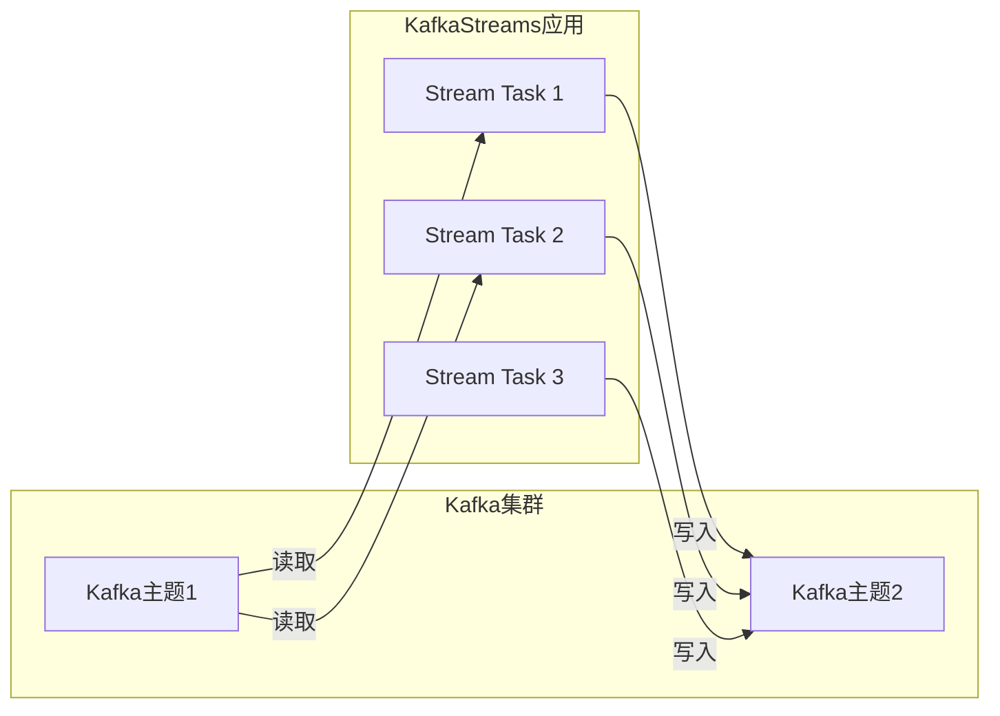

# KafkaStreams:轻量级流式处理框架详解

## 1.背景介绍

### 1.1 什么是流式处理

流式处理(Stream Processing)是一种软件架构范式,专门用于处理持续不断产生的数据流。与传统的批处理系统不同,流式处理系统可以实时处理数据,而不必等待整个数据集可用。这种处理模式在许多应用场景中都很有用,例如:

- 实时监控和警报系统
- 物联网(IoT)数据处理
- 在线机器学习模型训练
- 实时数据分析和可视化

### 1.2 流式处理的挑战

尽管流式处理带来了诸多好处,但它也伴随着一些挑战:

- 数据无边界:数据流是无限的,必须持续处理
- 低延迟要求:对于某些应用,需要毫秒级的低延迟处理
- 容错性:流式系统必须具备容错能力,以防止数据丢失和处理中断
- 数据积压:处理能力有限时,需要暂存待处理数据以防数据丢失
- 状态管理:有状态的流式计算需要高效管理状态

### 1.3 Apache Kafka 和 Kafka Streams

Apache Kafka是一个分布式流式处理平台,最初由LinkedIn公司开发。它具有高吞吐量、可扩展性好、容错性强等优点,被广泛应用于日志收集、消息系统、数据管道等场景。

Kafka Streams是Apache Kafka的一个流式处理库,允许开发人员用标准的Java代码实现流式应用程序和微服务。它提供了一个高度抽象的数据处理模型,隐藏了大部分底层复杂性,使开发人员能够专注于业务逻辑的实现。

## 2.核心概念与联系

### 2.1 Kafka Streams 核心抽象

Kafka Streams中有几个核心抽象概念:

- **Stream**:一个持续更新的不可变数据记录序列
- **Stream处理器(Processor)**:一个可重用的组件,对输入Stream进行处理并产生一个或多个输出Stream
- **拓扑(Topology)**:由多个Stream处理器按照特定模式组成的有向无环图

### 2.2 Kafka Streams 和 Kafka 集群

Kafka Streams应用程序与Kafka集群紧密集成。Kafka Streams利用Kafka的存储层作为其状态存储,使其能够无缝处理和转换数据流。

Kafka Streams应用程序由一个或多个流处理任务(Stream Task)组成,这些任务分布在Kafka Streams应用程序实例之间。每个任务从一个或多个分区读取输入数据,并将处理后的结果写回到Kafka主题。



### 2.3 处理保证

Kafka Streams提供了三种处理语义保证:

1. **至少一次(At-Least-Once)**:每条记录都会被处理一次或多次。这是默认的处理语义。
2. **精确一次(Exactly-Once)**:每条记录只会被处理一次。需要启用Kafka的事务支持。
3. **精确一次(Exactly-Once)**:每条记录只会被处理一次。需要启用Kafka的事务支持。

## 3.核心算法原理具体操作步骤 

### 3.1 Kafka Streams 处理器API

Kafka Streams提供了高级的Streams处理器API,允许开发人员用标准的Java代码实现自定义的流处理逻辑。主要有以下几个核心接口:

- **StreamsBuilder**: 用于构建拓扑结构
- **Processor**:最小的处理单元,对单条记录进行处理
- **Transformer**:对每条记录执行一对一的数据转换操作
- **ValueMapper**:对每条记录的值执行一对一的数据转换操作

使用这些API,我们可以构建各种各样的流处理应用程序,例如过滤、转换、统计、连接、分组和聚合等。

### 3.2 基于状态的运算

很多流处理应用需要基于状态的运算,比如窗口聚合。Kafka Streams支持多种状态存储,如内存中的HashMaps或基于RocksDB的持久化键值存储。

状态存储可以是:

- **键值存储(Key-Value Store)**:存储键值对,支持范围查询
- **窗口存储(Window Store)**:存储窗口数据,支持窗口聚合操作

应用程序可以直接查询和更新这些状态存储,从而实现有状态的计算。

### 3.3 有状态运算示例:窗口聚合

下面是一个使用Kafka Streams进行滑动窗口计数的示例:

```java
// 构建拓扑
StreamsBuilder builder = new StreamsBuilder();
KStream<String, String> textLines = builder.stream("text-lines-topic");

KTable<Windowed<String>, Long> wordCounts = textLines
    .flatMapValues(value -> Arrays.asList(value.toLowerCase().split("\\W+")))
    .groupBy((key, word) -> word)
    .windowedBy(TimeWindows.of(60000).advanceBy(5000))
    .count(Materialized.<String, Long, WindowStore<Bytes, byte[]>>as("counts-store"));

wordCounts.toStream().to("word-count-topic", Produced.with(windowedSerdes, Serdes.Long()));
```

这个例子统计了每个单词在一个滑动窗口内的出现次数。其中:

- 使用`flatMapValues`将每行文本拆分为单词
- `groupBy`按单词分组
- `windowedBy`定义60秒的滑动窗口,每5秒滑动一次
- `count`对每个窗口中的单词进行计数,并将结果存储在一个内存中的`WindowStore`中
- 最后将结果写回到一个输出主题

通过这个示例,我们可以看到Kafka Streams支持有状态的运算,并且可以轻松地对无界数据流进行窗口分析。

## 4.数学模型和公式详细讲解举例说明

在流式处理中,常常需要对数据进行统计和聚合分析。这些操作通常涉及一些数学模型和公式。以下是一些常见的数学模型:

### 4.1 计数

计数是最基本的聚合操作之一。对于一个数据流,我们可以计算出现的总数:

$$
count = \sum_{i=1}^{n} 1
$$

其中 $n$ 是数据流中记录的总数。

### 4.2 求和

对于一个数值数据流,我们可以计算所有值的总和:

$$
sum = \sum_{i=1}^{n} x_i
$$

其中 $x_i$ 是第 $i$ 条记录的值。

### 4.3 平均值

平均值是通过将总和除以计数得到的:

$$
\overline{x} = \frac{\sum_{i=1}^{n} x_i}{n}
$$

### 4.4 中位数

中位数是将一个数据集排序后位于中间的值。对于包含奇数个元素的数据集,中位数是中间那个值。对于包含偶数个元素的数据集,中位数是中间两个值的平均值。

计算中位数的一种高效方法是使用堆,维护一个大顶堆和一个小顶堆,大顶堆存储较小的一半元素,小顶堆存储较大的一半元素。中位数就是这两个堆的顶部元素的中间值。

### 4.5 分位数

分位数是将一个数据集划分为几个等大小的子集后,每个子集的边界值。常见的分位数包括四分位数(25%、50%、75%)和百分位数(每个1%)。

计算分位数的一种方法是先对数据集排序,然后选取相应的位置上的值。例如,对于一个包含100个元素的数据集,第25个元素就是25%分位数。

### 4.6 滑动窗口统计

在流式处理中,我们常常需要对最近的一段时间窗口内的数据进行统计。这可以通过维护一个滑动窗口来实现。

假设我们要计算最近60秒内的数据流的计数。我们可以使用一个大小为60的环形缓冲区,每当有新的记录到来时,将其计数加1,并移除最早进入窗口的那条记录的计数。这样,缓冲区中的总和就是滑动窗口内的计数。

更一般地,对于一个大小为 $w$ 的滑动窗口,第 $i$ 个时间步的统计量 $y_i$ 可以递归地计算为:

$$
y_i = y_{i-1} + f(x_i) - f(x_{i-w})
$$

其中 $x_i$ 是第 $i$ 个时间步的输入数据, $f$ 是要计算的统计量函数(如计数、求和等)。

## 4.项目实践:代码实例和详细解释说明

让我们通过一个实际的代码示例来了解如何使用Kafka Streams构建流式应用程序。

在这个示例中,我们将构建一个简单的单词计数应用程序。它从一个输入主题读取文本行,统计每个单词出现的次数,并将结果写入到一个输出主题。

### 4.1 项目设置

首先,我们需要在项目中添加Kafka Streams的依赖项。对于Maven项目,在`pom.xml`中添加:

```xml
<dependency>
    <groupId>org.apache.kafka</groupId>
    <artifactId>kafka-streams</artifactId>
    <version>3.3.1</version>
</dependency>
```

### 4.2 应用程序代码

```java
import org.apache.kafka.common.serialization.Serdes;
import org.apache.kafka.streams.KafkaStreams;
import org.apache.kafka.streams.StreamsBuilder;
import org.apache.kafka.streams.StreamsConfig;
import org.apache.kafka.streams.kstream.KStream;
import org.apache.kafka.streams.kstream.KTable;
import org.apache.kafka.streams.kstream.Produced;

import java.util.Arrays;
import java.util.Properties;

public class WordCountApp {

    public static void main(String[] args) {
        // 配置Kafka Streams属性
        Properties props = new Properties();
        props.put(StreamsConfig.APPLICATION_ID_CONFIG, "wordcount-app");
        props.put(StreamsConfig.BOOTSTRAP_SERVERS_CONFIG, "kafka-broker-1:9092");

        // 构建拓扑
        StreamsBuilder builder = new StreamsBuilder();
        KStream<String, String> textLines = builder.stream("text-lines-topic");
        KTable<String, Long> wordCounts = textLines
                .flatMapValues(value -> Arrays.asList(value.toLowerCase().split("\\W+")))
                .groupBy((key, word) -> word)
                .count();

        // 将结果写回到Kafka主题
        wordCounts.toStream().to("word-count-topic", Produced.with(Serdes.String(), Serdes.Long()));

        // 启动Kafka Streams应用程序
        KafkaStreams streams = new KafkaStreams(builder.build(), props);
        streams.start();

        // 等待终止信号
        Runtime.getRuntime().addShutdownHook(new Thread(streams::close));
    }
}
```

让我们逐步解释这段代码:

1. 首先,我们配置Kafka Streams的属性,包括应用程序ID和Kafka Broker地址。

2. 然后,我们使用`StreamsBuilder`构建流处理拓扑。我们从一个名为`text-lines-topic`的输入主题创建一个`KStream`。

3. 对于每一行文本,我们使用`flatMapValues`将其拆分为单词列表。然后使用`groupBy`按单词分组,并对每个单词调用`count`来统计出现次数。

4. 最后,我们将单词计数结果写回到一个名为`word-count-topic`的输出主题。

5. 创建`KafkaStreams`实例并启动应用程序。我们还添加了一个关闭钩子,以便在应用程序终止时正确关闭Kafka Streams。

### 4.3 运行应用程序

要运行这个应用程序,我们需要一个Kafka集群。您可以使用Confluent提供的单节点Docker映像快速启动一个Kafka集群:

```bash
$ docker run -p 2181:2181 -p 9092:9092 \
    --env ADVERTISED_HOST=127.0.0.1 \
    --env CONFLUENT_METRICS_ENABLE='false' \
    confluentinc/cp-kafka:7.2.1 
```

然后,我们需要创建两个主题:

```bash
# 输入主题
$ docker exec -it <container_id> kafka-topics --bootstrap-server localhost:9092 --create --topic text-lines-topic

# 输出主题 