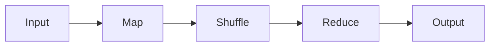
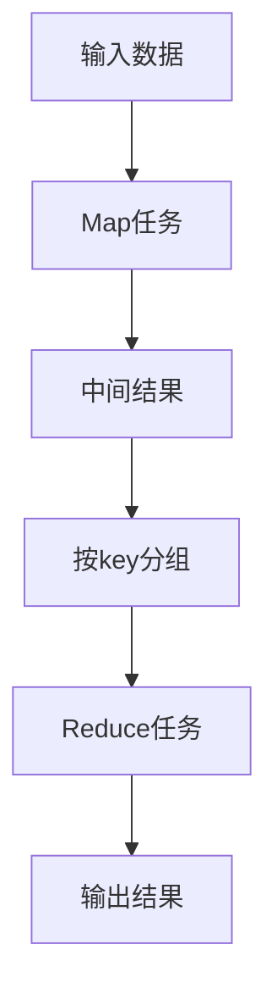

# MapReduce 原理与代码实例讲解

作者：禅与计算机程序设计艺术

## 1. 背景介绍

### 1.1 大数据处理的挑战
随着互联网的快速发展,数据量呈现爆炸式增长。如何高效处理海量数据成为了一个巨大的挑战。传统的单机数据处理方式已经无法满足需求,迫切需要一种新的大规模数据处理模式。

### 1.2 MapReduce的诞生
MapReduce是Google公司在2004年提出的一个用于大规模数据集并行运算的编程模型。它将复杂的、运行在大规模集群上的并行计算过程高度地抽象到了两个函数:Map和Reduce。

### 1.3 MapReduce的影响力  
MapReduce模型影响深远,催生了一系列大数据处理技术和工具的发展,如Hadoop、Spark等。它为大规模数据处理提供了一种简单而强大的编程方式,极大地推动了大数据时代的到来。

## 2. 核心概念与联系

### 2.1 Map函数
- 定义: 对输入的key-value对进行处理,生成中间的key-value对集合
- 输入: <key, value>
- 输出: <key, value>列表
- 执行过程: 并行执行,每个Map任务彼此独立

### 2.2 Reduce函数 
- 定义: 对Map阶段输出的中间结果按照key进行聚合
- 输入: <key, value列表>
- 输出: <key, value>
- 执行过程: 并行执行,每个Reduce任务彼此独立

### 2.3 Shuffle阶段
- 定义: Map和Reduce之间的数据传输过程
- 功能: 将Map输出结果按照key分发给对应的Reduce任务
- 实现: 排序、分区等操作

### 2.4 核心概念关系


## 3. 核心算法原理与操作步骤

### 3.1 基本流程
1. 输入数据被切分为M份,每一份由一个Map任务处理
2. 用户编写的Map函数输入一个key-value对,输出一组中间key-value对
3. MapReduce框架对中间结果按key进行分组,将相同key的value聚合在一起形成列表
4. 用户编写的Reduce函数输入<key, value列表>,进行归约操作,输出最终结果
5. 所有Reduce任务的输出结果合并,形成最终输出

### 3.2 数据流图解


### 3.3 容错机制
- 重复执行: 若某个Map或Reduce任务失败,则重新执行该任务
- 数据备份: Map输出结果写到本地磁盘,同时备份到其他节点

## 4. 数学模型与公式

### 4.1 Map阶段
设输入数据集为 $D={d_1, d_2, ..., d_n}$,Map函数为 $f$,则Map阶段输出为:

$$Map(D) = {f(d_1), f(d_2), ..., f(d_n)}$$

其中, $f(d_i)$ 表示在输入 $d_i$ 上应用Map函数 $f$ 后得到的中间结果集合。

### 4.2 Reduce阶段
设Map输出结果经过分组后形成 $<k_i, v_i>$ 的列表,其中 $k_i$ 为key, $v_i$ 为对应的value列表。Reduce函数为 $g$,则Reduce阶段输出为:

$$Reduce(<k_i, v_i>) = {g(k_1, v_1), g(k_2, v_2), ..., g(k_m, v_m)}$$

其中, $g(k_i, v_i)$ 表示在 $<k_i, v_i>$ 上应用Reduce函数 $g$ 后得到的结果。

### 4.3 词频统计例子
以词频统计为例,设输入数据为一组文本文件,Map函数 $f$ 将每个文件切分为单词,输出 $<word, 1>$。经过Shuffle后,形成 $<word, [1, 1, ...]>$ 的列表。Reduce函数 $g$ 对列表中的计数值求和,输出 $<word, sum>$。

$$Map: f(file) \rightarrow {<word_1, 1>, <word_2, 1>, ...}$$
$$Shuffle: <word, [1, 1, ...]>$$  
$$Reduce: g(word, [1, 1, ...]) \rightarrow <word, sum>$$

## 5. 项目实践：代码实例

下面以Python为例,实现一个简单的MapReduce词频统计程序。

### 5.1 Map函数
```python
def map_func(file):
    for line in open(file):
        for word in line.split():
            yield word, 1
```
Map函数读取文件,将每行切分为单词,输出 `<word, 1>`。

### 5.2 Reduce函数
```python
def reduce_func(word, counts):
    yield word, sum(counts)
```
Reduce函数接收一个单词和对应的计数列表,对计数值求和,输出 `<word, sum>`。

### 5.3 主程序
```python
import mapreduce

inputs = ['file1.txt', 'file2.txt', ...]

mapper = mapreduce.MapReduce(map_func, reduce_func, 3)
word_counts = mapper(inputs)

print(word_counts)
```
主程序指定输入文件、Map和Reduce函数,设置3个Reduce任务,调用MapReduce框架执行任务,最后打印结果。

## 6. 实际应用场景

### 6.1 搜索引擎
MapReduce广泛应用于搜索引擎中的倒排索引构建、PageRank计算等。如对网页集合进行分析,生成倒排索引,加快检索速度。

### 6.2 推荐系统
利用MapReduce对海量用户行为日志进行挖掘分析,计算用户的兴趣特征,实现个性化推荐。如对用户评分、浏览历史等数据进行协同过滤。

### 6.3 网络爬虫
利用MapReduce并行爬取和处理网页。Map任务执行爬虫程序,Reduce任务对爬取结果进行去重、统计等。

### 6.4 机器学习
MapReduce为机器学习算法提供了高效的训练平台。如分布式训练逻辑回归、支持向量机等模型,加速模型迭代过程。

## 7. 工具与资源推荐

### 7.1 Hadoop
- 官网: http://hadoop.apache.org/
- MapReduce是Hadoop的核心组件之一,提供了分布式计算框架
- 配套组件: HDFS分布式文件系统、YARN资源管理系统等

### 7.2 Spark  
- 官网: https://spark.apache.org/
- 基于内存的分布式计算框架,提供了类似MapReduce的编程模型
- 特点: 运算速度快、支持多种语言、提供丰富的类库

### 7.3 Flink
- 官网: https://flink.apache.org/ 
- 实时流计算框架,支持高吞吐、低延迟的流式和批式数据处理  
- 特点: 支持有状态计算、事件时间、exactly-once语义

### 7.4 其他资源
- 论文: MapReduce: Simplified Data Processing on Large Clusters
- 书籍: Hadoop: The Definitive Guide
- 教程: Hadoop MapReduce Tutorial

## 8. 总结与展望

### 8.1 MapReduce的意义
- 抽象了并行计算模型,屏蔽了分布式系统的复杂性
- 实现计算与存储的高度融合,适合数据密集型应用
- 推动了云计算、大数据生态的发展

### 8.2 局限性
- 不适合迭代计算、实时计算等场景
- 中间结果落盘,IO开销大 
- 编程模型受限,表达能力不够灵活

### 8.3 未来发展
- 融合批流一体化处理,支持更加通用的计算场景
- 优化数据本地性和任务调度,提升性能
- 扩展编程模型,提供更加声明式的API
- 与新硬件技术深度结合,如RDMA、NVM等

## 9. 附录：常见问题

### 9.1 什么是数据本地性？为什么重要？
数据本地性是指Map任务和它所需要处理的数据在同一个节点上,避免通过网络传输数据。这对MapReduce性能影响很大,因为网络带宽往往是系统的瓶颈。

### 9.2 MapReduce如何实现排序？
MapReduce保证Reduce的输入数据按key有序。具体实现是在Map输出时对key进行排序,在Shuffle阶段保持这个顺序将数据传给Reduce。用户也可以通过自定义分区器、比较器等控制排序行为。

### 9.3 Combiner的作用是什么？
Combiner是一个本地的"迷你Reduce",在Map端对数据进行局部聚合,减少传输到Reduce端的数据量。但使用时要注意Combiner必须满足结合律和交换律,且不影响最终结果。

### 9.4 MapReduce支持哪些压缩格式？
MapReduce支持多种压缩格式,如DEFLATE、Gzip、Snappy等。压缩可以减少IO和网络传输量,但会增加CPU开销。在IO密集型任务中,使用压缩通常可以提升性能。

### 9.5 MapReduce中的Speculative Execution是什么？
推测执行(Speculative Execution)是指在一个任务执行得比预期慢时,启动该任务的备份执行,取最早完成的任务结果。这可以缓解任务的长尾效应,减少作业的总执行时间。但对于开销大的任务,频繁启动备份可能会降低集群的整体性能。