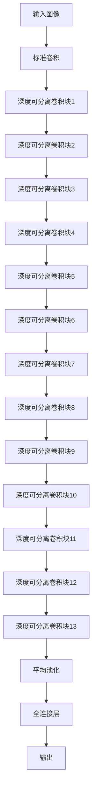

# MobileNet：轻量级卷积神经网络

## 1.背景介绍

### 1.1 移动计算的兴起

随着智能手机和平板电脑的普及,移动计算已经成为当今科技发展的核心驱动力之一。移动设备的计算能力不断提高,但与此同时,人们对更智能、更高效的移动应用也提出了更高的要求。在这种背景下,针对移动设备优化的深度学习模型变得越来越重要。

### 1.2 深度学习模型在移动端的挑战

尽管深度学习在计算机视觉、自然语言处理等领域取得了巨大成功,但将这些模型部署到移动设备上仍然面临着诸多挑战:

1. **计算资源有限**:移动设备的CPU和GPU性能远低于服务器,无法支持大型深度学习模型的运行。
2. **内存和存储空间有限**:移动设备的内存和存储空间有限,无法存储庞大的模型参数。
3. **功耗和发热**:复杂的深度学习模型会导致高功耗和发热,影响设备的续航能力和用户体验。
4. **实时响应要求**:移动应用往往需要实时响应,而传统的深度学习模型推理速度较慢,无法满足这一需求。

### 1.3 MobileNet的提出

为了解决上述挑战,谷歌(Google)的研究人员在2017年提出了MobileNet系列模型,旨在在保持较高精度的同时,大幅降低模型的计算量和存储需求,使其能够高效地运行在移动设备上。MobileNet的核心思想是使用深度可分离卷积(Depthwise Separable Convolution)来构建轻量级的卷积神经网络。

## 2.核心概念与联系

### 2.1 标准卷积

在介绍深度可分离卷积之前,我们先来回顾一下标准卷积的工作原理。标准卷积是卷积神经网络中最基本的操作之一,它将一个输入特征图(Feature Map)与一个卷积核(Kernel)进行卷积运算,生成一个输出特征图。

假设输入特征图的尺寸为$D_F \times D_F \times M$,卷积核的尺寸为$D_K \times D_K \times M \times N$,其中$M$和$N$分别表示输入和输出通道数。标准卷积的计算过程可以表示为:

$$
\begin{aligned}
\text{output}(n_x, n_y, n_n) &= \sum_{m=0}^{M-1} \sum_{i=0}^{D_K-1} \sum_{j=0}^{D_K-1} \\
&\quad\quad\quad\quad\text{input}(n_x+i, n_y+j, m) \cdot \text{kernel}(i, j, m, n_n)
\end{aligned}
$$

其中,$(n_x, n_y)$表示输出特征图的横纵坐标,$(i, j)$表示卷积核的横纵坐标,$m$和$n_n$分别表示输入和输出通道索引。

标准卷积的计算量与输入特征图的尺寸、卷积核的尺寸以及输入输出通道数都有关,当这些值较大时,计算量会迅速增加。

### 2.2 深度可分离卷积

为了减少计算量,MobileNet引入了深度可分离卷积(Depthwise Separable Convolution),它将标准卷积分解为两个更小的卷积操作:深度卷积(Depthwise Convolution)和点wise卷积(Pointwise Convolution)。

**深度卷积**:对输入特征图的每个通道分别应用单独的卷积核,生成与输入通道数相同的输出特征图。深度卷积的计算量与输入特征图的尺寸和卷积核尺寸有关,但与输入输出通道数无关。

**点wise卷积**:对深度卷积的输出特征图进行线性组合,生成新的输出特征图。点wise卷积的计算量与输入特征图的尺寸和输出通道数有关,但与输入通道数无关。

深度可分离卷积的计算量约为标准卷积的 $\frac{1}{N} + \frac{1}{D_K^2}$ 倍,在输入输出通道数和卷积核尺寸较大时,计算量的减少是显著的。

### 2.3 MobileNet架构

MobileNet的基本架构由一系列深度可分离卷积层组成,每个卷积层后面接一个批量归一化(Batch Normalization)层和ReLU激活函数。为了进一步减少计算量,MobileNet还引入了两种策略:

1. **宽度乘数(Width Multiplier)**:通过调整每层输出通道数的倍数来控制模型的宽度。
2. **分辨率乘数(Resolution Multiplier)**:通过调整输入图像的分辨率来控制模型的计算量。

MobileNet的架构如下所示:

## 3.核心算法原理具体操作步骤

MobileNet的核心算法原理是基于深度可分离卷积的卷积神经网络架构。下面我们将详细介绍深度可分离卷积的具体操作步骤。

### 3.1 深度卷积(Depthwise Convolution)

深度卷积是深度可分离卷积的第一步操作。它对输入特征图的每个通道分别应用单独的卷积核,生成与输入通道数相同的输出特征图。具体步骤如下:

1. 对于输入特征图$\text{input}$的每个通道$m$,应用一个$D_K \times D_K$的卷积核$\text{kernel}_m$,得到一个与输入通道$m$对应的输出特征图$\text{output}_m$。

$$
\text{output}_m(n_x, n_y) = \sum_{i=0}^{D_K-1} \sum_{j=0}^{D_K-1} \text{input}(n_x+i, n_y+j, m) \cdot \text{kernel}_m(i, j)
$$

2. 将所有输出特征图$\text{output}_m$沿通道维度堆叠,得到最终的深度卷积输出$\text{depthwise\_output}$,其尺寸为$D_F \times D_F \times M$。

深度卷积的计算量为:

$$
D_K \cdot D_K \cdot M \cdot D_F \cdot D_F
$$

与标准卷积相比,深度卷积的计算量减少了$\frac{1}{N}$倍,其中$N$是输出通道数。

### 3.2 点wise卷积(Pointwise Convolution)

点wise卷积是深度可分离卷积的第二步操作。它对深度卷积的输出特征图进行线性组合,生成新的输出特征图。具体步骤如下:

1. 对于深度卷积的输出$\text{depthwise\_output}$,应用一个$1 \times 1$的卷积核$\text{kernel}_{pw}$,得到点wise卷积的输出$\text{pointwise\_output}$。

$$
\begin{aligned}
\text{pointwise\_output}(n_x, n_y, n_n) &= \sum_{m=0}^{M-1} \\
&\quad\quad\quad\quad\text{depthwise\_output}(n_x, n_y, m) \cdot \text{kernel}_{pw}(m, n_n)
\end{aligned}
$$

2. 点wise卷积的输出$\text{pointwise\_output}$的尺寸为$D_F \times D_F \times N$,其中$N$是输出通道数。

点wise卷积的计算量为:

$$
M \cdot N \cdot D_F \cdot D_F
$$

与标准卷积相比,点wise卷积的计算量减少了$\frac{1}{D_K^2}$倍,其中$D_K$是卷积核尺寸。

### 3.3 深度可分离卷积总计算量

深度可分离卷积的总计算量为深度卷积和点wise卷积的计算量之和:

$$
\begin{aligned}
\text{计算量} &= D_K \cdot D_K \cdot M \cdot D_F \cdot D_F + M \cdot N \cdot D_F \cdot D_F \\
&= (D_K \cdot D_K + N) \cdot M \cdot D_F \cdot D_F
\end{aligned}
$$

与标准卷积相比,深度可分离卷积的计算量约为标准卷积的$\frac{1}{N} + \frac{1}{D_K^2}$倍。当输入输出通道数$N$和卷积核尺寸$D_K$较大时,计算量的减少是显著的。

## 4.数学模型和公式详细讲解举例说明

在上一节中,我们介绍了深度可分离卷积的具体操作步骤。现在,我们将通过一个具体的例子,详细讲解深度可分离卷积的数学模型和公式。

### 4.1 示例数据

假设我们有一个输入特征图$\text{input}$,其尺寸为$4 \times 4 \times 3$,即高度和宽度均为4,通道数为3。我们将使用一个$3 \times 3$的卷积核,输出通道数为2。

输入特征图$\text{input}$的数据如下:

$$
\text{input} = \begin{bmatrix}
\begin{bmatrix}
1 & 2 & 3 & 4\\
5 & 6 & 7 & 8\\
9 & 10 & 11 & 12\\
13 & 14 & 15 & 16
\end{bmatrix} &
\begin{bmatrix}
17 & 18 & 19 & 20\\
21 & 22 & 23 & 24\\
25 & 26 & 27 & 28\\
29 & 30 & 31 & 32
\end{bmatrix} &
\begin{bmatrix}
33 & 34 & 35 & 36\\
37 & 38 & 39 & 40\\
41 & 42 & 43 & 44\\
45 & 46 & 47 & 48
\end{bmatrix}
\end{bmatrix}
$$

### 4.2 深度卷积

我们将对输入特征图$\text{input}$的每个通道分别应用一个$3 \times 3$的卷积核,得到三个输出特征图。

对于第一个通道,我们使用卷积核$\text{kernel}_1$:

$$
\text{kernel}_1 = \begin{bmatrix}
1 & 2 & 3\\
4 & 5 & 6\\
7 & 8 & 9
\end{bmatrix}
$$

第一个输出特征图$\text{output}_1$的计算过程如下:

$$
\begin{aligned}
\text{output}_1(0, 0) &= 1 \cdot 1 + 2 \cdot 5 + 3 \cdot 9 + 2 \cdot 2 + 6 \cdot 6 + 7 \cdot 10 + 3 \cdot 3 + 7 \cdot 7 + 11 \cdot 11 = 285\\
\text{output}_1(0, 1) &= 2 \cdot 2 + 6 \cdot 6 + 10 \cdot 10 + 3 \cdot 3 + 7 \cdot 7 + 11 \cdot 11 + 4 \cdot 4 + 8 \cdot 8 + 12 \cdot 12 = 342\\
\text{output}_1(1, 0) &= 5 \cdot 1 + 6 \cdot 5 + 7 \cdot 9 + 10 \cdot 2 + 11 \cdot 6 + 12 \cdot 10 + 13 \cdot 3 + 14 \cdot 7 + 15 \cdot 11 = 453\\
\text{output}_1(1, 1) &= 6 \cdot 2 + 11 \cdot 6 + 12 \cdot 10 + 7 \cdot 3 + 12 \cdot 7 + 16 \cdot 11 + 8 \cdot 4 + 15 \cdot 8