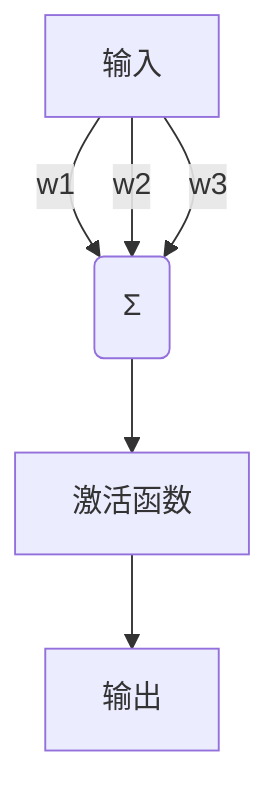
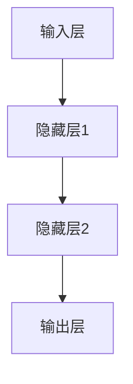

# Neural Network

## 1. 背景介绍

神经网络是一种受生物神经系统启发的机器学习模型,旨在模拟人脑的工作原理。它由大量互相连接的节点(神经元)组成,这些节点可以接收输入,进行计算处理,并产生输出。神经网络的关键优势在于其强大的模式识别和数据处理能力,使其能够解决许多复杂的问题,如图像识别、自然语言处理和决策制定等。

### 1.1 神经网络的发展历史

神经网络的概念可以追溯到20世纪40年代,当时生物学家沃伦·麦卡洛克和逻辑学家沃尔特·皮茨提出了第一个神经网络模型。然而,由于计算能力的限制和理论上的局限性,神经网络在很长一段时间内都没有取得实质性的进展。直到20世纪80年代,随着反向传播算法的发明和计算机硬件的快速发展,神经网络才开始获得广泛的关注和应用。

近年来,随着大数据时代的到来和深度学习技术的飞速发展,神经网络已成为机器学习领域最热门和最成功的技术之一。深度神经网络能够从海量数据中自动学习特征表示,并在许多领域取得了超越人类的性能,如图像识别、语音识别、自然语言处理等。

### 1.2 神经网络的应用领域

神经网络在各个领域都有广泛的应用,包括但不限于:

- **计算机视觉**: 图像识别、目标检测、语义分割等
- **自然语言处理**: 机器翻译、文本生成、情感分析等
- **语音识别**: 语音转文本、语音合成等
- **推荐系统**: 个性化推荐、内容过滤等
- **金融**: 股票预测、欺诈检测、风险管理等
- **医疗保健**: 疾病诊断、药物发现、医学图像分析等
- **机器人**: 控制系统、路径规划、视觉导航等

神经网络的应用范围正在不断扩大,它已经成为人工智能领域最重要和最有前景的技术之一。

## 2. 核心概念与联系

### 2.1 神经元

神经元是神经网络的基本计算单元,它模拟了生物神经元的工作原理。一个典型的神经元由三个主要部分组成:输入、权重和激活函数。



1. **输入(Input)**: 神经元接收来自其他神经元或外部数据源的输入信号。
2. **权重(Weight)**: 每个输入都与一个权重相关联,权重决定了该输入对神经元输出的影响程度。
3. **激活函数(Activation Function)**: 激活函数对神经元的加权输入求和进行非线性转换,产生神经元的输出。常用的激活函数包括Sigmoid函数、ReLU(整流线性单元)函数等。

神经元的输出可以表示为:

$$
y = f\left(\sum_{i=1}^{n}w_ix_i + b\right)
$$

其中:
- $y$是神经元的输出
- $f$是激活函数
- $w_i$是第$i$个输入的权重
- $x_i$是第$i$个输入
- $b$是偏置项(bias)
- $n$是输入的数量

通过调整权重和偏置,神经元可以学习到特定的映射关系,从而实现各种复杂的计算任务。

### 2.2 神经网络结构

神经网络由多个神经元组成,这些神经元按层级组织,形成一个复杂的网络结构。一个典型的神经网络包括以下几层:

1. **输入层(Input Layer)**: 接收外部数据输入。
2. **隐藏层(Hidden Layers)**: 对输入数据进行特征提取和转换,可以有多个隐藏层。
3. **输出层(Output Layer)**: 产生最终的输出结果。



神经网络的层数和每层神经元的数量决定了网络的复杂度和表达能力。一般来说,更深更宽的神经网络能够学习更复杂的映射关系,但也更容易出现过拟合和计算效率低下的问题。

### 2.3 前向传播和反向传播

神经网络的工作过程分为两个阶段:前向传播(Forward Propagation)和反向传播(Backward Propagation)。

**前向传播**是指将输入数据通过网络层层传递,计算出最终的输出。在这个过程中,每个神经元根据其输入和权重计算出激活值,并将激活值传递给下一层的神经元。

**反向传播**是指根据输出与期望值之间的误差,通过调整网络中每个神经元的权重和偏置,使得误差最小化。这个过程从输出层开始,逐层向后传播误差,并根据误差梯度更新每个神经元的权重和偏置。反向传播算法是训练神经网络的关键,它使得神经网络能够从数据中学习,不断优化自身的参数。

## 3. 核心算法原理具体操作步骤

神经网络的训练过程可以概括为以下几个步骤:

1. **初始化权重和偏置**: 通常使用小的随机值初始化网络中所有神经元的权重和偏置。
2. **前向传播**: 将训练数据输入到网络中,计算每一层的激活值,直到得到输出层的输出。
3. **计算损失函数**: 比较输出层的输出与期望输出之间的差异,计算损失函数(如均方误差、交叉熵等)。
4. **反向传播**: 从输出层开始,计算每个神经元的误差梯度,并沿着网络反向传播,更新每个神经元的权重和偏置。
5. **更新权重和偏置**: 根据计算出的梯度,使用优化算法(如梯度下降、Adam等)更新每个神经元的权重和偏置。
6. **重复训练**: 重复步骤2-5,直到损失函数收敛或达到预设的迭代次数。

以下是反向传播算法的伪代码:

```
初始化网络权重和偏置
repeat:
    # 前向传播
    for each layer in network:
        计算层的激活值
    
    # 计算损失函数
    计算输出层与期望输出之间的损失
    
    # 反向传播
    for each layer in reversed(network):
        计算层的误差梯度
        更新层的权重和偏置
        
until 损失函数收敛或达到最大迭代次数
```

在训练过程中,还需要注意以下几个关键点:

- **批量梯度下降**: 为了提高计算效率,通常会将训练数据分成多个批次(batch),每次迭代计算一个批次的梯度,并更新权重和偏置。
- **学习率(Learning Rate)**: 控制每次权重和偏置更新的步长,过大可能导致发散,过小可能导致收敛缓慢。
- **正则化(Regularization)**: 为了防止过拟合,常用的正则化方法包括L1正则化、L2正则化、Dropout等。
- **优化算法**: 除了基本的梯度下降算法,还有一些更高级的优化算法,如Momentum、RMSProp、Adam等,可以加快收敛速度。

通过不断迭代训练,神经网络可以逐步学习到从输入映射到输出的复杂函数关系,从而解决各种实际问题。

## 4. 数学模型和公式详细讲解举例说明

### 4.1 损失函数

损失函数(Loss Function)用于衡量神经网络的输出与期望输出之间的差异,是训练过程中需要优化的目标函数。常用的损失函数包括:

1. **均方误差(Mean Squared Error, MSE)**: 主要用于回归问题,计算输出与期望值之间的平方差。

$$
\mathrm{MSE} = \frac{1}{n}\sum_{i=1}^{n}(y_i - \hat{y}_i)^2
$$

其中$n$是样本数量,$y_i$是期望输出,$\hat{y}_i$是神经网络的输出。

2. **交叉熵(Cross Entropy)**: 主要用于分类问题,衡量预测概率分布与真实概率分布之间的差异。

对于二分类问题:

$$
\mathrm{CE} = -\frac{1}{n}\sum_{i=1}^{n}[y_i\log(\hat{y}_i) + (1-y_i)\log(1-\hat{y}_i)]
$$

对于多分类问题:

$$
\mathrm{CE} = -\frac{1}{n}\sum_{i=1}^{n}\sum_{j=1}^{C}y_{ij}\log(\hat{y}_{ij})
$$

其中$C$是类别数量,$y_{ij}$是第$i$个样本属于第$j$类的真实标签(0或1),$\hat{y}_{ij}$是第$i$个样本属于第$j$类的预测概率。

### 4.2 梯度下降

梯度下降(Gradient Descent)是神经网络训练中最常用的优化算法,用于更新网络中每个神经元的权重和偏置。其基本思想是沿着损失函数的负梯度方向更新参数,从而最小化损失函数。

对于单个参数$\theta$,梯度下降的更新规则为:

$$
\theta \leftarrow \theta - \eta \frac{\partial L}{\partial \theta}
$$

其中:
- $L$是损失函数
- $\eta$是学习率(Learning Rate),控制每次更新的步长
- $\frac{\partial L}{\partial \theta}$是损失函数关于参数$\theta$的梯度

对于神经网络中的所有参数$\Theta$,梯度下降的更新规则为:

$$
\Theta \leftarrow \Theta - \eta \nabla_\Theta L
$$

其中$\nabla_\Theta L$是损失函数关于所有参数的梯度向量。

梯度的计算通过反向传播算法实现,具体步骤如下:

1. 前向传播计算输出
2. 计算输出层的误差梯度
3. 反向传播计算每一层的误差梯度
4. 更新每个神经元的权重和偏置

通过不断迭代这个过程,神经网络可以逐步减小损失函数,从而学习到更好的参数。

### 4.3 正则化

为了防止神经网络过拟合,常常需要引入正则化(Regularization)技术。正则化的基本思想是在损失函数中加入一个惩罚项,对模型的复杂度进行约束,从而提高模型的泛化能力。

常用的正则化方法包括:

1. **L1正则化(Lasso Regularization)**:

$$
L = L_0 + \lambda\sum_{i=1}^{n}|w_i|
$$

其中$L_0$是原始损失函数,$\lambda$是正则化系数,控制正则化强度,$w_i$是第$i$个权重参数。L1正则化可以产生稀疏解,即一些权重会被压缩为0。

2. **L2正则化(Ridge Regularization)**:

$$
L = L_0 + \lambda\sum_{i=1}^{n}w_i^2
$$

L2正则化会使得权重参数趋向于较小的值,但不会完全为0。

3. **Dropout**:

Dropout是一种常用的正则化技术,它通过在训练过程中随机丢弃一部分神经元,从而减少神经元之间的相互依赖,提高模型的泛化能力。

### 4.4 优化算法

除了基本的梯度下降算法,还有一些更高级的优化算法,可以加快神经网络的收敛速度。常用的优化算法包括:

1. **Momentum**:

Momentum算法在梯度下降的基础上引入了动量项,使得参数更新方向不仅取决于当前梯度,还取决于之前的更新方向。这可以加速收敛并帮助跳出局部最优。

2. **RMSProp**:

RMSProp算法通过对梯度进行指数加权平均,自适应地调整每个参数的学习率,从而加快收敛速度。

3. **Adam**:

Adam算法是RMSProp和Momentum的结合,它同时利用了动量项和自适应学习率调整,被认为是目前最高效的优化算法之一。

这