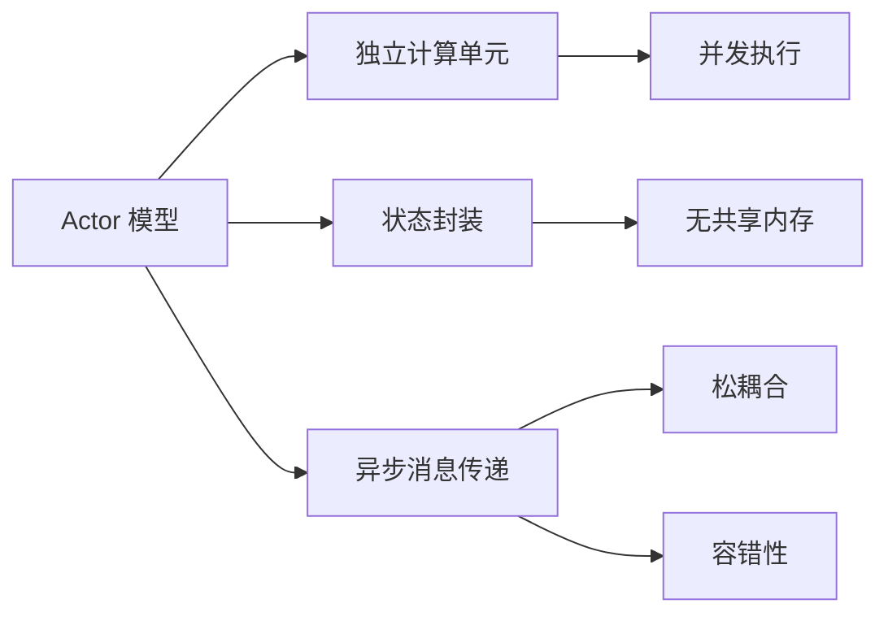
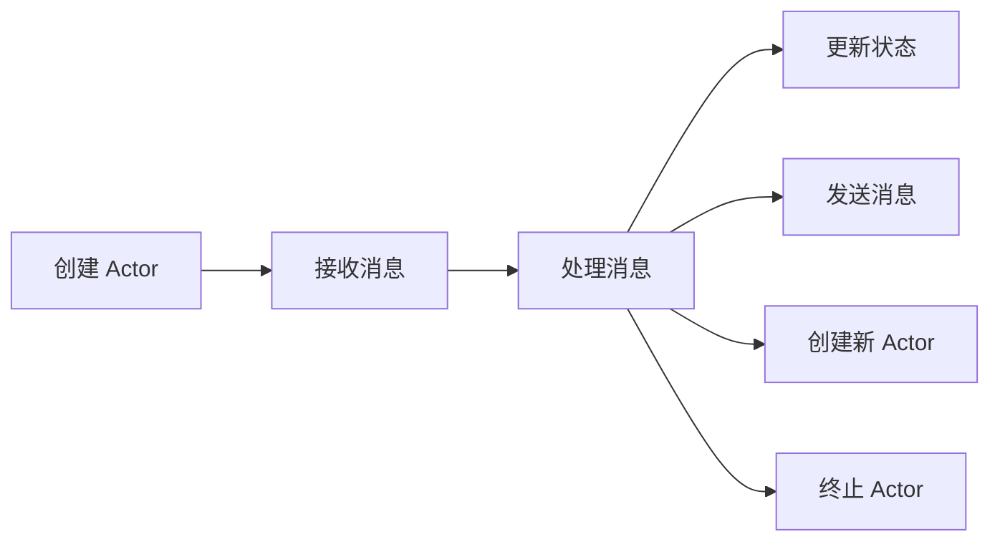
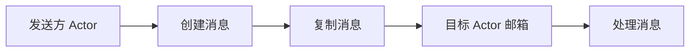
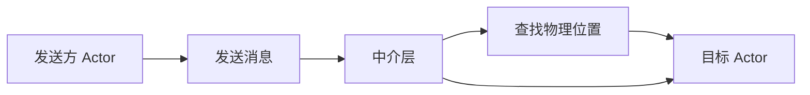
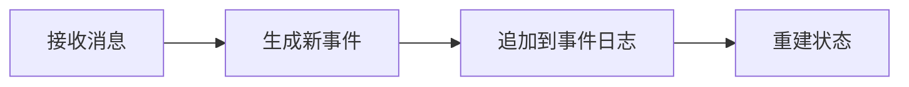

# Precision 原理与代码实战案例讲解

## 1.背景介绍

### 1.1 什么是 Precision

Precision 是一种用于构建高性能、分布式、容错系统的编程范式和框架。它基于一组设计原则和模式,旨在简化复杂系统的开发,提高系统的可靠性、可扩展性和可维护性。Precision 的核心思想是将系统分解为多个独立的、可复制的单元,这些单元通过异步消息传递进行通信和协作。

### 1.2 Precision 的起源和发展

Precision 的概念源于 20 世纪 70 年代,当时分布式计算和容错系统的研究开始兴起。随着互联网和云计算的发展,构建大规模、高可用的分布式系统变得越来越重要。Precision 作为一种新兴的编程范式,为解决这些挑战提供了有效的方法。

### 1.3 Precision 的应用场景

Precision 广泛应用于各种需要高性能、高可用性和可扩展性的领域,如电子商务、在线游戏、物联网、金融服务等。它使开发人员能够更轻松地构建复杂的分布式系统,同时提高系统的容错能力和资源利用效率。

## 2.核心概念与联系

### 2.1 Actor 模型

Actor 模型是 Precision 的核心概念,它将系统划分为多个独立的 Actor。每个 Actor 都是一个独立的计算单元,拥有自己的状态和行为。Actor 之间通过异步消息传递进行通信,而不是共享内存或锁。这种设计有助于提高并发性和容错性。



### 2.2 Location Transparency

Location Transparency 是 Precision 中的另一个重要概念。它意味着 Actor 可以在任何节点上运行,而不需要知道其他 Actor 的物理位置。这种透明性使得系统更加灵活和可扩展,因为 Actor 可以动态地在不同节点之间迁移,以实现负载均衡和故障转移。

### 2.3 事件溯源 (Event Sourcing)

事件溯源是一种在 Precision 系统中管理状态的模式。它将系统的状态变化记录为一系列不可变的事件,而不是直接更新状态。这种方式有助于提高系统的可审计性、可重放性和容错性。事件溯源与 Actor 模型相结合,可以实现高度可靠和一致的分布式系统。

## 3.核心算法原理具体操作步骤

### 3.1 Actor 生命周期

每个 Actor 都有自己的生命周期,包括创建、处理消息、更改状态和终止。Actor 的行为由其接收到的消息决定,而不是由外部调用决定。这种设计有助于提高并发性和封装性。

1. 创建 Actor
2. 接收消息
3. 处理消息
   - 更新内部状态
   - 发送消息给其他 Actor
   - 创建新的 Actor
4. 终止 Actor



### 3.2 消息传递

Actor 之间通过异步消息传递进行通信。消息是不可变的,并且会被复制到目标 Actor 的邮箱中。目标 Actor 会按照消息到达的顺序依次处理它们。这种设计确保了消息的可靠传递和处理顺序。

1. 发送方 Actor 创建消息
2. 消息被复制到目标 Actor 的邮箱
3. 目标 Actor 按顺序处理邮箱中的消息



### 3.3 Location Transparency 实现

Location Transparency 通过引入一个中介层来实现,该层负责将消息路由到正确的 Actor。发送方 Actor 只需要知道目标 Actor 的逻辑地址,而不需要知道其物理位置。中介层会根据逻辑地址找到目标 Actor 的实际位置,并将消息传递给它。

1. 发送方 Actor 发送消息,包含目标 Actor 的逻辑地址
2. 中介层接收消息,根据逻辑地址查找目标 Actor 的物理位置
3. 中介层将消息转发给目标 Actor



### 3.4 事件溯源实现

在事件溯源中,每个 Actor 都维护一个事件日志,记录它所有的状态变化。当 Actor 接收到一条消息时,它会根据当前状态和消息内容生成一个新事件,并将该事件追加到事件日志中。Actor 的状态由事件日志重建,而不是直接修改。

1. Actor 接收消息
2. 根据当前状态和消息生成新事件
3. 将新事件追加到事件日志
4. 从事件日志重建状态



## 4.数学模型和公式详细讲解举例说明

在 Precision 中,一些核心概念和算法可以用数学模型和公式来描述和分析。

### 4.1 Actor 模型形式化定义

Actor 模型可以用一个三元组 $(S, B, M)$ 来表示,其中:

- $S$ 是 Actor 的状态集合
- $B$ 是 Actor 的行为函数集合,每个函数 $b \in B$ 将当前状态和接收到的消息映射到一个新状态和一系列动作
- $M$ 是 Actor 可以接收和发送的消息集合

对于任何 Actor $a$,它的行为可以用以下公式表示:

$$
(s', A) = b(s, m)
$$

其中:

- $s$ 是 Actor 的当前状态
- $m$ 是接收到的消息
- $b \in B$ 是 Actor 的行为函数
- $s'$ 是 Actor 的新状态
- $A$ 是 Actor 执行的一系列动作,如发送消息、创建新 Actor 等

### 4.2 消息传递模型

消息传递是 Actor 模型中的关键机制。假设有两个 Actor $a$ 和 $b$,其中 $a$ 向 $b$ 发送一条消息 $m$。这个过程可以用以下公式描述:

$$
(s_b', A_b) = b_b(s_b, m)
$$

其中:

- $s_b$ 是 $b$ 的当前状态
- $b_b \in B_b$ 是 $b$ 的行为函数
- $s_b'$ 是 $b$ 的新状态
- $A_b$ 是 $b$ 执行的动作序列

注意,发送方 Actor $a$ 的状态不受影响,因为消息传递是异步的。

### 4.3 Location Transparency 模型

Location Transparency 可以用一个映射函数 $\phi$ 来表示,它将 Actor 的逻辑地址映射到物理位置。假设有一个 Actor $a$,其逻辑地址为 $l_a$,物理位置为 $p_a$,则有:

$$
p_a = \phi(l_a)
$$

发送方 Actor 只需要知道目标 Actor 的逻辑地址,中介层会使用 $\phi$ 函数找到目标 Actor 的物理位置,并将消息传递给它。

### 4.4 事件溯源模型

在事件溯源中,Actor 的状态由一系列事件决定。假设 Actor $a$ 的初始状态为 $s_0$,它接收到一系列事件 $e_1, e_2, \ldots, e_n$,则 Actor 的最终状态 $s_n$ 可以用以下公式计算:

$$
s_n = f(s_0, e_1, e_2, \ldots, e_n)
$$

其中 $f$ 是一个状态转换函数,它将初始状态和所有事件应用,得到最终状态。

事件溯源的优点在于,只要保存事件日志,就可以重建任何时刻的状态。这提高了系统的可审计性和容错性。

## 4.项目实践:代码实例和详细解释说明

为了更好地理解 Precision 的原理和实现,我们将通过一个简单的在线商店示例来演示如何使用 Precision 构建一个分布式系统。

### 4.1 系统概述

我们的在线商店系统包括以下几个主要组件:

- `ShoppingCartActor`: 管理用户的购物车,响应添加、删除和查看商品的操作。
- `InventoryActor`: 管理商品库存,响应查询库存和更新库存的操作。
- `OrderActor`: 处理订单,与 `ShoppingCartActor` 和 `InventoryActor` 协作完成下单流程。

### 4.2 Actor 定义

首先,我们定义 `ShoppingCartActor`。它维护一个购物车状态,并响应以下消息:

```scala
// Scala 示例代码
case class AddItem(itemId: String, quantity: Int)
case class RemoveItem(itemId: String, quantity: Int)
case object ViewCart
case object Checkout

class ShoppingCartActor extends Actor {
  import ShoppingCartActor._

  var cart: Map[String, Int] = Map.empty

  def receive: Receive = {
    case AddItem(itemId, quantity) =>
      cart = cart.updated(itemId, cart.getOrElse(itemId, 0) + quantity)

    case RemoveItem(itemId, quantity) =>
      val newQuantity = cart.getOrElse(itemId, 0) - quantity
      if (newQuantity <= 0) {
        cart = cart.removed(itemId)
      } else {
        cart = cart.updated(itemId, newQuantity)
      }

    case ViewCart =>
      sender() ! cart

    case Checkout =>
      // 与 InventoryActor 和 OrderActor 协作完成下单流程
      // ...
  }
}

object ShoppingCartActor {
  def props(): Props = Props(new ShoppingCartActor())
}
```

接下来,我们定义 `InventoryActor`。它维护商品库存状态,并响应以下消息:

```scala
// Scala 示例代码
case class QueryInventory(itemId: String)
case class UpdateInventory(itemId: String, quantity: Int)

class InventoryActor extends Actor {
  import InventoryActor._

  var inventory: Map[String, Int] = Map.empty

  def receive: Receive = {
    case QueryInventory(itemId) =>
      sender() ! inventory.getOrElse(itemId, 0)

    case UpdateInventory(itemId, quantity) =>
      inventory = inventory.updated(itemId, inventory.getOrElse(itemId, 0) + quantity)
  }
}

object InventoryActor {
  def props(): Props = Props(new InventoryActor())
}
```

最后,我们定义 `OrderActor`。它协调 `ShoppingCartActor` 和 `InventoryActor` 完成下单流程:

```scala
// Scala 示例代码
case class PlaceOrder(cartActor: ActorRef, inventoryActor: ActorRef)

class OrderActor extends Actor {
  import OrderActor._

  def receive: Receive = {
    case PlaceOrder(cartActor, inventoryActor) =>
      // 1. 获取购物车内容
      cartActor ! ViewCart
      val cart = expectMsgPF() {
        case cart: Map[String, Int] => cart
      }

      // 2. 检查库存
      val outOfStock = cart.flatMap {
        case (itemId, quantity) =>
          inventoryActor ! QueryInventory(itemId)
          val stock = expectMsgPF() {
            case stock: Int => stock
          }
          if (stock < quantity) Some(itemId -> (quantity - stock))
          else None
      }

      if (outOfStock.isEmpty) {
        // 3. 更新库存
        cart.foreach {
          case (itemId, quantity) =>
            inventoryActor ! UpdateInventory(itemId, -quantity)
        }
        // 4. 完成订单
        // ...
      } else {
        // 库存不足,取消订单
        // ...
      }
  }
}

object OrderActor {
  def props(): Props = Props(new OrderActor())
}
```

在这个示例中,我们展示了如何使用 Actor 模型构建一个分布式在线商店系统。每个组件都是一个独立的 Actor,通过异步消息传递进行协作。这种设计提高了系统的可扩展性和容错性。

### 4