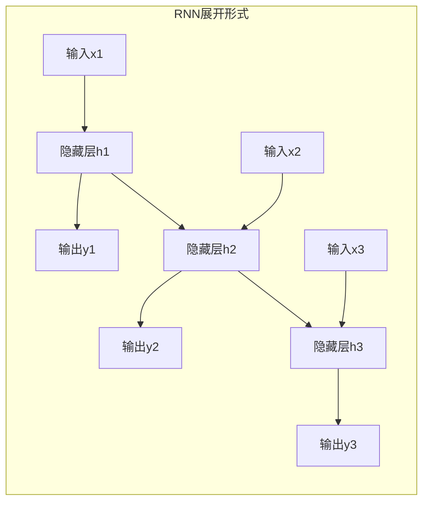

# Recurrent Neural Networks (RNN) 原理与代码实战案例讲解

## 1.背景介绍

### 1.1 序列数据处理的重要性

在现实世界中,我们经常会遇到各种序列数据,如自然语言处理中的句子和文本、语音识别中的语音信号、机器翻译中的源语言和目标语言序列等。传统的机器学习算法如决策树、支持向量机等无法很好地处理这种序列数据,因为它们通常将输入数据看作是独立同分布的,而忽视了数据内在的顺序关系。

### 1.2 循环神经网络(RNN)的产生

为了解决序列数据处理问题,循环神经网络(Recurrent Neural Network, RNN)应运而生。与前馈神经网络不同,RNN在隐藏层之间增加了循环连接,使得网络在处理序列时能够利用之前时刻的状态,捕捉输入序列中的动态行为和时间模式。这种循环结构赋予了RNN处理序列数据的能力,使其在自然语言处理、语音识别、机器翻译等领域取得了巨大成功。

## 2.核心概念与联系

### 2.1 RNN的基本结构

RNN的基本结构由一个输入层、一个隐藏层和一个输出层组成。与传统的前馈神经网络不同,RNN的隐藏层之间存在循环连接,使得隐藏层的状态不仅取决于当前时刻的输入,还取决于前一时刻的隐藏状态。这种循环结构使RNN能够捕捉输入序列中的时间动态信息。

$$
h_t = f(W_{hx}x_t + W_{hh}h_{t-1} + b_h)\\
y_t = g(W_{yh}h_t + b_y)
$$

其中,$x_t$表示时刻t的输入,$h_t$表示时刻t的隐藏状态,$y_t$表示时刻t的输出,W为权重矩阵,b为偏置向量,f和g分别为隐藏层和输出层的激活函数。

### 2.2 RNN的展开形式

为了更好地理解RNN的工作原理,我们可以将其展开成一个链式结构。在这种展开形式中,每个时刻的输入、隐藏状态和输出都被视为一个独立的网络层,并且这些层之间通过循环连接相互关联。这种展开形式有助于我们理解RNN是如何在时间维度上传播信息的。



### 2.3 RNN的应用场景

由于RNN能够处理序列数据,因此它在以下领域有着广泛的应用:

- **自然语言处理**: 如机器翻译、文本生成、情感分析等。
- **语音识别**: 将语音信号转换为文本。
- **时间序列预测**: 如天气预报、股票价格预测等。
- **手写识别**: 将手写体转换为文本。
- **机器人控制**: 根据传感器数据控制机器人的运动。

## 3.核心算法原理具体操作步骤

虽然RNN在理论上可以捕捉任意长度的序列信息,但在实践中,由于梯度消失和梯度爆炸问题,它只能学习有限长度的序列模式。为了解决这个问题,研究人员提出了一些改进的RNN变体,如长短期记忆网络(LSTM)和门控循环单元(GRU)。

### 3.1 RNN的前向传播

RNN的前向传播过程可以概括为以下步骤:

1. 初始化隐藏状态$h_0$,通常将其设置为全0向量。
2. 对于每个时刻t:
   - 计算当前时刻的隐藏状态$h_t$,根据前一时刻的隐藏状态$h_{t-1}$和当前输入$x_t$。
   - 计算当前时刻的输出$y_t$,根据当前隐藏状态$h_t$。
3. 重复步骤2,直到处理完整个序列。

以下是RNN前向传播的Python伪代码:

```python
def forward(inputs, hidden):
    outputs = []
    for x in inputs:
        hidden = np.tanh(np.dot(W_hx, x) + np.dot(W_hh, hidden) + b_h)
        output = np.dot(W_yh, hidden) + b_y
        outputs.append(output)
    return outputs, hidden
```

### 3.2 RNN的反向传播

RNN的反向传播过程需要计算每个时刻的梯度,并通过时间反向传播误差。具体步骤如下:

1. 初始化输出层梯度$\delta_o$。
2. 对于每个时刻t(从最后一个时刻开始,逆序计算):
   - 计算隐藏层梯度$\delta_h^t$,根据当前时刻的输出梯度$\delta_o^t$和下一时刻的隐藏层梯度$\delta_h^{t+1}$。
   - 计算当前时刻的权重梯度,并累加到总梯度中。
3. 更新权重和偏置。

以下是RNN反向传播的Python伪代码:

```python
def backward(inputs, outputs, hidden, targets):
    dW_hx, dW_hh, dW_yh = np.zeros_like(W_hx), np.zeros_like(W_hh), np.zeros_like(W_yh)
    db_h, db_y = np.zeros_like(b_h), np.zeros_like(b_y)
    delta_h_next = np.zeros_like(hidden)
    
    for t in reversed(range(len(inputs))):
        delta_o = outputs[t] - targets[t]
        delta_h = np.dot(W_yh.T, delta_o) + delta_h_next
        delta_h_next = delta_h * (1 - hidden ** 2)
        
        dW_hx += np.outer(delta_h_next, inputs[t])
        dW_hh += np.outer(delta_h_next, hidden)
        dW_yh += np.outer(delta_o, hidden)
        db_h += delta_h_next
        db_y += delta_o
        
    return dW_hx, dW_hh, dW_yh, db_h, db_y
```

### 3.3 RNN的梯度消失和梯度爆炸

尽管RNN在理论上可以捕捉任意长度的序列信息,但在实践中,由于梯度消失和梯度爆炸问题,它只能学习有限长度的序列模式。

**梯度消失**:在反向传播过程中,由于使用了激活函数(如tanh或relu),梯度会逐渐衰减,导致无法有效地传播长距离的梯度信息。这使得RNN难以学习长期依赖关系。

**梯度爆炸**:与梯度消失相反,在某些情况下,梯度会呈指数级增长,导致权重更新过大,网络无法收敛。

为了解决这些问题,研究人员提出了一些改进的RNN变体,如长短期记忆网络(LSTM)和门控循环单元(GRU),它们通过引入门控机制来更好地捕捉长期依赖关系。

## 4.数学模型和公式详细讲解举例说明

### 4.1 RNN的数学模型

RNN的数学模型可以用以下公式表示:

$$
\begin{aligned}
h_t &= f(W_{hx}x_t + W_{hh}h_{t-1} + b_h)\\
y_t &= g(W_{yh}h_t + b_y)
\end{aligned}
$$

其中:

- $x_t$是时刻t的输入向量
- $h_t$是时刻t的隐藏状态向量
- $y_t$是时刻t的输出向量
- $W_{hx}$是输入到隐藏层的权重矩阵
- $W_{hh}$是隐藏层到隐藏层的权重矩阵
- $W_{yh}$是隐藏层到输出层的权重矩阵
- $b_h$和$b_y$分别是隐藏层和输出层的偏置向量
- $f$和$g$分别是隐藏层和输出层的激活函数,通常使用tanh或relu函数

在前向传播过程中,RNN根据当前输入$x_t$和前一时刻的隐藏状态$h_{t-1}$计算当前时刻的隐藏状态$h_t$,然后根据$h_t$计算输出$y_t$。在反向传播过程中,RNN需要计算每个时刻的梯度,并通过时间反向传播误差。

### 4.2 RNN的展开形式

为了更好地理解RNN的工作原理,我们可以将其展开成一个链式结构。在这种展开形式中,每个时刻的输入、隐藏状态和输出都被视为一个独立的网络层,并且这些层之间通过循环连接相互关联。


在这个展开形式中,每个时刻的隐藏状态$h_t$不仅取决于当前时刻的输入$x_t$,还取决于前一时刻的隐藏状态$h_{t-1}$。这种循环结构使RNN能够捕捉输入序列中的时间动态信息。

### 4.3 RNN的反向传播算法

RNN的反向传播算法需要计算每个时刻的梯度,并通过时间反向传播误差。具体步骤如下:

1. 初始化输出层梯度$\delta_o^t$:
   $$\delta_o^t = \frac{\partial E}{\partial y_t}$$
   其中$E$是损失函数。

2. 对于每个时刻t(从最后一个时刻开始,逆序计算):
   - 计算隐藏层梯度$\delta_h^t$:
     $$\delta_h^t = \frac{\partial E}{\partial h_t} = \frac{\partial E}{\partial y_t}\frac{\partial y_t}{\partial h_t} + \frac{\partial E}{\partial h_{t+1}}\frac{\partial h_{t+1}}{\partial h_t}$$
   - 计算当前时刻的权重梯度:
     $$\begin{aligned}
     \frac{\partial E}{\partial W_{hx}} &= \delta_h^t \frac{\partial h_t}{\partial W_{hx}} = \delta_h^t x_t^T\\
     \frac{\partial E}{\partial W_{hh}} &= \delta_h^t \frac{\partial h_t}{\partial W_{hh}} = \delta_h^t h_{t-1}^T\\
     \frac{\partial E}{\partial W_{yh}} &= \delta_o^t \frac{\partial y_t}{\partial W_{yh}} = \delta_o^t h_t^T
     \end{aligned}$$
   - 计算当前时刻的偏置梯度:
     $$\begin{aligned}
     \frac{\partial E}{\partial b_h} &= \delta_h^t\\
     \frac{\partial E}{\partial b_y} &= \delta_o^t
     \end{aligned}$$

3. 更新权重和偏置:
   $$\begin{aligned}
   W_{hx} &\leftarrow W_{hx} - \alpha\frac{\partial E}{\partial W_{hx}}\\
   W_{hh} &\leftarrow W_{hh} - \alpha\frac{\partial E}{\partial W_{hh}}\\
   W_{yh} &\leftarrow W_{yh} - \alpha\frac{\partial E}{\partial W_{yh}}\\
   b_h &\leftarrow b_h - \alpha\frac{\partial E}{\partial b_h}\\
   b_y &\leftarrow b_y - \alpha\frac{\partial E}{\partial b_y}
   \end{aligned}$$
   其中$\alpha$是学习率。

通过上述反向传播算法,RNN可以根据损失函数的梯度信息不断更新权重和偏置,从而学习到序列数据中的时间模式。

### 4.4 梯度消失和梯度爆炸问题

尽管RNN在理论上可以捕捉任意长度的序列信息,但在实践中,由于梯度消失和梯度爆炸问题,它只能学习有限长度的