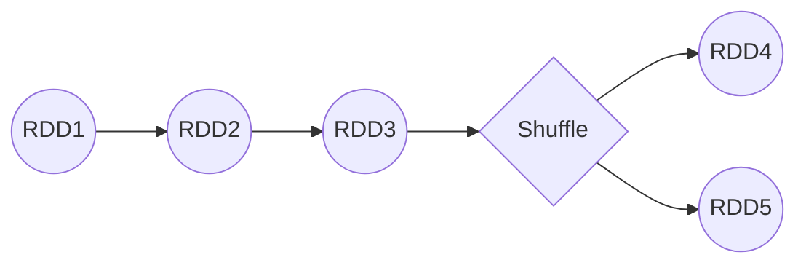

# Spark Executor原理与代码实例讲解

作者：禅与计算机程序设计艺术

## 1. 背景介绍
### 1.1 大数据处理的挑战
### 1.2 Spark的诞生与发展
### 1.3 Spark生态系统概览

## 2. 核心概念与联系
### 2.1 RDD
#### 2.1.1 RDD的定义与特性
#### 2.1.2 RDD的五大属性
#### 2.1.3 RDD的创建方式
### 2.2 DAG
#### 2.2.1 DAG的定义
#### 2.2.2 DAG的生成过程
#### 2.2.3 DAG的优化策略
### 2.3 Executor
#### 2.3.1 Executor的定义与作用
#### 2.3.2 Executor与Driver的关系
#### 2.3.3 Executor内部组件

## 3. 核心算法原理具体操作步骤
### 3.1 任务调度
#### 3.1.1 任务提交流程
#### 3.1.2 任务调度策略
#### 3.1.3 任务执行过程
### 3.2 Shuffle过程
#### 3.2.1 Shuffle的定义与作用
#### 3.2.2 Shuffle的类型
#### 3.2.3 Shuffle的优化技巧
### 3.3 内存管理
#### 3.3.1 存储内存与执行内存
#### 3.3.2 内存空间分配策略
#### 3.3.3 内存溢出处理机制

## 4. 数学模型和公式详细讲解举例说明
### 4.1 RDD的血缘关系
#### 4.1.1 窄依赖与宽依赖
#### 4.1.2 血缘关系的数学表示
#### 4.1.3 血缘关系的应用场景
### 4.2 Shuffle的数学模型
#### 4.2.1 Shuffle的数学定义
#### 4.2.2 Shuffle的数学推导过程
#### 4.2.3 Shuffle的数学优化方法

## 5. 项目实践：代码实例和详细解释说明
### 5.1 Spark Core实例
#### 5.1.1 WordCount详解
#### 5.1.2 PageRank实现
#### 5.1.3 KMeans聚类算法
### 5.2 Spark SQL实例  
#### 5.2.1 DataFrame的创建与操作
#### 5.2.2 Dataset的使用方法
#### 5.2.3 UDF与UDAF的开发
### 5.3 Spark Streaming实例
#### 5.3.1 DStream的原理与使用
#### 5.3.2 与Kafka集成的流处理
#### 5.3.3 Structured Streaming应用

## 6. 实际应用场景
### 6.1 电商领域
#### 6.1.1 用户行为分析
#### 6.1.2 商品推荐系统
#### 6.1.3 实时营销平台
### 6.2 金融领域  
#### 6.2.1 风险控制模型
#### 6.2.2 反欺诈系统
#### 6.2.3 实时交易分析
### 6.3 工业领域
#### 6.3.1 设备故障预测
#### 6.3.2 生产质量监控
#### 6.3.3 能源优化管理

## 7. 工具和资源推荐
### 7.1 开发工具
#### 7.1.1 IDEA
#### 7.1.2 Zeppelin
#### 7.1.3 Jupyter Notebook
### 7.2 集群部署
#### 7.2.1 Standalone模式
#### 7.2.2 YARN模式
#### 7.2.3 Mesos模式  
### 7.3 学习资源
#### 7.3.1 官方文档
#### 7.3.2 经典书籍
#### 7.3.3 视频教程

## 8. 总结：未来发展趋势与挑战
### 8.1 Spark 3.0的新特性 
### 8.2 Spark与AI的结合
### 8.3 Spark面临的机遇与挑战

## 9. 附录：常见问题与解答
### 9.1 Spark和Hadoop的区别？
### 9.2 Spark为什么比MapReduce快？
### 9.3 Spark Streaming和Flink的对比？

---

## 1. 背景介绍

在大数据时代，数据的爆炸式增长给传统的数据处理方式带来了巨大挑战。Hadoop的出现为海量数据的存储和批处理提供了解决方案，但在迭代计算和交互式查询等场景下，MapReduce这种基于磁盘的计算框架难以满足实时性和快速响应的需求。

Spark作为UC Berkeley AMP实验室的一个研究项目，于2009年诞生。相比于MapReduce，Spark通过引入RDD（弹性分布式数据集）和基于内存的计算，大大提升了数据处理的效率。Spark可以将中间结果缓存在内存中，避免了不必要的磁盘IO，特别适合迭代算法和交互式数据挖掘等应用场景。

经过多年的发展，Spark已经从一个单纯的批处理框架，发展成为一个集数据处理、SQL查询、机器学习、图计算等多种功能于一体的大数据生态系统。Spark生态系统包括以下几个主要组件：

- Spark Core：Spark的核心计算引擎，提供了RDD编程API和任务调度功能
- Spark SQL：提供了结构化数据处理和SQL查询的API
- Spark Streaming：提供了实时流处理的能力，可以对多种数据源进行流式计算
- MLlib：Spark的分布式机器学习库，提供了常用的机器学习算法和模型评估的工具
- GraphX：Spark的图计算框架，支持图的并行计算和图算法的实现

Spark丰富的组件体系，使其可以应对各种复杂的大数据处理场景。下面我们将重点介绍Spark的核心概念，并深入剖析Spark任务调度和执行的原理。

## 2. 核心概念与联系

### 2.1 RDD

#### 2.1.1 RDD的定义与特性

RDD（Resilient Distributed Dataset）是Spark的核心数据抽象，它是一个分布式的数据集合，具有以下几个主要特性：

- Immutable：RDD是只读的，不能直接修改，只能通过转换操作生成新的RDD
- Partitioned：RDD是分区的，每个分区可以在集群中的不同节点上进行计算  
- Resilient：RDD具有容错性，可以自动从节点失败中恢复
- Lazy Evaluated：RDD采用惰性计算模式，只有在action操作触发时才会真正执行计算

#### 2.1.2 RDD的五大属性

每个RDD都由五个主要属性来定义：

- 分区列表（partitions）：数据集的分片，决定了RDD的并行度
- 分区计算函数（compute）：对每个分区进行计算的函数
- RDD之间的依赖关系（dependencies）：窄依赖和宽依赖决定任务的划分
- 分区器（partitioner）：决定了parent RDD Shuffle后数据的分布
- 首选位置（preferred locations）：数据本地性，尽可能将计算任务分配到数据所在节点

#### 2.1.3 RDD的创建方式

RDD可以通过两种方式创建：

- 通过外部数据源创建：包括本地集合、HDFS、HBase等
- 通过其他RDD转换生成：如map、filter、join等转换操作

示例代码：

```scala
// 通过并行化本地集合创建RDD
val rdd1 = sc.parallelize(Array(1, 2, 3, 4, 5))

// 通过外部文件创建RDD
val rdd2 = sc.textFile("hdfs://path/to/file")

// 通过其他RDD转换生成
val rdd3 = rdd1.map(_ * 2)
```

### 2.2 DAG

#### 2.2.1 DAG的定义

DAG（Directed Acyclic Graph）有向无环图是Spark任务调度和执行的基础。Spark中的每个作业（job）都会被转换为一个DAG，图中的每个节点代表一个RDD分区上的计算任务，边代表RDD之间的依赖关系。

#### 2.2.2 DAG的生成过程

当遇到action算子如collect、count等，就会触发job的提交，Spark会根据RDD之间的依赖关系构建DAG：

1. 从action算子开始，递归检查其依赖的父RDD
2. 对于Shuffle依赖（宽依赖），加入Stage边界，将DAG划分为不同的Stage
3. 每个Stage内部的转换操作形成一个管道，代表本地管道化计算

#### 2.2.3 DAG的优化策略

DAG图描述了RDD之间的依赖和计算过程，Spark会对DAG进行优化，合并一些没有Shuffle的转换操作，减少实际生成的task数量。常见的DAG优化策略有：

- PipelinedRDD：将多个map、filter等窄依赖操作合并为一个task
- UnionRDD：合并多个父RDD为一个UnionRDD，避免多次扫描父RDD
- 尽可能晚地创建Shuffle：如在join操作中使用map-side预聚合

下图展示了一个简单的Spark DAG，包含了两个Stage：



### 2.3 Executor

#### 2.3.1 Executor的定义与作用

Executor是Spark分布式计算的基本单元，负责执行Spark任务（Task），并为需要持久化的RDD提供存储。每个Spark作业（Application）启动时，会根据配置在集群的各个工作节点上启动一定数量的Executor进程。

#### 2.3.2 Executor与Driver的关系

Spark应用程序通过Driver进程来管理Executor，Driver负责任务的调度分发、Executor的监控等工作。Driver和Executor的关系如下：

- Driver将任务以Task的形式发送给Executor
- Executor接收Task并执行计算，将结果返回给Driver
- Driver负责