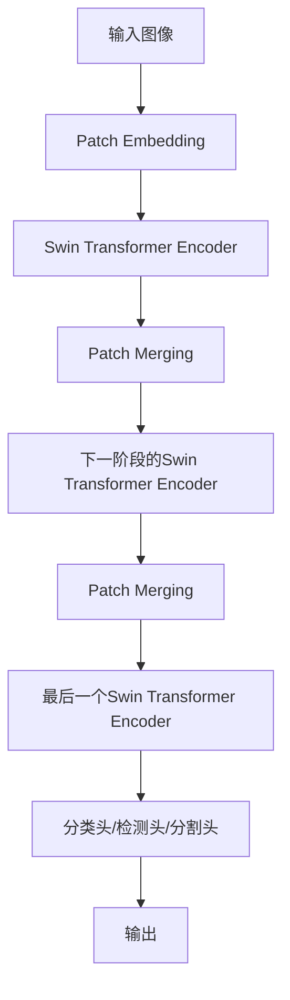

# Swin Transformer原理与代码实例讲解

## 1.背景介绍

计算机视觉是人工智能领域的一个重要分支,其目标是使机器能够从数字图像或视频中获取有意义的信息。近年来,受益于深度学习技术的飞速发展,计算机视觉取得了令人瞩目的进展。卷积神经网络(CNN)作为主流的深度学习模型,在图像分类、目标检测和语义分割等任务上展现出了强大的能力。然而,CNN在处理大尺度图像时存在一些固有的缺陷,如感受野受限、缺乏全局信息等。

为了解决这些问题,Transformer模型应运而生。Transformer最初是在自然语言处理(NLP)领域提出的,用于处理序列数据。由于其强大的长期依赖建模能力和高效的注意力机制,Transformer在NLP任务上取得了卓越的成绩。后来,研究人员尝试将Transformer应用于计算机视觉任务,并提出了Vision Transformer(ViT)。ViT直接将图像分割为patches(图像块),并将这些patches序列化输入到Transformer中进行处理。尽管ViT在大规模数据集上表现出色,但在小规模数据集上的性能却不尽如人意。

Swin Transformer是由微软亚洲研究院提出的一种新型视觉Transformer,旨在解决ViT在小数据集上的性能问题。Swin Transformer的核心思想是将图像分层划分为层级窗口,并在每个窗口内进行自注意力计算,同时引入了窗口间的位移注意力机制来捕获全局信息。这种设计使得Swin Transformer能够在保留Transformer长期依赖建模能力的同时,显著降低计算复杂度,从而在小数据集上获得更好的性能。

## 2.核心概念与联系

### 2.1 Transformer模型

Transformer是一种基于自注意力机制的序列到序列模型,由编码器(Encoder)和解码器(Decoder)组成。编码器将输入序列映射为高维向量表示,解码器则根据编码器的输出生成目标序列。在Transformer中,自注意力机制用于捕获输入序列中任意两个位置之间的依赖关系,从而建模长期依赖。

Transformer的核心组件是多头自注意力(Multi-Head Attention)和前馈神经网络(Feed-Forward Neural Network)。多头自注意力机制允许模型同时关注输入序列中的不同位置,从而学习更丰富的表示。前馈神经网络则用于对每个位置的表示进行非线性变换,增强模型的表示能力。

在视觉任务中,Vision Transformer(ViT)将图像分割为patches,并将这些patches序列化输入到Transformer中进行处理。尽管ViT在大规模数据集上表现出色,但由于缺乏局部连续性建模,在小数据集上的性能却不尽如人意。

### 2.2 Swin Transformer

Swin Transformer是一种新型的视觉Transformer,旨在解决ViT在小数据集上的性能问题。它的核心思想是将图像分层划分为层级窗口,并在每个窗口内进行自注意力计算,同时引入了窗口间的位移注意力机制来捕获全局信息。

具体而言,Swin Transformer将图像分割为非重叠的窗口,每个窗口内进行自注意力计算。为了捕获窗口间的依赖关系,Swin Transformer引入了位移注意力机制。位移注意力机制通过在窗口间进行有限的位移,来建立窗口之间的连接,从而捕获全局信息。

此外,Swin Transformer还采用了层级结构,将图像分为多个分辨率阶段。在较低分辨率阶段,模型会聚合更大范围的上下文信息,而在较高分辨率阶段,模型则关注更细粒度的局部特征。这种分层结构使得Swin Transformer能够在不同尺度上捕获信息,从而提高模型的表示能力。

### 2.3 Swin Transformer与其他视觉Transformer模型的关系

Swin Transformer与其他视觉Transformer模型存在一些关键区别:

1. **窗口分割和位移注意力**:与ViT直接将图像分割为patches不同,Swin Transformer将图像分割为层级窗口,并在每个窗口内进行自注意力计算。同时,它引入了位移注意力机制来捕获窗口间的依赖关系,从而获取全局信息。

2. **层级结构**:Swin Transformer采用了分层结构,将图像分为多个分辨率阶段。这种设计使得模型能够在不同尺度上捕获信息,提高表示能力。

3. **计算效率**:由于窗口分割和位移注意力机制的引入,Swin Transformer的计算复杂度显著降低,从而在小数据集上获得更好的性能。

4. **注意力范围**:与一些其他视觉Transformer模型(如PVT、TNT等)相比,Swin Transformer的注意力范围更加灵活,可以通过调整窗口大小和位移范围来控制。

总的来说,Swin Transformer在保留Transformer长期依赖建模能力的同时,通过一系列创新设计,显著提高了计算效率和小数据集上的性能表现。

## 3.核心算法原理具体操作步骤

### 3.1 Swin Transformer的整体架构

Swin Transformer的整体架构如下图所示:

具体来说,Swin Transformer的处理流程如下:

1. **Patch Embedding**:将输入图像分割为非重叠的patches,并将每个patch映射为一个向量表示。

2. **Swin Transformer Encoder**:将patch embeddings输入到Swin Transformer Encoder中进行处理。Encoder由多个Swin Transformer Block组成,每个Block包含窗口分割自注意力(W-MSA)和位移注意力(SW-MSA)两种注意力机制。

3. **Patch Merging**:在每个阶段的最后,将相邻的patch embeddings合并,以降低分辨率,并增加通道数。

4. **分类头/检测头/分割头**:根据不同的任务,将最后一个Swin Transformer Encoder的输出连接到相应的头部进行处理,如分类头、目标检测头或语义分割头。

5. **输出**:输出相应任务的结果,如分类标签、目标检测框或分割掩码。

### 3.2 Swin Transformer Block

Swin Transformer Block是Swin Transformer Encoder的核心组件,它包含两种注意力机制:窗口分割自注意力(W-MSA)和位移注意力(SW-MSA)。

#### 3.2.1 窗口分割自注意力(W-MSA)

窗口分割自注意力(W-MSA)是Swin Transformer的关键创新之一。它将输入特征图分割为非重叠的窗口,并在每个窗口内进行自注意力计算。这种设计可以显著降低计算复杂度,同时保留了自注意力机制的优势。

具体来说,W-MSA的计算过程如下:

1. 将输入特征图 $X \in \mathbb{R}^{B \times H \times W \times C}$ 分割为 $M \times M$ 个非重叠的窗口,其中 $B$ 是批量大小, $H$、$W$ 是特征图的高度和宽度, $C$ 是通道数。

2. 对于每个窗口,将其展平为二维矩阵 $X_\text{win} \in \mathbb{R}^{B \times N \times C}$,其中 $N = \frac{H \times W}{M^2}$ 是窗口内的patch数量。

3. 对 $X_\text{win}$ 进行多头自注意力计算:

$$
\begin{aligned}
\text{Attention}(Q, K, V) &= \text{Softmax}\left(\frac{QK^T}{\sqrt{d_k}}\right)V \\
\text{MultiHead}(Q, K, V) &= \text{Concat}(\text{head}_1, \dots, \text{head}_h)W^O
\end{aligned}
$$

其中 $Q$、$K$、$V$ 分别是查询(Query)、键(Key)和值(Value)矩阵, $d_k$ 是缩放因子, $h$ 是头数。

4. 将注意力输出重新整形为原始窗口大小,并与输入特征图相加,得到窗口分割自注意力的输出。

通过将自注意力计算限制在窗口内,W-MSA可以显著降低计算复杂度,从 $\mathcal{O}(N^2 \cdot C)$ 降低到 $\mathcal{O}(N \cdot C + N \cdot \frac{C^2}{h})$,其中 $N$ 是输入序列的长度。

#### 3.2.2 位移注意力(SW-MSA)

虽然窗口分割自注意力可以有效降低计算复杂度,但它只能捕获窗口内的局部信息,无法建模窗口间的全局依赖关系。为了解决这个问题,Swin Transformer引入了位移注意力(SW-MSA)机制。

位移注意力的核心思想是在窗口间进行有限的位移,从而建立窗口之间的连接,捕获全局信息。具体来说,SW-MSA的计算过程如下:

1. 将输入特征图 $X \in \mathbb{R}^{B \times H \times W \times C}$ 分割为 $M \times M$ 个非重叠的窗口。

2. 对于每个窗口,将其展平为二维矩阵 $X_\text{win} \in \mathbb{R}^{B \times N \times C}$。

3. 对 $X_\text{win}$ 进行位移注意力计算:

$$
\begin{aligned}
\text{SW-MSA}(X_\text{win}) &= \text{Attention}(X_\text{win}W^Q, X_\text{win}W^K, X_\text{win}W^V) \\
&= \text{Softmax}\left(\frac{(X_\text{win}W^Q)(X_\text{win}W^K)^T}{\sqrt{d_k}}\right)(X_\text{win}W^V)
\end{aligned}
$$

其中 $W^Q$、$W^K$、$W^V$ 分别是查询、键和值的线性投影矩阵。

4. 将位移注意力输出重新整形为原始窗口大小,并与输入特征图相加,得到位移注意力的输出。

位移注意力通过在窗口间进行有限的位移,建立了窗口之间的连接,从而捕获了全局信息。与传统的全局自注意力相比,位移注意力的计算复杂度更低,从 $\mathcal{O}(N^2 \cdot C)$ 降低到 $\mathcal{O}(N \cdot C + N \cdot \frac{C^2}{h})$。

#### 3.2.3 Swin Transformer Block的计算流程

Swin Transformer Block将窗口分割自注意力(W-MSA)和位移注意力(SW-MSA)进行了有机结合,其计算流程如下:

1. 对输入特征图进行层归一化(LayerNorm)。

2. 进行窗口分割自注意力(W-MSA)计算,捕获窗口内的局部信息。

3. 对W-MSA的输出进行层归一化,然后通过一个前馈神经网络(MLP)进行非线性变换。

4. 进行位移注意力(SW-MSA)计算,捕获窗口间的全局信息。

5. 对SW-MSA的输出进行层归一化,然后通过另一个MLP进行非线性变换。

6. 输出Swin Transformer Block的计算结果。

通过将W-MSA和SW-MSA有机结合,Swin Transformer Block能够同时捕获局部和全局信息,从而提高模型的表示能力。

### 3.3 Patch Merging

在Swin Transformer的每个阶段的最后,会进行Patch Merging操作,将相邻的patch embeddings合并,以降低分辨率,并增加通