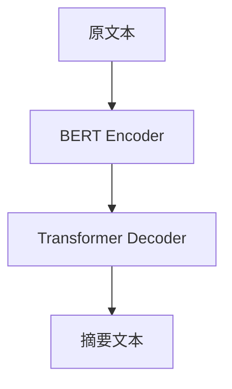
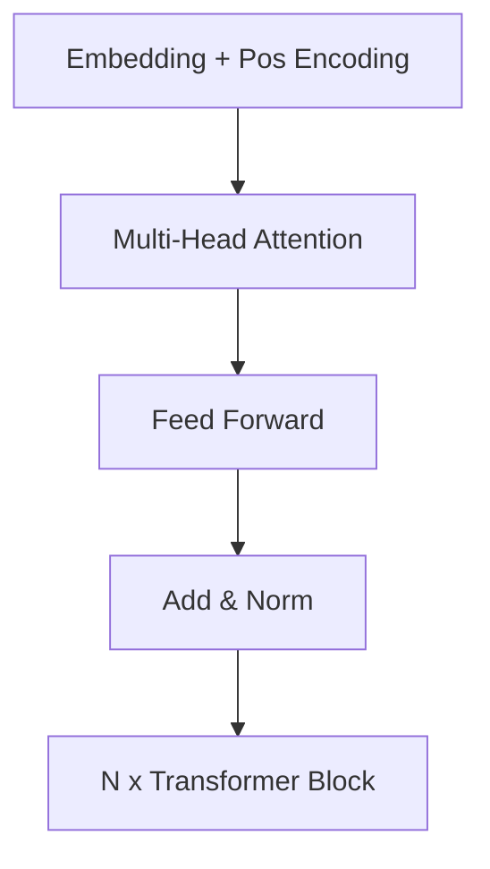

# Transformer大模型实战 使用BERT模型执行抽象式摘要任务

## 1.背景介绍

### 1.1 自然语言处理的重要性

在当今信息时代,自然语言处理(NLP)已成为人工智能领域中最重要和最具挑战性的研究方向之一。随着数据量的激增和计算能力的提高,NLP技术在各个领域都有广泛的应用,如机器翻译、智能问答系统、文本摘要、情感分析等。

### 1.2 文本摘要任务概述  

文本摘要是NLP中一项核心任务,旨在自动生成一段简明扼要的文字来总结原文的主要内容。根据摘要方式的不同,可分为extractive(抽取式)和abstractive(抽象式)两种。

- **抽取式摘要**: 从原文中抽取出一些重要的句子或语句拼接而成。
- **抽象式摘要**: 需要深层次理解原文语义,并用自己的语言重新表述摘要内容,这对模型的理解和生成能力要求更高。

### 1.3 Transformer模型的革命性作用

2017年,Transformer模型在机器翻译任务上取得了突破性进展,并很快在NLP的各种任务中获得广泛应用。Transformer完全基于注意力机制,摒弃了RNN/CNN等传统结构,大幅提升了并行计算能力。

BERT(Bidirectional Encoder Representations from Transformers)是2018年提出的一种基于Transformer的预训练语言模型,通过大规模无监督预训练,BERT可以学习到丰富的语义知识,为下游NLP任务提供强大的语义表示能力。

## 2.核心概念与联系

### 2.1 Transformer-Decoder 结构

对于抽象式摘要任务,我们通常采用类似机器翻译的Encoder-Decoder架构。Encoder用于编码输入文本,Decoder则根据Encoder的输出生成摘要文本。

BERT作为Encoder模型,能够捕捉输入序列的双向上下文信息,为生成高质量摘要奠定基础。而Decoder则需要一个专门用于序列生成的模型,如基于Transformer的自回归语言模型。

### 2.2 BERT 预训练任务

BERT 的预训练过程包括两个无监督任务:

1. **Masked Language Model(MLM)**: 随机遮蔽输入序列中的部分单词,模型需要基于上下文预测被遮蔽单词。这有助于学习双向语义表示。

2. **Next Sentence Prediction(NSP)**: 判断两个句子是否为连续句子,捕捉句子间的关系和上下文。

通过预训练,BERT可以从大规模语料中习得通用的语义知识,为下游任务提供强大的语义表示能力。

### 2.3 BERT 在摘要任务中的应用

对于抽象式摘要任务,我们通常采用两阶段的微调(fine-tuning)方式:

1. 使用BERT作为Encoder对输入文本进行编码,得到语义表示。

2. 将BERT Encoder的输出传递给Transformer Decoder,并以监督方式训练Decoder生成目标摘要。

在第二阶段中,我们可以使用序列到序列(Seq2Seq)的方式训练Decoder,将输入文本映射为摘要文本。这种方式能够充分利用BERT的语义表示能力,同时结合Decoder的生成能力。

## 3.核心算法原理具体操作步骤

在本节中,我们将详细介绍使用BERT执行抽象式摘要任务的核心算法原理和具体操作步骤。

### 3.1 BERT Encoder

BERT Encoder的核心是多层Transformer Encoder块,每个块由多头注意力机制和前馈神经网络组成。

1. **Embedding层**: 将输入文本转换为单词嵌入表示。
2. **位置编码**: 因为Transformer没有递归或卷积结构,所以需要添加位置编码来保持序列的位置信息。
3. **多头注意力机制**: 捕捉序列中不同位置单词之间的依赖关系。
4. **前馈神经网络**: 对每个位置的表示进行非线性变换,提供"编码"能力。
5. **残差连接和层归一化**: 保证梯度传播稳定,防止梯度消失或爆炸。

通过堆叠N个Transformer Encoder块,BERT可以学习到输入序列的深层次语义表示。

### 3.2 Transformer Decoder

Decoder端也采用类似的Transformer结构,但增加了一些关键设计:

1. **Masked Self-Attention**: 在Self-Attention时,对序列后面的词进行遮蔽,确保每个位置的单词只能看到之前的单词,符合自回归语言模型的特点。

2. **Encoder-Decoder Attention**: 除了Self-Attention外,Decoder还需要和Encoder的输出进行注意力交互,以获取输入序列的语义表示。

3. **输出层**: 通常使用线性层和Softmax将Decoder的输出映射为下一个单词的概率分布。

在训练时,我们将Encoder的输出和目标摘要序列输入到Decoder中,通过最大化生成摘要序列的条件概率来优化模型参数。

### 3.3 Beam Search 解码

在inference阶段,我们无法一次生成整个摘要序列,需要自回归地生成每个单词。由于存在词汇冗余和模棱两可的问题,我们通常采用Beam Search算法来近似寻找生成概率最大的候选序列。

Beam Search算法维护一个候选集合(beam),每次从beam中挑选概率最高的k个候选序列,延展一个单词,更新beam。通过设置合理的beam size和终止条件,可以在可解空间中高效搜索近似最优解。

### 3.4 训练细节

1. **数据预处理**: 通常需要对训练语料进行文本清洗、分词、数据扩增等预处理,提高数据质量。

2. **优化目标**: 通常采用交叉熵损失函数,最大化生成目标摘要序列的条件概率。

3. **Teacher Forcing**: 在训练时,我们可以将上一个时间步的ground-truth输入到Decoder,而不是使用之前生成的单词,以提高训练效率。

4. **梯度裁剪(Gradient Clipping)**: 由于Transformer结构较深,梯度容易出现爆炸或消失。梯度裁剪可以有效缓解这一问题。

5. **学习率warmup**: 在训练初期,较小的学习率有助于模型收敛。warmup策略可以使学习率在训练过程中逐步增大。

6. **Label Smoothing**: 平滑标签分布,使模型对于ground-truth之外的低概率单词也有一定的惩罚,有助于提高泛化能力。

通过上述一些训练技巧,我们可以进一步提升BERT在抽象式摘要任务中的性能表现。

## 4.数学模型和公式详细讲解举例说明

在本节中,我们将详细介绍Transformer模型中的数学原理和公式,并结合实例进行说明。

### 4.1 注意力机制(Attention Mechanism)

注意力机制是Transformer的核心,它能够捕捉序列中任意两个单词之间的依赖关系。对于给定的查询(query)序列$\mathbf{q} = (q_1, q_2, \ldots, q_m)$和键值(key-value)序列$\mathbf{k} = (k_1, k_2, \ldots, k_n), \mathbf{v} = (v_1, v_2, \ldots, v_n)$,注意力机制的计算过程如下:

$$\begin{aligned}
\text{Attention}(\mathbf{q}, \mathbf{k}, \mathbf{v}) &= \text{softmax}\left(\frac{\mathbf{q}\mathbf{k}^\top}{\sqrt{d_k}}\right)\mathbf{v} \\
&= \sum_{j=1}^n \alpha_{ij}v_j \\
\alpha_{ij} &= \frac{\exp\left(\frac{q_i k_j^\top}{\sqrt{d_k}}\right)}{\sum_{l=1}^n \exp\left(\frac{q_i k_l^\top}{\sqrt{d_k}}\right)}
\end{aligned}$$

其中$d_k$是缩放因子,用于防止点积过大导致梯度消失。$\alpha_{ij}$表示查询$q_i$对键值对$(k_j, v_j)$的注意力权重。

通过这种方式,注意力机制能够自动捕捉序列中任意位置单词之间的依赖关系,而不受序列长度的限制。这种长程依赖建模能力是Transformer优于RNN/CNN的关键所在。

### 4.2 多头注意力(Multi-Head Attention)

单一的注意力机制可能会过于集中于某些局部特征,而忽视其他重要信息。为了提高模型的表示能力,Transformer引入了多头注意力机制,它可以从不同的"注视角度"捕捉不同的依赖关系。

具体地,我们将查询/键/值序列线性投影到$h$个注意力头上,分别计算注意力,然后将所有头的注意力输出拼接起来:

$$\begin{aligned}
\text{MultiHead}(\mathbf{Q}, \mathbf{K}, \mathbf{V}) &= \text{Concat}(\text{head}_1, \ldots, \text{head}_h)\mathbf{W}^O \\
\text{head}_i &= \text{Attention}(\mathbf{Q}\mathbf{W}_i^Q, \mathbf{K}\mathbf{W}_i^K, \mathbf{V}\mathbf{W}_i^V)
\end{aligned}$$

其中$\mathbf{W}_i^Q, \mathbf{W}_i^K, \mathbf{W}_i^V$是不同头的线性投影矩阵,$\mathbf{W}^O$是最终的输出线性变换。

通过多头注意力机制,Transformer能够同时关注不同位置的信息,提高了对长程依赖的建模能力。

### 4.3 Self-Attention

在Transformer中,注意力机制不仅应用于Encoder-Decoder之间,也被用于Encoder和Decoder内部。这种"Self-Attention"机制可以捕捉同一序列内部的依赖关系,是Transformer避免使用循环或卷积结构的关键。

对于输入序列$\mathbf{X} = (x_1, x_2, \ldots, x_n)$,Self-Attention的计算过程为:

$$\text{SelfAttention}(\mathbf{X}) = \text{MultiHead}(\mathbf{X}\mathbf{W}^Q, \mathbf{X}\mathbf{W}^K, \mathbf{X}\mathbf{W}^V)$$

其中$\mathbf{W}^Q, \mathbf{W}^K, \mathbf{W}^V$是线性投影矩阵,用于将输入映射到查询/键/值空间。

Self-Attention可以自动学习序列内部的依赖模式,而无需人工设计卷积核或循环结构,这极大地提高了Transformer的表示能力和并行计算效率。

### 4.4 位置编码(Positional Encoding)

由于Self-Attention没有捕捉序列顺序信息的机制,Transformer引入了位置编码(Positional Encoding)来赋予每个单词位置信息。

具体地,位置编码是一个由正弦和余弦函数构成的矩阵,其中第$i$行第$j$列的值为:

$$\begin{aligned}
\text{PE}_{(i,2j)} &= \sin\left(i/10000^{2j/d_\text{model}}\right) \\
\text{PE}_{(i,2j+1)} &= \cos\left(i/10000^{2j/d_\text{model}}\right)
\end{aligned}$$

其中$i$是位置索引,而$j$则是维度索引。位置编码矩阵直接与输入的单词嵌入相加,从而为模型提供位置信息。

通过这种方式,Transformer可以自动学习到不同位置的语义差异,而无需引入循环或卷积结构。

以上是Transformer中一些核心的数学模型和公式。通过巧妙设计的注意力机制、多头注意力和位置编码,Transformer能够高效地捕捉长程依赖,并实现并行计算,从而在NLP任务中取得了革命性的进展。

## 4.项目实践:代码实例和详细解释说明

在本节中,我们将通