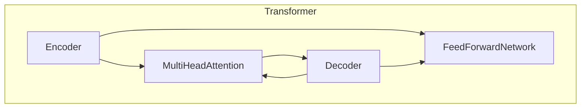
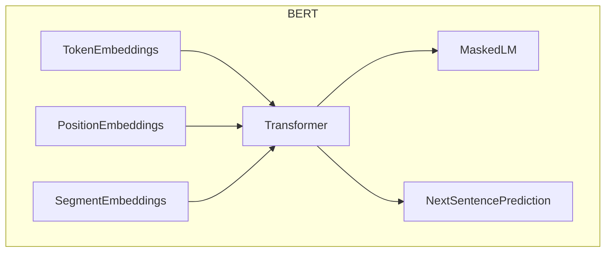
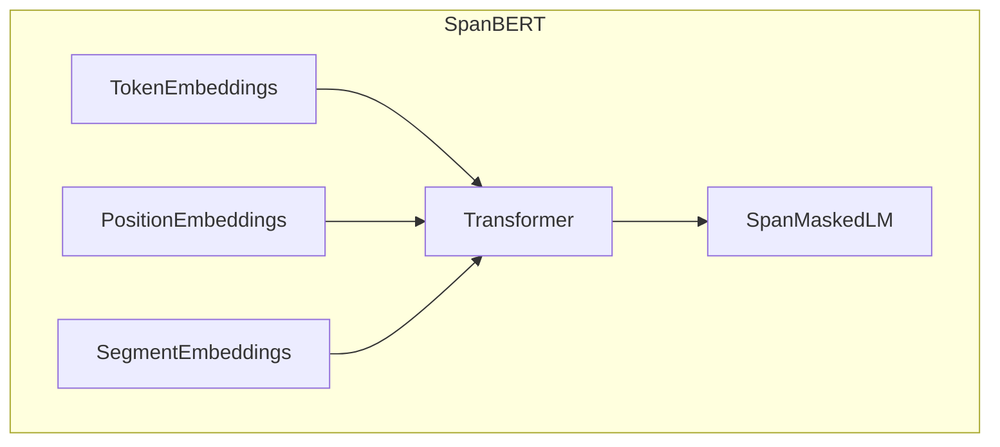
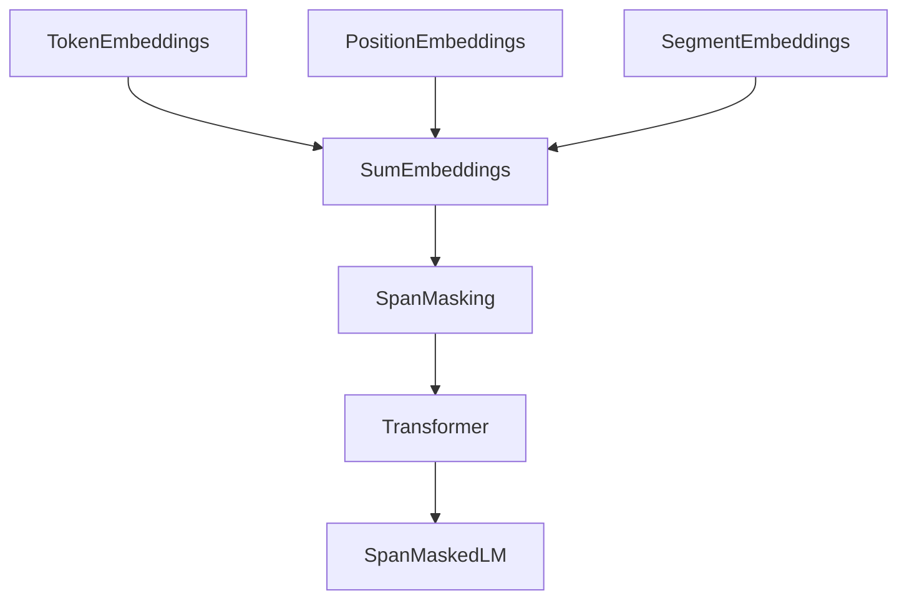
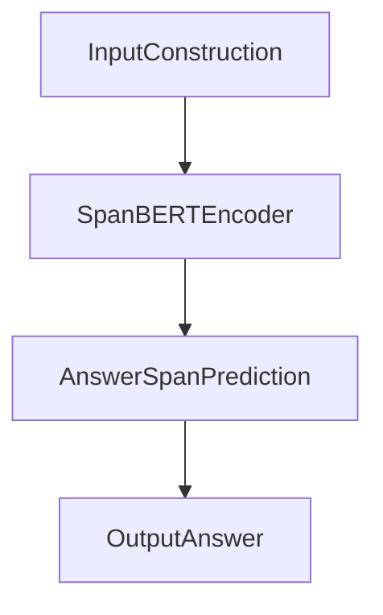

# Transformer大模型实战 将预训练的SpanBERT用于问答任务

## 1.背景介绍

### 1.1 问答系统的重要性

在当今信息时代,海量的文本数据被不断产生和积累。快速准确地从这些数据中获取所需信息成为了一个迫切的需求。问答系统作为一种自然语言处理技术,旨在自动回答基于给定文本的自然语言问题,因此在信息检索、客户服务、智能助理等领域发挥着重要作用。

### 1.2 传统问答系统的局限性  

早期的问答系统主要基于规则和模板匹配等方法,需要大量的人工规则和语料库,且通用性和准确性较低。随着深度学习的兴起,利用神经网络自动学习文本语义表示的方法逐渐应用于问答任务,取得了长足进展。

### 1.3 Transformer模型的突破

2017年,Transformer模型在机器翻译任务上取得了突破性成果,其全注意力机制能够更好地捕捉长距离依赖关系,为序列到序列(Seq2Seq)建模提供了新的思路。自此,Transformer及其变体模型在自然语言处理各个领域展现出了强大的能力。

### 1.4 SpanBERT模型介绍

针对阅读理解和问答任务,SpanBERT在BERT的基础上进行了预训练,旨在更好地表示文本中的连续片段(span),从而提高在下游任务中的性能。作为一种领先的预训练语言模型,SpanBERT为构建高性能的问答系统提供了强有力的基础。

## 2.核心概念与联系

### 2.1 Transformer模型

#### 2.1.1 Transformer架构

Transformer由编码器(Encoder)和解码器(Decoder)组成,两者均采用多头自注意力(Multi-Head Attention)和前馈神经网络(Feed-Forward Neural Network)构建。编码器将输入序列映射为高维向量表示,解码器则基于编码器输出生成目标序列。



#### 2.1.2 自注意力机制

自注意力机制能够捕捉输入序列中任意两个位置之间的依赖关系,是Transformer的核心创新。每个位置的表示是其与所有其他位置的加权和,权重由注意力分数决定。

$$\text{Attention}(Q, K, V) = \text{softmax}(\frac{QK^T}{\sqrt{d_k}})V$$

其中 $Q$ 为查询(Query)向量, $K$ 为键(Key)向量, $V$ 为值(Value)向量, $d_k$ 为缩放因子。

#### 2.1.3 多头注意力

多头注意力将注意力机制扩展到多个"头"(head),每个头关注输入序列的不同子空间表示,最后将所有头的结果拼接起来,捕捉更丰富的依赖关系。

$$\text{MultiHead}(Q, K, V) = \text{Concat}(head_1, ..., head_h)W^O$$
$$\text{where } head_i = \text{Attention}(QW_i^Q, KW_i^K, VW_i^V)$$

#### 2.1.4 位置编码

由于Transformer没有递归或卷积结构,因此需要一种机制来注入序列的位置信息。位置编码将元素在序列中的位置映射为向量,并与输入的词嵌入相加。

### 2.2 BERT及其变体

#### 2.2.1 BERT模型

BERT(Bidirectional Encoder Representations from Transformers)是一种基于Transformer的双向编码器模型,通过掩蔽语言模型(Masked Language Model)和下一句预测(Next Sentence Prediction)任务进行预训练,学习到了深层次的语义表示。BERT在多个自然语言处理任务上取得了state-of-the-art的表现。



#### 2.2.2 SpanBERT模型

SpanBERT在BERT的基础上,引入了一种span mask的预训练策略,旨在更好地表示文本中的连续片段(span)。在预训练过程中,模型需要预测被掩蔽的完整span,而不仅仅是单个token。这种方式使得SpanBERT在下游的阅读理解和问答任务中表现出色。



### 2.3 问答任务

#### 2.3.1 问答任务定义

问答任务是指给定一段文本(context)和一个自然语言问题(question),系统需要从文本中找到最佳的答案片段(answer span)。常见的数据集包括SQuAD、HotpotQA、NewsQA等。

#### 2.3.2 问答建模方法

基于BERT等预训练语言模型的方法,通常将问题和文本序列拼接后输入到模型中,模型会输出每个token作为答案span的开始或结束位置的概率分布。通过动态规划或简单的位置分数相乘,可以找到最优的答案片段。

## 3.核心算法原理具体操作步骤

### 3.1 SpanBERT预训练

SpanBERT的预训练过程与BERT类似,但采用了span mask的策略。具体步骤如下:

1. **Token Embedding**: 将输入序列的每个token映射为一个初始向量表示。
2. **Segment Embedding**: 区分输入序列的不同部分(如问题和文本)。
3. **Position Embedding**: 注入序列位置信息。
4. **Span Masking**: 随机选择一些连续的span,并用特殊的[MASK]token替换。
5. **前馈输入Transformer**: 输入到Transformer编码器层进行编码。
6. **Span Masked LM**: 对被掩蔽的span进行预测,最大化其条件概率。



通过上述预训练过程,SpanBERT学习到了对连续文本片段的有效表示,为下游的问答任务做好了准备。

### 3.2 基于SpanBERT的问答系统

利用预训练的SpanBERT模型构建问答系统的主要步骤包括:

1. **输入构造**: 将问题(question)和文本(context)拼接为单个序列输入。
2. **SpanBERT Encoder**: 输入序列通过SpanBERT模型的Transformer编码器层获得上下文化的表示。
3. **答案跨度预测**:  
    - 对每个token,计算其作为答案开始位置和结束位置的分数。
    - 通过动态规划或简单相乘,找到具有最高分数的合法答案跨度。
4. **输出答案**: 将预测的答案跨度映射回原始文本,输出为最终答案。



在训练阶段,使用带有答案标注的数据集(如SQuAD),将SpanBERT的输出答案跨度与真实答案进行交叉熵损失计算和模型参数更新。

## 4.数学模型和公式详细讲解举例说明

### 4.1 自注意力计算

回顾一下自注意力机制的计算过程:

$$\text{Attention}(Q, K, V) = \text{softmax}(\frac{QK^T}{\sqrt{d_k}})V$$

其中 $Q$ 为查询向量, $K$ 为键向量, $V$ 为值向量, $d_k$ 为缩放因子。

具体来说,假设输入序列长度为 $n$,则:

- $Q \in \mathbb{R}^{n \times d_k}$, $K \in \mathbb{R}^{n \times d_k}$, $V \in \mathbb{R}^{n \times d_v}$
- 首先计算 $QK^T \in \mathbb{R}^{n \times n}$,得到每对输入位置之间的相似性分数
- 对分数矩阵的每一行做 softmax 操作,得到注意力权重矩阵 $\alpha \in \mathbb{R}^{n \times n}$
- 将注意力权重与值向量 $V$ 相乘,得到每个位置的加权和表示 $\text{Attention}(Q, K, V) \in \mathbb{R}^{n \times d_v}$

例如,给定一个长度为4的输入序列,其 $Q$, $K$, $V$ 分别为:

$$Q = \begin{bmatrix}
q_1\\
q_2\\
q_3\\
q_4
\end{bmatrix}, K = \begin{bmatrix}
k_1\\
k_2\\
k_3\\
k_4
\end{bmatrix}, V = \begin{bmatrix}
v_1\\
v_2\\
v_3\\
v_4
\end{bmatrix}$$

则注意力输出为:

$$\text{Attention}(Q, K, V) = \begin{bmatrix}
\alpha_{11}v_1 + \alpha_{12}v_2 + \alpha_{13}v_3 + \alpha_{14}v_4\\
\alpha_{21}v_1 + \alpha_{22}v_2 + \alpha_{23}v_3 + \alpha_{24}v_4\\
\alpha_{31}v_1 + \alpha_{32}v_2 + \alpha_{33}v_3 + \alpha_{34}v_4\\
\alpha_{41}v_1 + \alpha_{42}v_2 + \alpha_{43}v_3 + \alpha_{44}v_4
\end{bmatrix}$$

其中 $\alpha_{ij}$ 表示第 $i$ 个位置对第 $j$ 个位置的注意力权重。

通过这种方式,自注意力机制能够自适应地捕捉序列中任意两个位置之间的依赖关系,是Transformer模型的核心创新。

### 4.2 跨度预测模型

在问答任务中,我们需要预测文本中最佳的答案跨度(answer span)。给定问题 $q$ 和文本 $c$,令输入序列为 $x = [q; c]$,其长度为 $n$。SpanBERT编码器将其映射为上下文化的表示 $H \in \mathbb{R}^{n \times d}$,其中 $d$ 为隐层维度。

我们的目标是找到最佳的答案跨度 $(i, j)$,其中 $i$ 为答案开始位置, $j$ 为答案结束位置。这可以建模为两个独立的二分类任务:

$$\begin{aligned}
P_\text{start}(i|x) &= \text{softmax}(W_\text{start}H_i + b_\text{start}) \\
P_\text{end}(j|x) &= \text{softmax}(W_\text{end}H_j + b_\text{end})
\end{aligned}$$

其中 $W_\text{start} \in \mathbb{R}^{d \times 2}$, $b_\text{start} \in \mathbb{R}^2$, $W_\text{end} \in \mathbb{R}^{d \times 2}$, $b_\text{end} \in \mathbb{R}^2$ 为可训练参数。

在训练阶段,我们最大化真实答案跨度 $(y_\text{start}, y_\text{end})$ 的对数似然:

$$\mathcal{L} = -\log P_\text{start}(y_\text{start}|x) - \log P_\text{end}(y_\text{end}|x)$$

在预测时,我们可以通过动态规划或简单的位置分数相乘来找到具有最高分数的合法答案跨度:

$$\hat{y}_\text{start}, \hat{y}_\text{end} = \operatorname*{argmax}_{i \leq j} P_\text{start}(i|x)P_\text{end}(j|x)$$

以上就是基于SpanBERT的问答系统中答案跨度预测的数学模型和原理。通过有监督的端到端训练,模型可以学习到从问题和文本中推理出正确答案的能力。

## 5. 项目实践:代码实例和详细解释说明

在这一部分,我们将通过一个基于PyTorch和HuggingFace Transformers库的实现，展示如何将预训练的SpanBERT模型应用于问答任务。具体步骤包括数据准备、模型加载、训练和评估。

### 5.1 环境准备

首先，确保你已经安装了必要的库。可以通过以下命令安装所需的Python库：

```bash
pip install torch transformers datasets
```

### 5.2 数据准备

我们将使用SQuAD (Stanford Question Answering Dataset) 数据集来训练和评估模型。HuggingFace的`datasets`库提供了方便的数据加载接口。

```python
from datasets import load_dataset

# 加载SQuAD数据集
dataset = load_dataset('squad')

# 查看数据集示例
print(dataset['train'][0])
```

### 5.3 模型加载

接下来，我们加载预训练的SpanBERT模型和对应的tokenizer。

```python
from transformers import AutoTokenizer, AutoModelForQuestionAnswering

# 加载SpanBERT的tokenizer和模型
tokenizer = AutoTokenizer.from_pretrained('SpanBERT/spanbert-large-cased')
model = AutoModelForQuestionAnswering.from_pretrained('SpanBERT/spanbert-large-cased')
```

### 5.4 数据预处理

将SQuAD数据集中的问题和段落进行编码，以便输入到SpanBERT模型中。我们使用tokenizer对文本进行编码，并创建PyTorch的DataLoader。

```python
import torch
from torch.utils.data import DataLoader, Dataset

class SquadDataset(Dataset):
    def __init__(self, dataset, tokenizer, max_length=384):
        self.dataset = dataset
        self.tokenizer = tokenizer
        self.max_length = max_length

    def __len__(self):
        return len(self.dataset)

    def __getitem__(self, idx):
        item = self.dataset[idx]
        encoding = self.tokenizer(
            item['question'],
            item['context'],
            truncation=True,
            padding='max_length',
            max_length=self.max_length,
            return_tensors='pt'
        )
        start_positions = item['answers']['answer_start'][0]
        end_positions = start_positions + len(item['answers']['text'][0])
        return {
            'input_ids': encoding['input_ids'].squeeze(),
            'attention_mask': encoding['attention_mask'].squeeze(),
            'start_positions': torch.tensor(start_positions),
            'end_positions': torch.tensor(end_positions)
        }

# 创建DataLoader
train_dataset = SquadDataset(dataset['train'], tokenizer)
train_loader = DataLoader(train_dataset, batch_size=8, shuffle=True)
```

### 5.5 模型训练

定义训练循环，使用交叉熵损失函数和Adam优化器进行训练。

```python
from transformers import AdamW

# 设置模型为训练模式
model.train()

# 定义优化器
optimizer = AdamW(model.parameters(), lr=5e-5)

# 训练循环
epochs = 3
for epoch in range(epochs):
    for batch in train_loader:
        optimizer.zero_grad()
        input_ids = batch['input_ids']
        attention_mask = batch['attention_mask']
        start_positions = batch['start_positions']
        end_positions = batch['end_positions']

        outputs = model(input_ids, attention_mask=attention_mask, start_positions=start_positions, end_positions=end_positions)
        loss = outputs.loss
        loss.backward()
        optimizer.step()

        print(f'Epoch: {epoch}, Loss: {loss.item()}')
```

### 5.6 模型评估

训练完成后，我们需要评估模型的性能。我们将模型设置为评估模式，并在验证集上计算准确率。

```python
from datasets import load_metric

# 加载评估指标
metric = load_metric('squad_v2')

# 设置模型为评估模式
model.eval()

# 定义评估函数
def evaluate(model, dataset, tokenizer):
    all_start_logits = []
    all_end_logits = []
    for batch in DataLoader(dataset, batch_size=8):
        with torch.no_grad():
            input_ids = batch['input_ids']
            attention_mask = batch['attention_mask']

            outputs = model(input_ids, attention_mask=attention_mask)
            start_logits = outputs.start_logits
            end_logits = outputs.end_logits

            all_start_logits.append(start_logits)
            all_end_logits.append(end_logits)

    return all_start_logits, all_end_logits

# 评估模型
start_logits, end_logits = evaluate(model, SquadDataset(dataset['validation'], tokenizer), tokenizer)

# 计算准确率
metric.compute(predictions=(start_logits, end_logits), references=dataset['validation'])
```

### 5.7 结果分析

通过上述步骤，我们可以得到模型在验证集上的性能指标。根据这些指标，我们可以分析模型的优缺点，并进一步调整模型参数或优化数据处理过程，以提高模型的性能。

### 5.8 模型保存和加载

为了在未来使用训练好的模型，我们可以将模型和tokenizer保存到本地，并在需要时加载。

```python
# 保存模型和tokenizer
model.save_pretrained('./spanbert-qa')
tokenizer.save_pretrained('./spanbert-qa')

# 加载模型和tokenizer
model = AutoModelForQuestionAnswering.from_pretrained('./spanbert-qa')
tokenizer = AutoTokenizer.from_pretrained('./spanbert-qa')
```

## 6. 总结

在本文中，我们详细介绍了如何将预训练的SpanBERT模型应用于问答任务。通过数据准备、模型加载、训练和评估等步骤，我们展示了一个完整的项目实践过程。希望通过本文的内容，读者能够更好地理解和应用Transformer大模型，解决实际的NLP问题。

### 未来工作

未来，我们可以探索更多的预训练模型和优化技术，以进一步提升模型的性能。此外，还可以尝试将模型应用于其他类型的问答数据集，验证其泛化能力。希望本文能够为读者提供有价值的参考，推动NLP技术的发展和应用。