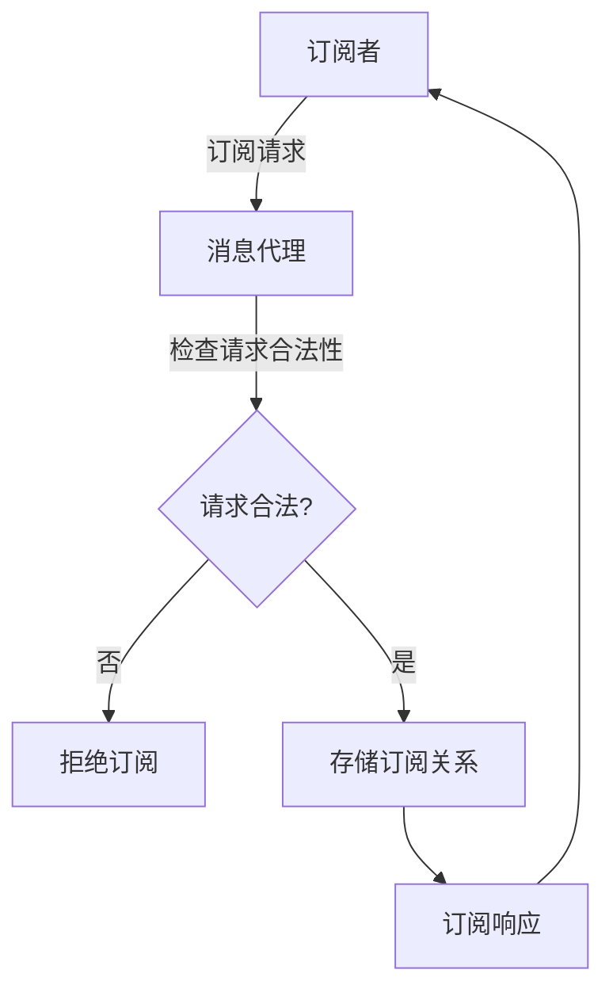
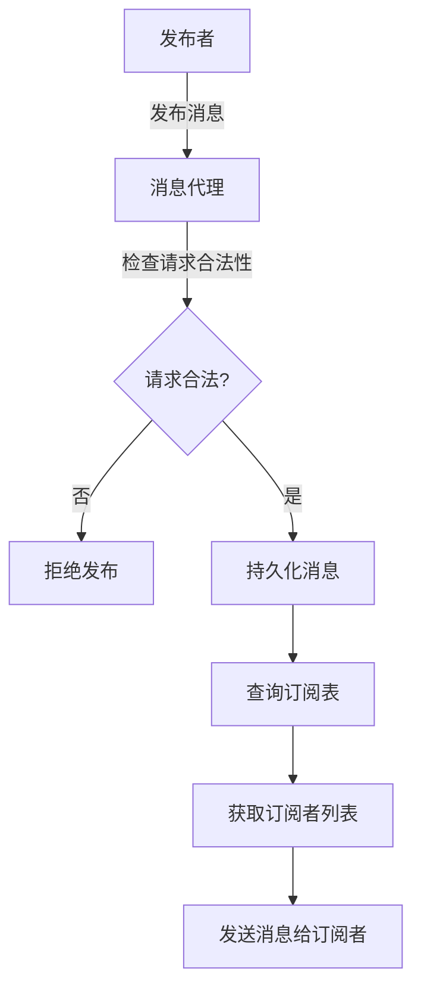
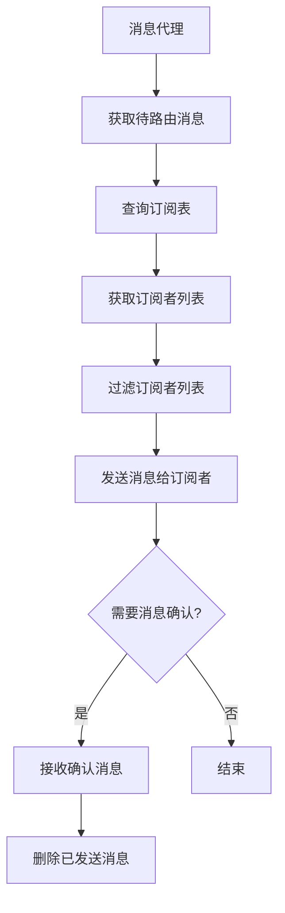

# 【AI大数据计算原理与代码实例讲解】发布订阅

## 1.背景介绍

### 1.1 什么是发布订阅模式

发布订阅模式(Publish-Subscribe Pattern)是一种消息传递模式,它由发布者(Publisher)、订阅者(Subscriber)和消息代理(Message Broker)三个角色组成。发布者不直接将消息发送给特定的订阅者,而是将消息发布给消息代理,订阅者从消息代理处订阅感兴趣的消息主题(Topic)。消息代理在收到消息后,会将消息转发给所有订阅该主题的订阅者。

### 1.2 发布订阅模式的优点

1. **解耦**:发布者和订阅者不需要直接相互了解,只需要知道消息代理即可,从而实现了松散耦合。
2. **异步通信**:发布者发布消息后不需要等待订阅者处理完,可以继续其他操作,提高了系统的吞吐量和响应性能。
3. **灵活性**:发布订阅模式支持动态订阅和取消订阅,使系统具有良好的扩展性和可维护性。
4. **广播能力**:消息代理可以将一条消息同时发送给多个订阅者,实现了一对多的广播通信模式。

### 1.3 发布订阅模式的应用场景

发布订阅模式在分布式系统、事件驱动架构、消息中间件等领域有着广泛的应用,常见的应用场景包括:

- 实时数据流处理
- 分布式事务处理
- 异步通信
- 网络设备监控
- 物联网(IoT)应用
- 金融实时数据分发等

## 2.核心概念与联系  

### 2.1 主题(Topic)

主题是消息的逻辑分类,发布者将消息发布到特定主题,订阅者订阅感兴趣的主题。主题可以是扁平的,也可以采用层次结构。例如,一个天气预报系统可能有主题"weather.beijing"和"weather.shanghai"。

### 2.2 消息代理(Message Broker)

消息代理是发布订阅模式的核心组件,负责接收发布者发布的消息,并将消息转发给订阅了相应主题的订阅者。常见的消息代理有RabbitMQ、Apache Kafka、ActiveMQ等。

消息代理通常具有以下功能:

- 消息路由
- 消息持久化
- 消息过滤
- 消息转换
- 消息重试等

### 2.3 发布者(Publisher)

发布者是生产消息的一方,将消息发布到指定的主题。发布者可以是各种应用程序、服务或设备。

### 2.4 订阅者(Subscriber)

订阅者是消费消息的一方,从消息代理处订阅感兴趣的主题,并接收相应的消息。订阅者可以是各种应用程序、服务或设备。

### 2.5 核心概念之间的关系

发布订阅模式的核心概念之间的关系如下:


发布者将消息发布到消息代理,消息代理根据订阅关系将消息路由给相应的订阅者。订阅者订阅感兴趣的主题,从消息代理处接收消息。

## 3.核心算法原理具体操作步骤

发布订阅模式的核心算法原理可以概括为以下几个步骤:

1. **订阅主题**:订阅者向消息代理发送订阅请求,指定感兴趣的主题。消息代理记录订阅关系。

2. **发布消息**:发布者将消息发送到消息代理,并指定发布到哪个主题。

3. **消息路由**:消息代理根据消息的主题和订阅关系,将消息路由给订阅了该主题的订阅者。

4. **消息传递**:订阅者接收到消息代理转发的消息,并进行相应的处理。

5. **消息确认**:订阅者处理完消息后,可以向消息代理发送确认消息,以便消息代理进行相应的操作(如删除消息)。

这个过程中,消息代理扮演了核心角色,负责维护订阅关系、路由消息和传递消息等任务。

### 3.1 订阅主题算法

订阅主题算法的主要步骤如下:

1. 订阅者向消息代理发送订阅请求,包含订阅主题等信息。
2. 消息代理检查订阅请求的合法性和安全性。
3. 如果订阅请求合法,消息代理将订阅关系存储到订阅表中。
4. 消息代理向订阅者返回订阅响应。



### 3.2 发布消息算法

发布消息算法的主要步骤如下:

1. 发布者将消息发送到消息代理,指定发布到哪个主题。
2. 消息代理检查发布请求的合法性和安全性。
3. 如果发布请求合法,消息代理将消息持久化到消息队列或日志中。
4. 消息代理根据消息的主题查询订阅表,获取订阅了该主题的订阅者列表。
5. 消息代理将消息发送给订阅者列表中的所有订阅者。



### 3.3 消息路由算法

消息路由算法是发布订阅模式的核心算法,主要步骤如下:

1. 消息代理从消息队列或日志中获取待路由的消息。
2. 根据消息的主题,查询订阅表,获取订阅了该主题的订阅者列表。
3. 对订阅者列表进行过滤,根据消息过滤条件(如果有)剔除不符合条件的订阅者。
4. 将消息发送给过滤后的订阅者列表。
5. 如果需要,可以进行消息确认,删除已发送的消息。



## 4.数学模型和公式详细讲解举例说明

在发布订阅模式中,常见的数学模型和公式包括:

### 4.1 消息路由算法的时间复杂度分析

假设消息代理维护了一个订阅表,其中包含 $n$ 个订阅关系。在路由一条消息时,需要遍历订阅表,查找订阅了该消息主题的订阅者。如果使用线性查找算法,时间复杂度为 $O(n)$。

如果使用哈希表等数据结构存储订阅关系,查找订阅者的时间复杂度可以降低到 $O(1)$。但是,在插入或删除订阅关系时,需要维护哈希表,时间复杂度为 $O(1)$。

因此,在实现消息路由算法时,需要权衡查找和维护订阅关系的时间复杂度,选择合适的数据结构和算法。

### 4.2 消息堆积模型

在高并发场景下,发布者发布消息的速度可能会超过消息代理处理消息的速度,导致消息在消息代理中堆积。为了避免消息丢失和系统崩溃,需要对消息堆积进行建模和分析。

假设发布者以平均速率 $\lambda$ 发布消息,消息代理以平均速率 $\mu$ 处理消息,则消息堆积的过程可以用 $M/M/1$ 队列模型来描述。在稳定状态下,系统的平均消息堆积长度 $L$ 可以用下式计算:

$$
L = \frac{\rho}{1-\rho}
$$

其中 $\rho = \lambda / \mu$ 是系统的利用率。当 $\rho < 1$ 时,系统处于稳定状态;当 $\rho \geq 1$ 时,系统会无限堆积消息,导致崩溃。

通过对消息堆积进行建模和分析,可以合理配置消息代理的处理能力,避免系统崩溃,提高系统的可靠性和稳定性。

### 4.3 消息确认模型

在发布订阅模式中,订阅者接收到消息后,通常需要向消息代理发送确认消息,以便消息代理进行相应的操作(如删除已发送的消息)。消息确认过程可以用概率模型来描述。

假设订阅者成功接收并处理消息的概率为 $p$,则在发送 $n$ 条消息后,至少有一条消息未被成功处理的概率为 $(1-p)^n$。为了保证消息的可靠传递,需要控制这个概率在一个可接受的范围内。

例如,如果要求至少有 99.9% 的消息被成功处理,那么需要满足:

$$
(1-p)^n \leq 0.001
$$

解这个不等式,可以得到 $n$ 的下界,从而确定需要发送的消息数量。

通过建立消息确认模型,可以量化消息传递的可靠性,并采取相应的措施(如增加重试次数)来提高可靠性。

## 4.项目实践:代码实例和详细解释说明

为了更好地理解发布订阅模式的实现,我们将使用 Python 和 RabbitMQ 来构建一个简单的示例项目。

### 4.1 安装 RabbitMQ

RabbitMQ 是一个流行的开源消息代理,支持多种消息协议,包括 AMQP、MQTT、STOMP 等。我们将使用 AMQP 协议来实现发布订阅模式。

首先,需要安装 RabbitMQ 服务器。具体安装步骤请参考官方文档:https://www.rabbitmq.com/download.html

### 4.2 安装 Python 库

我们将使用 Python 的 `pika` 库来与 RabbitMQ 进行交互。可以使用 `pip` 来安装这个库:

```bash
pip install pika
```

### 4.3 发布者代码

下面是一个简单的发布者示例代码:

```python
import pika

# 连接到 RabbitMQ 服务器
connection = pika.BlockingConnection(pika.ConnectionParameters('localhost'))
channel = connection.channel()

# 声明一个交换机
channel.exchange_declare(exchange='logs', exchange_type='fanout')

# 发布消息
message = 'Hello, World!'
channel.basic_publish(exchange='logs', routing_key='', body=message)

print(f"[x] Sent '{message}'")

# 关闭连接
connection.close()
```

这段代码首先连接到本地的 RabbitMQ 服务器,然后声明一个名为 `logs` 的`fanout`类型的交换机。`fanout`交换机会将收到的消息广播给所有绑定到它的队列。

接下来,我们发布一条消息 `'Hello, World!'` 到 `logs` 交换机。由于我们使用的是`fanout`交换机,所以路由键(`routing_key`)可以留空。

最后,我们关闭与 RabbitMQ 的连接。

### 4.4 订阅者代码

下面是一个简单的订阅者示例代码:

```python
import pika

# 连接到 RabbitMQ 服务器
connection = pika.BlockingConnection(pika.ConnectionParameters('localhost'))
channel = connection.channel()

# 声明一个交换机
channel.exchange_declare(exchange='logs', exchange_type='fanout')

# 创建一个随机队列
result = channel.queue_declare(queue='', exclusive=True)
queue_name = result.method.queue

# 绑定队列到交换机
channel.queue_bind(exchange='logs', queue=queue_name)

print(f'