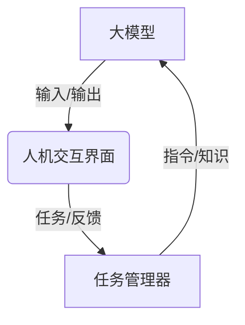

# 【大模型应用开发 动手做AI Agent】CAMEL论文中的股票交易场景

## 1.背景介绍

### 1.1 人工智能的发展历程

人工智能(Artificial Intelligence, AI)是一个广泛的研究领域,旨在创建能够模仿人类智能行为的智能系统。自20世纪50年代AI概念被正式提出以来,这一领域经历了几个重要的发展阶段。

#### 1.1.1 早期阶段

早期的AI研究主要集中在专家系统、机器学习和自然语言处理等领域。这一时期的主要成就包括深蓝战胜国际象棋世界冠军、语音识别系统的发展等。然而,这些系统大多基于规则和逻辑推理,缺乏真正的"智能"。

#### 1.1.2 深度学习时代

21世纪初,深度学习(Deep Learning)技术的兴起推动了AI的新一轮发展浪潮。深度神经网络能够从大量数据中自主学习,在计算机视觉、自然语言处理等领域取得了突破性进展。

#### 1.1.3 大模型时代

近年来,随着算力和数据的不断增长,大规模的人工神经网络模型(大模型)应运而生。这些大模型通过在海量数据上预训练,获得了通用的知识表示能力,可以应用于多种下游任务。大模型的出现极大地推动了AI的发展,也带来了新的机遇和挑战。

### 1.2 CAMEL:大模型新范式

CAMEL(Communication Assisted Machine Intelligence and Language)是一种新兴的大模型范式,旨在通过人机协作来充分发挥大模型的潜力。相比于传统的大模型应用,CAMEL强调了人类与AI之间的交互和协作。

在CAMEL框架下,人类不仅是模型的使用者,也是知识的提供者。通过与AI代理进行自然语言交互,人类可以引导模型完成特定任务,并将领域知识注入模型中。与此同时,AI代理也可以主动询问人类,获取必要的信息和反馈。

CAMEL的核心思想是将人类的专业知识与大模型的泛化能力相结合,实现人机协同,提高AI系统的性能和可解释性。这种新范式为AI的发展开辟了新的道路,也给人工智能的应用带来了新的可能性。

### 1.3 股票交易:AI应用的热点领域

证券交易是人工智能应用的一个重要领域。股票市场蕴含着大量的数据和复杂的模式,传统的人工交易策略很难充分利用这些信息。而AI技术则有望通过数据驱动的方式,发现隐藏的规律,制定更优的交易策略。

同时,股票交易场景也为AI系统带来了新的挑战。交易决策不仅需要对历史数据进行分析,还需要结合当前市场形势、新闻事件等多方面信息做出判断。此外,交易策略的可解释性也是一个重要的考虑因素。

CAMEL范式为解决这些挑战提供了新的思路。通过人机协作,AI代理可以获取人类专家的领域知识,并将其融入到模型中;与此同时,人类也可以对模型的决策过程进行监督和干预,提高系统的可解释性和可控性。

本文将以CAMEL论文中的股票交易场景为例,探讨如何基于大模型开发AI交易代理系统,并分析其中的关键技术和挑战。

## 2.核心概念与联系

### 2.1 CAMEL框架概述

CAMEL框架由三个核心组件构成:大模型(Large Model)、人机交互界面(Human-AI Interface)和任务管理器(Task Manager)。

#### 2.1.1 大模型

大模型是CAMEL框架的核心,通常是一个经过大规模预训练的语言模型或多模态模型。它具有广泛的知识表示能力,可以根据输入生成自然语言或其他形式的输出。

在股票交易场景中,大模型可以接收历史数据、新闻事件等信息作为输入,并输出交易决策建议。

#### 2.1.2 人机交互界面

人机交互界面为人类与AI代理之间的沟通提供了渠道。人类可以通过自然语言与AI代理进行对话,提出问题、给出指令或反馈。同时,AI代理也可以主动向人类询问必要的信息。

在股票交易中,交易员可以与AI代理讨论当前市场形势,询问交易策略的细节,或对AI的决策提出质疑和建议。

#### 2.1.3 任务管理器

任务管理器负责协调人机交互,并根据交互过程动态调整大模型的行为。它接收人类的指令和反馈,并将其转化为对大模型的指令或知识注入。同时,它也会监控大模型的输出,必要时将输出呈现给人类,获取进一步的反馈。

在股票交易场景中,任务管理器需要综合考虑市场数据、新闻事件、人类专家意见等多方面信息,指导大模型做出合理的交易决策。

### 2.2 人机协作的关键作用

人机协作是CAMEL框架的核心理念,也是实现高性能AI系统的关键。人机协作可以带来以下几个主要好处:

#### 2.2.1 知识注入

大模型虽然具有广泛的知识表示能力,但在特定领域可能存在知识缺失或偏差。通过人机交互,人类专家可以将领域知识注入到模型中,弥补模型的不足。

在股票交易场景中,交易员可以向AI代理传递关于行业动态、公司业绩等专业知识,使模型的决策更加准确。

#### 2.2.2 决策监督

人类可以对AI代理的决策过程进行监督和干预,提高系统的可解释性和可控性。当AI代理做出令人质疑的决策时,人类可以要求其解释决策依据,并根据需要进行纠正或优化。

对于股票交易这种风险较高的应用场景,决策的可解释性和可控性尤为重要。人类可以根据自身经验,对AI代理的交易决策进行审核和调整。

#### 2.2.3 反馈优化

通过人机交互,人类可以实时向AI代理提供反馈,指出模型的不足之处。AI代理则可以根据反馈进行自我优化,不断提高性能。

在股票交易中,交易员可以根据实际交易结果,对AI代理的策略提出改进建议。AI代理则可以基于这些反馈,优化内部模型和策略。

#### 2.2.4 任务分工

CAMEL框架允许人机之间进行合理的任务分工。人类可以专注于需要领域知识和经验的决策环节,而将数据处理、模式发现等重复性工作交给AI代理完成。

在股票交易中,AI代理可以负责分析大量的历史数据,发现潜在的交易机会。而人类则可以根据自身经验,对AI提出的交易策略进行评估和调整。

通过上述机制,CAMEL框架实现了人机协同,发挥了人类和AI各自的优势,从而提高了AI系统的整体性能和可靠性。

## 3.核心算法原理具体操作步骤

### 3.1 大模型的训练

CAMEL框架中的大模型通常是一个经过大规模预训练的语言模型或多模态模型。预训练的目标是使模型获得广泛的知识表示能力,能够理解和生成自然语言。

#### 3.1.1 预训练任务

常见的预训练任务包括:

1. **掩码语言模型(Masked Language Modeling, MLM)**: 模型需要根据上下文预测被掩码的词语。
2. **下一句预测(Next Sentence Prediction, NSP)**: 模型需要判断两个句子是否相关。
3. **自回归语言模型(Autoregressive Language Modeling)**: 模型需要根据前面的词语预测下一个词语。

这些预训练任务旨在让模型学习语言的语义和语法规则,建立对自然语言的深层次理解。

#### 3.1.2 预训练数据

预训练所使用的数据集通常包含大量的自然语言数据,如网页文本、书籍、新闻文章等。为了获得更广泛的知识覆盖,数据集还可以包含其他类型的数据,如表格、图像等。

对于股票交易场景,预训练数据还可以包括历史股票数据、财经新闻等领域相关的数据,使模型获得一定的金融领域知识。

#### 3.1.3 预训练算法

预训练常用的算法包括:

1. **Transformer**: 基于自注意力机制的序列到序列模型,能够有效捕捉长距离依赖关系。
2. **BERT**: 基于Transformer的双向编码器,在MLM和NSP任务上取得了卓越表现。
3. **GPT**: 基于Transformer的自回归语言模型,擅长生成自然语言。

这些算法通过对大规模数据的训练,使模型获得了强大的语言理解和生成能力,为下游任务奠定了基础。

### 3.2 人机交互

人机交互是CAMEL框架的核心环节,它决定了人类如何向AI代理传递指令和反馈,以及AI代理如何响应人类的交互。

#### 3.2.1 自然语言理解

为了实现自然语言交互,AI代理需要具备自然语言理解(Natural Language Understanding, NLU)的能力。NLU模块需要将人类的自然语言输入转换为结构化的语义表示,以便后续的处理。

常见的NLU技术包括:

1. **词法分析**: 将输入分割为词语序列。
2. **句法分析**: 识别句子的语法结构。
3. **语义分析**: 理解句子的意义,提取关键信息。
4. **意图识别**: 判断输入的目的,如询问、指令等。
5. **实体识别**: 识别输入中的关键实体,如人名、地名等。

对于股票交易场景,NLU模块需要能够识别与交易相关的实体和意图,如"买入""卖出""止损"等。

#### 3.2.2 自然语言生成

AI代理还需要具备自然语言生成(Natural Language Generation, NLG)的能力,以便用自然语言回复人类的交互。NLG模块需要将结构化的语义表示转换为流畅的自然语言输出。

常见的NLG技术包括:

1. **内容规划**: 确定输出内容的结构和组织。
2. **句子规划**: 将语义表示转换为句子级别的表示。
3. **实现**: 将句子级表示转换为自然语言文本。

对于股票交易场景,NLG模块需要能够生成清晰的交易决策解释和建议,以便人类能够理解AI代理的决策依据。

#### 3.2.3 对话管理

为了实现流畅的人机对话,AI代理需要一个对话管理(Dialogue Management)模块,负责协调对话的进行。对话管理模块需要跟踪对话的上下文和状态,并根据当前状态决定应该如何响应人类的输入。

常见的对话管理技术包括:

1. **有限状态机**: 根据预定义的状态转移规则进行对话管理。
2. **基于策略的方法**: 使用强化学习等技术,学习最优的对话策略。
3. **基于模型的方法**: 使用序列到序列模型直接生成对话响应。

对于股票交易场景,对话管理模块需要能够处理各种交互情况,如询问市场行情、解释交易决策、接受人类反馈等。它需要根据对话状态做出合理的响应,并将对话引导到正确的方向。

### 3.3 知识注入

CAMEL框架的一个关键优势是能够将人类专家的领域知识注入到AI代理中,从而提高模型的性能和可解释性。知识注入可以通过多种方式实现。

#### 3.3.1 基于提示的微调

基于提示的微调(Prompt-based Finetuning)是一种常见的知识注入方法。它的基本思路是将人类的知识表示为一个自然语言提示(Prompt),并将提示与下游任务的输入一同输入到预训练模型中进行微调。

在股票交易场景中,提示可以