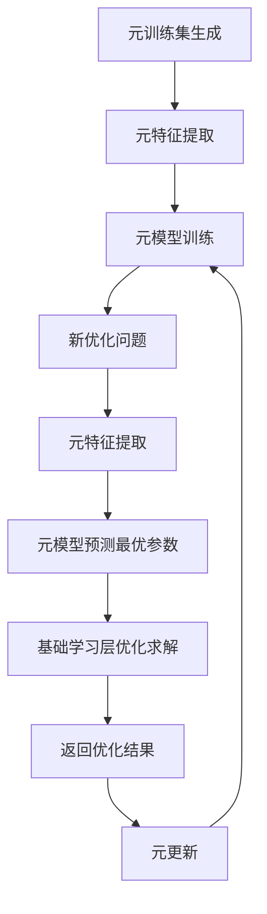

# 一切皆是映射：构建元学习启发式优化算法

作者：禅与计算机程序设计艺术

## 1. 背景介绍

### 1.1 优化问题的挑战
在现实世界中,我们经常面临着各种各样的优化问题,如资源分配、运输路线规划、工艺参数优化等。这些问题通常具有高维、非线性、多模态等特点,传统的优化算法难以有效求解。启发式优化算法,如遗传算法、粒子群算法、蚁群算法等,通过模拟自然界的智能行为,在求解复杂优化问题方面表现出色。然而,针对不同问题,如何设计高效的启发式算法仍然是一大挑战。

### 1.2 元学习的兴起
近年来,元学习(Meta-Learning)受到学术界和工业界的广泛关注。元学习,也称为"学会学习"(Learning to Learn),旨在通过机器学习的方法来学习和改进学习算法本身。与传统机器学习相比,元学习更加注重学习过程的优化,通过从历史经验中提取知识,实现学习算法的自适应和演化。元学习已在few-shot learning、强化学习、神经网络架构搜索等领域取得重要进展。

### 1.3 元学习与优化算法
启发式优化算法的性能高度依赖于算法的参数设置和搜索策略。不同的问题往往需要不同的参数和策略。手工调参费时费力,且难以获得最优解。如何实现启发式优化算法的自动化设计与调优,是一个亟待解决的问题。元学习为解决这一问题提供了新的思路。通过元学习,我们可以从大量优化问题的求解经验中提取知识,学习如何自动设计和调整优化算法,从而实现启发式优化算法的"进化"。本文将探讨如何利用元学习的思想,构建高效的启发式优化算法。

## 2. 核心概念与联系

### 2.1 映射的概念
在数学和计算机科学中,映射(Mapping)是一个重要概念。映射描述了两个集合之间元素的对应关系。形式化地,映射 $f: X \rightarrow Y$ 将集合 $X$ 中的每个元素 $x$ 映射到集合 $Y$ 中的唯一元素 $f(x)$。通过映射,我们可以将一个问题转化为另一个问题,或将一个域的知识迁移到另一个域。

### 2.2 优化问题的映射
优化问题可以看作一种特殊的映射。给定一个目标函数 $f: \mathcal{X} \rightarrow \mathbb{R}$,优化问题旨在寻找 $\mathcal{X}$ 中使 $f$ 取得最小值(或最大值)的元素 $x^*$:

$$
x^* = \arg\min_{x \in \mathcal{X}} f(x)
$$

这里,$\mathcal{X}$ 表示解空间,即所有可行解的集合。优化算法则可以看作一个映射 $\mathcal{A}: \mathcal{F} \rightarrow \mathcal{X}$,将目标函数 $f \in \mathcal{F}$ 映射到其(近似)最优解 $x^* \in \mathcal{X}$。

### 2.3 元学习与优化算法映射
传统的优化算法对于特定问题是固定的,缺乏灵活性。元学习优化算法旨在学习一个映射 $\mathcal{M}: \mathcal{P} \rightarrow \mathcal{A}$,将问题 $p \in \mathcal{P}$ 映射到适合该问题的优化算法 $\mathcal{A}_p \in \mathcal{A}$。通过这种方式,元学习实现了优化算法的自动设计和调优,提高了算法的适应性和泛化能力。

## 3. 核心算法原理具体操作步骤

本节介绍基于元学习的启发式优化算法的核心原理和操作步骤。该算法通过两个层次的学习来实现优化算法的自动设计与调优:

### 3.1 基础学习层
基础学习层对应于传统的启发式优化算法,如遗传算法、粒子群算法等。这些算法在给定的优化问题上进行搜索,生成解的种群并迭代更新,直到满足终止条件。基础学习层的主要步骤包括:

1. 初始化:随机生成解的初始种群。
2. 评估:计算每个解的适应度(目标函数值)。
3. 选择:根据适应度选择优良解作为父代。
4. 变异:对父代解进行变异操作,生成新解。
5. 更新:根据新解更新种群。
6. 终止:重复步骤2-5,直到满足终止条件(如达到最大迭代次数或找到满意解)。

### 3.2 元学习层
元学习层位于基础学习层之上,通过学习和优化基础学习层的参数和策略,实现启发式算法的自动设计与调优。元学习层的主要步骤包括:

1. 元训练集生成:收集一系列不同类型、不同规模的优化问题,作为元训练集。
2. 元特征提取:对每个优化问题提取元特征,如问题规模、目标函数性质等。
3. 元模型训练:使用元训练集训练元模型,学习元特征与最优算法参数/策略之间的映射关系。常用的元模型包括神经网络、决策树等。
4. 元测试:在新的优化问题上,根据问题的元特征,利用训练好的元模型预测最优的算法参数/策略,并应用于基础学习层进行优化求解。
5. 元更新:将元测试的结果加入元训练集,并重新训练元模型,实现元学习的持续优化。

通过元学习层和基础学习层的协同,算法可以根据问题的特点自动调整参数和策略,提高优化性能。

## 4. 数学模型和公式详细讲解举例说明

本节通过数学建模和公式推导,详细阐述基于元学习的启发式优化算法的原理。

### 4.1 优化问题的数学描述
考虑一般的优化问题:

$$
\min_{x \in \mathcal{X}} f(x), \quad \text{s.t.} \quad g_i(x) \leq 0, \quad i=1,\ldots,m
$$

其中,$f(x)$ 是目标函数,$\mathcal{X}$ 是决策变量 $x$ 的可行域,$g_i(x)$ 是第 $i$ 个不等式约束。

### 4.2 基础学习层的数学模型
以遗传算法为例,基础学习层的数学模型可描述为:

1. 初始化:随机生成初始种群 $\mathcal{P}_0=\{x_1,\ldots,x_N\}$,其中 $x_i \in \mathcal{X}$。
2. 评估:计算每个个体的适应度 $F(x_i)=-f(x_i)$。
3. 选择:以概率 $p_i=\frac{F(x_i)}{\sum_{j=1}^N F(x_j)}$ 选择个体 $x_i$ 进入父代种群 $\mathcal{P}_p$。
4. 变异:对 $\mathcal{P}_p$ 中的个体执行变异操作 $\mathcal{M}$,生成子代种群 $\mathcal{P}_o$。
5. 更新:从 $\mathcal{P}_p \cup \mathcal{P}_o$ 中选择适应度最高的 $N$ 个个体形成新种群 $\mathcal{P}_{t+1}$。
6. 终止:重复步骤2-5,直到满足终止条件。

算法的性能取决于种群大小 $N$、变异算子 $\mathcal{M}$ 等参数的选择。

### 4.3 元学习层的数学模型
假设元训练集为 $\mathcal{D}_{tr}=\{(p_i,\theta_i^*)\}_{i=1}^M$,其中 $p_i$ 表示第 $i$ 个优化问题,$\theta_i^*$ 表示问题 $p_i$ 对应的最优算法参数。元学习的目标是学习一个映射 $\mathcal{M}: \mathcal{P} \rightarrow \Theta$,使得对于新问题 $p \in \mathcal{P}$,预测的参数 $\hat{\theta}=\mathcal{M}(p)$ 尽可能接近最优参数 $\theta^*$。

假设元模型为参数为 $\phi$ 的函数 $h_{\phi}$。元学习的数学模型可表示为最小化经验风险:

$$
\min_{\phi} \frac{1}{M} \sum_{i=1}^M \mathcal{L}(h_{\phi}(p_i), \theta_i^*)
$$

其中,$\mathcal{L}$ 是损失函数,如平方损失:

$$
\mathcal{L}(h_{\phi}(p_i), \theta_i^*) = \|h_{\phi}(p_i) - \theta_i^*\|_2^2
$$

通过最小化经验风险,元模型 $h_{\phi}$ 学习到问题特征与最优参数之间的映射关系。在新问题 $p$ 上,直接用 $h_{\phi}(p)$ 预测最优参数,避免了手工调参的繁琐过程。

### 4.4 算法流程图
下图展示了基于元学习的启发式优化算法的总体流程:



## 5. 项目实践：代码实例和详细解释说明

本节通过Python代码实例,演示基于元学习的遗传算法的实现。为简洁起见,代码进行了适当简化。

### 5.1 基础学习层实现

```python
import numpy as np

def GA(func, bounds, pop_size, max_iter, mutation_rate):
    """遗传算法
    
    Args:
        func (function): 目标函数
        bounds (list): 变量范围
        pop_size (int): 种群大小
        max_iter (int): 最大迭代次数
        mutation_rate (float): 变异概率
    
    Returns:
        best_x (array): 最优解
        best_y (float): 最优值
    """
    # 初始化种群
    pop = np.random.uniform(bounds[0], bounds[1], (pop_size, len(bounds[0])))
    
    for i in range(max_iter):
        # 评估适应度
        fitness = -func(pop)
        
        # 选择
        idx = np.random.choice(pop_size, size=pop_size, p=fitness/fitness.sum())
        parent = pop[idx]
        
        # 变异
        mask = np.random.rand(pop_size, len(bounds[0])) < mutation_rate
        noise = np.random.normal(0, 1, (pop_size, len(bounds[0])))
        child = parent + mask * noise
        child = np.clip(child, bounds[0], bounds[1])
        
        # 更新种群
        pop = child
    
    # 返回最优解
    best_idx = np.argmin(func(pop))
    best_x = pop[best_idx]
    best_y = func(best_x)
    
    return best_x, best_y
```

### 5.2 元学习层实现

```python
from sklearn.ensemble import RandomForestRegressor

def meta_train(problems, metas, params):
    """元训练
    
    Args:
        problems (list): 优化问题列表
        metas (list): 元特征列表
        params (list): 最优参数列表
    
    Returns:
        meta_model (object): 训练好的元模型
    """
    meta_model = RandomForestRegressor()
    meta_model.fit(metas, params)
    
    return meta_model

def meta_predict(meta_model, problem):
    """元预测
    
    Args:
        meta_model (object): 训练好的元模型
        problem (object): 新的优化问题
    
    Returns:
        pred_params (array): 预测的最优参数
    """
    meta = extract_meta(problem)
    pred_params = meta_model.predict([meta])
    
    return pred_params[0]
```

### 5.3 算法应用示例

```python
# 定义优化问题
def sphere(x):
    return np.sum(x**2)

def rosenbrock(x):
    return np.sum(100*(x[1:]-x[:-1]**2)**2 + (1-x[:-1])**2)

problems = [sphere, rosenbrock]
bounds = [[-5, 5], [-5, 5]]

# 元训练
metas = []
params = []
for func, bound in zip(problems, bounds):
    _, best